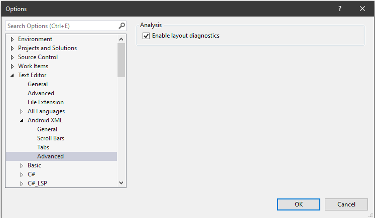
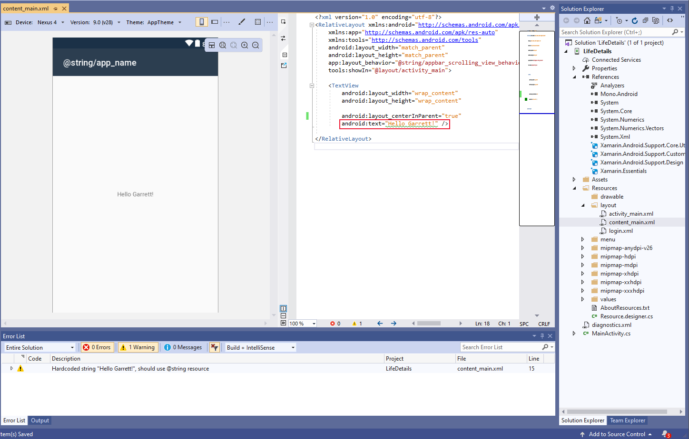
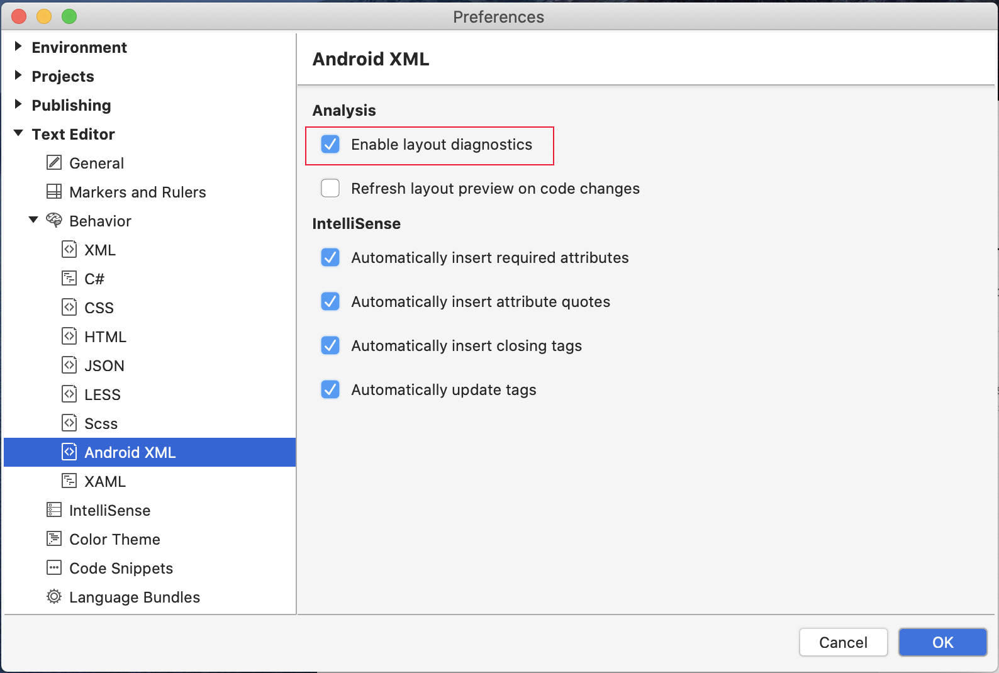
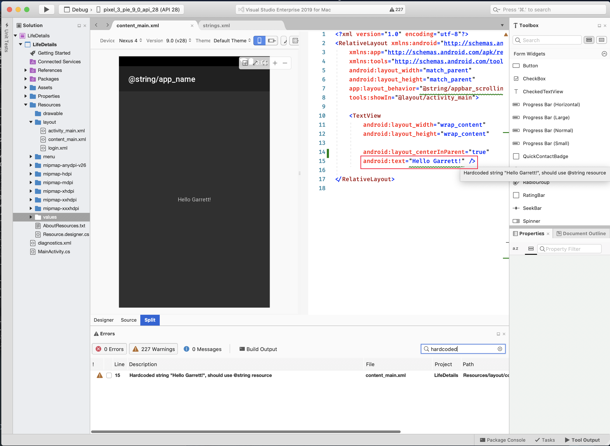
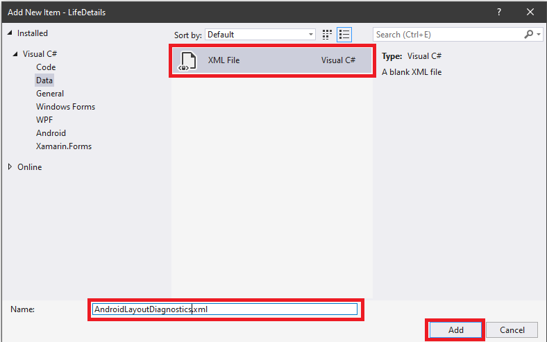
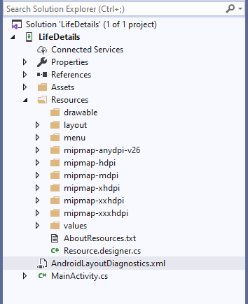
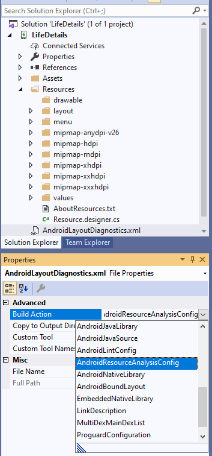
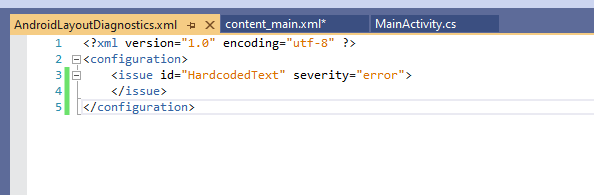
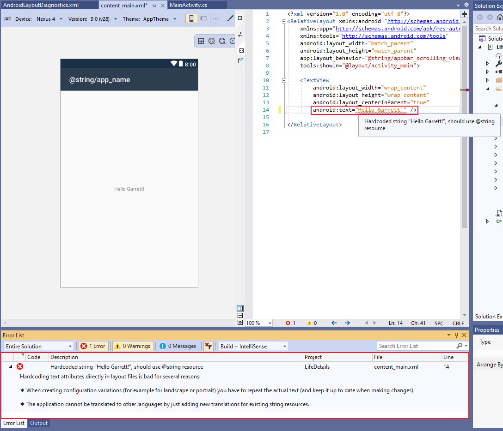

# Android layout diagnostics

Android layout diagnostics are designed to help improve the quality of Android layout files by highlighting common quality issues and helpful optimizations. This feature is available for both Visual Studio 16.5+ and Visual Studio for Mac 8.5+.

A default set of analyzers is provided for a wide range of issues and each can be customized to cover a project's specific needs. The analyzers are loosely based on the Android linting system.

# [Visual Studio](#tab/windows)

## Enable Android layout diagnostics on Visual Studio 2019

Make sure the layout diagnostics setting, **Enable layout diagnostics**, is enabled. To access this options page, choose **Tools** > **Options**, and then choose **Text Editor** > **Android XML** > **Advanced**:



Once enabled, the Android layout editor will display issues:



# [Visual Studio for Mac](#tab/macos)

## Enable Android layout diagnostics on Visual Studio for Mac

Make sure the layout diagnostics setting, **Enable layout diagnostics**, is enabled. To access this options page, choose **Visual Studio** > **Preferences...**, and then choose **Text Editor** > **Android XML**:



Once enabled, the Android layout editor will display issues:



-----

## Features

The following sections outline the available features in Android layout diagnostics.

### Analyzers

Analyzers are used to help detect issues in layout files, reduce hardcoded values, improve performance, and flag errors. For a list of analyzers, see
[Android designer diagnostic analyzers](diagnostic-analyzers.md)

### Diagnostic configuration

Analyzers can be configured using an XML file, allowing you to change the default severity level, ignore certain files, and pass in variables.

You can use a baseline file if you have a set of configurations you want to share across multiple Android apps. To use this feature, create a new configuration file and append `-baseline` to the file name. The baseline configurations are applied first, and then the remaining configuration files.

> [!TIP]
> This can be useful if you want to ignore a set of issues on a new or existing Android app.

The format is:

```xml
<?xml version="1.0" encoding="utf-8" ?> 
<configuration>
    <issue id="DuplicateIDs" severity="warning">
        <ignore path="Resources/layout/layout1.xml" />
    </issue>
    <issue id="HardcodedText" severity="informational">
        <ignore path="Resources/layout/layout1.xml" />
        <ignore path="Resource/layout/layout2.xml" />
    </issue>
    <issue id="TooManyViews">
        <variable name="MAX_VIEW_COUNT" value="12" />
    </issue>
    <issue id="TooDeepLayout">
        <variable name="MAX_DEPTH" value="12" />
    </issue>
</configuration>
```

> [!NOTE]
> Currently the only variables are `MAX_VIEW_COUNT` (default: 80) and `MAX_DEPTH` (default: 10) for `TooManyViews` and `TooDeepLayout` respectively.

The severity levels are:

- Suggestion
- Info
- Warning
- Error
- Ignore

### Add a configuration file

Create a new XML file in the root of an Android app project. The name of the file isn't important, but this example uses `AndroidLayoutDiagnostics.xml`:



Once the new XML file is added, it should appear in the Android app project tree:



Make sure that the build action is set to **AndroidResourceAnalysisConfig** in the properties panel.
The easiest way to pull up the property panel for the new file is to right-click on the file and select properties. Once the properties panel is showing, you should change the **Build Action** to **AndroidResourceAnalysisConfig**:



Now that you have a blank XML file you need to add the `<configuration>` root element. At this point, you can adjust the default behavior of any supported issues.
If you want to ensure that hard-coded strings are treated as errors add:

```xml
<issue="HardcodedText" severity="error">
</issue>
```



Now that hard-coded text is considered an error, it's now flagged with a red squiggle in the layout editor:



> [!NOTE]
> For any new configuration file changes to take effect, any currently open layout files need to be reopened.
>

## Troubleshooting

Here are some possible common problems.

- Make sure there are no XML format error.
- Build action is set correctly to **AndroidResourceAnalysisConfig**.

## Known issues

- The error pad isn't populated until after the file is changed the first time.

## Related links

- [Android Lint Checks](http://tools.android.com/tips/lint-checks)
- [Improve your code with lint checks](https://developer.android.com/studio/write/lint)
