# Xamarin.Android Designer Material Design features

_This topic describes Designer features that make it easier for
developers to create Material Design-compliant layouts. This section
introduces and explains how to use the Material Grid, the Material
Color Palette, the Typographic Scale, and the Theme Editor._

> [!Video https://youtube.com/embed/E3_ZjIOzVzY]

**Evolve 2016: Everyone Can Create Beautiful Apps with Material Design**

## Overview

The Xamarin.Android Designer includes features that make it easier
for you to create Material-Design-compliant layouts. If you are not
familiar with Material Design, see the
[Material Design introduction](https://material.io/design/introduction).

# [Visual Studio](#tab/windows)

In this guide, we'll have a look at the following Designer features:

-   *Material Grid* &ndash; An overlay on the Design Surface that shows
    a grid, spacing, and keylines to help you place layout widgets
    according to Material Design guidelines.

-   *Theme Editor* &ndash; A small color resource editor that lets you
    set color information for a subset of a theme. For example, you can
    preview and modify Material colors such as `colorPrimary`,
    `colorPrimaryDark`, and `colorAccent`.

We'll have look at each of these features and provide examples of how
to use them.

## Material Design Grid

The Material Design Grid menu is available from the toolbar at the top
of the Designer:

[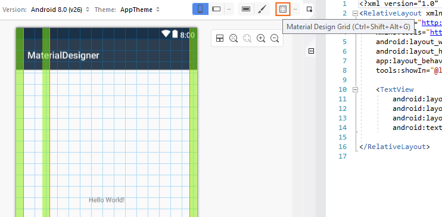](material-design-features-images/vs/01-material-design-grid-w158.png#lightbox)

When you click the Material Design Grid icon, the Designer displays an
overlay on the Design Surface that includes the following elements:

-   Keylines (orange lines)

-   Spacing (green areas)

-   A grid (blue lines)

These elements can be seen in the previous screenshot. Each of these
overlay items is configurable. When you click the ellipsis next to the
Material Design Grid menu, a dialog popover opens that allows you to
disable/enable the grid, configure the placement of keylines, and set
spacings. Note that all values are expressed in `dp`
(density-independent pixels):

[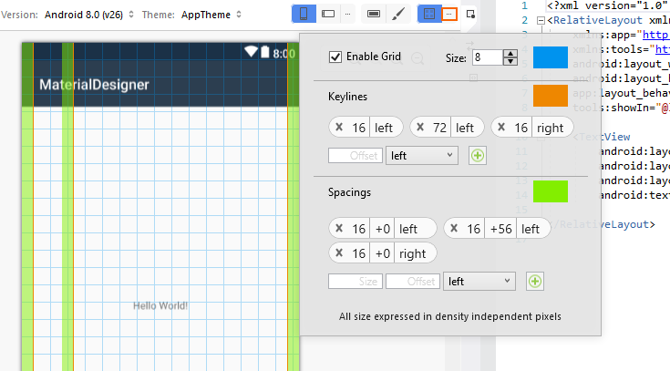](material-design-features-images/vs/03-grid-configuration-w158.png#lightbox)

To add a new keyline, enter a new offset value in the **Offset** box,
select a location (**left**, **top**, **right**, or **bottom**) and
click the + icon to add the new keyline. Similarly, to add a new
spacing, enter the size and offset (in dp) into the **Size** and
**Offset** boxes, respectively. Select a location (**left**, **top**,
**right**, or **bottom**) and click the + icon to add the new spacing.

When you change these configuration values, they are saved in the layout
XML file and reused when you open the layout again.

## Theme Editor

The **Theme Editor** lets you customize color information for a subset
of theme attributes. To open the **Theme Editor**, click the paintbrush
icon on the toolbar:

Although the **Theme Editor** is accessible from the toolbar for
all target Android versions and API levels, only a subset of
the capabilities described below are available if the target API
level is earlier than API 21 (Android 5.0 Lollipop).

The left-hand panel of the  **Theme Editor** displays the list of
colors that make up the currently selected theme (in this example,
we are using the `Default Theme`):

[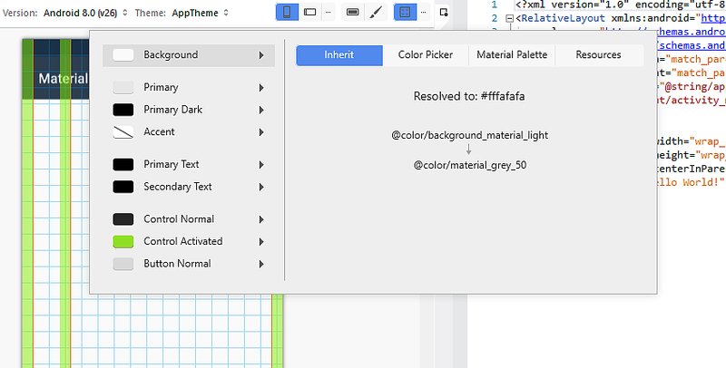](material-design-features-images/vs/05-theme-editor-w158.png#lightbox)

When you select a color on the left, the right-hand panel provides the
following tabs to help you edit that color:

-   **Inherit** &ndash; Displays a style inheritance diagram for the
    selected color and lists the resolved color and color
    code assigned to that theme color.

-   **Color Picker** &ndash; Lets you change the selected color
    to any arbitrary value.

-   **Material Palette** &ndash; Lets you change the selected color
    to a value that conforms to Material Design.

-   **Resources** &ndash; Lets you change the selected color
    to one of the other existing color resources in the theme.

Let's look at each one of these tabs in detail.

### Inherit tab

As seen in the following example, the **Inherit** tab lists the
style inheritance for the **Background** color of the **Default Theme**:

[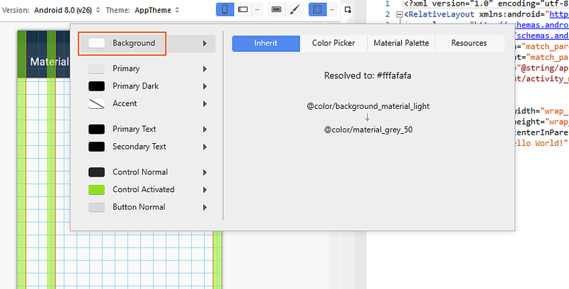](material-design-features-images/vs/06-inherit-tab-w158.png#lightbox)

In this example, the **Default Theme** inherits from a style that uses
`@color/background_material_light` but overrides it with
`color/material_grey_50`, which has a color code value of `#fffafafa`.
For more information about style inheritance, see
[Styles and Themes](http://developer.android.com/guide/topics/ui/themes.html#Inheritance).

### Color Picker

The following screenshot illustrates the **Color Picker**:

[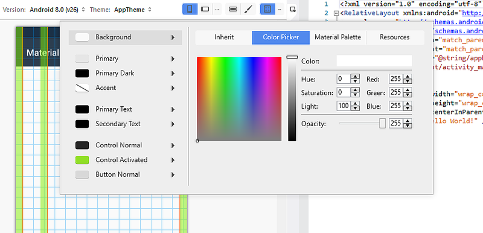](material-design-features-images/vs/07-color-picker-w158.png#lightbox)

In this example, the **Background** color can be changed to any
value through various means:

-   Clicking a color directly.
-   Entering hue, saturation, and brightness values.
-   Entering RGB (red, green, blue) values in decimal.
-   Setting the alpha (opacity) for the selected color.
-   Entering the hexadecimal color code directly.

The color you choose in the Color Picker is *not* restricted to
Material Design guidelines or to the set of available color resources.

### Resources

The **Resources** tab offers a list of color resources that are already
present in the theme:

[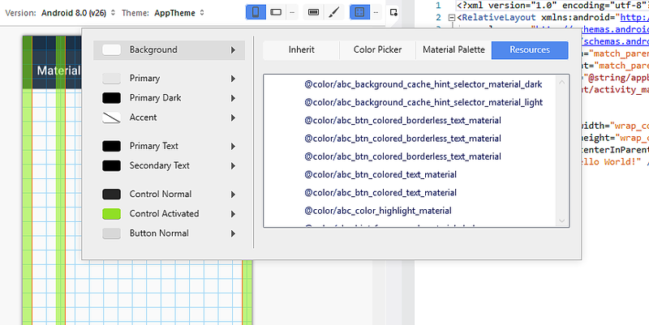](material-design-features-images/vs/08-resources-w158.png#lightbox)

Using the **Resources** tab constrains your choices to this list of
colors. Keep in mind that if you choose a color resource that is
already assigned to another part of the theme, two adjacent elements of
the UI may "run together" (because they have the same color) and become
difficult for the user to distinguish.

### Material Palette

The **Material Palette** tab opens the **Material Design Color
Palette**. Choosing a color value from this palette constrains your
color choice so that it is consistent with Material Design guidelines:

[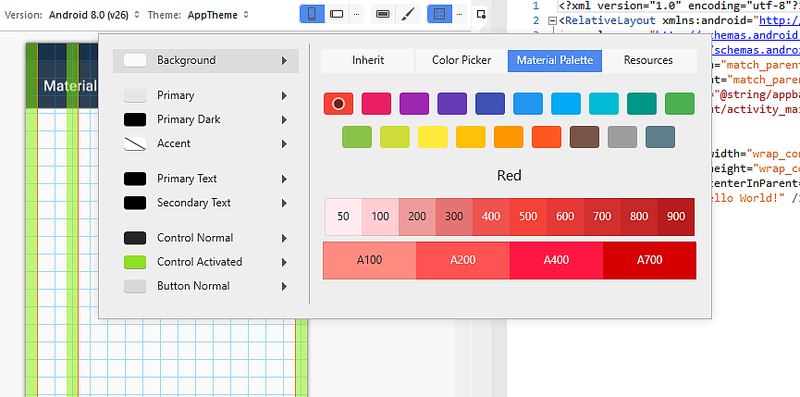](material-design-features-images/vs/09-material-palette-w158.png#lightbox)

The top of the color palette displays primary Material Design colors
while the bottom of the palette displays a range of hues for the
selected primary color. For example, when you select **Indigo**, a
collection of **Indigo** hues is displayed at the bottom of the dialog.
When you select a hue, the color of the property is changed to the
selected hue. In the following example, the `Background Tint` of the
button is changed to *Indigo 500*:

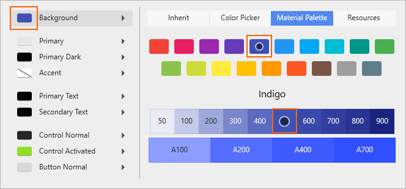

`Background Tint` is set to the color code for *Indigo 500*
(`#ff3f51b5`), and the Designer updates the background color to reflect
this change:

[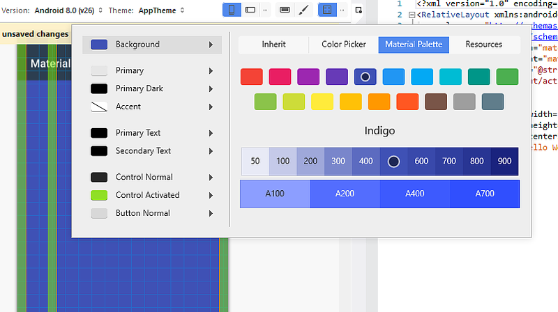](material-design-features-images/vs/11-background-tint-w158.png#lightbox)

For more information about the Material Design color palette, see the
Material Design
[Color Palette Guide](https://material.io/design/color/).

### Creating a new theme

In the following example, we'll use the Material Palette to create a
new custom theme. First, we'll change the **Background** color to *Blue
900*:

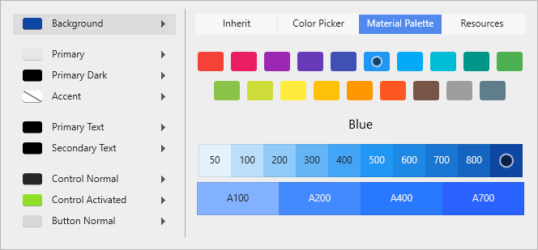

When a color resource is changed, a message pops up with the
message, *The current theme has unsaved changes*:

The **Background** color in the Designer has changed to the new color
selection, but this change has not yet been saved. At this point,
you can do one of the following:

-   Click **Discard Changes** to discard the new color choice (or choices) 
    and revert the theme to its original state. 

-   Press <kbd>CTRL+S</kbd> to save your changes to the currently theme. 

In the following example, <kbd>CTRL+S</kbd> was pressed so that the changes
were saved to **AppTheme**:

## Summary

This topic described the Material Design features available in the
Xamarin.Android Designer. It explained how to enable and configure the
Material Design Grid, and it explained how to use the Theme Editor to
create new custom themes that conform to Material Design guidelines.
For more information about Xamarin.Android support for Material Design,
see [Material Theme](~/android/user-interface/material-theme.md).

# [Visual Studio for Mac](#tab/macos)

In this guide, we'll a have a look at the following Designer features:

-   *Material Design Grid* &ndash; An overlay on the Design Surface
    that shows a grid, spacing, and keylines to help you place layout
    widgets according to Material Design guidelines.

-   *Material Design Color Palette* &ndash; A Property Pad dialog that
    assists you in choosing a color from the official Material Design
    palette.

-   *Typographic Scale* &ndash; A Property Pad dialog that provides you
    with a choice of Material Design-compliant settings for the
    `textAppearance` property of text fields.

-   *Theme Editor* &ndash; A small color resource editor that lets you
    set color information for a subset of a theme. For example, you can
    preview and modify Material colors such as `colorPrimary`,
    `colorPrimaryDark`, and `colorAccent`.

We'll have look at each of these features and provide examples of how
to use them.

## Material Design Grid

The Material Design Grid menu is available from the toolbar at the top
of the Designer:

[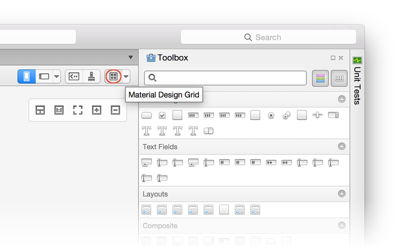](material-design-features-images/xs/01-material-design-grid.png#lightbox)

When you click the Material Design Grid icon, the Designer displays an
overlay on the Design Surface that includes the following elements:

-   Keylines (orange lines)

-   Spacing (green areas)

-   A grid (blue lines)

These elements can be seen in the following screenshot:

[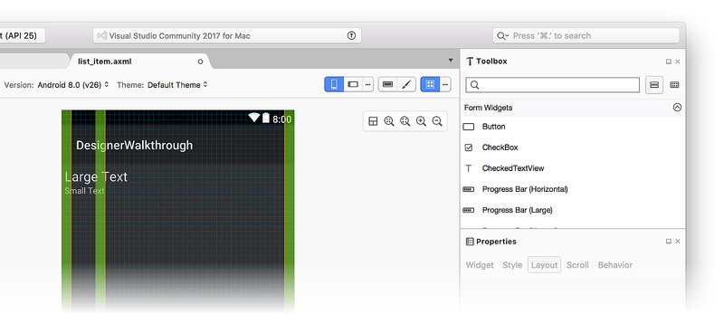](material-design-features-images/xs/02-grid-and-keylines.png#lightbox)

Each of these overlay items is configurable. When you click the ellipsis
(&hellip;) next to the Material Design Grid menu, a dialog popover opens
that allows you to disable/enable the grid, configure the placement of
keylines, and set the spacings. Note that all values are expressed in
`dp` (density-independent pixels):

[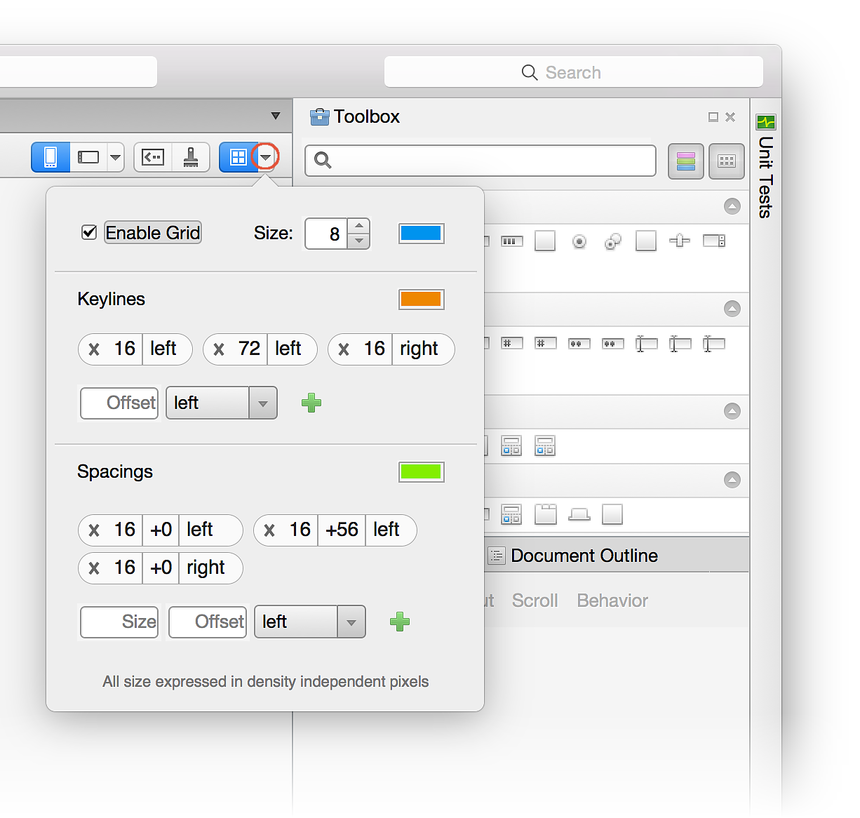](material-design-features-images/xs/03-grid-configuration.png#lightbox)

To add a new keyline, enter a new offset value in the **Offset** box,
select a location (**left**, **top**, **right**, or **bottom**) and
click the + icon (which appears to the right when a value is entered)
to add the new keyline. Similarly, to add a new spacing, enter the size
and offset (in dp) into the **Size** and **Offset** boxes,
respectively. Select a location (**left**, **top**, **right**, or
**bottom**) and click the + icon to add the new spacing.

When you change these configuration values, they are saved in the layout
XML file and reused when you open the layout again.

## Material Design Color Palette

Every Property panel item that accepts a color now has an additional
palette icon that you can use to open the Material Design Color
Palette, as shown in this screenshot:

When you click this icon, a dialog popover opens that makes it possible
for you to configure the color of that property from the Material
Design color palette:

[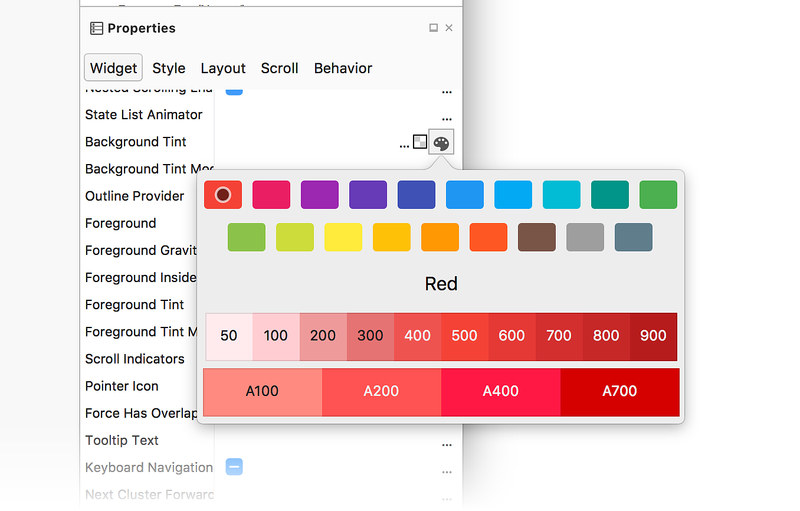](material-design-features-images/xs/05-material-palette.png#lightbox)

The top of the color palette displays primary Material Design colors
while the bottom of the palette displays a range of hues for the
selected primary color. For example, when you select **Indigo**, a
collection of **Indigo** hues is displayed at the bottom of the dialog.
When you select a hue, the color of the property is changed to the
selected hue. In the following example, the `Background Tint` of the
button is changed to *Indigo 500*:

[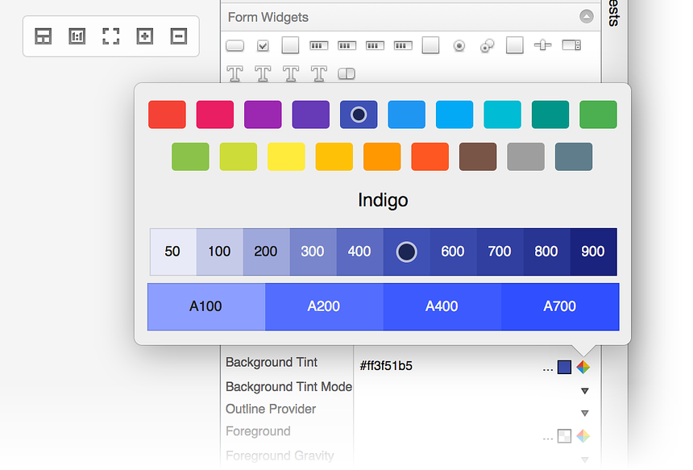](material-design-features-images/xs/06-indigo.png#lightbox)

`Background Tint` is set to the color code for *Indigo 500*
(`#ff3f51b5`), and the Designer updates the background color of the
button to reflect this change:

[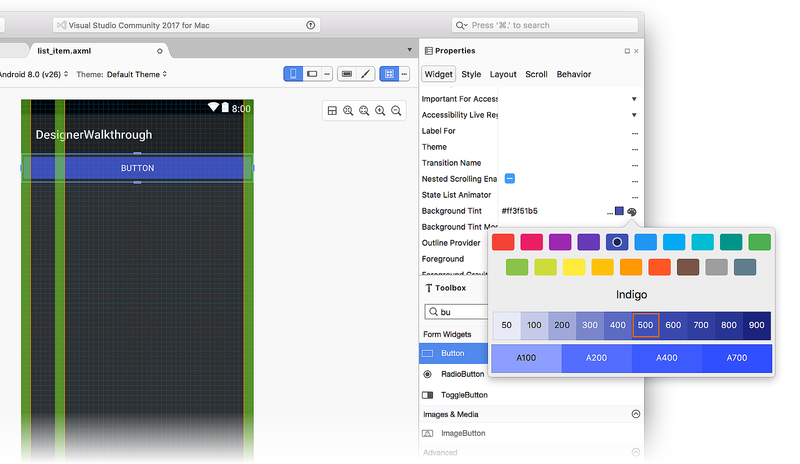](material-design-features-images/xs/07-background-tint.png#lightbox)

For more information about the Material Design color palette, see the
Material Design
[Color Palette Guide](https://material.io/design/color/).

## Typographic scale

The **Text Appearance** section of the **Property** pad **Style** tab
has an icon that lets you select from a `TextAppearance` style that
conforms to the Material Design specification:

[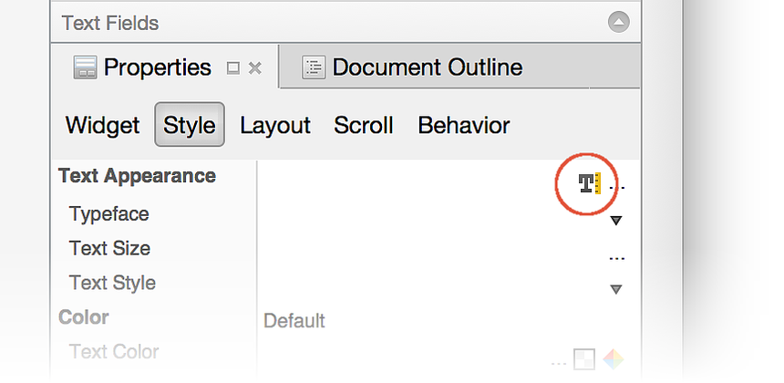](material-design-features-images/xs/08-typo-scale-icon.png#lightbox)

When you click this icon, it opens the **Typographic Scale** dialog
popover, which presents a list of pre-configured text styles that you
can choose from:

[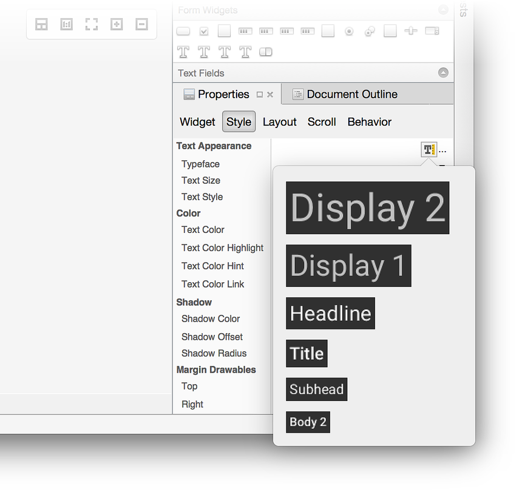](material-design-features-images/xs/09-text-appearance.png#lightbox)

In the following example, clicking **Display 1** changes the text of
the button to the larger font of **Display 1**:

[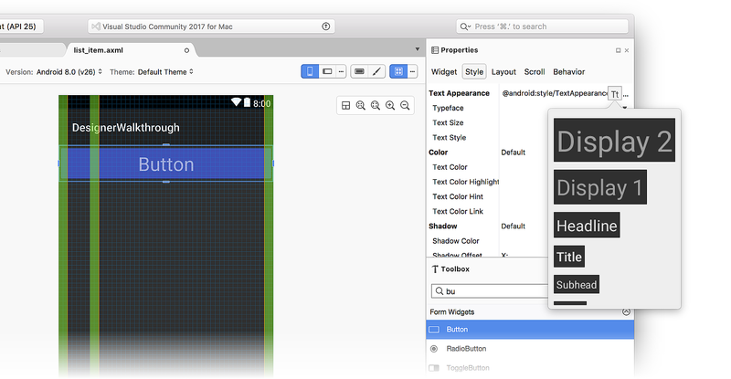](material-design-features-images/xs/10-display-1.png#lightbox)

The text style in the **Typographic Scale** dialog follows the
**Theme** setting. For example, if the **Light** theme is chosen in the
Designer, the list of available text styles mirrors the **Light**
theme:

[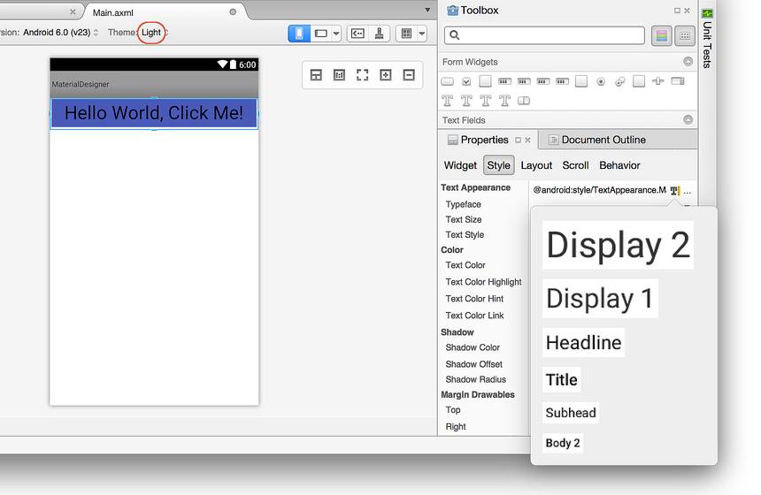](material-design-features-images/xs/11-light-theme.png#lightbox)

## Theme Editor

The **Theme Editor** lets you customize color information for a subset
of theme attributes. To open the **Theme Editor**, click the paintbrush
icon on the toolbar:

[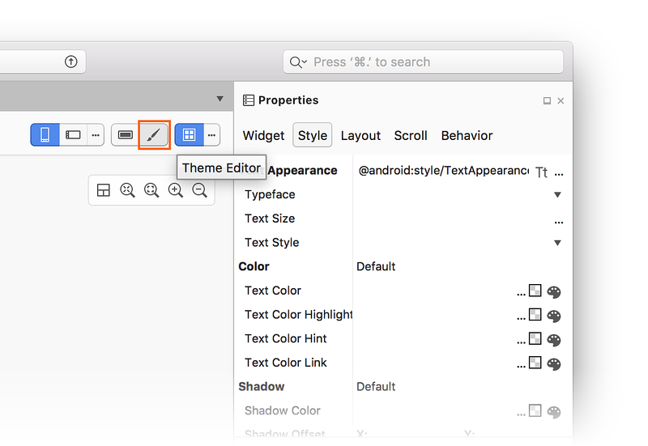](material-design-features-images/xs/12a-theme-editor-icon.png#lightbox)

Although the **Theme Editor** is accessible from the toolbar for
all target Android versions and API levels, only a subset of
the capabilities described below are available if the target API
level is earlier than API 21 (Android 5.0 Lollipop).

The left-hand panel of the  **Theme Editor** displays the list of
colors that make up the currently selected theme (in this example,
we are using the `Default Theme`):

[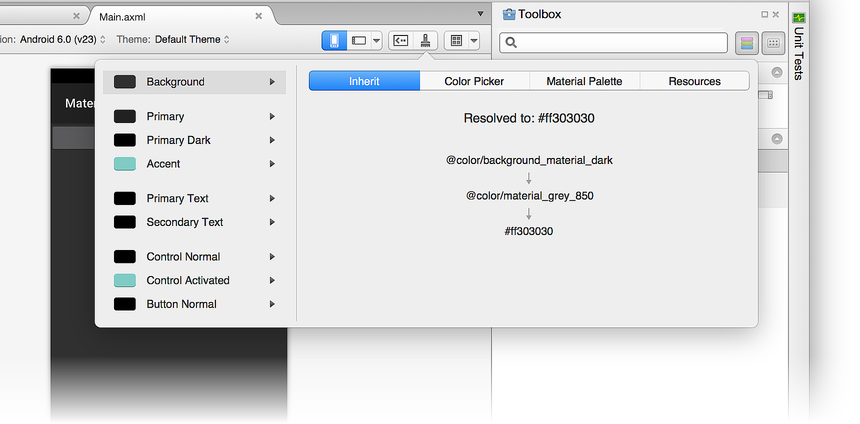](material-design-features-images/xs/12b-theme-editor.png#lightbox)

When you select a color on the left, the right-hand panel provides the
following tabs to help you edit that color:

-   **Inherit** &ndash; Displays a style inheritance diagram for the
    selected color and lists the resolved color and color
    code assigned to that theme color.

-   **Color Picker** &ndash; Lets you change the selected color
    to any arbitrary value.

-   **Material Palette** &ndash; Lets you change the selected color
    to a value that conforms to Material Design.

-   **Resources** &ndash; Lets you change the selected color
    to one of the other existing color resources in the theme.

Let's look at each one of these tabs in detail.

### Inherit tab

As seen in the following example, the **Inherit** tab lists the
style inheritance for the **Background** color of the **Default Theme**:

[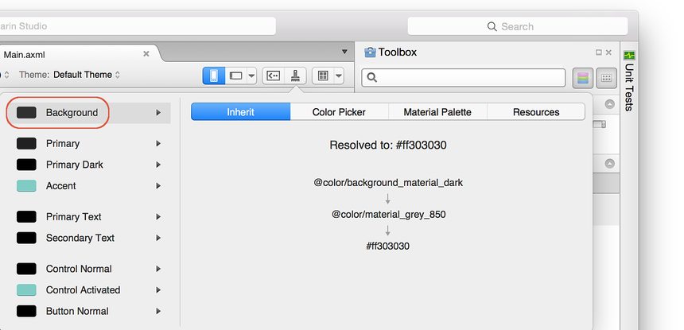](material-design-features-images/xs/13-inherit.png#lightbox)

In this example, the **Default Theme** inherits from a style that uses
`@color/background_material_dark` but overrides it with
`color/material_grey_850`, which has a color code value of `#ff303030`.
For more information about style inheritance, see
[Styles and Themes](http://developer.android.com/guide/topics/ui/themes.html#Inheritance).

### Color Picker

The following screenshot illustrates the **Color Picker**:

In this example, the **Background** color can be changed to any
value through various means:

-   Clicking a color directly.
-   Entering hue, saturation, and brightness values.
-   Entering RGB (red, green, blue) values in decimal.
-   Setting the alpha (opacity) for the selected color.
-   Entering the hexadecimal color code directly.

The color you choose in the Color Picker is *not* restricted to
Material Design guidelines or to the set of available color resources.

### Resources

The **Resources** tab offers a list of color resources that are already
present in the theme:

[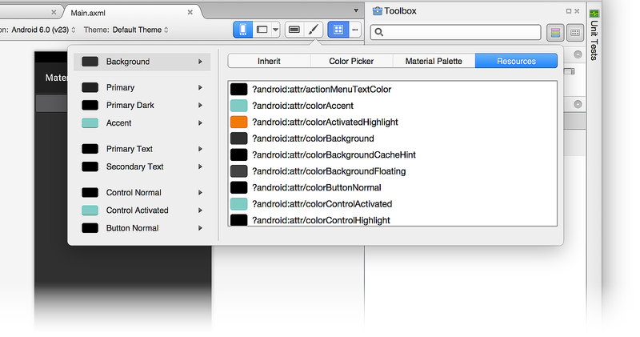](material-design-features-images/xs/15-resources.png#lightbox)

Using the **Resources** tab constrains your choices to this list of
colors. Keep in mind that if you choose a color resource that is
already assigned to another part of the theme, two adjacent elements of
the UI may "run together" (because they have the same color) and become
difficult for the user to distinguish.

### Material Palette

The **Material Palette** tab opens the **Material Design Color Palette**
described [earlier](#material_palette). Choosing a color value from this palette
constrains your color choice so that it is consistent with Material
Design guidelines.

[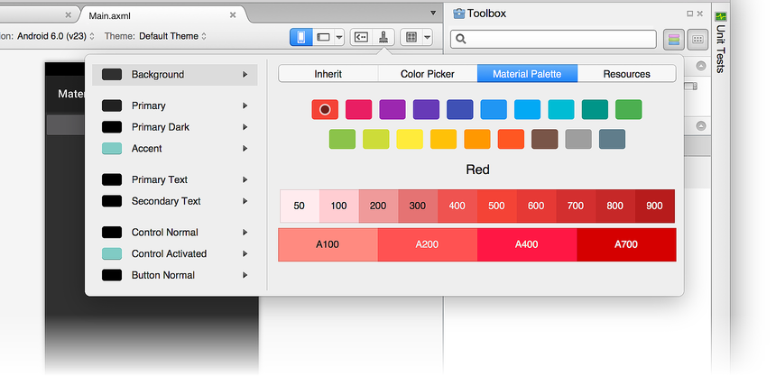](material-design-features-images/xs/16-material-palette.png#lightbox)

### Creating a new theme

In the following example, we'll use the Material Palette to create a
new custom theme. First, we'll change the **Background** color to *Blue
900*:

[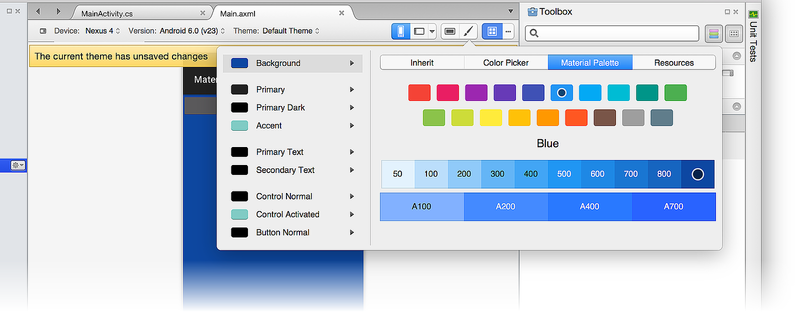](material-design-features-images/xs/17-change-background-to-blue.png#lightbox)

When a color resource is changed, a message pops up with the
message, *The current theme has unsaved changes*:

The color change in the Designer has been made, but this change has not
yet been saved. At this point, you can do one of the following:

-   Click **Discard Changes** to discard the new color choice (or choices) 
    and revert the theme to its original state. 

-   Press **&#8984; + S** to save your changes to a new theme
    called **Custom**. 

## Summary

This topic described the Material Design features available in the
Xamarin.Android Designer. It explained how to enable and configure the
Material Design Grid, how to use the Material Design Color Palette to
edit color properties, and how to use the Typographic Scale selector to
configure text properties. It also demonstrated how to use the Theme
Editor to create new custom themes that conform to Material Design
guidelines. For more information about Xamarin.Android support for
Material Design, see
[Material Theme](~/android/user-interface/material-theme.md).

-----

## Related Links

- [Material Theme](~/android/user-interface/material-theme.md)
- [Material Design introduction](https://material.io/design/introduction)
