# Resource Qualifiers and Visualization Options

_This topic explains how to define resources that will be used only when some qualifier values are matched. A simple example is a language-qualified string resource. A string resource can be defined as the default, with other alternative resources defined to be used for additional languages. All resource types can be qualified, including the layout itself._

## Custom Device Configurations

Android is available on a plethora of devices and screen resolutions.
To help design user interfaces that target many devices, the
Designer comes with a variety of device configurations built in. It
also supports adding additional device configurations; these
configurations are based on *qualifiers* that you specify to
distinguish one device configuration from another. There are many
different types of qualifiers. For more information about these
resource types, see
[Android Resources](~/android/app-fundamentals/resources-in-android/index.md).

At the bottom of the Device Selector menu is a **Customize** option as
shown below:

# [Visual Studio](#tab/vswin)

[ 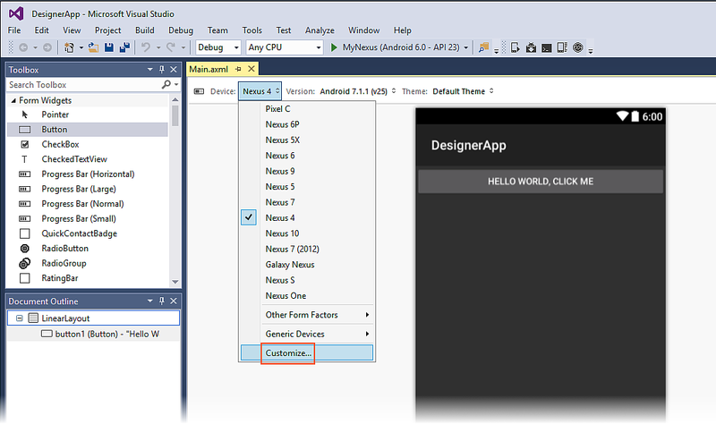](resource-qualifiers-images/vs/01-device-selector.png)

# [Visual Studio for Mac](#tab/vsmac)

[ 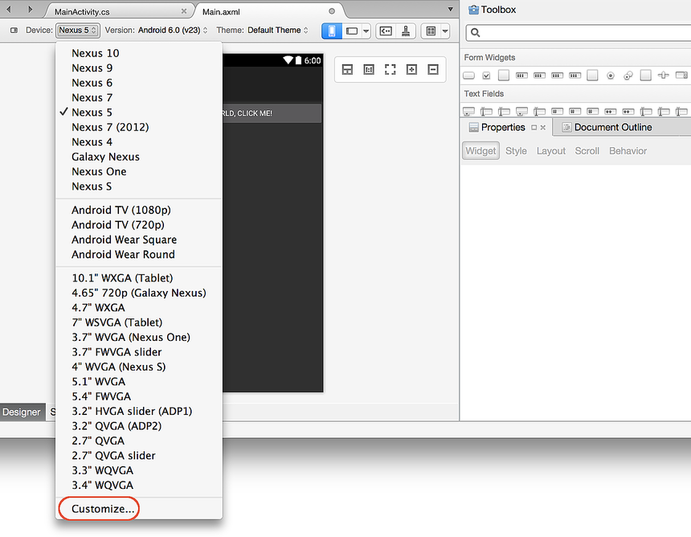](resource-qualifiers-images/xs/01-device-selector.png)

-----

Selecting **Customize** displays a dialog that that you can use for
browsing through available device configurations. When you click the
**Device Definitions** tab, a list of all known device definitions is
presented:

# [Visual Studio](#tab/vswin)

# [Visual Studio for Mac](#tab/vsmac)

[ 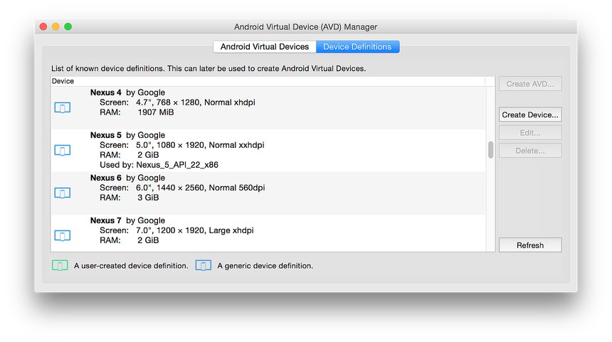](resource-qualifiers-images/xs/02-device-definitions.png)

-----

Devices preconfigured in the Designer cannot be modified. However,
you can click **Create Device...** to define a custom device
definition. Alternately, you can select an existing definition and click
**Clone...** to use it as the starting point for a new definition.
For example, selecting the **Nexus 5** definition and clicking
**Clone...** presents the following dialog:

# [Visual Studio](#tab/vswin)

[ 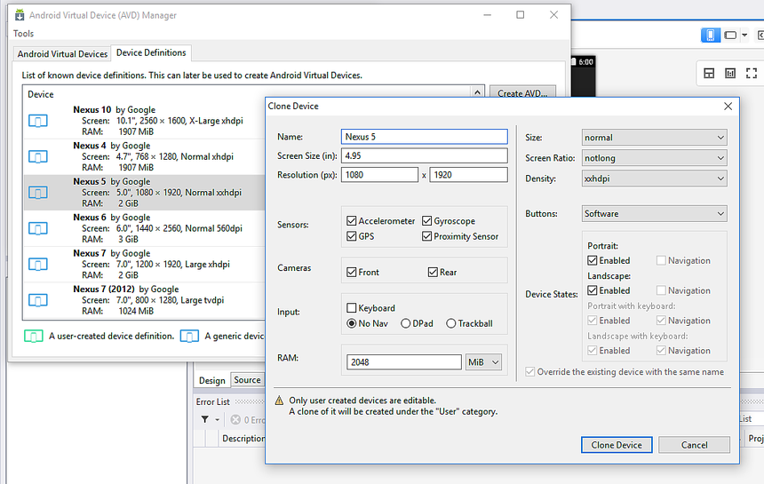](resource-qualifiers-images/vs/03-clone.png)

# [Visual Studio for Mac](#tab/vsmac)

[ 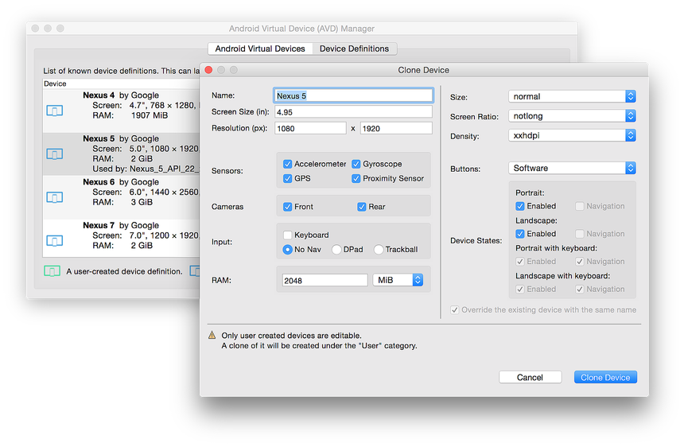](resource-qualifiers-images/xs/03-clone.png)

-----

In the next screenshot, the name is changed to **Nexus 5 Custom** and
the device parameters are modified to create a new custom device
definition. In this example, **Portrait** is disabled so that the
device definition is landscape-only:

# [Visual Studio](#tab/vswin)

# [Visual Studio for Mac](#tab/vsmac)

[ 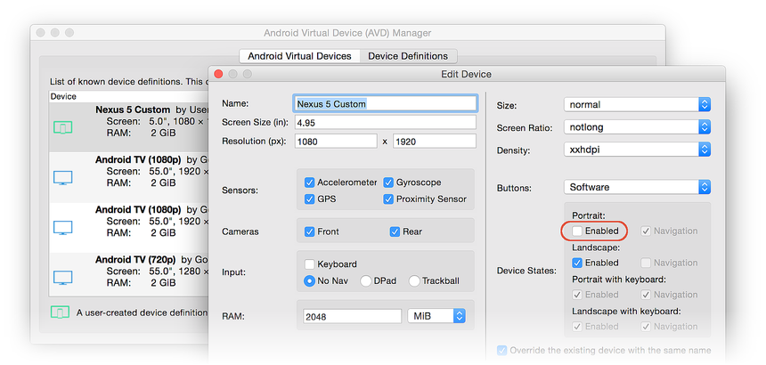](resource-qualifiers-images/xs/04-custom.png)

-----

Clicking **Clone Device** creates the new device definition, which now
appears in the **Device Definitions** list:

# [Visual Studio](#tab/vswin)

[ 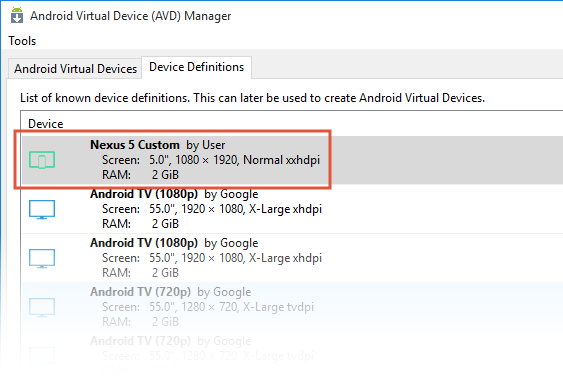](resource-qualifiers-images/vs/05-updated-device-definitions.png)

# [Visual Studio for Mac](#tab/vsmac)

[ 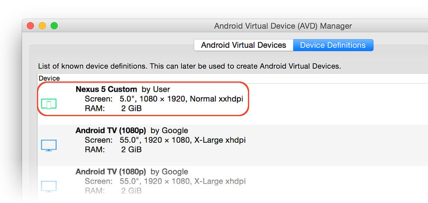](resource-qualifiers-images/xs/05-updated-device-definitions.png)

-----

Note that each user-created device definition is displayed with a green
icon as shown above. When you return to the **Device** selector menu,
the new custom device definition is presented in the topmost section of
the list (if you do not see your custom device configuration in this
list, try restarting the IDE):

# [Visual Studio](#tab/vswin)

[ 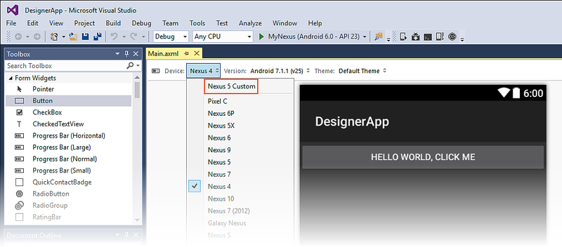](resource-qualifiers-images/vs/06-nexus-5-custom.png)

# [Visual Studio for Mac](#tab/vsmac)

[ 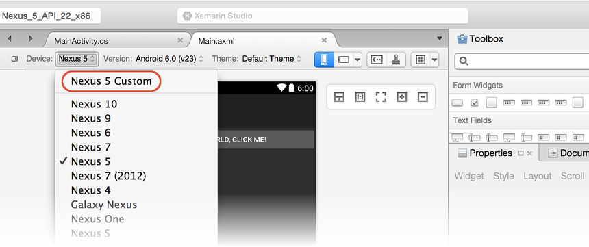](resource-qualifiers-images/xs/06-nexus-5-custom.png)

-----

Selecting this device configuration modifies the layout to conform to
the customizations created earlier (in this case, landscape-only mode):

# [Visual Studio](#tab/vswin)

# [Visual Studio for Mac](#tab/vsmac)

[ 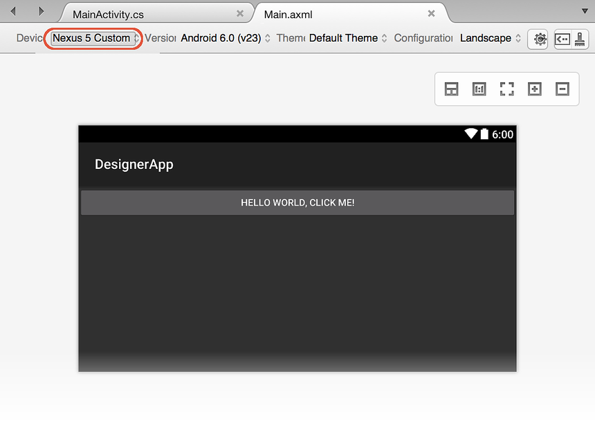](resource-qualifiers-images/xs/07-custom-in-use.png)

-----

## Resource Qualifier Options

**Resource Qualifier Options** can be accessed by clicking the
down triangle icon to the right of the **Device Configuration**
options:

# [Visual Studio](#tab/vswin)

# [Visual Studio for Mac](#tab/vsmac)

[ 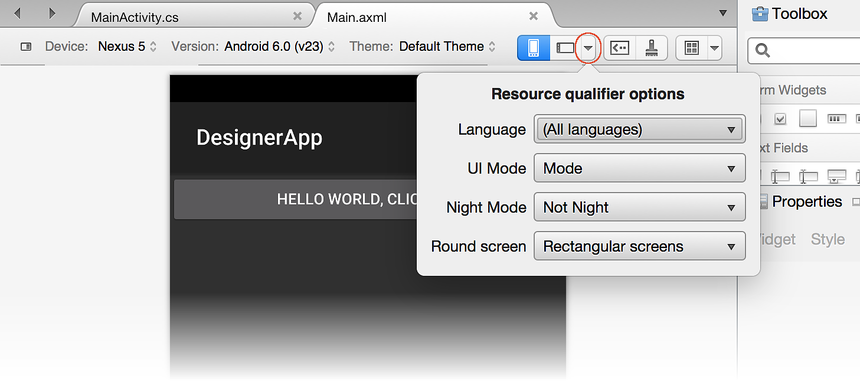](resource-qualifiers-images/xs/08-resource-qual-opt.png)

-----

This dialog presents pull-down menus for the following resource
qualifiers:

-   **Language** &ndash; Displays available language resources
    and offers an option to add new language/region resources.

-   **UI Mode** &ndash; Lists display modes (such as **Car Dock**
    and **Desk Dock**) as well as layout directions.

Each of these pull-down menus opens new dialog boxes where you
can select and configure resource qualifiers (as explained
next).

### Language

The **Language** pull-down menu lists only those languages that have
resources defined (or **All languages**, which is the default). However,
there is also an **Add language/region...** option that allows you to
add a new language to the list:

# [Visual Studio](#tab/vswin)

# [Visual Studio for Mac](#tab/vsmac)

[ 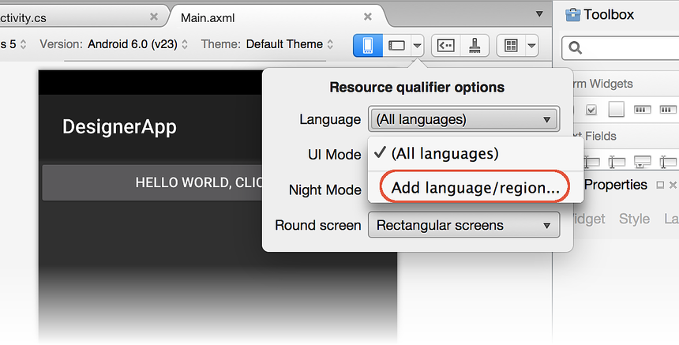](resource-qualifiers-images/xs/09-add-language-region.png)

-----

When you click **Add language/region...**, the **Select Language**
dialog opens to display drop-down lists of available languages and
regions:

# [Visual Studio](#tab/vswin)

# [Visual Studio for Mac](#tab/vsmac)

[ 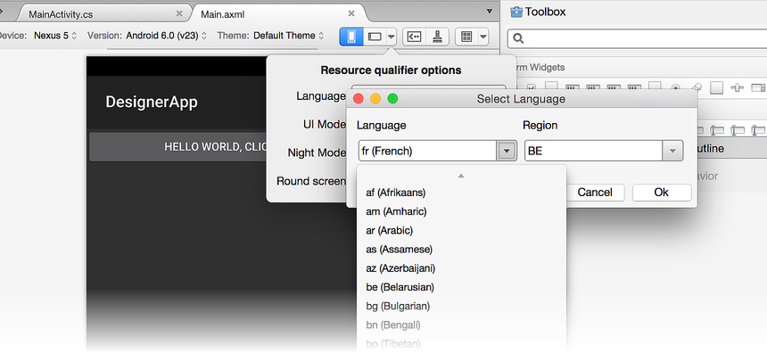](resource-qualifiers-images/xs/10-languages.png)

-----

In this example, we have chosen **fr (French)** for the language and
**BE** (Belgium) for the regional dialect of French. Note that the
**Region** field is optional because many languages can be specified
without regard for specific regions. When the **Language** pull-down
menu is opened again, it displays the newly-added language/region
resource:

# [Visual Studio](#tab/vswin)

# [Visual Studio for Mac](#tab/vsmac)

-----

Note that if you add a new language but you do not create new resources
for it, the added language will no longer be shown the next time you
open the project.

### UI Mode

When you click the **UI Mode** pull-down menu, a list of modes is
displayed, such as **Normal**, **Car Dock**, **Desk Dock**,
**Television**, **Appliance**, and **Watch**:

# [Visual Studio](#tab/vswin)

Below this list are the night modes **Not Night** and **Night**,
followed by the layout directions **Left to Right** and **Right to
Left** (for information about **Left to Right** and **Right to Left**
options, see
[LayoutDirection](https://developer.xamarin.com/api/type/Android.Util.LayoutDirection/).
The last items in the **Resource Qualifier Options** dialog are the
**Round screens** (for use with Android Wear) or **Not Round screens**
(for information about round and non-round screens, see
[Layouts](https://developer.android.com/training/wearables/ui/layouts.html)).
For more information about Android UI modes, see
[UiModeManager](https://developer.xamarin.com/api/type/Android.App.UiModeManager/).

# [Visual Studio for Mac](#tab/vsmac)

[ 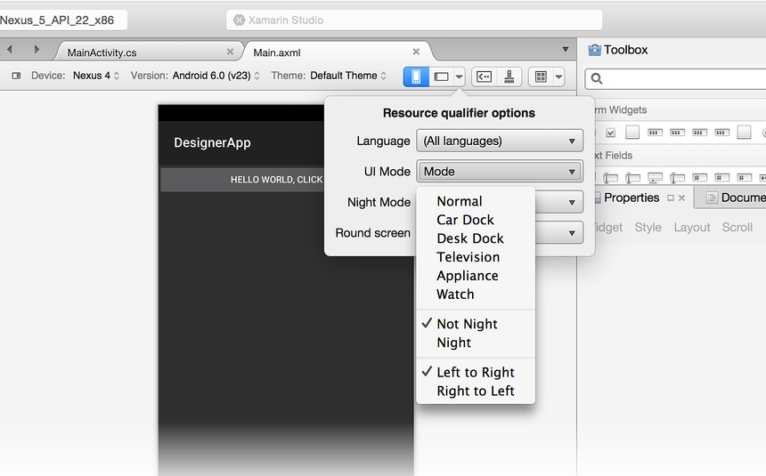](resource-qualifiers-images/xs/12-ui-mode.png)

Below this list are the night modes **Not Night** and **Night**,
followed by the layout directions **Left to Right** and **Right to
Left**. For more information about Android UI modes, see
[UiModeManager](https://developer.xamarin.com/api/type/Android.App.UiModeManager/).
For information about **Left to Right** and **Right to Left** options,
see [LayoutDirection](https://developer.xamarin.com/api/type/Android.Util.LayoutDirection/).

### Round Screen

The last item in the **Resource Qualifier Options** dialog is the
**Round screen** menu. This menu allows you to select either **Round
screens** (for use with Android Wear) or **Rectangular screens**:

[ 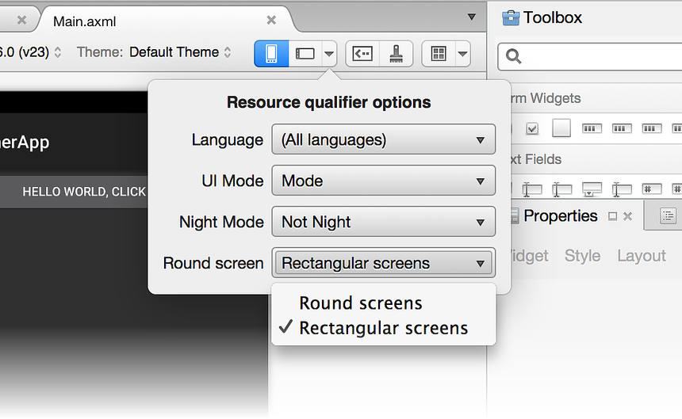](resource-qualifiers-images/xs/13-round-screen.png)

-----

## Action Bar Settings

The **Action Bar Settings** icon is available to the left of the
paintbrush (Theme Editor) icon:

# [Visual Studio](#tab/vswin)

# [Visual Studio for Mac](#tab/vsmac)

-----

This icon opens a dialog popover that provides a way to select from one of
three Action Bar modes:

-   **Standard** &ndash; Consists of either a logo or icon and title text
    with an optional subtitle.

-   **List** &ndash; List navigation mode. Instead of static title text, this
    mode presents a list menu for navigation within the activity (that is,
    it can be presented to the user as a dropdown list).

-   **Tabs** &ndash; Tab navigation mode. Instead of static title text,
    this mode presents a series of tabs for navigation within the
    activity.

## Themes

The **Theme** drop-down menu displays all of the themes defined in the
project. Selecting **More Themes** opens a dialog with a list of all
themes available from the installed Android SDK, as shown below:

# [Visual Studio](#tab/vswin)

# [Visual Studio for Mac](#tab/vsmac)

[ 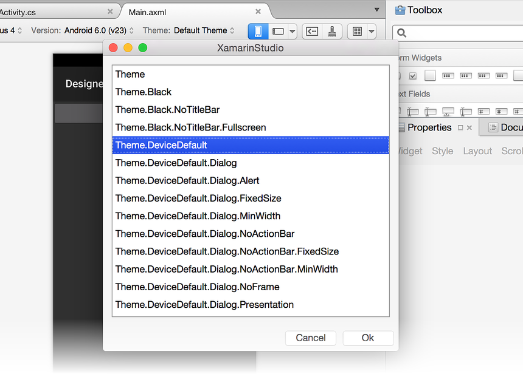](resource-qualifiers-images/xs/14-theme-menu.png)

-----

When a theme is selected, the Design Surface is updated to show
the effect of the new theme. Note that this change is made permanent only
if the **OK** button is clicked in the **Theme** dialog. Once a theme
has been selected, it will be included in the **Theme** drop-down menu
as shown below:

# [Visual Studio](#tab/vswin)

# [Visual Studio for Mac](#tab/vsmac)

[ 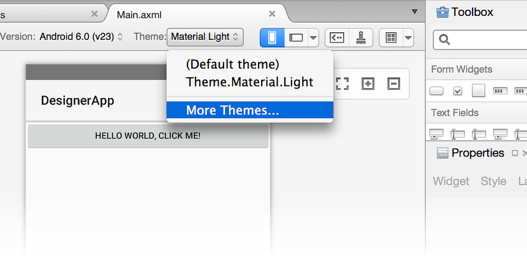](resource-qualifiers-images/xs/15-light-theme.png)

-----

## Android Version

The Android **Version** selector sets the Android version that is used
to render the layout in the Designer. The selector displays all
versions that are compatible with the target framework version of the
project:

# [Visual Studio](#tab/vswin)

The target framework version can be set in the project's settings under
**Properties > Application > Compile using Android version**. For more
information about target framework version, see
[Understanding Android API Levels](~/android/app-fundamentals/android-api-levels.md).

The set of widgets available in the toolbox is determined by the target
framework version of the project. This is also true for the properties
available in the **Properties Window**. The available list of widgets is
*not* determined by the value selected in the **Version** selector of
the toolbar. For example, if you set the target version of the project
to Android 4.4, you can still select Android 6.0 in the toolbar version
selector to see what the project looks like in Android 6.0, but you
won't be able to add widgets that are specific to Android 6.0 &ndash;
you will still be limited to the widgets that are available in Android
4.4.

# [Visual Studio for Mac](#tab/vsmac)

[ 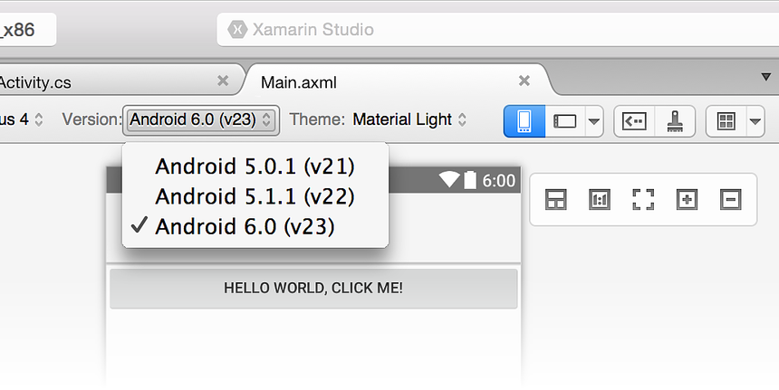](resource-qualifiers-images/xs/16-android-version.png)

The target framework version can be set in the project's settings under
the **Project Options > Build > General** section. For more information
about target framework version, see
[Understanding Android API Levels](~/android/app-fundamentals/android-api-levels.md).

The set of widgets available in the toolbox is determined by the target
framework version of the project. This is also true for the properties
available in the **Property Pad**. The available list of widgets is
*not* determined by the value selected in the **Version** selector of
the toolbar. For example, if you set the target version of the project
to Android 4.4, you can still select Android 6.0 in the toolbar version
selector to see what the project looks like in Android 6.0, but you
won't be able to add widgets that are specific to Android 6.0 &ndash;
you will still be limited to the widgets that are available in Android
4.4.

-----
