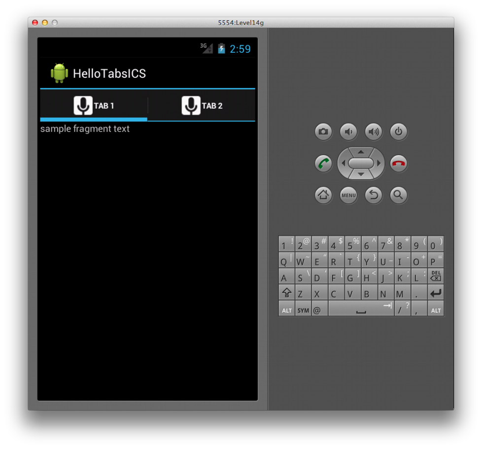
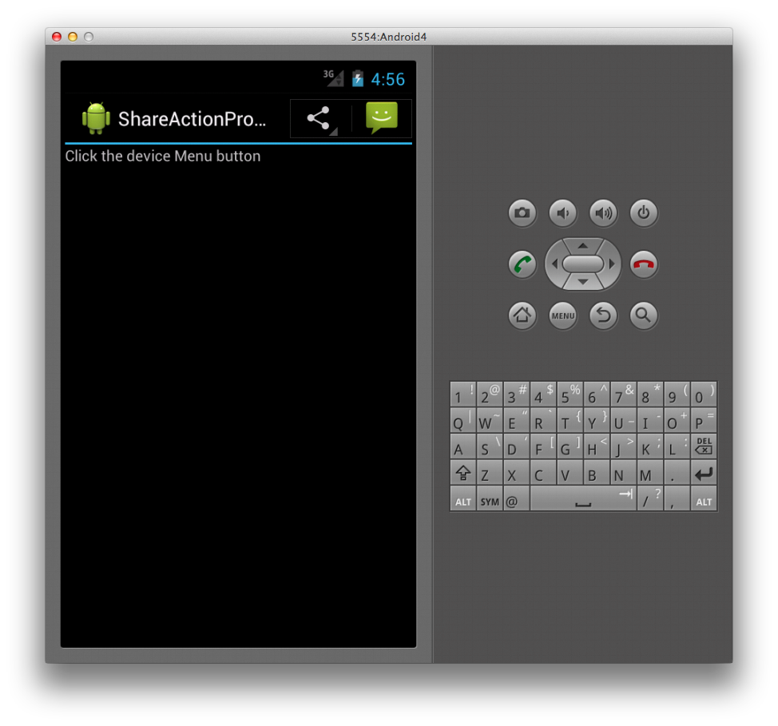
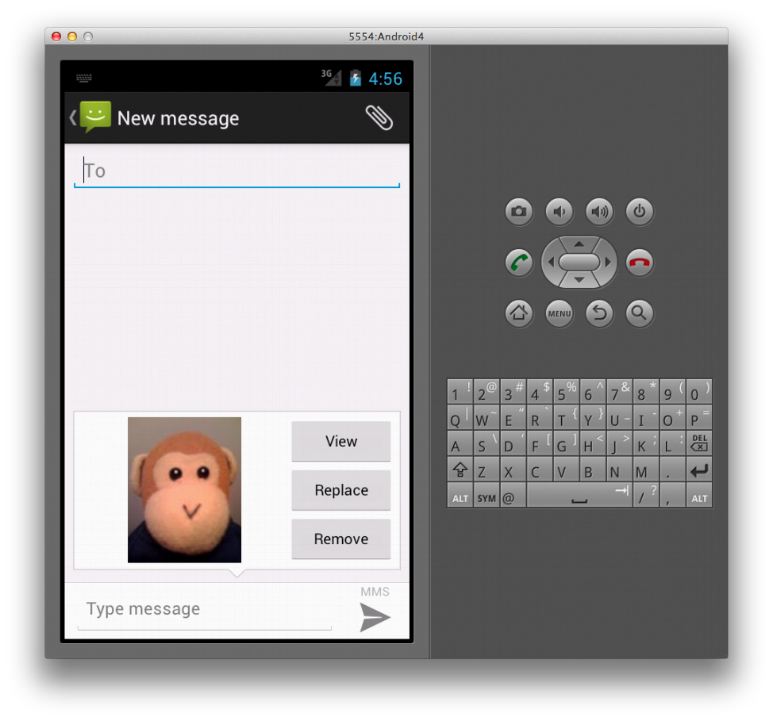

# ActionBar for Xamarin.Android

When using `TabActivity`, the code to create the tab icons has no
effect when run against the Android 4.0 framework. Although
functionally it works as it did in versions of Android prior to 2.3,
the `TabActivity` class itself has been deprecated in 4.0. A new way to
create a tabbed interface has been introduced that uses the Action Bar,
which we'll discuss next.

## Action Bar Tabs

The Action Bar includes support for adding tabbed interfaces in Android 4.0.
The following screenshot shows an example of such an interface.

[](action-bar-images/25-actionbartabs.png#lightbox)

To create tabs in the Action Bar, we first need to set its
`NavigationMode` property to support tabs. In Android 4, an `ActionBar`
property is available on the Activity class, which we can use to set
the `NavigationMode` like this:

```csharp
this.ActionBar.NavigationMode = ActionBarNavigationMode.Tabs;
```

Once this is done, we can create a tab by calling the `NewTab` method
on the Action Bar. With this tab instance, we can call the `SetText`
and `SetIcon` methods to set the tab's label text and icon; these calls
are made in order in the code shown below:

```csharp
var tab = this.ActionBar.NewTab ();
tab.SetText (tabText);
tab.SetIcon (Resource.Drawable.ic_tab_white);
```

Before we can add the tab however, we need to handle the `TabSelected`
event. In this handler, we can create the content for the tab. Action
Bar tabs are designed to work with *Fragments*, which are classes that
represent a portion of the user interface in an Activity. For this
example, the Fragment's view contains a single `TextView`, which we
inflate in our `Fragment` subclass like this:

```csharp
class SampleTabFragment: Fragment
{           
    public override View OnCreateView (LayoutInflater inflater,
        ViewGroup container, Bundle savedInstanceState)
    {
        base.OnCreateView (inflater, container, savedInstanceState);

        var view = inflater.Inflate (
            Resource.Layout.Tab, container, false);

        var sampleTextView =
            view.FindViewById<TextView> (Resource.Id.sampleTextView);            
        sampleTextView.Text = "sample fragment text";

        return view;
    }
}
```

The event argument passed in the `TabSelected` event is of type
`TabEventArgs`, which includes a `FragmentTransaction` property that we
can use to add the fragment as shown below:

```csharp
tab.TabSelected += delegate(object sender, ActionBar.TabEventArgs e) {             
    e.FragmentTransaction.Add (Resource.Id.fragmentContainer,
        new SampleTabFragment ());
};
```

Finally, we can add the tab to the Action Bar by calling the `AddTab`
method as shown in this code:

```csharp
this.ActionBar.AddTab (tab);
```

For the complete example, see the *HelloTabsICS* project in the sample
code for this document.

## ShareActionProvider

The `ShareActionProvider` class enables a sharing action to take place
from an Action Bar. It takes care of creating an action view with a
list of apps that can handle a sharing Intent and keeps a history of
the previously used applications for easy access to them later from the
Action Bar. This allows applications to share data via a user
experience that's consistent throughout Android.

### Image Sharing Example

For example, below is a screenshot of an Action Bar with a menu item to
share an image (taken from the
[ShareActionProvider](/samples/xamarin/monodroid-samples/shareactionproviderdemo)
sample). When the user taps the menu item on the Action Bar, the
ShareActionProvider loads the application to handle an Intent that is
associated with the `ShareActionProvider`. In this example, the
messaging application has been previously used, so it is presented on
the Action Bar.

[](action-bar-images/09-shareactionprovider.png#lightbox)

When the user clicks on the item in the Action Bar, the messaging app that
contains the shared image is launched, as shown below:

[](action-bar-images/10-messagewithimage.png#lightbox)

### Specifying the action Provider Class

To use the `ShareActionProvider`, set the `android:actionProviderClass`
attribute on a menu item in the XML for the Action Bar's menu as
follows:

```xml
<?xml version="1.0" encoding="utf-8"?>
<menu xmlns:android="http://schemas.android.com/apk/res/android">
  <item android:id="@+id/shareMenuItem"
      android:showAsAction="always"
      android:title="@string/sharePicture"
      android:actionProviderClass="android.widget.ShareActionProvider" />
</menu>
```

### Inflating the Menu

To inflate the menu, we override `OnCreateOptionsMenu` in the Activity
subclass. Once we have a reference to the menu, we can get the
`ShareActionProvider` from the `ActionProvider` property of the menu
item and then use the SetShareIntent method to set the
`ShareActionProvider`'s Intent, as shown below:

```csharp
public override bool OnCreateOptionsMenu (IMenu menu)
{
    MenuInflater.Inflate (Resource.Menu.ActionBarMenu, menu);       

    var shareMenuItem = menu.FindItem (Resource.Id.shareMenuItem);           
    var shareActionProvider =
       (ShareActionProvider)shareMenuItem.ActionProvider;
    shareActionProvider.SetShareIntent (CreateIntent ());
}
```

### Creating the Intent

The `ShareActionProvider` will use the Intent, passed to the
`SetShareIntent` method in the above code, to launch the appropriate
Activity. In this case we create an Intent to send an image by using
the following code:

```csharp
Intent CreateIntent ()
{  
    var sendPictureIntent = new Intent (Intent.ActionSend);
    sendPictureIntent.SetType ("image/*");
    var uri = Android.Net.Uri.FromFile (GetFileStreamPath ("monkey.png"));          
    sendPictureIntent.PutExtra (Intent.ExtraStream, uri);
    return sendPictureIntent;
}
```

The image in the code example above is included as an asset with the
application and copied to a publicly accessible location when the
Activity is created, so it will be accessible to other applications,
such as the messaging app. The sample code that accompanies this
article contains the full source of this example, illustrating its use.

## Related Links

- [Hello Tabs ICS (sample)](/samples/xamarin/monodroid-samples/hellotabsics)
- [ShareActionProvider Demo (sample)](/samples/xamarin/monodroid-samples/shareactionproviderdemo)