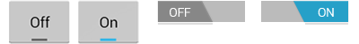

# ToggleButton

In this section, you'll create a button used specifically for toggling
between two states, using the
[`ToggleButton`](https://developer.xamarin.com/api/type/Android.Widget.ToggleButton/) widget. This
widget is an excellent alternative to radio buttons if you have two
simple states that are mutually exclusive ("on" and "off", for
example). Android 4.0 (API level 14) introduced an alternative to the
toggle button known as a
[`Switch`](https://developer.xamarin.com/api/type/Android.Widget.Switch/).

An example of a **ToggleButton** can be seen in the left hand pair of images,
while the right hand pair of images presents an example of a **Switch**:

  

Which control an application uses is a matter of style. Both widgets
are functionally equivalent.

Open the **Resources/layout/Main.axml** file and add the
[`ToggleButton`](https://developer.xamarin.com/api/type/Android.Widget.ToggleButton/) element
(inside the
[`LinearLayout`](https://developer.xamarin.com/api/type/Android.Widget.LinearLayout/)):

To do something when the state is changed, add the following code
to the end of the
[`OnCreate()`](https://developer.xamarin.com/api/member/Android.App.Activity.OnCreate/p/Android.OS.Bundle/Android.OS.PersistableBundle)
method:

```csharp
ToggleButton togglebutton = FindViewById<ToggleButton>(Resource.Id.togglebutton);

togglebutton.Click += (o, e) => {
    // Perform action on clicks
    if (togglebutton.Checked)
        Toast.MakeText(this, "Checked", ToastLength.Short).Show ();
    else
        Toast.MakeText(this, "Not checked", ToastLength.Short).Show ();
};
```

This captures the
[`ToggleButton`](https://developer.xamarin.com/api/type/Android.Widget.ToggleButton/) element
from the layout, and handles the Click event, which defines the
action to perform when the button is clicked. In this example, the
method checks the new state of the button, then shows a
[`Toast`](https://developer.xamarin.com/api/type/Android.Widget.Toast/) message that indicates
the current state.

Notice that the
[`ToggleButton`](https://developer.xamarin.com/api/type/Android.Widget.ToggleButton/) handles
its own state change between checked and unchecked, so you just ask
which it is.

Run the application.


**Tip:** If you need to change the state yourself (such as
when loading a saved
[`CheckBoxPreference`](https://developer.xamarin.com/api/type/Android.Preferences.CheckBoxPreference/)),
use the
[`Checked`](https://developer.xamarin.com/api/property/Android.Widget.CompoundButton.Checked/)
property setter or
[`Toggle()`](https://developer.xamarin.com/api/member/Android.Widget.CompoundButton.Toggle/)
method.


## Related Links

- [ToggleButton](http://developer.android.com/reference/android/widget/ToggleButton.html)
- [Switch](http://developer.android.com/reference/android/widget/Switch.html)
