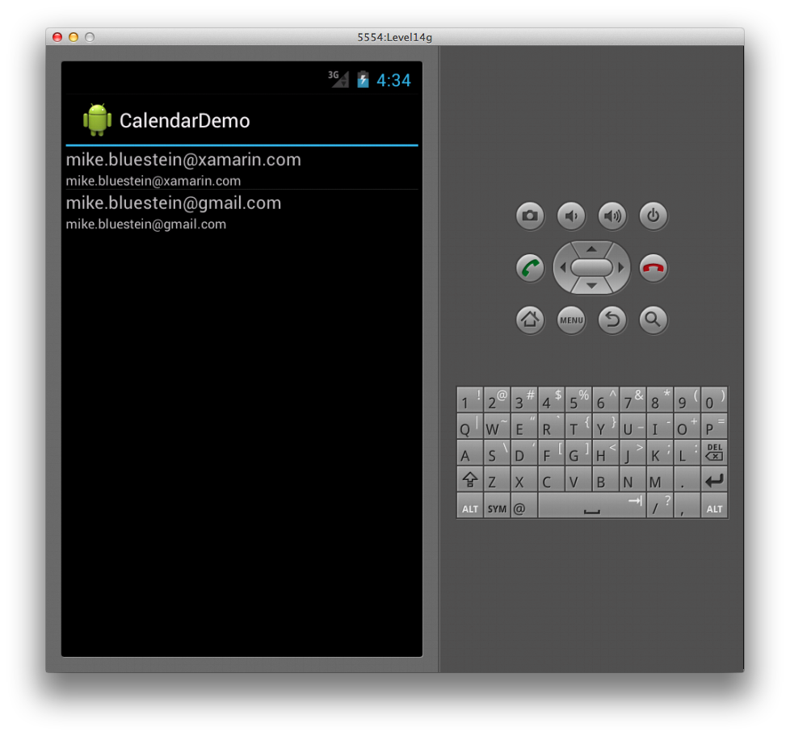
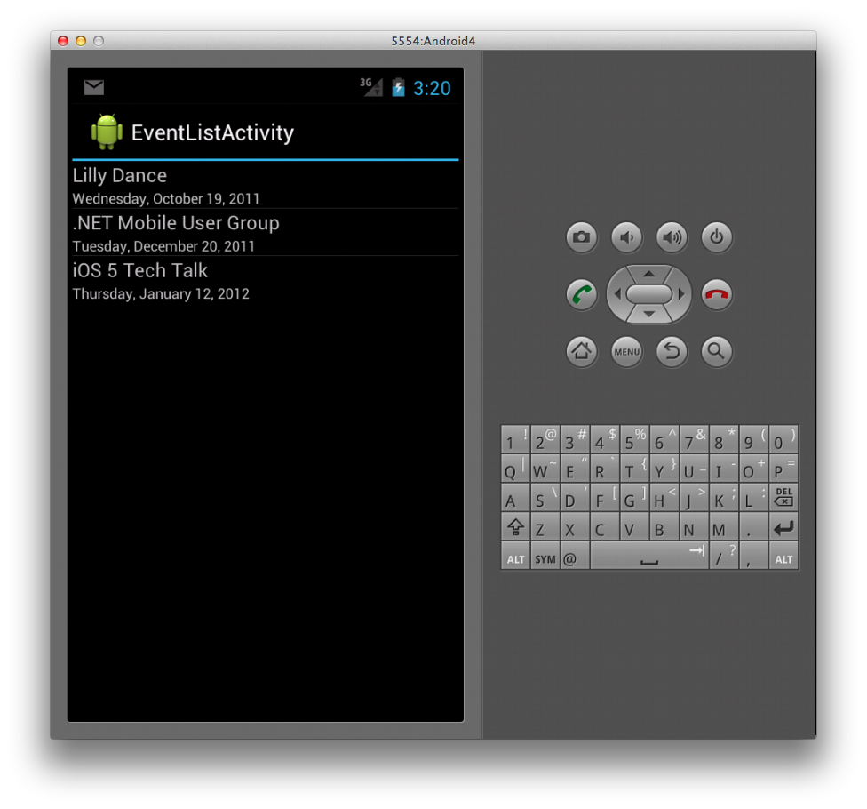
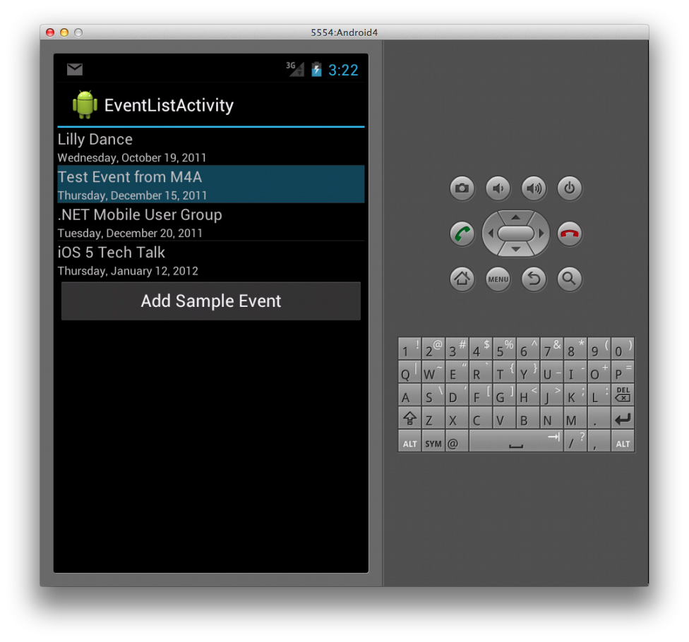
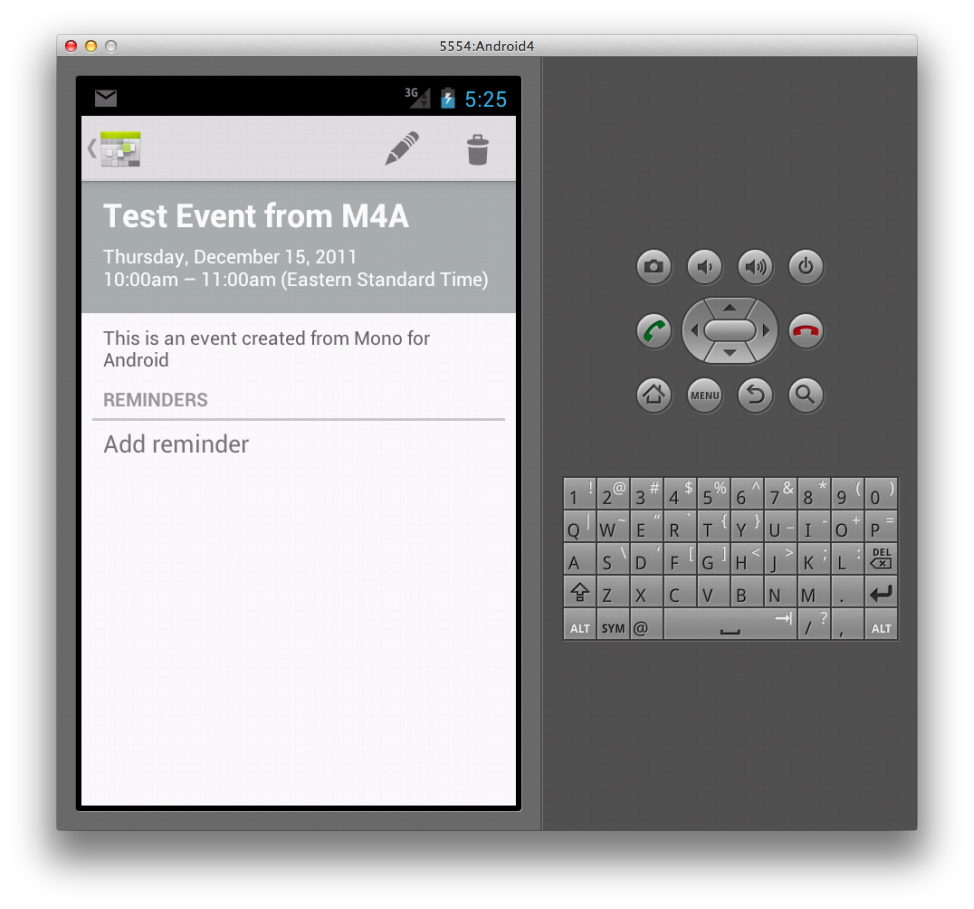

# Xamarin.Android Calendar

## Calendar API

A new set of calendar APIs introduced in Android 4 supports
applications that are designed to read or write data to the calendar
provider. These APIs support a wealth of interaction options with
calendar data, including the ability to read and write events,
attendees, and reminders. By using the calendar provider in your
application, data you add through the API will appear in the built-in
calendar app that comes with Android 4.

## Adding Permissions

When working with the new calendar APIs in your application, the first
thing you need to do is add the appropriate permissions to the Android
manifest. The permissions you need to add are
`android.permisson.READ_CALENDAR` and
`android.permission.WRITE_CALENDAR`, depending on whether you are
reading and/or writing calendar data.

## Using the Calendar Contract

Once you set the permissions, you can interact with calendar data
by using the `CalendarContract` class. This class provides a data model
that applications can use when they interact with the calendar
provider. The `CalendarContract` allows applications to resolve the
Uris to calendar entities, such as calendars and events. It also
provides a way to interact with various fields in each entity, such as
a calendar's name and ID, or an event's start and end date.

Let's look at an example that uses the Calendar API. In this example,
we'll examine how to enumerate calendars and their events, as well as
how to add a new event to a calendar.

## Listing Calendars

First, let's examine how to enumerate the calendars that have been
registered in the calendar app. To do this, we can instantiate a
`CursorLoader`. Introduced in Android 3.0 (API 11), `CursorLoader` is
the preferred way to consume a `ContentProvider`. At a minimum, we'll
need to specify the content Uri for calendars and the columns we want
to return; this column specification is known as a _projection_.

Calling the `CursorLoader.LoadInBackground` method allows us to query a
content provider for data, such as the calendar provider.
`LoadInBackground` performs the actual load operation and returns a
`Cursor` with the results of the query.

The `CalendarContract` assists us in specifying both the content `Uri`
and the projection. To get the content `Uri` for querying calendars, we
can simply use the `CalendarContract.Calendars.ContentUri` property
like this:

```csharp
var calendarsUri = CalendarContract.Calendars.ContentUri;
```

Using the `CalendarContract` to specify which calendar columns we want
is equally simple. We just add fields in the
`CalendarContract.Calendars.InterfaceConsts` class to an array. For
example, the following code includes the calendar's ID, display name,
and account name:

```csharp
string[] calendarsProjection = {
    CalendarContract.Calendars.InterfaceConsts.Id,
    CalendarContract.Calendars.InterfaceConsts.CalendarDisplayName,
    CalendarContract.Calendars.InterfaceConsts.AccountName
};
```

The `Id` is important to include if you are using a
`SimpleCursorAdapter` to bind the data to the UI, as we will see
shortly. With the content Uri and projection in place, we instantiate
the `CursorLoader` and call the `CursorLoader.LoadInBackground` method
to return a cursor with the calendar data as shown below:

```csharp
var loader = new CursorLoader(this, calendarsUri, calendarsProjection, null, null, null);
var cursor = (ICursor)loader.LoadInBackground();

```

The UI for this example contains a `ListView`, with each item in the
list representing a single calendar. The following XML shows the markup
that includes the `ListView`:

```xml
<?xml version="1.0" encoding="utf-8"?>
<LinearLayout xmlns:android="http://schemas.android.com/apk/res/android"
android:orientation="vertical"
android:layout_width="fill_parent"
android:layout_height="fill_parent">
  <ListView
    android:id="@android:id/android:list"
    android:layout_width="fill_parent"
    android:layout_height="wrap_content" />
</LinearLayout>
```

Also, we need to specify the UI for each list item, which we place in a
separate XML file as follows:

```xml
<?xml version="1.0" encoding="utf-8"?>
<LinearLayout xmlns:android="http://schemas.android.com/apk/res/android"
android:orientation="vertical"
android:layout_width="fill_parent"
android:layout_height="wrap_content">
  <TextView android:id="@+id/calDisplayName"
    android:layout_width="wrap_content"
    android:layout_height="wrap_content"
    android:textSize="16dip" />
  <TextView android:id="@+id/calAccountName"
    android:layout_width="wrap_content"
    android:layout_height="wrap_content"
    android:textSize="12dip" />
</LinearLayout>
```

From this point on, it's just normal Android code to bind the data
from the cursor to the UI. We'll use a `SimpleCursorAdapter` as
follows:

```csharp
string[] sourceColumns = {
    CalendarContract.Calendars.InterfaceConsts.CalendarDisplayName,
    CalendarContract.Calendars.InterfaceConsts.AccountName };

int[] targetResources = {
    Resource.Id.calDisplayName, Resource.Id.calAccountName };      

SimpleCursorAdapter adapter = new SimpleCursorAdapter (this,
    Resource.Layout.CalListItem, cursor, sourceColumns, targetResources);

ListAdapter = adapter;
```

In the above code, the adapter takes the columns specified in the
`sourceColumns` array and writes them to the user interface elements in
the `targetResources` array for each calendar entry in the cursor. The
Activity used here is a subclass of `ListActivity`; it includes the
`ListAdapter` property to which we set the adapter.

Here's a screenshot showing the end result, with the calendar info
displayed in the `ListView`:

[](calendar-images/11-calendar.png#lightbox)

## Listing Calendar Events

Next let's look at how to enumerate the events for a given calendar.
Building upon the example above, we'll present a list of events when
the user selects one of the calendars. Therefore, we'll need to handle
the item selection in the previous code:

```csharp
ListView.ItemClick += (sender, e) => {
    int i = (e as ItemEventArgs).Position;

    cursor.MoveToPosition(i);
    int calId =
        cursor.GetInt (cursor.GetColumnIndex (calendarsProjection [0]));

    var showEvents = new Intent(this, typeof(EventListActivity));
    showEvents.PutExtra("calId", calId);
    StartActivity(showEvents);
};
```

In this code, we're creating an Intent to open an Activity of type
`EventListActivity`, passing the calendar's ID in the Intent. We will
need the ID to know which calendar to query for events. In the
`EventListActivity`'s `OnCreate` method, we can retrieve the ID from
the `Intent` as shown below:

```csharp
_calId = Intent.GetIntExtra ("calId", -1);
```

Now let's query events for this calendar ID. The process to query for
events is similar to the way we queried for a list of calendars
earlier, only this time we'll work with the `CalendarContract.Events`
class. The following code creates a query to retrieve events:

```csharp
var eventsUri = CalendarContract.Events.ContentUri;

string[] eventsProjection = {
    CalendarContract.Events.InterfaceConsts.Id,
    CalendarContract.Events.InterfaceConsts.Title,
    CalendarContract.Events.InterfaceConsts.Dtstart
};

var loader = new CursorLoader(this, eventsUri, eventsProjection,
                   String.Format ("calendar_id={0}", _calId), null, "dtstart ASC");
var cursor = (ICursor)loader.LoadInBackground();
```

In this code, we first get the content `Uri` for events from the
`CalendarContract.Events.ContentUri` property. Then we specify the
event columns we want to retrieve in the eventsProjection array.
Finally, we instantiate a `CursorLoader` with this information
and call the loader's `LoadInBackground` method to return a `Cursor`
with the event data.

To display the event data in the UI, we can use markup and code just
like we did before to display the list of calendars. Again, we use
`SimpleCursorAdapter` to bind the data to a `ListView` as shown in the
following code:

```csharp
string[] sourceColumns = {
    CalendarContract.Events.InterfaceConsts.Title,
    CalendarContract.Events.InterfaceConsts.Dtstart };

int[] targetResources = {
    Resource.Id.eventTitle,
    Resource.Id.eventStartDate };

var adapter = new SimpleCursorAdapter (this, Resource.Layout.EventListItem,
    cursor, sourceColumns, targetResources);

adapter.ViewBinder = new ViewBinder ();       
ListAdapter = adapter;
```

The main difference between this code and the code that we used earlier
to show the calendar list is the use of a `ViewBinder`, which is set on
the line:

```csharp
adapter.ViewBinder = new ViewBinder ();
```

The `ViewBinder` class allows us to further control how we bind
values to views. In this case, we use it to convert the event start time from
milliseconds to a date string, as shown in the following implementation:

```csharp
class ViewBinder : Java.Lang.Object, SimpleCursorAdapter.IViewBinder
{    
    public bool SetViewValue (View view, Android.Database.ICursor cursor,
        int columnIndex)
    {
        if (columnIndex == 2) {
            long ms = cursor.GetLong (columnIndex);

            DateTime date = new DateTime (1970, 1, 1, 0, 0, 0,
                DateTimeKind.Utc).AddMilliseconds (ms).ToLocalTime ();

            TextView textView = (TextView)view;
            textView.Text = date.ToLongDateString ();

            return true;
        }
        return false;
    }    
}
```

This displays a list of events as shown below:

[](calendar-images/12-events.png#lightbox)

## Adding a Calendar Event

We've seen how to read calendar data. Now let's see how to add an
event to a calendar. For this to work, be sure to include the
`android.permission.WRITE_CALENDAR` permission we mentioned earlier. To
add an event to a calendar, we will:

1. Create a  `ContentValues` instance.
1. Use keys from the  `CalendarContract.Events.InterfaceConsts` class to populate the  `ContentValues` instance.
1. Set the time zones for the event start and end times.
1. Use a  `ContentResolver` to insert the event data into the calendar.

The code below illustrates these steps:

```csharp
ContentValues eventValues = new ContentValues ();

eventValues.Put (CalendarContract.Events.InterfaceConsts.CalendarId,
    _calId);
eventValues.Put (CalendarContract.Events.InterfaceConsts.Title,
    "Test Event from M4A");
eventValues.Put (CalendarContract.Events.InterfaceConsts.Description,
    "This is an event created from Xamarin.Android");
eventValues.Put (CalendarContract.Events.InterfaceConsts.Dtstart,
    GetDateTimeMS (2011, 12, 15, 10, 0));
eventValues.Put (CalendarContract.Events.InterfaceConsts.Dtend,
    GetDateTimeMS (2011, 12, 15, 11, 0));

eventValues.Put(CalendarContract.Events.InterfaceConsts.EventTimezone,
    "UTC");
eventValues.Put(CalendarContract.Events.InterfaceConsts.EventEndTimezone,
    "UTC");

var uri = ContentResolver.Insert (CalendarContract.Events.ContentUri,
    eventValues);
```

Note that if we do not set the time zone, an exception of type
`Java.Lang.IllegalArgumentException` will be thrown. Because event time
values must be expressed in milliseconds since epoch, we create a
`GetDateTimeMS` method (in `EventListActivity`) to convert our date
specifications into millisecond format:

```csharp
long GetDateTimeMS (int yr, int month, int day, int hr, int min)
{
    Calendar c = Calendar.GetInstance (Java.Util.TimeZone.Default);

    c.Set (Java.Util.CalendarField.DayOfMonth, 15);
    c.Set (Java.Util.CalendarField.HourOfDay, hr);
    c.Set (Java.Util.CalendarField.Minute, min);
    c.Set (Java.Util.CalendarField.Month, Calendar.December);
    c.Set (Java.Util.CalendarField.Year, 2011);

    return c.TimeInMillis;
}
```

If we add a button to the event list UI and run the above code in the
button's click event handler, the event is added to the calendar and
updated in our list as shown below:

[](calendar-images/13.png#lightbox)

If we open the calendar app, then we will see that the event is written
there as well:

[](calendar-images/14.png#lightbox)

As you can see, Android allows powerful and easy access to retrieve and
persist calendar data, allowing applications to seamlessly integrate
calendar capabilities.

## Related Links

- [Calendar Demo (sample)](/samples/xamarin/monodroid-samples/calendardemo)