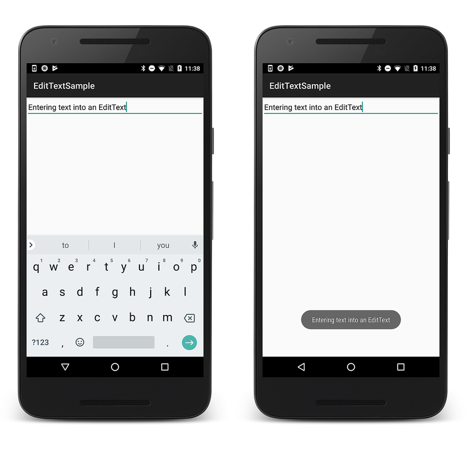

# Xamarin.Android Edit Text

In this section, you will use the
[EditText](xref:Android.Widget.EditText)
widget to create a text field for user input. Once text has been
entered into the field, the **Enter** key will display the text in a
toast message.

Open **Resources/layout/activity_main.axml** and add the
[EditText](xref:Android.Widget.EditText)
element to a containing layout. The following example
**activity_main.axml** has an `EditText` that has been added to a `LinearLayout`:

```xml
<?xml version="1.0" encoding="utf-8"?>
<LinearLayout xmlns:android="http://schemas.android.com/apk/res/android"
    android:orientation="vertical"
    android:layout_width="match_parent"
    android:layout_height="match_parent">
    <EditText
        android:id="@+id/edittext"
        android:layout_width="match_parent"
        android:imeOptions="actionGo"
        android:inputType="text"
        android:layout_height="wrap_content" />
</LinearLayout>
```

In this code example, the `EditText` attribute `android:imeOptions` is
set to `actionGo`. This setting changes the default
[Done](https://developer.android.com/reference/android/view/inputmethod/EditorInfo#IME_ACTION_DONE)
action to the
[Go](https://developer.android.com/reference/android/view/inputmethod/EditorInfo#IME_ACTION_GO)
action so that tapping the **Enter** key triggers the `KeyPress` input handler.
(Typically, `actionGo` is used so that the **Enter** key takes the user
to the target of a URL that is typed in.)

To handle user text input, add the following code to the end of the
[OnCreate](xref:Android.App.Activity.OnCreate*)
method in **MainActivity.cs**:

```csharp
EditText edittext = FindViewById<EditText>(Resource.Id.edittext);
edittext.KeyPress += (object sender, View.KeyEventArgs e) => {
    e.Handled = false;
    if (e.Event.Action == KeyEventActions.Down && e.KeyCode == Keycode.Enter)
    {
        Toast.MakeText(this, edittext.Text, ToastLength.Short).Show();
        e.Handled = true;
    }
};
```

In addition, add the following `using` statement to the top of
**MainActivity.cs** if it is not already present:

```csharp
using Android.Views;
```

This code example inflates the
[EditText](xref:Android.Widget.EditText)
element from the layout and adds a
[KeyPress](xref:Android.Views.View.KeyPress)
handler that defines the action to be made when a key is pressed while
the widget has focus. In this case, the method is defined to listen for
the **Enter** key (when tapped) and then pop up a
[Toast](xref:Android.Widget.Toast)
message with the text that has been entered. Note that the
[Handled](xref:Android.Views.View.KeyEventArgs.Handled)
property should always be `true` if the event has been handled. This is
necessary to prevent the event from bubbling up (which would result in
a carriage return in the text field).

Run the application and enter some text into the text field. When you
press the **Enter** key, the toast will be displayed as shown on the right:

[](edit-text-images/edit-text.png#lightbox)

*Portions of this page are modifications based on work created and shared by the Android Open Source Project and used according to terms described in the* [*Creative Commons 2.5 Attribution License*](https://creativecommons.org/licenses/by/2.5/) *. This tutorial is based on the* [*Android Form Stuff tutorial*](https://developer.android.com/resources/tutorials/views/hello-formstuff.html) *.*

## Related Links

- [EditTextSample](/samples/xamarin/monodroid-samples/userinterface-edittextsample)