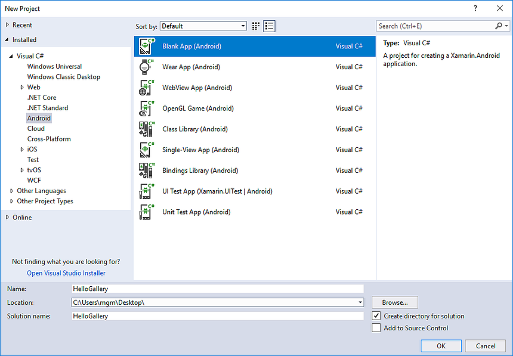
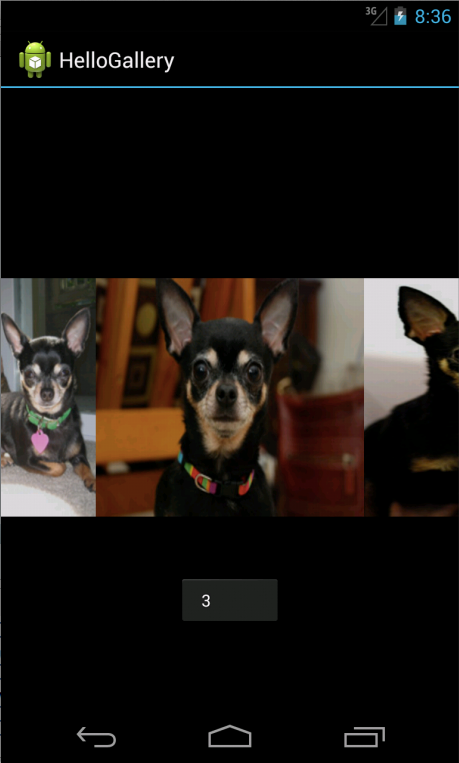

# Gallery

[`Gallery`](https://developer.xamarin.com/api/type/Android.Widget.Gallery/)
is a layout widget used to display items in a horizontally scrolling
list and positions the current selection at the center of the view.

> [!IMPORTANT]
> This widget was deprecated in Android 4.1 (API level 16). 

In this tutorial, you'll create a gallery of photos and then display a toast
message each time a gallery item is selected.

After the `Main.axml` layout is set for the content view, the `Gallery`
is captured from the layout with
[`FindViewById`](https://developer.xamarin.com/api/member/Android.App.Activity.FindViewById/p/System.Int32/).
The
[`Adapter`](https://developer.xamarin.com/api/property/Android.Widget.AdapterView.RawAdapter/)
property is then used to set a custom adapter ( `ImageAdapter`) as the
source for all items to be displayed in the dallery. The `ImageAdapter`
is created in the next step.

To do something when an item in the gallery is clicked, an anonymous
delegate is subscribed to the
[`ItemClick`](https://developer.xamarin.com/api/event/Android.Widget.AdapterView.ItemClick/)
event. It shows a
[`Toast`](https://developer.xamarin.com/api/type/Android.Widget.Toast/)
that displays the index position (zero-based) of theselected item (in a
real world scenario, the position could be used to get the full sized
image for some other task).

First, there are a few member variables, including an array of IDs that
reference the images saved in the drawable resources directory
(**Resources/drawable**).

Next is the class constructor, where the
[`Context`](https://developer.xamarin.com/api/type/Android.Content.Context/)
for an `ImageAdapter` instance is defined and saved to a local field.
Next, this implements some required methods inherited from
[`BaseAdapter`](https://developer.xamarin.com/api/type/Android.Widget.BaseAdapter/).
The constructor and the
[`Count`](https://developer.xamarin.com/api/property/Android.Widget.BaseAdapter.Count/)
property are self-explanatory. Normally,
[`GetItem(int)`](https://developer.xamarin.com/api/member/Android.Widget.BaseAdapter.GetItem/p/System.Int32/)
should return the actual object at the specified position in the
adapter, but it's ignored for this example. Likewise,
[`GetItemId(int)`](https://developer.xamarin.com/api/member/Android.Widget.BaseAdapter.GetItemId/p/System.Int32/)
should return the row id of the item, but it's not needed here.

The method does the work to apply an image to an
[`ImageView`](https://developer.xamarin.com/api/type/Android.Widget.ImageView/)
that will be embedded in the
[`Gallery`](https://developer.xamarin.com/api/type/Android.Widget.Gallery/)
In this method, the member
[`Context`](https://developer.xamarin.com/api/type/Android.Content.Context/)
is used to create a new
[`ImageView`](https://developer.xamarin.com/api/type/Android.Widget.ImageView/).
The
[`ImageView`](https://developer.xamarin.com/api/type/Android.Widget.ImageView/)
is prepared by applying an image from the local array of drawable
resources, setting the
[`Gallery.LayoutParams`](https://developer.xamarin.com/api/type/Android.Widget.Gallery+LayoutParams/)
height and width for the image, setting the scale to fit the
[`ImageView`](https://developer.xamarin.com/api/type/Android.Widget.ImageView/)
dimensions, and then finally setting the background to use the
styleable attribute acquired in the constructor.

See [`ImageView.ScaleType`](https://developer.xamarin.com/api/type/Android.Widget.ImageView+ScaleType/)
for other image scaling options.

## Walkthrough

Start a new project named *HelloGallery*.

[](gallery-images/hellogallery1.png#lightbox)

Find some photos you'd like to use, or
[download these sample
images](http://developer.android.com/shareables/sample_images.zip).
Add the image files to the project's **Resources/Drawable**
directory. In the **Properties** window, set the Build Action for
each to **AndroidResource**.

Open **Resources/Layout/Main.axml** and insert the following:

```xml
<?xml version="1.0" encoding="utf-8"?>
<Gallery xmlns:android="http://schemas.android.com/apk/res/android"
    android:id="@+id/gallery"
    android:layout_width="fill_parent"
    android:layout_height="wrap_content"
/>
```

Open `MainActivity.cs` and insert the following code for the
[`OnCreate()`](https://developer.xamarin.com/api/member/Android.App.Activity.OnCreate/p/Android.OS.Bundle/)
method:

```csharp
protected override void OnCreate (Bundle bundle)
{
    base.OnCreate (bundle);

    // Set our view from the "main" layout resource
    SetContentView (Resource.Layout.Main);

    Gallery gallery = (Gallery) FindViewById<Gallery>(Resource.Id.gallery);

    gallery.Adapter = new ImageAdapter (this);

    gallery.ItemClick += delegate (object sender, Android.Widget.AdapterView.ItemClickEventArgs args) {
        Toast.MakeText (this, args.Position.ToString (), ToastLength.Short).Show ();
    };
}
```

Create a new class called `ImageAdapter` that subclasses
[`BaseAdapter`](https://developer.xamarin.com/api/type/Android.Widget.BaseAdapter/):

```csharp
public class ImageAdapter : BaseAdapter
{
    Context context;

    public ImageAdapter (Context c)
    {
          context = c;
    }

    public override int Count { get { return thumbIds.Length; } }

    public override Java.Lang.Object GetItem (int position)
    {
          return null;
    }

    public override long GetItemId (int position)
    {
          return 0;
    }

    // create a new ImageView for each item referenced by the Adapter
    public override View GetView (int position, View convertView, ViewGroup parent)
    {
          ImageView i = new ImageView (context);

          i.SetImageResource (thumbIds[position]);
          i.LayoutParameters = new Gallery.LayoutParams (150, 100);
          i.SetScaleType (ImageView.ScaleType.FitXy);

          return i;
    }

    // references to our images
    int[] thumbIds = {
            Resource.Drawable.sample_1,
            Resource.Drawable.sample_2,
            Resource.Drawable.sample_3,
            Resource.Drawable.sample_4,
            Resource.Drawable.sample_5,
            Resource.Drawable.sample_6,
            Resource.Drawable.sample_7
     };
}

```

Run the application. It should look like the screenshot below:




## References

-   [`BaseAdapter`](https://developer.xamarin.com/api/type/Android.Widget.BaseAdapter/)
-   [`Gallery`](https://developer.xamarin.com/api/type/Android.Widget.Gallery/)
-   [`ImageView`](https://developer.xamarin.com/api/type/Android.Widget.ImageView/)

*Portions of this page are modifications based on work created and shared by the 
Android Open Source Project and used according to terms described in the*
[*Creative Commons 2.5 Attribution License*](http://creativecommons.org/licenses/by/2.5/).


