# Xamarin.Android Controls (Widgets)

Xamarin.Android exposes all of the native user interface controls
(widgets) provided by Android. These controls can be easily added to
Xamarin.Android apps using the Android Designer or programatically via
XML layout files. Regardless of which method you choose,
Xamarin.Android exposes all of the user interface object properties and
methods in C#. The following sections introduce the most common
Android user interface controls and explain how to incorporate them
into Xamarin.Android apps.

## [Action Bar](~/android/user-interface/controls/action-bar.md) 

`ActionBar` is a toolbar that displays the activity title,
navigation interfaces, and other interactive items. Typically, the
action bar appears at the top of an activity's window.

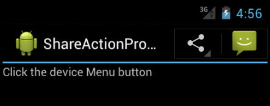

## [Auto Complete](~/android/user-interface/controls/auto-complete.md)

`AutoCompleteTextView` is an editable text view element that shows
completion suggestions automatically while the user is typing. The list
of suggestions is displayed in a drop down menu from which the user can
choose an item to replace the content of the edit box with.

## [Buttons](~/android/user-interface/controls/buttons/index.md)

Buttons are UI elements that the user taps to perform an action.

## [Calendar](~/android/user-interface/controls/calendar.md)

The `Calendar` class is used for converting a specific instance in time
(a millisecond value that is offset from the epoch) to values such as
year, month, hour, day of the month, and the date of the next week.
`Calendar` supports a wealth of interaction options with
calendar data, including the ability to read and write events,
attendees, and reminders. By using the calendar provider in your
application, data you add through the API will appear in the built-in
calendar app that comes with Android.

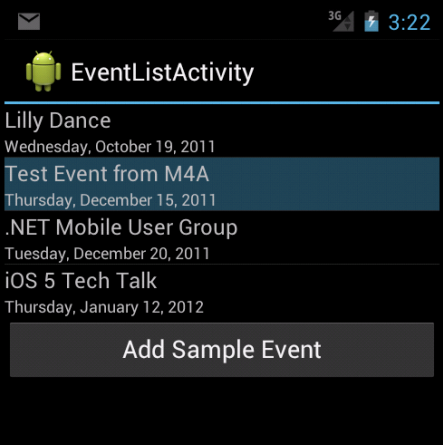

## [CardView](~/android/user-interface/controls/card-view.md)

`CardView` is a UI component that presents text and image content in
views that resemble cards. `CardView` is implemented as a `FrameLayout`
widget with rounded corners and a shadow. Typically, a `CardView` is
used to present a single row item in a `ListView` or `GridView` view
group.

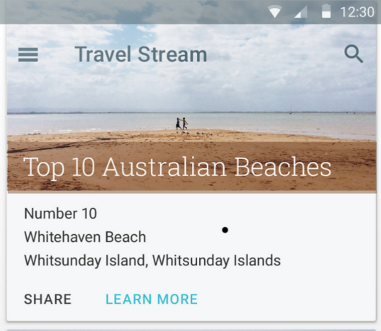

## [Edit Text](~/android/user-interface/controls/edit-text.md)

`EditText` is a UI element that is used for entering and modifying
text.

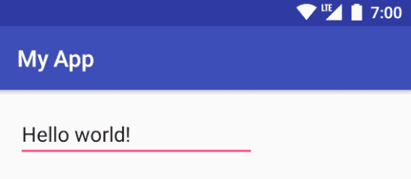

## [Gallery](~/android/user-interface/controls/gallery.md)

`Gallery` is a layout widget that is used to display items in a
horizontally scrolling list; it positions the current selection at the
center of the view.

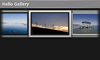

## [Navigation Bar](~/android/user-interface/controls/navigation-bar.md)

The *Navigation Bar* provides navigation controls on devices that
do not include hardware buttons for **Home**, **Back**, and **Menu**.

## [Pickers](~/android/user-interface/controls/pickers/index.md)

*Pickers* are UI elements that allow the user to pick a date or a 
time by using dialogs that are provided by Android.

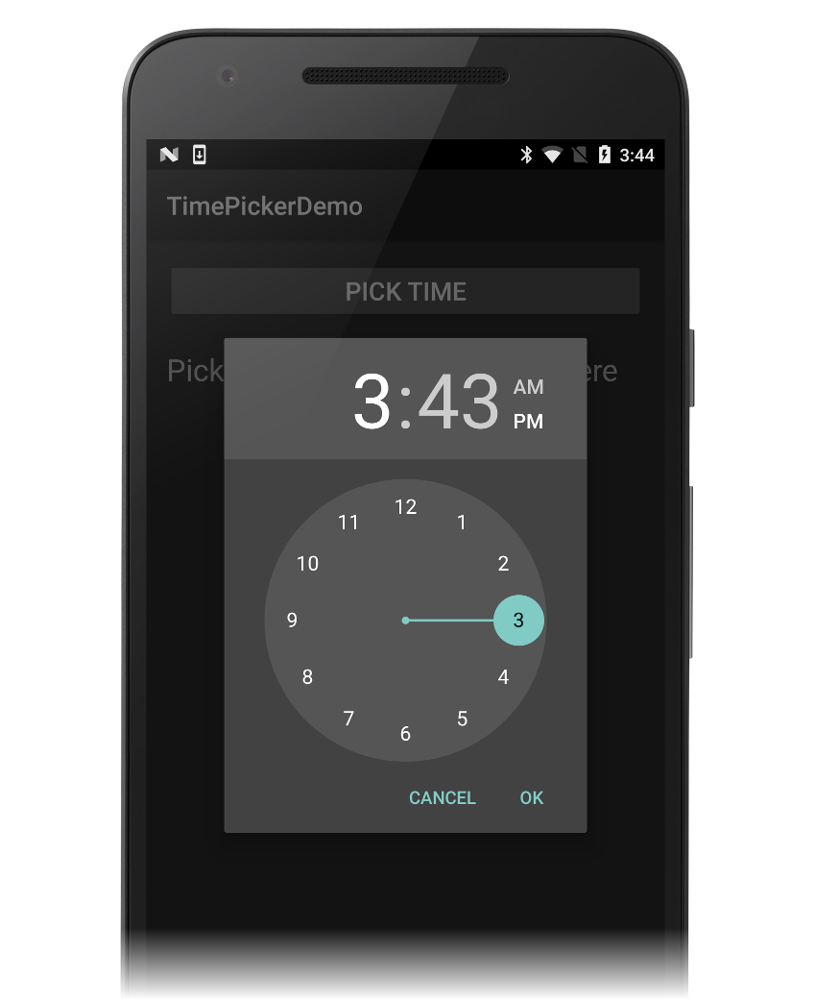

## [Popup Menu](~/android/user-interface/controls/popup-menu.md)

`PopupMenu` is used for displaying popup menus that are attached to
a particular view.

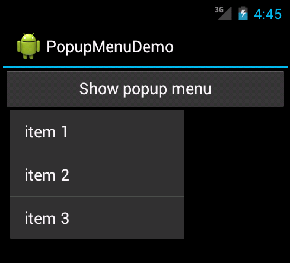

## [RatingBar](~/android/user-interface/controls/ratingbar.md)

A `RatingBar` is a UI element that displays a rating in stars.

## [Spinner](~/android/user-interface/controls/spinner.md)

`Spinner` is a UI element that provides a quick way to select one
value from a set. It is similar to a drop-down list. 

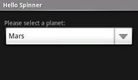

## [Switch](~/android/user-interface/controls/switch.md)

`Switch` is a UI element that allows a user to toggle between two
states, such as ON or OFF. The `Switch` default value is OFF.

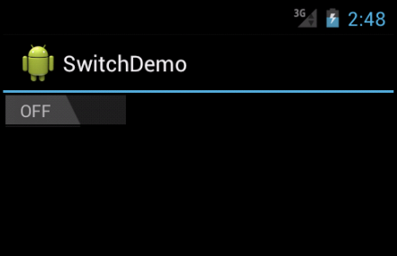

## [TextureView](~/android/user-interface/controls/texture-view.md)

`TextureView` is a view that uses hardware-accelerated 2D rendering to
enable a video or OpenGL content stream to be displayed.

## [ToolBar](~/android/user-interface/controls/tool-bar/index.md)

The `Toolbar` widget (introduced in Android 5.0 Lollipop) can be
thought of as a generalization of the action bar interface &ndash; it
is intended to replace the action bar. The `Toolbar` can be used
anywhere in an app layout, and it is much more customizable than an
action bar.

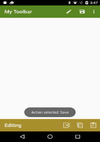

## [ViewPager](~/android/user-interface/controls/view-pager/index.md) 

The `ViewPager` is a layout manager that allows the user to flip left
and right through pages of data.

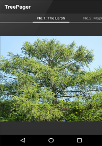

## [WebView](~/android/user-interface/controls/web-view.md)

`WebView` is a UI element that allows you to create your own window for
viewing web pages (or even develop a complete browser).

