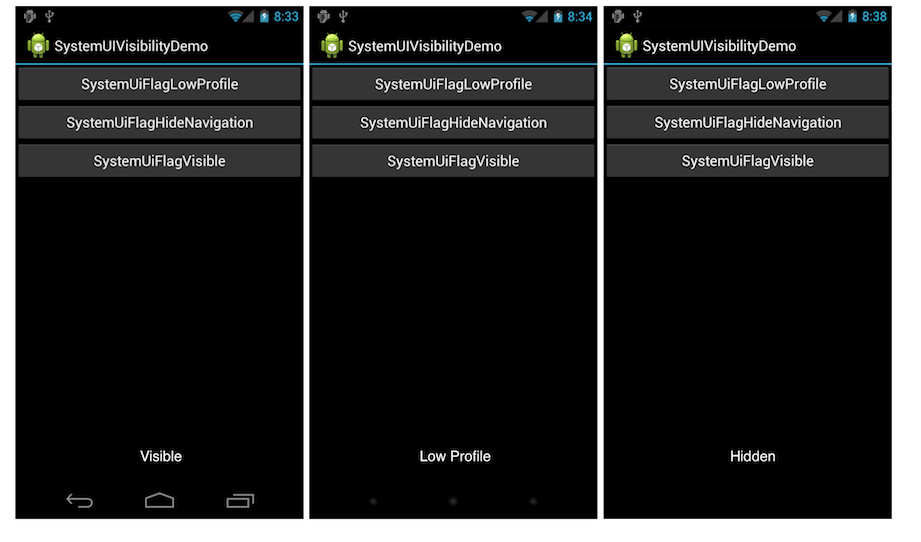

# Xamarin.Android Navigation Bar

Android 4 introduced a new system user interface feature called a
*Navigation Bar*, which provides navigation controls on devices that
don't include hardware buttons for **Home**, **Back**, and **Menu**.
The following screenshot shows the Navigation Bar from a Nexus Prime
device:

 [](navigation-bar-images/19-navbar.png#lightbox)

Several new flags are available that control the visibility of the Navigation
Bar and its controls, as well as the visibility of the System Bar that was
introduced in Android 3. The flags are defined in the `Android.View.View` class and are listed below:

- `SystemUiFlagVisible` &ndash; Makes the Navigation Bar visible.
- `SystemUiFlagLowProfile` &ndash; Dims out controls in the Navigation Bar.
- `SystemUiFlagHideNavigation` &ndash; Hides the Navigation Bar.

These flags can be applied to any view in the view hierarchy by setting
the `SystemUiVisibility` property. If multiple views have this property
set, the system combines them with an OR operation and applies them so
long as the window in which the flags are set retains focus. When you
remove a view, any flags it has set will also be removed.

The following example shows a simple application where clicking any of the
buttons changes the `SystemUiVisibility`:

 [](navigation-bar-images/18-systemuivisibility.png#lightbox)

The code to change the `SystemUiVisibility` sets the property on a
`TextView` from each button's click event handler as shown below:

```csharp
var tv = FindViewById<TextView> (Resource.Id.systemUiFlagTextView);
var lowProfileButton = FindViewById<Button>(Resource.Id.lowProfileButton);
var hideNavButton = FindViewById<Button> (Resource.Id.hideNavigation);
var visibleButton = FindViewById<Button> (Resource.Id.visibleButton);

lowProfileButton.Click += delegate {
    tv.SystemUiVisibility =
        (StatusBarVisibility)View.SystemUiFlagLowProfile;
};

hideNavButton.Click += delegate {
    tv.SystemUiVisibility =
       (StatusBarVisibility)View.SystemUiFlagHideNavigation;        
};

visibleButton.Click += delegate {
    tv.SystemUiVisibility = (StatusBarVisibility)View.SystemUiFlagVisible;
}
```

Also, a `SystemUiVisibility` change raises a `SystemUiVisibilityChange`
event. Just like setting the `SystemUiVisibility` property, a handler
for the `SystemUiVisibilityChange` event can be registered for any view
in the hierarchy. For example, the code below uses the `TextView`
instance to register for the event:

```csharp
tv.SystemUiVisibilityChange +=
  delegate(object sender, View.SystemUiVisibilityChangeEventArgs e) {
        tv.Text = String.Format ("Visibility = {0}", e.Visibility);
  };
```

## Related Links

- [SystemUIVisibilityDemo (sample)](/samples/xamarin/monodroid-samples/systemuivisibilitydemo)