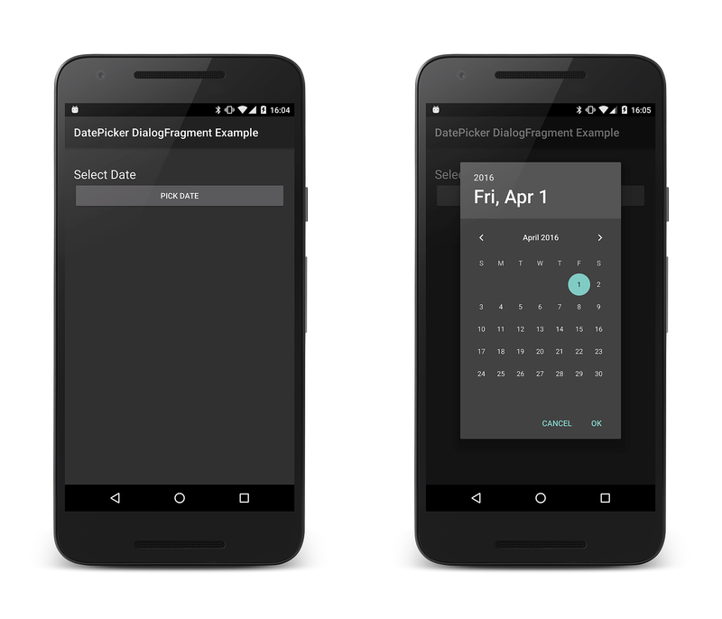
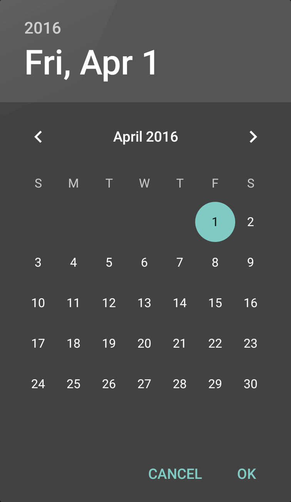

# Date Picker

## Overview

There are occasions when a user must input data into an Android
application. To assist with this, the Android framework provides the
[`DatePicker`](https://developer.xamarin.com/api/type/Android.Widget.DatePicker/) widget and the
[`DatePickerDialog`](https://developer.xamarin.com/api/type/Android.App.DatePickerDialog/) . The
`DatePicker` allows users to select the year, month, and day in a
consistent interface across devices and applications. The
`DatePickerDialog` is a helper class that encapsulates the `DatePicker`
in a dialog.

Modern Android applications should display the `DatePickerDialog` in a
[`DialogFragment`](https://developer.xamarin.com/api/type/Android.App.DialogFragment/). This will
allow an application to display the DatePicker as a popup dialog or
embedded in an Activity. In addition, the `DialogFragment` will manage
the lifecycle and display of the dialog, reducing the amount of code
that must be implemented.

This guide will demonstrate how to use the `DatePickerDialog`, wrapped
in a `DialogFragment`. The sample application will display the
`DatePickerDialog` as a modal dialog when the user clicks a button on
an Activity. When the date is set by the user, a `TextView` will update
with the date that was selected.

[](date-picker-images/image-01.png#lightbox)

## Requirements

The sample application for this guide targets Android 4.1 (API level
16) or higher, but is applicable to Android 3.0 (API level 11 or
higher). It is possible to support older versions of Android with the
addition of the Android Support Library v4 to the project and some code
changes.

## Using the DatePicker

This sample will extend `DialogFragment`. The subclass will host and
display a `DatePickerDialog`:



When the user selects a date and clicks the **OK** button, the
`DatePickerDialog` will call the method
[`IOnDateSetListener.OnDateSet`](https://developer.xamarin.com/api/member/Android.App.DatePickerDialog+IOnDateSetListener.OnDateSet/p/Android.Widget.DatePicker/System.Int32/System.Int32/System.Int32/).
This interface is implemented by the hosting `DialogFragment`. If the
user clicks the **Cancel** button, then fragment and dialog will
dismiss themselves.

There are several ways the `DialogFragment` can return the selected
date to the hosting activity:

1. **Invoke a method or set a property** &ndash; The Activity can
   provide a property or method specifically for setting this value.

2. **Raise an event** &ndash; The `DialogFragment` can define an event
   that will be raised when `OnDateSet` is invoked.

3. **Use an `Action`** &ndash; The `DialogFragment` can invoke an
   `Action<DateTime>` to display the date in the Activity. The Activity
   will provide the `Action<DateTime` when instantiating the
   `DialogFragment`. This sample will use the third technique, and
   require that the Activity supply an `Action<DateTime>` to the
   `DialogFragment`.


### Extending DialogFragment

The first step in displaying a `DatePickerDialog` is to subclass
`DialogFragment` and have it implement the `IOnDateSetListener`
interface:

```csharp
public class DatePickerFragment : DialogFragment, 
                                  DatePickerDialog.IOnDateSetListener
{
    // TAG can be any string of your choice.
    public static readonly string TAG = "X:" + typeof (DatePickerFragment).Name.ToUpper();
    
    // Initialize this value to prevent NullReferenceExceptions.
    Action<DateTime> _dateSelectedHandler = delegate { };
    
    public static DatePickerFragment NewInstance(Action<DateTime> onDateSelected)
    {
        DatePickerFragment frag = new DatePickerFragment();
        frag._dateSelectedHandler = onDateSelected;
        return frag;
    }
    
    public override Dialog OnCreateDialog(Bundle savedInstanceState)
    {
        DateTime currently = DateTime.Now;
        DatePickerDialog dialog = new DatePickerDialog(Activity, 
                                                       this, 
                                                       currently.Year, 
                                                       currently.Month - 1,
                                                       currently.Day);
        return dialog;
    }
    
    public void OnDateSet(DatePicker view, int year, int monthOfYear, int dayOfMonth)
    {
        // Note: monthOfYear is a value between 0 and 11, not 1 and 12!
        DateTime selectedDate = new DateTime(year, monthOfYear + 1, dayOfMonth);
        Log.Debug(TAG, selectedDate.ToLongDateString());
        _dateSelectedHandler(selectedDate);
    }
}
```

The `NewInstance` method is invoked to instantiate a new
`DatePickerFragment`. This method takes an `Action<DateTime>` that will
be invoked when the user clicks on the **OK** button in the
`DatePickerDialog`.

When the fragment is to be displayed, Android will call the method
`OnCreateDialog`. This method will create a new `DatePickerDialog`
object and initialize it with the current date and the callback object
(which is the current instance of the `DatePickerFragment`).


> [!NOTE]
> Be aware that the value of the month 
> when `IOnDateSetListener.OnDateSet` is invoked is in the 
> range of 0 to 11, and not 1 to 12. The day of the month 
> will be in the range of 1 to 31 (depending on which month was selected).


### Showing the DatePickerFragment

Now that the `DialogFragment` has been implemented, this section will
examine how to use the fragment in an Activity. In the sample app that
accompanies this guide, the Activity will instantiate the
`DialogFragment` using the `NewInstance` factory method and then
display it invoke `DialogFragment.Show`. As a part of instantiating the
`DialogFragment`, the Activity passes an `Action<DateTime>`, which will
display the date in a `TextView` that is hosted by the Activity:

```csharp
[Activity(Label = "@string/app_name", MainLauncher = true, Icon = "@drawable/icon")]
public class MainActivity : Activity
{
    TextView _dateDisplay;
    Button _dateSelectButton;

    protected override void OnCreate(Bundle bundle)
    {
        base.OnCreate(bundle);
        SetContentView(Resource.Layout.Main);

        _dateDisplay = FindViewById<TextView>(Resource.Id.date_display);
        _dateSelectButton = FindViewById<Button>(Resource.Id.date_select_button);
        _dateSelectButton.Click += DateSelect_OnClick;
    }

    void DateSelect_OnClick(object sender, EventArgs eventArgs)
    {
        DatePickerFragment frag = DatePickerFragment.NewInstance(delegate(DateTime time)
                                                                 {
                                                                     _dateDisplay.Text = time.ToLongDateString();
                                                                 });
        frag.Show(FragmentManager, DatePickerFragment.TAG);
    }
}
```


## Summary

This sample discussed how to display a `DatePicker` widget as a popup
modal dialog as a part of an Android Activity. It provided a sample
DialogFragment implementation and discussed the `IOnDateSetListener`
interface. This sample also demonstrated how the DialogFragment may
interact with the host Activity to display the selected date.


## Related Links

- [DialogFragment](https://developer.xamarin.com/api/type/Android.App.DialogFragment/)
- [DatePicker](https://developer.xamarin.com/api/type/Android.Widget.DatePicker/)
- [DatePickerDialog](https://developer.xamarin.com/api/type/Android.App.DatePickerDialog/)
- [DatePickerDialog.IOnDateSetListener](https://developer.xamarin.com/api/type/Android.App.DatePickerDialog+IOnDateSetListener/)
- [Select A Date](https://github.com/xamarin/recipes/tree/master/Recipes/android/controls/datepicker/select_a_date)
