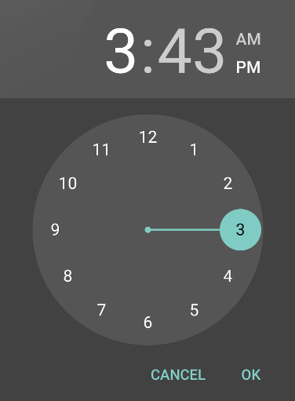

# Pickers

*Pickers* are UI elements that allow the user to pick a date or a
time by using dialogs that are provided by Android:

-   [Date Picker](~/android/user-interface/controls/pickers/date-picker.md) is used to select a date
    (year, month, and day).

    

-   [Time Picker](~/android/user-interface/controls/pickers/time-picker.md) is used to select a time
    (hour, minute, and AM/PM).

    
