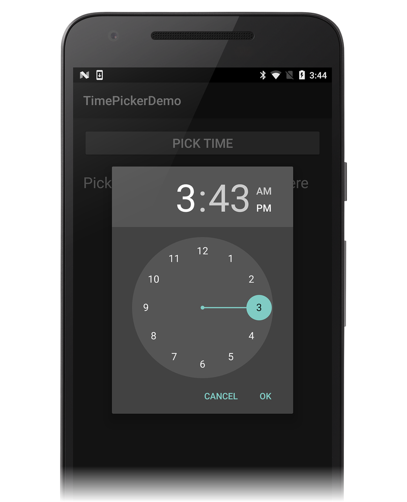
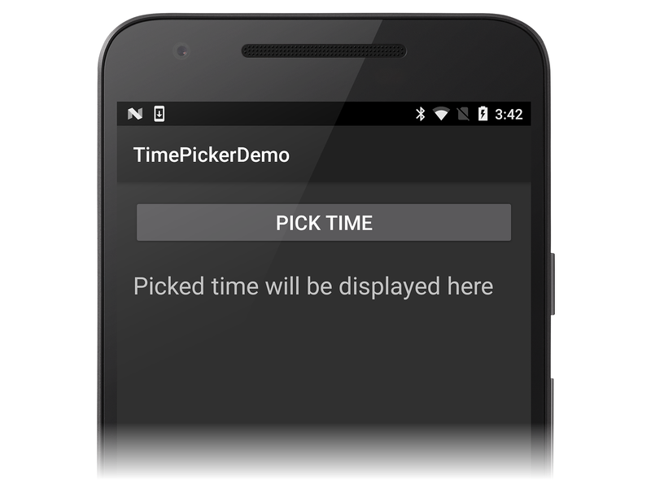
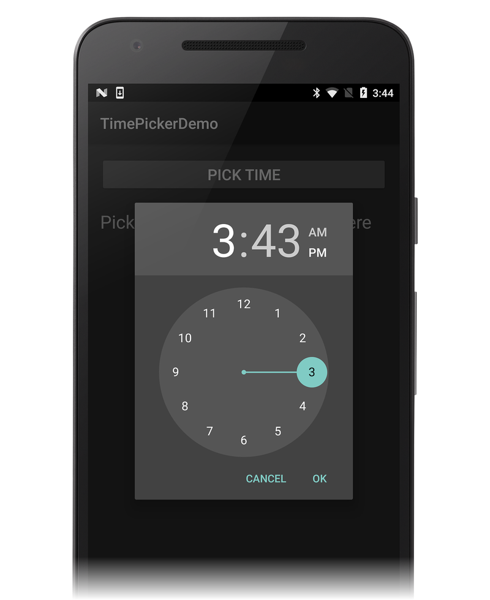
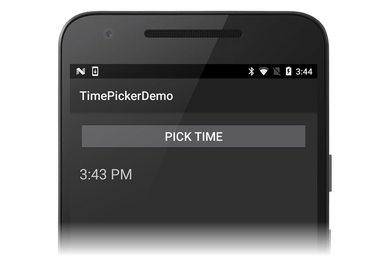
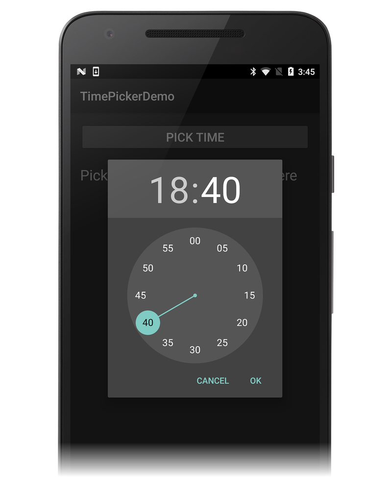

# Android Time Picker

To provide a way for the user to select a time, you can use
[TimePicker](xref:Android.Widget.TimePicker). Android apps
typically use `TimePicker` with
[TimePickerDialog](xref:Android.App.TimePickerDialog) for
selecting a time value &ndash; this helps to ensure a consistent
interface across devices and applications. `TimePicker` allows users to
select the time of day in either 24-hour or 12-hour AM/PM mode.
`TimePickerDialog` is a helper class that encapsulates the `TimePicker`
in a dialog.

[](time-picker-images/01-example-screen.png#lightbox)

## Overview

Modern Android applications display the `TimePickerDialog` in a
[DialogFragment](xref:Android.App.DialogFragment). This makes
it possible for an application to display the `TimePicker` as a popup
dialog or embed it in an Activity. In addition, the `DialogFragment`
manages the lifecycle and display of the dialog, reducing the amount of
code that must be implemented.

This guide demonstrates how to use the `TimePickerDialog`, wrapped in a
`DialogFragment`. The sample application displays the
`TimePickerDialog` as a modal dialog when the user clicks a button on
an Activity. When the time is set by the user, the dialog exits and a
handler updates a `TextView` on the Activity screen with the time that
was selected.

## Requirements

The sample application for this guide targets Android 4.1 (API level
16) or higher, but is can be used with Android 3.0 (API level 11 or
higher). It is possible to support older versions of Android with the
addition of the Android Support Library v4 to the project and some code
changes.

## Using the TimePicker

This example extends `DialogFragment`; the subclass implementation
of `DialogFragment` (called `TimePickerFragment` below) hosts
and displays a `TimePickerDialog`. When the sample app is first
launched, it displays a **PICK TIME** button above a `TextView` that
will be used to display the selected time:

[](time-picker-images/02-initial-app-screen.png#lightbox)

When you click the **PICK TIME** button, the example app launches the
`TimePickerDialog` as seen in this screenshot:

[](time-picker-images/03-am-pm-time-dialog.png#lightbox)

In the `TimePickerDialog`, selecting a time and clicking the **OK**
button causes the `TimePickerDialog` to invoke the method
[IOnTimeSetListener.OnTimeSet](xref:Android.App.TimePickerDialog.IOnTimeSetListener.OnTimeSet*).
This interface is implemented by the hosting `DialogFragment`
(`TimePickerFragment`, described below). Clicking the **Cancel**
button causes the fragment and dialog to be dismissed.

`DialogFragment` returns the selected time to the hosting Activity in
one of three ways:

1. **Invoking a method or setting a property** &ndash; The Activity can
   provide a property or method specifically for setting this value.

2. **Raising an event** &ndash; The `DialogFragment` can define an event
   that will be raised when `OnTimeSet` is invoked.

3. **Using an `Action`** &ndash; The `DialogFragment` can invoke an
   `Action<DateTime>` to display the time in the Activity. The Activity
   will provide the `Action<DateTime` when instantiating the
   `DialogFragment`.

This sample will use the third technique, which requires that the
Activity supply an `Action<DateTime>` handler to the `DialogFragment`.

## Start an App Project

Start a new Android project called **TimePickerDemo** (if you are not
familiar with creating Xamarin.Android projects, see
[Hello, Android](~/android/get-started/hello-android/hello-android-quickstart.md)
to learn how to create a new project).

Edit **Resources/layout/Main.axml** and replace its contents with the
following XML:

```xml
<?xml version="1.0" encoding="utf-8"?>
<LinearLayout xmlns:android="http://schemas.android.com/apk/res/android"
    android:orientation="vertical"
    android:layout_width="match_parent"
    android:layout_height="match_parent"
    android:layout_gravity="center_horizontal"
    android:padding="16dp">
    <Button
        android:id="@+id/select_button"
        android:paddingLeft="24dp"
        android:paddingRight="24dp"
        android:layout_width="match_parent"
        android:layout_height="wrap_content"
        android:text="PICK TIME"
        android:textSize="20dp" />
    <TextView
        android:id="@+id/time_display"
        android:layout_height="wrap_content"
        android:layout_width="match_parent"
        android:paddingTop="22dp"
        android:text="Picked time will be displayed here"
        android:textSize="24dp" />
</LinearLayout>
```

This is a basic
[LinearLayout](xref:Android.Widget.LinearLayout) with a
[TextView](xref:Android.Widget.TextView) that displays the time
and a
[Button](xref:Android.Widget.Button) that opens the
`TimePickerDialog`. Note that this layout uses hard-coded strings and
dimensions to make the app simpler and easier to understand &ndash; a
production app normally uses resources for these values (as can be seen
in the
[DatePicker](https://github.com/xamarin/recipes/blob/master/Recipes/android/controls/datepicker/select_a_date/Resources/layout/Main.axml)
code example).

Edit **MainActivity.cs** and replace its contents with the following
code:

```csharp
using Android.App;
using Android.Widget;
using Android.OS;
using System;
using Android.Util;
using Android.Text.Format;

namespace TimePickerDemo
{
    [Activity(Label = "TimePickerDemo", MainLauncher = true, Icon = "@drawable/icon")]
    public class MainActivity : Activity
    {
        TextView timeDisplay;
        Button timeSelectButton;

        protected override void OnCreate(Bundle bundle)
        {
            base.OnCreate(bundle);
            SetContentView(Resource.Layout.Main);
            timeDisplay = FindViewById<TextView>(Resource.Id.time_display);
            timeSelectButton = FindViewById<Button>(Resource.Id.select_button);
        }
    }
}
```

When you build and run this example, you should see an initial screen
similar to the following screen shot:

[](time-picker-images/02-initial-app-screen.png#lightbox)

Clicking the **PICK TIME** button does nothing because the
`DialogFragment` has not yet been implemented to display the `TimePicker`.
The next step is to create this `DialogFragment`.

## Extending DialogFragment

To extend `DialogFragment` for use with `TimePicker`, it is necessary
to create a subclass that is derived from `DialogFragment` and
implements `TimePickerDialog.IOnTimeSetListener`. Add the following
class to **MainActivity.cs**:

```csharp
public class TimePickerFragment : DialogFragment, TimePickerDialog.IOnTimeSetListener
{
    public static readonly string TAG = "MyTimePickerFragment";
    Action<DateTime> timeSelectedHandler = delegate { };

    public static TimePickerFragment NewInstance(Action<DateTime> onTimeSelected)
    {
        TimePickerFragment frag = new TimePickerFragment();
        frag.timeSelectedHandler = onTimeSelected;
        return frag;
    }

    public override Dialog OnCreateDialog (Bundle savedInstanceState)
    {
        DateTime currentTime = DateTime.Now;
        bool is24HourFormat = DateFormat.Is24HourFormat(Activity);
        TimePickerDialog dialog = new TimePickerDialog
            (Activity, this, currentTime.Hour, currentTime.Minute, is24HourFormat);
        return dialog;
    }

    public void OnTimeSet(TimePicker view, int hourOfDay, int minute)
    {
        DateTime currentTime = DateTime.Now;
        DateTime selectedTime = new DateTime(currentTime.Year, currentTime.Month, currentTime.Day, hourOfDay, minute, 0);
        Log.Debug(TAG, selectedTime.ToLongTimeString());
        timeSelectedHandler (selectedTime);
    }
}
```

This `TimePickerFragment` class is broken down into smaller pieces and
explained in the next section.

### DialogFragment Implementation

`TimePickerFragment` implements several methods: a factory method, a
Dialog instantiation method, and the `OnTimeSet` handler method
required by `TimePickerDialog.IOnTimeSetListener`.

- `TimePickerFragment` is a subclass of `DialogFragment`. It also
    implements the `TimePickerDialog.IOnTimeSetListener` interface (that
    is, it supplies the required `OnTimeSet` method):

    ```csharp
    public class TimePickerFragment : DialogFragment, TimePickerDialog.IOnTimeSetListener
    ```

- `TAG` is initialized for logging purposes (*MyTimePickerFragment*
    can be changed to whatever string you want to use). The
    `timeSelectedHandler` Action is initialized to an empty delegate to
    prevent null reference exceptions:

    ```csharp
    public static readonly string TAG = "MyTimePickerFragment";
    Action<DateTime> timeSelectedHandler = delegate { };
    ```

- The `NewInstance` factory method is called to instantiate a new
    `TimePickerFragment`. This method takes an `Action<DateTime>` handler that
    is invoked when the user clicks the **OK** button in the
    `TimePickerDialog`:

    ```csharp
    public static TimePickerFragment NewInstance(Action<DateTime> onTimeSelected)
    {
        TimePickerFragment frag = new TimePickerFragment();
        frag.timeSelectedHandler = onTimeSelected;
        return frag;
    }
    ```

- When the fragment is to be displayed, Android calls the `DialogFragment`
    method [OnCreateDialog](xref:Android.App.DialogFragment.OnCreateDialog*).
    This method creates a new `TimePickerDialog`
    object and initializes it with the Activity, the callback object
    (which is the current instance of the `TimePickerFragment`), and
    the current time:

    ```csharp
    public override Dialog OnCreateDialog (Bundle savedInstanceState)
    {
        DateTime currentTime = DateTime.Now;
        bool is24HourFormat = DateFormat.Is24HourFormat(Activity);
        TimePickerDialog dialog = new TimePickerDialog
            (Activity, this, currentTime.Hour, currentTime.Minute, is24HourFormat);
        return dialog;
    }
    ```

- When the user changes the time setting in the `TimePicker` dialog,
    the `OnTimeSet` method is invoked. `OnTimeSet` creates a `DateTime`
    object using the current date and merges in the time (hour and
    minute) selected by the user:

    ```csharp
    public void OnTimeSet(TimePicker view, int hourOfDay, int minute)
    {
        DateTime currentTime = DateTime.Now;
        DateTime selectedTime = new DateTime(currentTime.Year, currentTime.Month, currentTime.Day, hourOfDay, minute, 0);
    ```

- This `DateTime` object is passed to the `timeSelectedHandler` that
    is registered with the `TimePickerFragment` object at creation
    time. `OnTimeSet` invokes this handler to update the Activity's
    time display to the selected time (this handler is implemented in
    the next section):

    ```csharp
    timeSelectedHandler (selectedTime);
    ```

## Displaying the TimePickerFragment

Now that the `DialogFragment` has been implemented, it is time to
instantiate the `DialogFragment` using the `NewInstance` factory method
and display it by invoking
[DialogFragment.Show](xref:Android.App.DialogFragment.Show*):

Add the following method to `MainActivity`:

```csharp
void TimeSelectOnClick (object sender, EventArgs eventArgs)
{
    TimePickerFragment frag = TimePickerFragment.NewInstance (
        delegate (DateTime time)
        {
            timeDisplay.Text = time.ToShortTimeString();
        });

    frag.Show(FragmentManager, TimePickerFragment.TAG);
}
```

After `TimeSelectOnClick` instantiates a `TimePickerFragment`, it
creates and passes in a delegate for an anonymous method that updates
the Activity's time display with the passed-in time value. Finally, it
launches the `TimePicker` dialog fragment (via `DialogFragment.Show`)
to display the `TimePicker` to the user.

At the end of the `OnCreate` method, add the following line to attach
the event handler to the **PICK TIME** button that launches the dialog:

```csharp
timeSelectButton.Click += TimeSelectOnClick;
```

When the **PICK TIME** button is clicked, `TimeSelectOnClick` will be
invoked to display the `TimePicker` dialog fragment to the user.

## Try It!

Build and run the app. When you click the **PICK TIME** button, the
`TimePickerDialog` is displayed in the default time format for
the Activity (in this case, 12-hour AM/PM mode):

[](time-picker-images/03-am-pm-time-dialog.png#lightbox)
   
When you click **OK** in the `TimePicker` dialog, the handler updates the
Activity's `TextView` with the chosen time and then exits:

[](time-picker-images/04-after-time-dialog.png#lightbox)

Next, add the following line of code to `OnCreateDialog` immediately
after `is24HourFormat` is declared and initialized:

```csharp
is24HourFormat = true;
```

This change forces the flag passed to the `TimePickerDialog` constructor
to be `true` so that 24-hour mode is used instead of the time format
of the hosting Activity. When you build and run the app again, click
the **PICK TIME** button, the `TimePicker` dialog is now displayed in 24
hour format:

[](time-picker-images/05-24hr-time-dialog.png#lightbox)

Because the handler calls
[DateTime.ToShortTimeString](xref:System.DateTime.ToShortDateString*)
to print the time to the Activity's `TextView`, the time is still printed
in the default 12-hour AM/PM format.

## Summary

This article explained how to display a `TimePicker` widget as a popup
modal dialog from an Android Activity. It provided a sample
`DialogFragment` implementation and discussed the `IOnTimeSetListener`
interface. This sample also demonstrated how the `DialogFragment` can
interact with the host Activity to display the selected time.

## Related Links

- [DialogFragment](xref:Android.App.DialogFragment)
- [TimePicker](xref:Android.Widget.TimePicker)
- [TimePickerDialog](xref:Android.App.TimePickerDialog)
- [TimePickerDialog.IOnTimeSetListener](xref:Android.App.TimePickerDialog.IOnTimeSetListener)
- [TimePickerDemo (sample)](/samples/xamarin/monodroid-samples/userinterface-timepickerdemo)