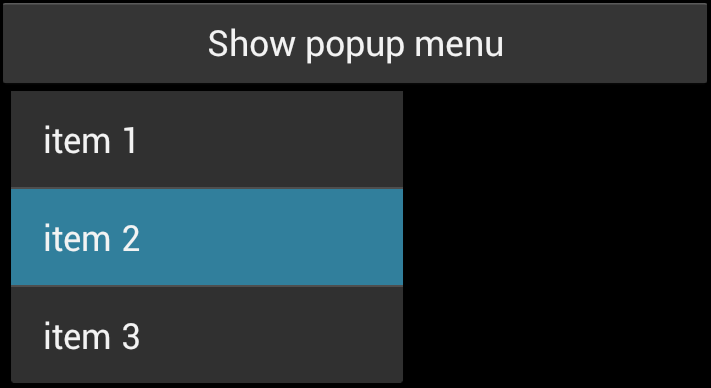
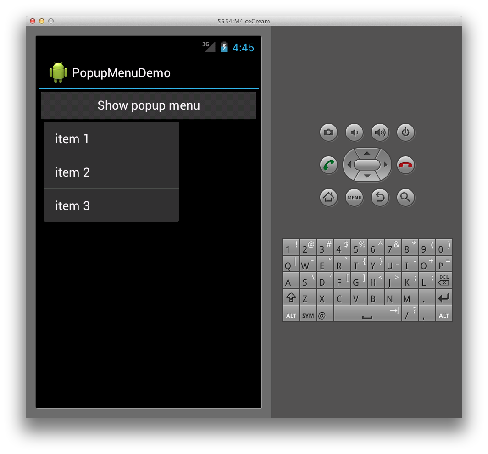

# PopUp Menu

The `PopupMenu` class adds support for displaying popup menus that are
attached to a particular view. The following illustration shows a popup
menu presented from a button, with the second item highlighted just as
it is selected:

 [ ](popup-menu-images/20-popupmenu.png)

Android 4 added a couple of new features to `PopupMenu` that make
it a bit easier to work with, namely:

-   **Inflate** &ndash; The Inflate method is now available directly on the PopupMenu class.
-   **DismissEvent** &ndash; The PopupMenu class now has a DismissEvent.

Let's take a look at these improvements. In this example, we have a single
Activity that contains a button. When the user clicks the button, a popup menu
is displayed as shown below:

 [ ](popup-menu-images/06-popupmenu.png)


## Creating a Popup Menu

When we create an instance of the `PopupMenu`, we need to pass its
constructor a reference to the `Context`, as well as the view to which
the menu is attached. In this case, we create the `PopupMenu` in the
click event handler for our button, which is named `showPopupMenu`.
This button is also the view to which we'll attach the `PopupMenu`,
as shown in the following code:

```csharp
showPopupMenu.Click += (s, arg) => {
    PopupMenu menu = new PopupMenu (this, showPopupMenu);
}
```

In Android 3, the code to inflate the menu from an XML resource
required that you first get a reference to a `MenuInflator`, and then
call its `Inflate` method with the resource ID of the XML that
contained the menu and the menu instance to inflate into. Such an
approach still works in Android 4 and later as the code below shows:

```csharp
showPopupMenu.Click += (s, arg) => {
    PopupMenu menu = new PopupMenu (this, showPopupMenu);
    menu.MenuInflater.Inflate (Resource.Menu.popup_menu, menu.Menu);
};
```

As of Android 4 however, you can now call `Inflate` directly on the
instance of the `PopupMenu`. This makes the code more concise as shown
here:

```csharp
showPopupMenu.Click += (s, arg) => {
    PopupMenu menu = new PopupMenu (this, showPopupMenu);
    menu.Inflate (Resource.Menu.popup_menu);
    menu.Show ();
};
```

In the code above, after inflating the menu we simply call `menu.Show`
to display it on the screen.


## Handling Menu Events

When the user selects a menu item, the `MenuItemClick` event will
be raised and the menu will be dismissed. Tapping anywhere outside the menu will
simply dismiss it. In either case, as of Android 4, when the menu is dismissed,
its `DismissEvent` will be raised. The following code adds event
handlers for both the `MenuItemClick` and `DismissEvent`
events:

```csharp
showPopupMenu.Click += (s, arg) => {
    PopupMenu menu = new PopupMenu (this, showPopupMenu);
    menu.Inflate (Resource.Menu.popup_menu);

    menu.MenuItemClick += (s1, arg1) => {
        Console.WriteLine ("{0} selected", arg1.Item.TitleFormatted);
    };

    menu.DismissEvent += (s2, arg2) => {
        Console.WriteLine ("menu dismissed");
    };
            menu.Show ();
};
```


## Related Links

- [PopupMenuDemo (sample)](https://developer.xamarin.com/samples/monodroid/PopupMenuDemo/)
- [Introducing Ice Cream Sandwich](http://www.android.com/about/ice-cream-sandwich/)
- [Android 4.0 Platform](http://developer.android.com/sdk/android-4.0.html)
