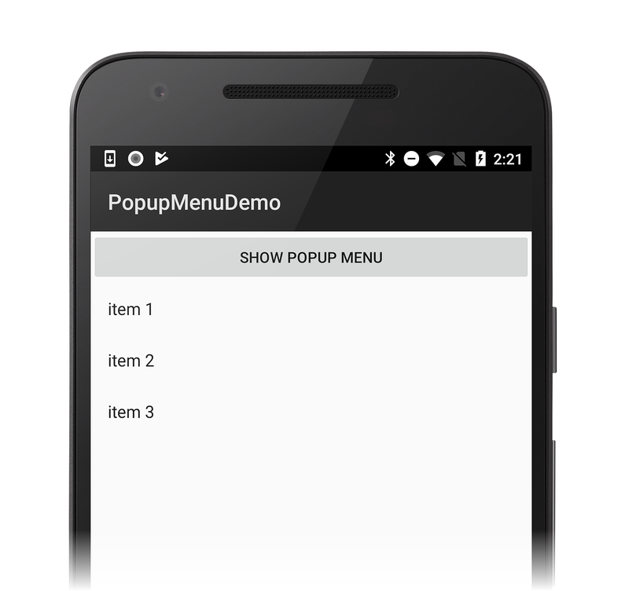

# Xamarin.Android PopUp Menu

The [PopupMenu](xref:Android.Widget.PopupMenu)
(also called a _shortcut menu_) is a menu that is anchored to a
particular view. In the following example, a single Activity contains a
button. When the user taps the button, a three-item popup menu is
displayed:

[](popup-menu-images/01-app-example.png#lightbox)

## Creating a Popup Menu

The first step is to create a menu resource file for the menu and place
it in **Resources/menu**. For example, the following XML is the code
for the three-item menu displayed in the previous screenshot,
**Resources/menu/popup_menu.xml**:

```xml
<?xml version="1.0" encoding="utf-8"?>
<menu xmlns:android="http://schemas.android.com/apk/res/android">
    <item android:id="@+id/item1"
          android:title="item 1" />
    <item android:id="@+id/item1"
          android:title="item 2" />
    <item android:id="@+id/item1"
          android:title="item 3" />
</menu>
```

Next, create an instance of `PopupMenu` and anchor it to its view. When
you create an instance of `PopupMenu`, you pass its constructor a
reference to the `Context` as well as the view to which the menu will
be attached. As a result, the popup menu is anchored to this view
during its construction.

In the following example, the `PopupMenu` is created in the click event
handler for the button (which is named `showPopupMenu`). This button is
also the view to which the `PopupMenu` is anchored, as shown in the
following code example:

```csharp
showPopupMenu.Click += (s, arg) => {
    PopupMenu menu = new PopupMenu (this, showPopupMenu);
};
```

Finally, the popup menu must be *inflated* with the menu resource that
was created earlier. In the following example, the call to the menu's
[Inflate](xref:Android.Views.LayoutInflater.Inflate*)
method is added and its
[Show](xref:Android.Widget.PopupMenu.Show)
method is called to display it:

```csharp
showPopupMenu.Click += (s, arg) => {
    PopupMenu menu = new PopupMenu (this, showPopupMenu);
    menu.Inflate (Resource.Menu.popup_menu);
    menu.Show ();
};
```

## Handling Menu Events

When the user selects a menu item, the
[MenuItemClick](xref:Android.Widget.PopupMenu.MenuItemClick)
click event will be raised and the menu will be dismissed. Tapping
anywhere outside the menu will simply dismiss it. In either case, when
the menu is dismissed, its
[DismissEvent](xref:Android.Widget.PopupMenu.Dismiss)
will be raised. The following code adds event handlers for both the
`MenuItemClick` and `DismissEvent` events:

```csharp
showPopupMenu.Click += (s, arg) => {
    PopupMenu menu = new PopupMenu (this, showPopupMenu);
    menu.Inflate (Resource.Menu.popup_menu);

    menu.MenuItemClick += (s1, arg1) => {
        Console.WriteLine ("{0} selected", arg1.Item.TitleFormatted);
    };

    menu.DismissEvent += (s2, arg2) => {
        Console.WriteLine ("menu dismissed");
    };
    menu.Show ();
};
```

## Related Links

- [PopupMenuDemo (sample)](/samples/xamarin/monodroid-samples/popupmenudemo)