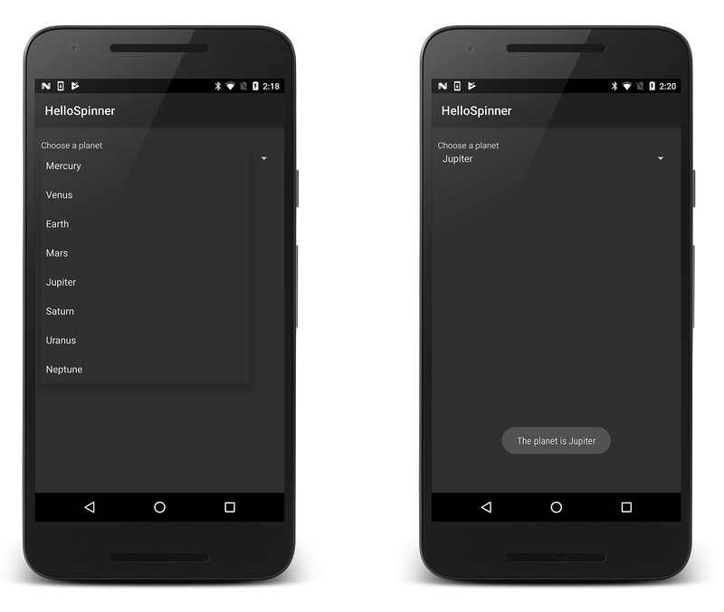
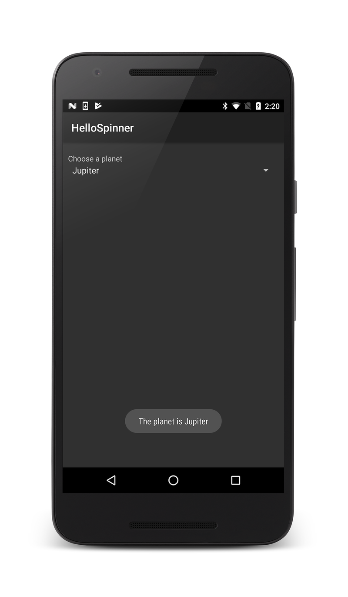
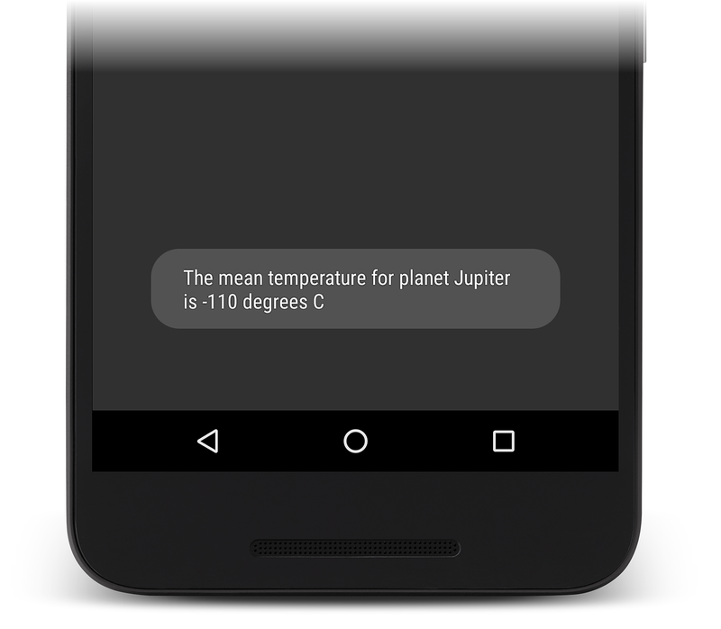

# Spinner

[`Spinner`](https://developer.xamarin.com/api/type/Android.Widget.Spinner/)
is a widget that presents a drop-down list for selecting items. This 
guide explains how to create a simple app that displays a list of 
choices in a Spinner, followed by modifications that display other
values associated with the selected choice.

## Basic Spinner

In the first part of this tutorial, you'll create a simple spinner
widget that displays a list of planets. When a planet is selected, a
toast message displays the selected item:

[](spinner-images/01-example-screenshots.png#lightbox)

Start a new project named **HelloSpinner**.

Open **Resources/Layout/Main.axml** and insert the following XML:

```xml
<?xml version="1.0" encoding="utf-8"?>
<LinearLayout xmlns:android="http://schemas.android.com/apk/res/android"
    android:orientation="vertical"
    android:padding="10dip"
    android:layout_width="fill_parent"
    android:layout_height="wrap_content">
    <TextView
        android:layout_width="fill_parent"
        android:layout_height="wrap_content"
        android:layout_marginTop="10dip"
        android:text="@string/planet_prompt"
    />
    <Spinner
        android:id="@+id/spinner"
        android:layout_width="fill_parent"
        android:layout_height="wrap_content"
        android:prompt="@string/planet_prompt"
    />
</LinearLayout>
```

Notice that the
[`TextView`](https://developer.xamarin.com/api/type/Android.Widget.TextView/)'s `android:text`
attribute and the
[`Spinner`](https://developer.xamarin.com/api/type/Android.Widget.Spinner/)'s `android:prompt`
attribute both reference the same string resource. This text
behaves as a title for the widget. When applied to the
[`Spinner`](https://developer.xamarin.com/api/type/Android.Widget.Spinner/), the title text will
appear in the selection dialog that appears upon selecting the
widget.

Edit **Resources/Values/Strings.xml** and modify the file to look
like this:

```xml
<?xml version="1.0" encoding="utf-8"?>
<resources>
  <string name="app_name">HelloSpinner</string>
  <string name="planet_prompt">Choose a planet</string>
  <string-array name="planets_array">
    <item>Mercury</item>
    <item>Venus</item>
    <item>Earth</item>
    <item>Mars</item>
    <item>Jupiter</item>
    <item>Saturn</item>
    <item>Uranus</item>
    <item>Neptune</item>
  </string-array>
</resources>
```

The second `<string>` element defines the title string referenced
by the
[`TextView`](https://developer.xamarin.com/api/type/Android.Widget.TextView/) and
[`Spinner`](https://developer.xamarin.com/api/type/Android.Widget.Spinner/) in the layout above.
The `<string-array>` element defines the list of strings that will
be displayed as the list in the
[`Spinner`](https://developer.xamarin.com/api/type/Android.Widget.Spinner/) widget.

Now open **MainActivity.cs** and add the following `using`
statement:

```csharp
using System;
```

Next, insert the following code for the
[`OnCreate()`](https://developer.xamarin.com/api/member/Android.App.Activity.OnCreate/(Android.OS.Bundle))
method:

```csharp
protected override void OnCreate (Bundle bundle)
{
    base.OnCreate (bundle);

    // Set our view from the "Main" layout resource
    SetContentView (Resource.Layout.Main);

    Spinner spinner = FindViewById<Spinner> (Resource.Id.spinner);

    spinner.ItemSelected += new EventHandler<AdapterView.ItemSelectedEventArgs> (spinner_ItemSelected);
    var adapter = ArrayAdapter.CreateFromResource (
            this, Resource.Array.planets_array, Android.Resource.Layout.SimpleSpinnerItem);

    adapter.SetDropDownViewResource (Android.Resource.Layout.SimpleSpinnerDropDownItem);
    spinner.Adapter = adapter;
}
```

After the `Main.axml` layout is set as the content view, the
[`Spinner`](https://developer.xamarin.com/api/type/Android.Widget.Spinner/) widget is captured
from the layout with
[`FindViewById<>(int)`](https://developer.xamarin.com/api/member/Android.App.Activity.FindViewById/p/System.Int32/).
The
[`CreateFromResource()`](https://developer.xamarin.com/api/member/Android.Widget.ArrayAdapter.CreateFromResource/p/Android.Content.Context/System.Int32/System.Int32/)
method then creates a new
[`ArrayAdapter`](https://developer.xamarin.com/api/type/Android.Widget.ArrayAdapter/), which
binds each item in the string array to the initial appearance for
the
[`Spinner`](https://developer.xamarin.com/api/type/Android.Widget.Spinner/) (which is how each
item will appear in the spinner when selected). The
`Resource.Array.planets_array` ID references the `string-array`
defined above and the `Android.Resource.Layout.SimpleSpinnerItem`
ID references a layout for the standard spinner appearance, defined
by the platform.
[`SetDropDownViewResource`](https://developer.xamarin.com/api/member/Android.Widget.ArrayAdapter.SetDropDownViewResource/p/System.Int32/)
is called to define the appearance for each item when the widget is
opened. Finally, the
[`ArrayAdapter`](https://developer.xamarin.com/api/type/Android.Widget.ArrayAdapter/) is set to
associate all of its items with the
[`Spinner`](https://developer.xamarin.com/api/type/Android.Widget.Spinner/) by setting the
[`Adapter`](https://developer.xamarin.com/api/type/Android.Widget.ArrayAdapter) property.

Now provide a callback method that notifys the application when an
item has been selected from the
[`Spinner`](https://developer.xamarin.com/api/type/Android.Widget.Spinner/). Here's what this
method should look like:

```csharp
private void spinner_ItemSelected (object sender, AdapterView.ItemSelectedEventArgs e)
{
    Spinner spinner = (Spinner)sender;
    string toast = string.Format ("The planet is {0}", spinner.GetItemAtPosition (e.Position));
    Toast.MakeText (this, toast, ToastLength.Long).Show ();
}
```

When an item is selected, the sender is cast to a
[`Spinner`](https://developer.xamarin.com/api/type/Android.Widget.Spinner/) so that items can be
accessed. Using the `Position` property on the `ItemEventArgs`, you
can find out the text of the selected object, and use it to display
a
[`Toast`](https://developer.xamarin.com/api/type/Android.Widget.Toast/).

Run the application; it should look like this:

[](spinner-images/02-basic-example.png#lightbox)

## Spinner Using Key/Value Pairs

Often it is necessary to use `Spinner` to display key values that are
associated with some kind of data used by your app. Because `Spinner`
does not work directly with key/value pairs, you must store the
key/value pair separately, populate the `Spinner` with key values, then
use the position of the selected key in the Spinner to look up the
associated data value. 

In the following steps, the **HelloSpinner** app is modified to display
the mean temperature for the selected planet:

Add the following `using` statement to **MainActivity.cs**:

```csharp
using System.Collections.Generic;
```

Add the following instance variable to the `MainActivity` class.
This list will hold key/value pairs for the planets and their mean
temperatures:

```csharp
private List<KeyValuePair<string, string>> planets;
```

In the `OnCreate` method, add the following code before
`adapter` is declared:

```csharp
planets = new List<KeyValuePair<string, string>>
{
    new KeyValuePair<string, string>("Mercury", "167 degrees C"),
    new KeyValuePair<string, string>("Venus", "464 degrees C"),
    new KeyValuePair<string, string>("Earth", "15 degrees C"),
    new KeyValuePair<string, string>("Mars", "-65 degrees C"),
    new KeyValuePair<string, string>("Jupiter" , "-110 degrees C"),
    new KeyValuePair<string, string>("Saturn", "-140 degrees C"),
    new KeyValuePair<string, string>("Uranus", "-195 degrees C"),
    new KeyValuePair<string, string>("Neptune", "-200 degrees C")
};
```

This code creates a simple store for planets and their
associated mean temperatures. (In a real-world app, a database
is typically used to store keys and their associated data.)

Immediately after the above code, add the following lines to
extract the keys and put them into a list (in order):

```csharp
List<string> planetNames = new List<string>();
foreach (var item in planets)
    planetNames.Add (item.Key);
```

Pass this list to the `ArrayAdapter` constructor (instead of the
`planets_array` resource):

```csharp
var adapter = new ArrayAdapter<string>(this,
    Android.Resource.Layout.SimpleSpinnerItem, planetNames);
```

Modify `spinner_ItemSelected` so that the selected position is used
to look up the value (the temperature) associated with the selected
planet:

```csharp
private void spinner_ItemSelected(object sender, AdapterView.ItemSelectedEventArgs e)
{
    Spinner spinner = (Spinner)sender;
    string toast = string.Format("The mean temperature for planet {0} is {1}",
        spinner.GetItemAtPosition(e.Position), planets[e.Position].Value);
    Toast.MakeText(this, toast, ToastLength.Long).Show();
}
```

Run the application; the toast should look like this:

[](spinner-images/03-keyvalue-example.png#lightbox)
   
  

## Resources

-   [`Resource.Layout`](https://developer.xamarin.com/api/type/Android.Resource+Layout/) 
-   [`ArrayAdapter`](https://developer.xamarin.com/api/type/Android.Widget.ArrayAdapter/) 
-   [`Spinner`](https://developer.xamarin.com/api/type/Android.Widget.Spinner/) 

*Portions of this page are modifications based on work created and shared by the
Android Open Source Project and used according to terms described in the*
[*Creative Commons 2.5 Attribution License*](http://creativecommons.org/licenses/by/2.5/).
