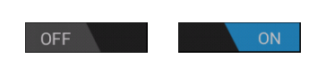
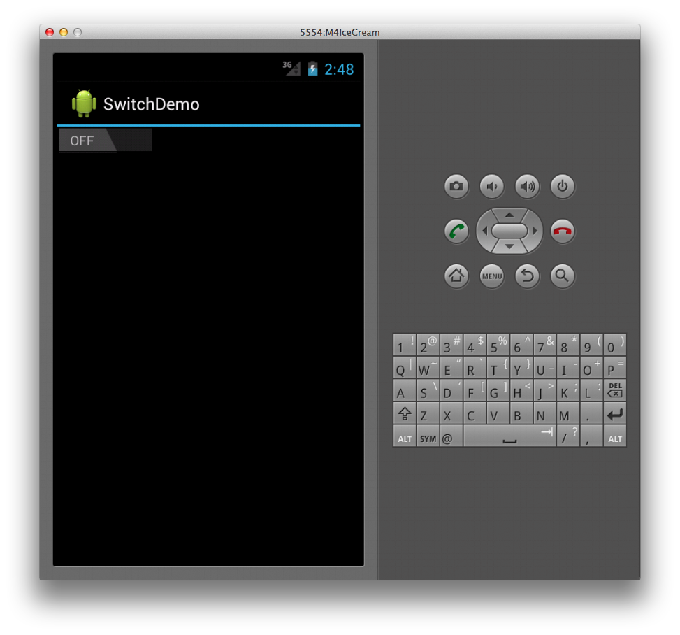
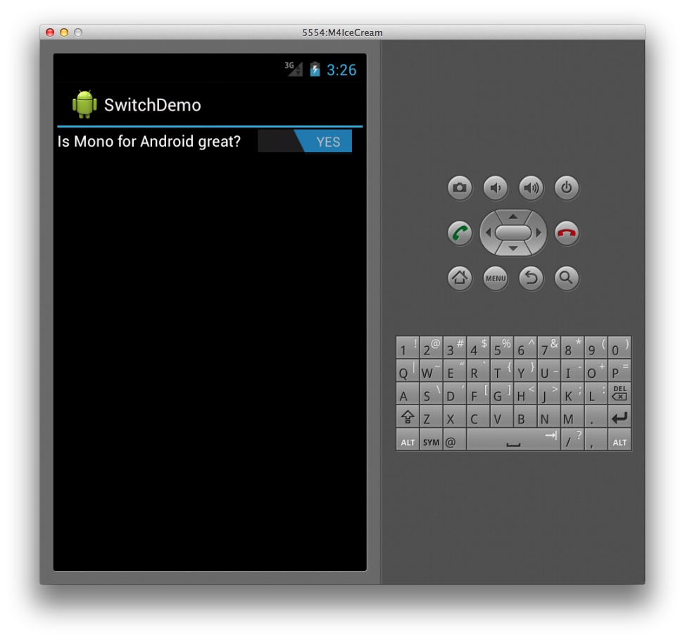

# Xamarin.Android Switch

The `Switch` widget (shown below) allows a user
to toggle between two states, such as ON or OFF. The `Switch` default
value is OFF. The widget is shown below in both its ON and OFF states:

[](switch-images/16-switch-onoff.png#lightbox)

## Creating a Switch

To create a switch, simply declare a `Switch` element in XML as
follows:

```xml
<Switch android:layout_width="wrap_content"
        android:layout_height="wrap_content" />
```

This creates a basic switch as shown below:

[](switch-images/07-switch.png#lightbox)

## Changing Default Values

Both the text that the control displays for the ON and OFF states and
the default value are configurable. For example, to make the Switch
default to ON and read NO/YES instead of OFF/ON, we can set the
`checked`, `textOn`, and `textOff` attributes in the following XML.

```xml
<Switch android:layout_width="wrap_content"
        android:layout_height="wrap_content"
        android:checked="true"
        android:textOn="YES"
        android:textOff="NO" />
```

## Providing a Title

The `Switch` widget also supports including a text label by setting the
`text` attribute as follows:

```xml
<Switch android:text="Is Xamarin.Android great?"
        android:layout_width="wrap_content"
        android:layout_height="wrap_content"
        android:checked="true"
        android:textOn="YES"
        android:textOff="NO" />
```

This markup produces the following screenshot at runtime:

[](switch-images/08-switch.png#lightbox)

When a `Switch`'s value changes, it raises a `CheckedChange` event.
For example, in the following code we capture this event and present a
`Toast` widget with a message based upon the `isChecked` value of
`Switch`, which is passed to the event handler as part of the
`CompoundButton.CheckedChangeEventArg` argument.

```csharp
Switch s = FindViewById<Switch> (Resource.Id.monitored_switch);
           
s.CheckedChange += delegate(object sender, CompoundButton.CheckedChangeEventArgs e) {
    var toast = Toast.MakeText (this, "Your answer is " +
        (e.IsChecked ?  "correct" : "incorrect"), ToastLength.Short);
    toast.Show ();
};
```

## Related Links

- [SwitchDemo (sample)](/samples/xamarin/monodroid-samples/switchdemo)
- [Tab Layout Tutorial](~/android/user-interface/layouts/tab-layout/index.md)