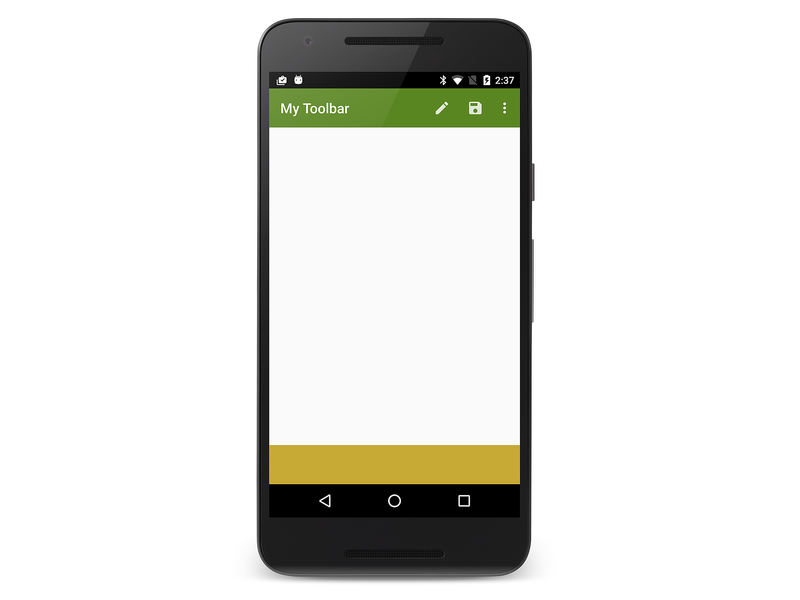
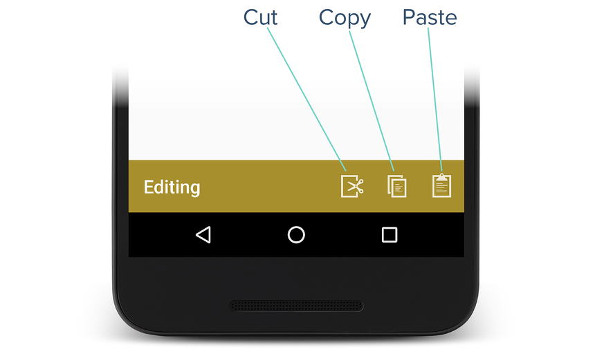
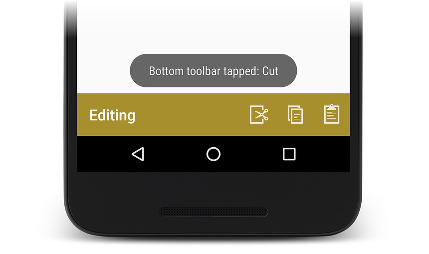
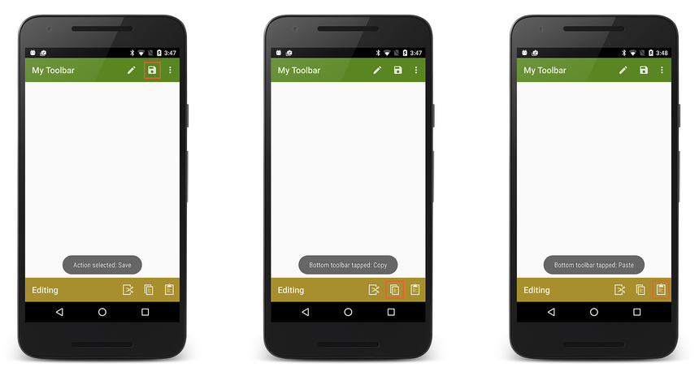
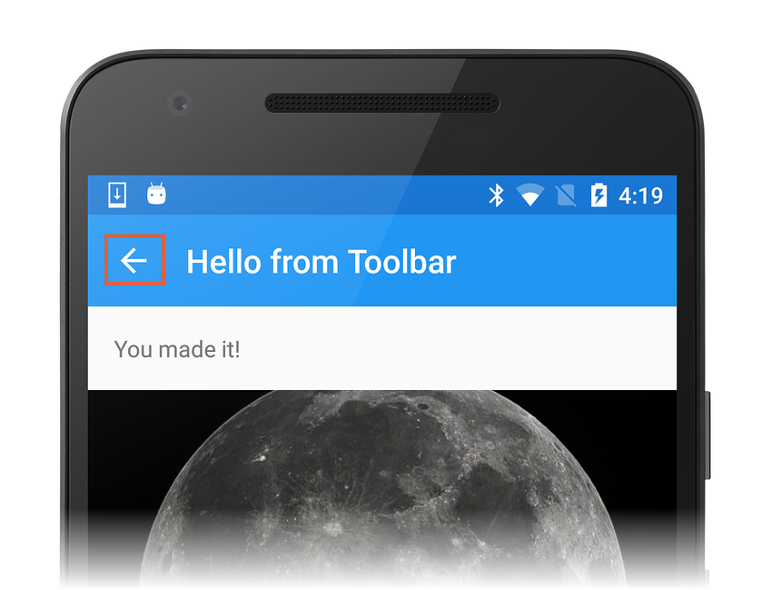

# Adding a Second Toolbar

## Overview 

The `Toolbar` can do more than replace the action bar &ndash; it can be 
used multiple times within an Activity, it can be customized for 
placement anywhere on the screen, and it can be configured to span only 
a partial width of the screen. The examples below illustrate how to 
create a second `Toolbar` and place it at the bottom of the screen. 
This `Toolbar` implements **Copy**, **Cut**, and **Paste** menu items. 

## Define the Second Toolbar 

Edit the layout file **Main.axml** and replace its contents with
with the following XML:

```xml
<?xml version="1.0" encoding="utf-8"?>
<RelativeLayout xmlns:android="http://schemas.android.com/apk/res/android"
    android:layout_width="match_parent"
    android:layout_height="match_parent">
    <include
        android:id="@+id/toolbar"
        layout="@layout/toolbar" />
    <LinearLayout
        android:orientation="vertical"
        android:layout_width="fill_parent"
        android:layout_height="fill_parent"
        android:id="@+id/main_content"
        android:layout_below="@id/toolbar">
      <ImageView
          android:layout_width="fill_parent"
          android:layout_height="0dp"
          android:layout_weight="1" />
      <Toolbar
          android:id="@+id/edit_toolbar"
          android:minHeight="?android:attr/actionBarSize"
          android:background="?android:attr/colorAccent"
          android:theme="@android:style/ThemeOverlay.Material.Dark.ActionBar"
          android:layout_width="match_parent"
          android:layout_height="wrap_content" />
    </LinearLayout>
</RelativeLayout>
```

This XML adds a second `Toolbar` to the bottom of the screen with an 
empty `ImageView` filling the middle of the screen. The height of this 
`Toolbar` is set to the height of an action bar: 

```xml
android:minHeight="?android:attr/actionBarSize"
```

The background color of this `Toolbar` is set to an accent color that
will be defined next:

```xml
android:background="?android:attr/colorAccent
```

Notice that this `Toolbar` is based on a different theme
(**ThemeOverlay.Material.Dark.ActionBar**) than that used by the
`Toolbar` created in
[Replacing the Action Bar](~/android/user-interface/controls/tool-bar/replacing-the-action-bar.md)
&ndash; it isn't bound to the Activity's window decor or to the theme
used in the first `Toolbar`.

Edit **Resources/values/styles.xml** and add the following accent color 
to the style definition: 

```xml
<item name="android:colorAccent">#C7A935</item>
```

This gives the bottom toolbar a dark amber color. Building and running 
the app displays a blank second toolbar at the bottom of the screen: 

[](adding-a-second-toolbar-images/01-second-toolbar.png#lightbox)

## Add Edit Menu Items 

This section explains how to add edit menu items to the bottom 
`Toolbar`. 

To add menu items to a secondary `Toolbar`: 

1. Add menu icons to the `mipmap-` folders of the app 
    project (if required).

2. Define the contents of the menu items by adding an additional 
    menu resource file to **Resources/menu**. 

3. In the Activity's `OnCreate` method, find the `Toolbar` 
    (by calling `FindViewById`) and inflate the `Toolbar`'s menus.

4. Implement a click handler in `OnCreate` for the new menu items. 

The following sections demonstrate this process in detail: **Cut**, 
**Copy**, and **Paste** menu items are added to the bottom `Toolbar`. 

### Define the Edit Menu Resource

In the **Resources/menu**
subdirectory, create a new XML file called **edit_menus.xml** and replace
the contents with the following XML:

```xml
<?xml version="1.0" encoding="utf-8" ?>
<menu xmlns:android="http://schemas.android.com/apk/res/android">
  <item
       android:id="@+id/menu_cut"
       android:icon="@mipmap/ic_menu_cut_holo_dark"
       android:showAsAction="ifRoom"
       android:title="Cut" />
  <item
       android:id="@+id/menu_copy"
       android:icon="@mipmap/ic_menu_copy_holo_dark"
       android:showAsAction="ifRoom"
       android:title="Copy" />
  <item
       android:id="@+id/menu_paste"
       android:icon="@mipmap/ic_menu_paste_holo_dark"
       android:showAsAction="ifRoom"
       android:title="Paste" />
</menu>
```

This XML creates the **Cut**, **Copy**, and **Paste** menu items (using 
icons that were added to the `mipmap-` folders in 
[Replacing the Action Bar](~/android/user-interface/controls/tool-bar/replacing-the-action-bar.md)).

### Inflate the Menus

At the end of the `OnCreate` method in **MainActivity.cs**, add the 
following lines of code: 

```csharp
var editToolbar = FindViewById<Toolbar>(Resource.Id.edit_toolbar);
editToolbar.Title = "Editing";
editToolbar.InflateMenu (Resource.Menu.edit_menus);
editToolbar.MenuItemClick += (sender, e) => {
    Toast.MakeText(this, "Bottom toolbar tapped: " + e.Item.TitleFormatted, ToastLength.Short).Show();
};
```

This code locates the `edit_toolbar` view defined in **Main.axml**, 
sets its title to **Editing**, and inflates its menu items (defined in 
**edit_menus.xml**). It defines a menu click handler that displays a 
toast to indicate which editing icon was tapped. 

Build and run the app. When the app runs, the text and icons added 
above will appear as shown here: 

[](adding-a-second-toolbar-images/02-bottom-toolbar.png#lightbox)

Tapping the **Cut** menu icon causes the following toast to be 
displayed: 

[](adding-a-second-toolbar-images/03-bottom-tapped.png#lightbox)

Tapping menu items on either toolbar displays the resulting toasts: 

[](adding-a-second-toolbar-images/04-menu-action.png#lightbox)

## The Up Button 

Most Android apps rely on the **Back** button for app navigation;
pressing the **Back** button takes the user to the previous screen.
However, you may also want to provide an **Up** button that makes it
easy for users to navigate "up" to the app's main screen. When the user
selects the **Up** button, the user moves up to a higher level in the
app hierarchy &ndash; that is, the app pops the user back multiple
activities in the back stack rather than popping back to the
previously-visited Activity. 

To enable the **Up** button in a second activity that uses a `Toolbar`
as its action bar, call the `SetDisplayHomeAsUpEnabled` and
`SetHomeButtonEnabled` methods in the second activity's `OnCreate`
method:

```csharp
SetActionBar (toolbar);
...
ActionBar.SetDisplayHomeAsUpEnabled (true);
ActionBar.SetHomeButtonEnabled (true);
```

The [Support v7 Toolbar](/samples/xamarin/monodroid-samples/supportv7-appcompat-toolbar) 
code sample demonstrates the **Up** button in action. This sample 
(which uses the AppCompat library described next) implements a second 
activity that uses the Toolbar **Up** button for hierarchical 
navigation back to the previous activity. In this example, the 
`DetailActivity` home button enables the **Up** button by making the 
following `SupportActionBar` method calls: 

```csharp
SetSupportActionBar (toolbar);
...
SupportActionBar.SetDisplayHomeAsUpEnabled (true);
SupportActionBar.SetHomeButtonEnabled (true);
```

When the user navigates from `MainActivity` to `DetailActivity`,
the `DetailActivity` displays an **Up** button (left pointing arrow)
as shown in the screenshot:

[](adding-a-second-toolbar-images/05-up-button.png#lightbox)

Tapping this **Up** button causes the app to return to `MainActivity`. 
In a more complex app with multiple levels of hierarchy, tapping this 
button would return the user to the next highest level in the app 
rather than to the previous screen. 

## Related Links

- [Lollipop Toolbar (sample)](/samples/xamarin/monodroid-samples/android50-toolbar)
- [AppCompat Toolbar (sample)](/samples/xamarin/monodroid-samples/supportv7-appcompat-toolbar)