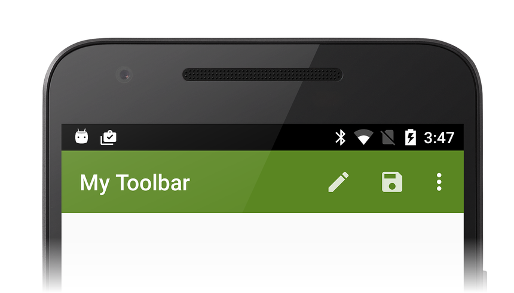

# Toolbar

_The Toolbar is an action bar component that provides more flexibility than the default action bar: it can be placed anywhere in the app, its size can be changed, and it can use a color scheme that is different from the app's theme. Also, each app screen can have multiple Toolbars._

## Overview

A key design element of any Android activity is an *action bar*. The 
action bar is the UI component that is used for navigation, search, 
menus, and branding in an Android app. In Android versions before 
Android 5.0 Lollipop, the action bar (also known as the *app bar*) was 
the recommended component for providing this functionality. 

The `Toolbar` widget (introduced in Android 5.0 Lollipop) can be 
thought of as a generalization of the action bar interface &ndash; it 
is intended to replace the action bar. The `Toolbar` can be used 
anywhere in an app layout, and it is much more customizable than an 
action bar. The following screenshot illustrates the customized 
`Toolbar` example created in this guide: 

There are some important differences between the `Toolbar` and the 
action bar: 

- A `Toolbar` can be placed anywhere in the user interface.

- Multiple toolbars can be displayed on the same screen.

- If fragments are used, each fragment can have its own `Toolbar`. 

- A `Toolbar` can be configured to span only a partial width of the 
    screen. 

- Because the `Toolbar` is not bound to the color scheme of the 
    Activity's window decor, it can have a visually distinct color 
    scheme. 

- Unlike the action bar, the `Toolbar` does not include an icon on 
    the left. Its menus on the right use less space. 

- The `Toolbar` height is adjustable. 

- Other views can be included inside the `Toolbar`. 

A `Toolbar` can contain one or more of the following elements: 

- Navigation button

- A branded logo image

- Title and subtitle

- Custom views

- Action menu

- Overflow menu

Google's [Material Design guidelines](https://material.google.com/) recommends 
taking advantage of these elements to give apps a distinct look (rather 
than relying solely on an application icon and title). 

This guide covers the most commonly-used `Toolbar` scenarios:

- Replacing an Activity's default action bar with a `Toolbar`. 

- Adding a second `Toolbar` to an Activity.

- Using the **Android Support Library v7 AppCompat** library 
    (referred to as *AppCompat* in the rest of this guide) to deploy 
    `Toolbar` on earlier versions of Android. 

## Requirements

`Toolbar` is available on Android 5.0 Lollipop (API 21) and later. 
When targeting Android releases earlier than Android 5.0, use the
[Android Support Library v7 AppCompat](https://www.nuget.org/packages/Xamarin.Android.Support.v7.AppCompat/), 
which provides backwards-compatible `Toolbar` support in a NuGet 
package. 
[Toolbar Compatibility](~/android/user-interface/controls/tool-bar/toolbar-compatibility.md) 
explains how to use this library. 

## Related Links

- [Lollipop Toolbar (sample)](/samples/xamarin/monodroid-samples/android50-toolbar)
- [AppCompat Toolbar (sample)](/samples/xamarin/monodroid-samples/supportv7-appcompat-toolbar)