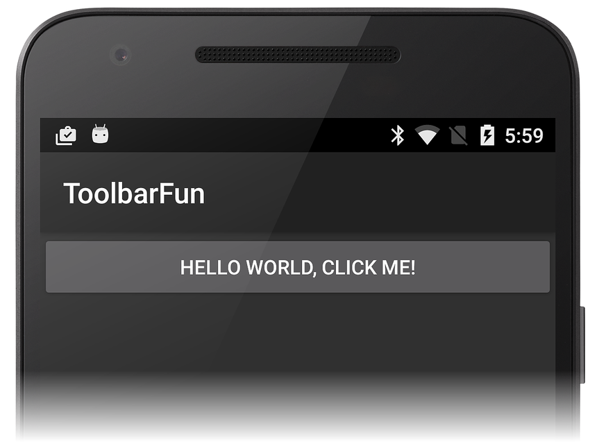
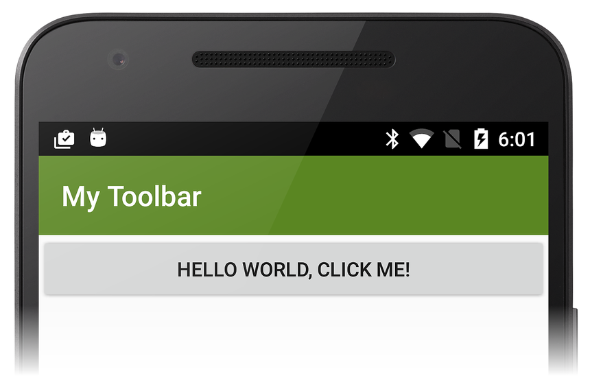
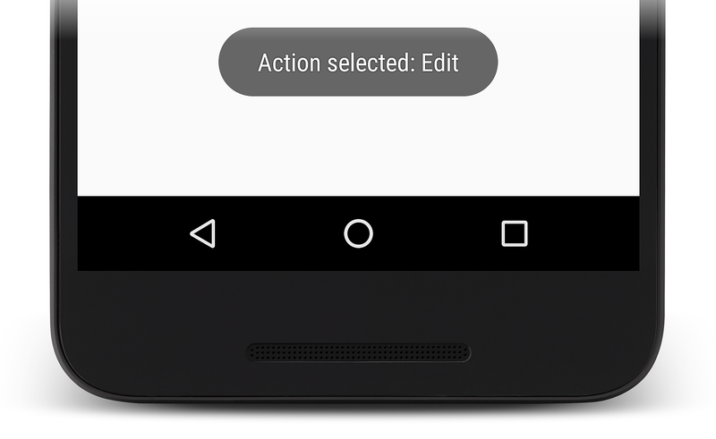
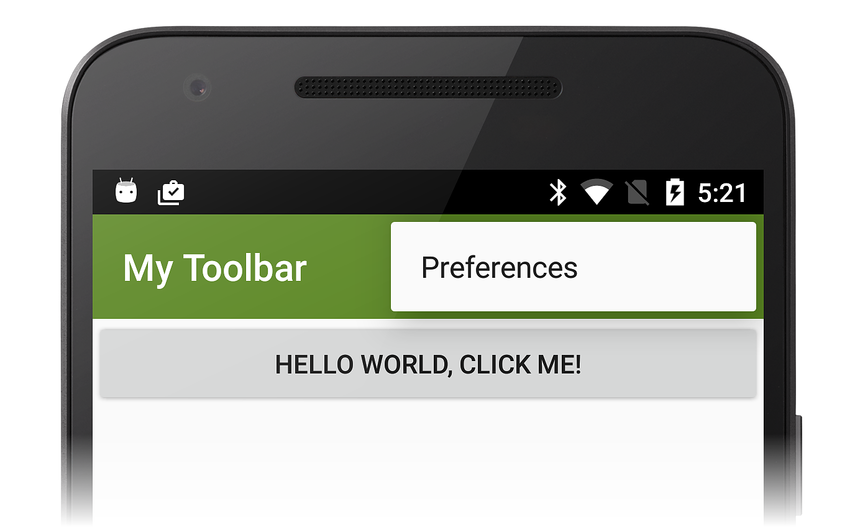
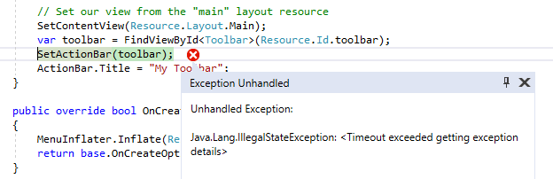

# Replacing the Action Bar

## Overview

One of the most common uses for the `Toolbar` is to replace the 
default action bar with a custom `Toolbar` (when a new Android project 
is created, it uses the default action bar). Because the `Toolbar` provides the 
ability to add branded logos, titles, menu items, navigation buttons, 
and even custom views to the app bar section of an Activity's UI, it
offers a significant upgrade over the default action bar.

To replace an app's default action bar with a `Toolbar`: 

1. Create a new custom theme and modify the app's properties so that it 
    uses this new theme. 

2. Disable the `windowActionBar` attribute in the custom theme and 
    enable the `windowNoTitle` attribute.

3. Define a layout for the `Toolbar`.

4. Include the `Toolbar` layout in the Activity's **Main.axml** layout 
    file. 

5. Add code to the Activity's `OnCreate` method to locate the `Toolbar`
    and call `SetActionBar` to install the `ToolBar` as the action bar.

The following sections explain this process in detail. A simple app is 
created and its action bar is replaced with a customized `Toolbar`. 

## Start an App Project

Create a new Android project called **ToolbarFun** (see
[Hello, Android](~/android/get-started/hello-android/hello-android-quickstart.md)
for more information about creating a new Android project). After this
project is created, set the target and minimum Android API levels to
**Android 5.0 (API Level 21 - Lollipop)** or later. For more
information about setting Android version levels, see
[Understanding Android API Levels](~/android/app-fundamentals/android-api-levels.md). When the app
is built and run, it displays the default action bar as seen in this
screenshot:

[](replacing-the-action-bar-images/01-before.png#lightbox)

## Create a Custom Theme

Open the **Resources/values** directory and a create a new file called 
**styles.xml**. Replace its contents with the following XML: 

```xml
<?xml version="1.0" encoding="utf-8" ?>
<resources>
  <style name="MyTheme" parent="@android:style/Theme.Material.Light.DarkActionBar">
    <item name="android:windowNoTitle">true</item>
    <item name="android:windowActionBar">false</item>
    <item name="android:colorPrimary">#5A8622</item>
  </style>
</resources>
```

This XML defines a new custom theme called **MyTheme** that is based on 
the **Theme.Material.Light.DarkActionBar** theme in Lollipop. The 
`windowNoTitle` attribute is set to `true` to hide the title bar: 

```xml
<item name="android:windowNoTitle">true</item>
```

To display the custom toolbar, the default `ActionBar` must be 
disabled: 

```xml
<item name="android:windowActionBar">false</item>
```

An olive-green `colorPrimary` setting is used for the background 
color of the toolbar: 

```xml
<item name="android:colorPrimary">#5A8622</item>
```

## Apply the Custom Theme

Edit **Properties/AndroidManifest.xml** and add the following 
`android:theme` attribute to the `<application>` element so that the 
app uses the `MyTheme` custom theme: 

```xml
<application android:label="@string/app_name" android:theme="@style/MyTheme"></application>
```

For more information about applying a custom theme to an app, see 
[Using Custom Themes](~/android/user-interface/material-theme.md#customtheme). 

## Define a Toolbar Layout

In the **Resources/layout** directory, create a new file called 
**toolbar.xml**. Replace its contents with the following XML: 

```xml
<?xml version="1.0" encoding="utf-8"?>
<Toolbar xmlns:android="http://schemas.android.com/apk/res/android"
    android:id="@+id/toolbar"
    android:layout_width="match_parent"
    android:layout_height="wrap_content"
    android:minHeight="?android:attr/actionBarSize"
    android:background="?android:attr/colorPrimary"
    android:theme="@android:style/ThemeOverlay.Material.Dark.ActionBar"/>
```

This XML defines the custom `Toolbar` that replaces the default 
action bar. The minimum height of the `Toolbar` is set to the size of 
the action bar that it replaces: 

```csharp
android:minHeight="?android:attr/actionBarSize"
```

The background color of the `Toolbar` is set to the olive-green color
defined earlier in **styles.xml**:

```csharp
android:background="?android:attr/colorPrimary"
```

Beginning with Lollipop, the `android:theme` attribute can be used to 
style an individual view. The `ThemeOverlay.Material` themes introduced 
in Lollipop make it possible to overlay the default `Theme.Material` 
themes, overwriting relevant attributes to make them either light or 
dark. In this example, the `Toolbar` uses a dark theme so that its 
contents are light in color: 

```csharp
android:theme="@android:style/ThemeOverlay.Material.Dark.ActionBar"
```

This setting is used so that menu items contrast with the darker 
background color.

## Include the Toolbar Layout

Edit the layout file **Resources/layout/Main.axml** and replace
its contents with the following XML:

```xml
<?xml version="1.0" encoding="utf-8"?>
<RelativeLayout xmlns:android="http://schemas.android.com/apk/res/android"
    android:layout_width="match_parent"
    android:layout_height="match_parent">
    <include
        android:id="@+id/toolbar"
        layout="@layout/toolbar" />
</RelativeLayout>
```

This layout includes the `Toolbar` defined in **toolbar.xml** and 
uses a `RelativeLayout` to specify that the `Toolbar` is to be 
placed at the very top of the UI (above the button). 

## Find and Activate the Toolbar

Edit **MainActivity.cs** and add the following using statement:

```csharp
using Android.Views;
```

Also, add the following lines of code to the end of the `OnCreate`
method:

```csharp
var toolbar = FindViewById<Toolbar>(Resource.Id.toolbar);
SetActionBar(toolbar);
ActionBar.Title = "My Toolbar";
```

This code finds the `Toolbar` and calls `SetActionBar` so that the 
`Toolbar` will take on default action bar characteristics. The title of 
the Toolbar is changed to **My Toolbar**. As seen in this code 
example, the `ToolBar` can be directly referenced as an action bar. 
Compile and run this app &ndash; the customized `Toolbar` is displayed 
in place of the default action bar: 

[](replacing-the-action-bar-images/02-after.png#lightbox)

Notice that the `Toolbar` is styled independently of the 
`Theme.Material.Light.DarkActionBar` theme that is applied to 
the remainder of the app. 

If an exception occurs while running the app, see the
[Troubleshooting](#troubleshooting) section below.

## Add Menu Items 

In this section, menus are added to the `Toolbar`. The upper right area 
of the `ToolBar` is reserved for menu items &ndash; each menu item 
(also called an *action item*) can perform an action within the current 
activity or it can perform an action on behalf of the entire app. 

To add menus to the `Toolbar`: 

1. Add menu icons (if required) to the `mipmap-` folders of 
    the app project. Google provides a set of free menu icons on the 
    [Material icons](https://m3.material.io/components/icon-buttons/overview) page. 

2. Define the contents of the menu items by adding a new menu resource 
    file under **Resources/menu**. 

3. Implement the `OnCreateOptionsMenu` method of the Activity &ndash; 
    this method inflates the menu items. 

4. Implement the `OnOptionsItemSelected` method of the Activity 
    &ndash; this method performs an action when a menu item is tapped. 

The following sections demonstrate this process in detail by adding
**Edit** and **Save** menu items to the customized `Toolbar`. 

### Install Menu Icons

Continuing with the `ToolbarFun` example app, add menu icons to the app
project. Download
[toolbar icons](https://github.com/xamarin/monodroid-samples/blob/master/Supportv7/AppCompat/Toolbar/Resources/toolbar-icons-plus.zip?raw=true),
unzip, and copy the contents of the extracted *mipmap-* folders to
the project *mipmap-* folders under **ToolbarFun/Resources** and
include each added icon file in the project.

### Define a Menu Resource

Create a new **menu** subdirectory under **Resources**. In the **menu** 
subdirectory, create a new menu resource file called **top_menus.xml** 
and replace its contents with the following XML: 

```xml
<?xml version="1.0" encoding="utf-8" ?>
<menu xmlns:android="http://schemas.android.com/apk/res/android">
  <item
       android:id="@+id/menu_edit"
       android:icon="@mipmap/ic_action_content_create"
       android:showAsAction="ifRoom"
       android:title="Edit" />
  <item
       android:id="@+id/menu_save"
       android:icon="@mipmap/ic_action_content_save"
       android:showAsAction="ifRoom"
       android:title="Save" />
  <item
       android:id="@+id/menu_preferences"
       android:showAsAction="never"
       android:title="Preferences" />
</menu>
```

This XML creates three menu items:

- An **Edit** menu item that uses the `ic_action_content_create.png` 
    icon (a pencil). 

- A **Save** menu item that uses the `ic_action_content_save.png` 
    icon (a diskette). 

- A **Preferences** menu item that does not have an icon.

The `showAsAction` attributes of the **Edit** and **Save** menu 
items are set to `ifRoom` &ndash; this setting causes these menu 
items to appear in the `Toolbar` if there is sufficient room for
them to be displayed. The **Preferences** menu item sets 
`showAsAction` to `never` &ndash; this causes the **Preferences** 
menu to appear in the *overflow* menu (three vertical dots). 

### Implement OnCreateOptionsMenu

Add the following method to **MainActivity.cs**:

```csharp
public override bool OnCreateOptionsMenu(IMenu menu)
{
    MenuInflater.Inflate(Resource.Menu.top_menus, menu);
    return base.OnCreateOptionsMenu(menu);
}
```

Android calls the `OnCreateOptionsMenu` method so that the app can 
specify the menu resource for an activity. In this method, the 
**top_menus.xml** resource is inflated into the passed `menu`. This 
code causes the new **Edit**, **Save**, and **Preferences** menu 
items to appear in the `Toolbar`. 

### Implement OnOptionsItemSelected

Add the following method to **MainActivity.cs**:

```csharp
public override bool OnOptionsItemSelected(IMenuItem item)
{
    Toast.MakeText(this, "Action selected: " + item.TitleFormatted,
        ToastLength.Short).Show();
    return base.OnOptionsItemSelected(item);
}
```

When a user taps a menu item, Android calls the `OnOptionsItemSelected` 
method and passes in the menu item that was selected. In this example, 
the implementation just displays a toast to indicate which menu item 
was tapped. 

Build and run `ToolbarFun` to see the new menu items in the toolbar. 
The `Toolbar` now displays three menu icons as seen in this 
screenshot: 

[](replacing-the-action-bar-images/04-menu-items.png#lightbox)

When a user taps the **Edit** menu item, a toast is displayed to 
indicate that the `OnOptionsItemSelected` method was called: 

[](replacing-the-action-bar-images/05-toast-displayed.png#lightbox)

When a user taps the overflow menu, the **Preferences** menu 
item is displayed. Typically, less-common actions should be placed 
in the overflow menu &ndash; this example uses the overflow menu 
for **Preferences** because it is not used as often as **Edit** 
and **Save**: 

[](replacing-the-action-bar-images/06-preferences.png#lightbox)

For more information about Android menus, see the Android Developer 
[Menus](https://developer.android.com/guide/topics/ui/menus.html) 
topic. 

## Troubleshooting

The following tips can help to debug problems that may occur while
replacing the action bar with a toolbar.

### Activity Already Has an Action Bar

If the app is not properly configured to use a custom theme as
explained in [Apply the Custom Theme](#apply-the-custom-theme), the following
exception may occur while running the app:



In addition, an error message such as the following may be produced:
_Java.Lang.IllegalStateException: This Activity already has an action
bar supplied by the window decor._ 

To correct this error, verify that the `android:theme` attribute for
the custom theme is added to `<application>` (in
**Properties/AndroidManifest.xml**) as described earlier in
[Apply the Custom Theme](#apply-the-custom-theme). In addition,
this error may be caused if the `Toolbar` layout or custom theme 
is not configured properly.

## Related Links

- [Lollipop Toolbar (sample)](/samples/xamarin/monodroid-samples/android50-toolbar)
- [AppCompat Toolbar (sample)](/samples/xamarin/monodroid-samples/supportv7-appcompat-toolbar)