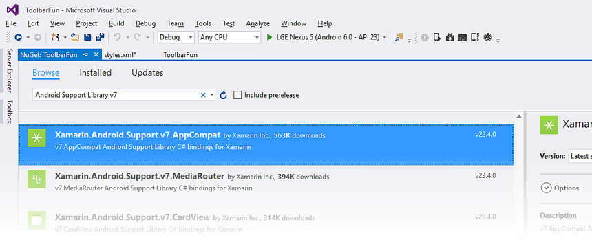
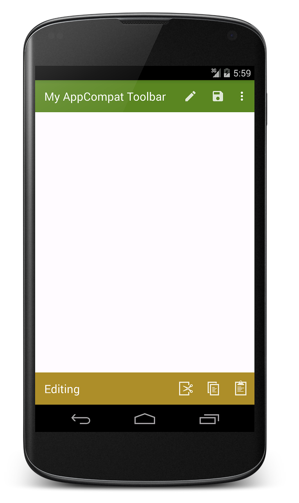

# Toolbar Compatibility

## Overview

This section explains how to use `Toolbar` on versions of Android 
earlier than Android 5.0 Lollipop. If your app does not support 
versions of Android earlier than Android 5.0, you can skip this 
section. 

Because `Toolbar` is part of the Android v7 support library, it can be
used on devices running Android 2.1 (API level 7) and higher. However,
the [Android Support Library v7 AppCompat](https://www.nuget.org/packages/Xamarin.Android.Support.v7.AppCompat/)
NuGet must be installed and the code modified so that it uses the
`Toolbar` implementation provided in this library. This section
explains how to install this NuGet and modify the **ToolbarFun** app
from [Adding a Second Toolbar](~/android/user-interface/controls/tool-bar/adding-a-second-toolbar.md)
so that it runs on versions of Android earlier than Lollipop 5.0.

To modify an app to use the AppCompat version of Toolbar: 

1. Set the Minimum and Target Android versions for the app.

2. Install the AppCompat NuGet Package.

3. Use an AppCompat theme instead of a built-in Android theme.

4. Modify `MainActivity` so that it subclasses `AppCompatActivity` 
    rather than `Activity`. 

Each of these steps is explained in detail in the following sections.

## Set the Minimum and Target Android Version

The app's Target Framework must be set to API Level 21 or 
greater or the app will not deploy properly. If an error such as **No 
resource identifier found for attribute 'tileModeX' in package 
'android'** is seen while deploying the app, this is because the Target 
Framework is not set to **Android 5.0 (API Level 21 - Lollipop)** or 
greater. 

Set the Target Framework level to API Level 21 or greater and
set the Android API level project settings to the minimum Android 
Version that the app is to support. For more information about setting 
Android API levels, see 
[Understanding Android API Levels](~/android/app-fundamentals/android-api-levels.md). 
In the `ToolbarFun` example, the Minimum Android Version is set to 
KitKat (API Level 4.4). 

## Install the AppCompat NuGet Package

Next, add the 
[Android Support Library v7 AppCompat](https://www.nuget.org/packages/Xamarin.Android.Support.v7.AppCompat/) package
to the project. In Visual Studio, right-click 
**References** and select **Manage NuGet Packages...**. Click 
**Browse** and search for **Android Support Library v7 AppCompat**. 
Select **Xamarin.Android.Support.v7.AppCompat** and 
click **Install**: 

[](toolbar-compatibility-images/01-appcompat-nuget.png#lightbox)

When this NuGet is installed, several other NuGet packages are also 
installed if not already present (such as 
**Xamarin.Android.Support.Animated.Vector.Drawable**, 
**Xamarin.Android.Support.v4**, and 
**Xamarin.Android.Support.Vector.Drawable**). For more information 
about installing NuGet packages, see 
[Walkthrough: Including a NuGet in your project](/visualstudio/mac/nuget-walkthrough). 

## Use an AppCompat Theme and Toolbar

The AppCompat library comes with several `Theme.AppCompat` themes that 
can be used on any version of Android supported by the AppCompat 
library. The `ToolbarFun` example app theme is derived from 
`Theme.Material.Light.DarkActionBar`, which is not available on Android 
versions earlier than Lollipop. Therefore, `ToolbarFun` must be adapted 
to use the AppCompat counterpart for this theme, 
`Theme.AppCompat.Light.DarkActionBar`. Also, because `Toolbar` is not 
available on versions of Android earlier than Lollipop, we must use the 
AppCompat version of `Toolbar`. Therefore, layouts must use 
`android.support.v7.widget.Toolbar` instead of `Toolbar`. 

### Update Layouts

Edit **Resources/layout/Main.axml** and replace the `Toolbar` element 
with the following XML: 

```xml
<android.support.v7.widget.Toolbar
    android:id="@+id/edit_toolbar"
    android:minHeight="?attr/actionBarSize"
    android:background="?attr/colorAccent"
    android:theme="@style/ThemeOverlay.AppCompat.Dark.ActionBar"
    android:layout_width="match_parent"
    android:layout_height="wrap_content" />
```

Edit **Resources/layout/toolbar.xml** and replace its contents with the 
following XML: 

```xml
<?xml version="1.0" encoding="utf-8"?>
<android.support.v7.widget.Toolbar xmlns:android="http://schemas.android.com/apk/res/android"
    android:id="@+id/toolbar"
    android:layout_width="match_parent"
    android:layout_height="wrap_content"
    android:minHeight="?attr/actionBarSize"
    android:background="?attr/colorPrimary"
    android:theme="@style/ThemeOverlay.AppCompat.Dark.ActionBar"/>
```

Note that the `?attr` values are no longer prefixed with `android:` 
(recall that the `?` notation references a resource in the current 
theme). If `?android:attr` were still used here, Android would 
reference the attribute value from the currently running platform 
rather than from the AppCompat library. Because this example uses the 
`actionBarSize` defined by the AppCompat library, the `android:` prefix 
is dropped. Similarly, `@android:style` is changed to `@style` so that 
the `android:theme` attribute is set to a theme in the AppCompat 
library &ndash; the `ThemeOverlay.AppCompat.Dark.ActionBar` theme is 
used here rather than `ThemeOverlay.Material.Dark.ActionBar`. 

### Update the Style

Edit **Resources/values/styles.xml** and replace its contents with the 
following XML: 

```xml
<?xml version="1.0" encoding="utf-8" ?>
<resources>
  <style name="MyTheme" parent="MyTheme.Base"> </style>
  <style name="MyTheme.Base" parent="Theme.AppCompat.Light.DarkActionBar">
    <item name="windowNoTitle">true</item>
    <item name="windowActionBar">false</item>
    <item name="colorPrimary">#5A8622</item>
    <item name="colorAccent">#A88F2D</item>
  </style>
</resources>
```

The item names and parent theme in this example are no longer 
prefixed with `android:` because we are using the AppCompat library. 
Also, the parent theme is changed to the AppCompat version of 
`Light.DarkActionBar`. 

### Update Menus

To support earlier versions of Android, the AppCompat library uses 
custom attributes that mirror the attributes of the `android:`
namespace. However, some attributes (such as the `showAsAction` 
attribute used in the `<menu>` tag) do not exist in the Android 
framework on older devices &ndash; `showAsAction` was introduced in 
Android API 11 but is not available in Android API 7. For this reason, 
a custom namespace must be used to prefix all of the attributes defined 
by the support library. In the menu resource files, a namespace called 
`local` is defined for prefixing the `showAsAction` attribute. 

Edit **Resources/menu/top_menus.xml** and replace its contents
with the following XML:

```xml
<?xml version="1.0" encoding="utf-8" ?>
<menu xmlns:android="http://schemas.android.com/apk/res/android"
      xmlns:local="http://schemas.android.com/apk/res-auto">
  <item
       android:id="@+id/menu_edit"
       android:icon="@mipmap/ic_action_content_create"
       local:showAsAction="ifRoom"
       android:title="Edit" />
  <item
       android:id="@+id/menu_save"
       android:icon="@mipmap/ic_action_content_save"
       local:showAsAction="ifRoom"
       android:title="Save" />
  <item
       android:id="@+id/menu_preferences"
       local:showAsAction="never"
       android:title="Preferences" />
</menu>
```

The `local` namespace is added with this line:

```xml
xmlns:local="http://schemas.android.com/apk/res-auto">
```

The `showAsAction` attribute is prefaced with this `local:` namespace 
rather than `android:` 

```csharp
local:showAsAction="ifRoom"
```

Similarly, edit **Resources/menu/edit_menus.xml** and replace
its contents with the following XML:

```xml
<?xml version="1.0" encoding="utf-8" ?>
<menu xmlns:android="http://schemas.android.com/apk/res/android"
      xmlns:local="http://schemas.android.com/apk/res-auto">
  <item
       android:id="@+id/menu_cut"
       android:icon="@mipmap/ic_menu_cut_holo_dark"
       local:showAsAction="ifRoom"
       android:title="Cut" />
  <item
       android:id="@+id/menu_copy"
       android:icon="@mipmap/ic_menu_copy_holo_dark"
       local:showAsAction="ifRoom"
       android:title="Copy" />
  <item
       android:id="@+id/menu_paste"
       android:icon="@mipmap/ic_menu_paste_holo_dark"
       local:showAsAction="ifRoom"
       android:title="Paste" />
</menu>
```

How does this namespace switch provide support for the `showAsAction` 
attribute on Android versions prior to API Level 11? The custom 
attribute `showAsAction` and all of its possible values are included in 
the app when the AppCompat NuGet is installed. 

## Subclass AppCompatActivity

The final step in the conversion is to modify `MainActivity` so that it 
is a subclass of `AppCompatActivity`. Edit **MainActivity.cs** and add 
the following `using` statements: 

```csharp
using Android.Support.V7.App;
using Toolbar = Android.Support.V7.Widget.Toolbar;
```

This declares `Toolbar` to be the AppCompat version of `Toolbar`. Next, 
change the class definition of `MainActivity`: 

```csharp
public class MainActivity : AppCompatActivity
```

To set the action bar to the AppCompat version of `Toolbar`, substitute
the call to `SetActionBar` with `SetSupportActionBar`. In this
example, the title is also changed to indicate that the AppCompat
version of `Toolbar` is being used:

```csharp
SetSupportActionBar (toolbar);
SupportActionBar.Title = "My AppCompat Toolbar";
```

Finally, change the Minimum Android level to the pre-Lollipop value 
that is to be supported (for example, API 19). 

Build the app and run it on a pre-Lollipop device or Android emulator. 
The following screenshot shows the AppCompat version of **ToolbarFun** 
on a Nexus 4 running KitKat (API 19): 

[](toolbar-compatibility-images/02-running-on-kitkat.png#lightbox)

When the AppCompat library is used, themes do not have to be switched 
based on the Android version &ndash; the AppCompat library makes it 
possible to provide a consistent user experience across all supported 
Android versions. 

## Related Links

- [Lollipop Toolbar (sample)](/samples/xamarin/monodroid-samples/android50-toolbar)
- [AppCompat Toolbar (sample)](/samples/xamarin/monodroid-samples/supportv7-appcompat-toolbar)
