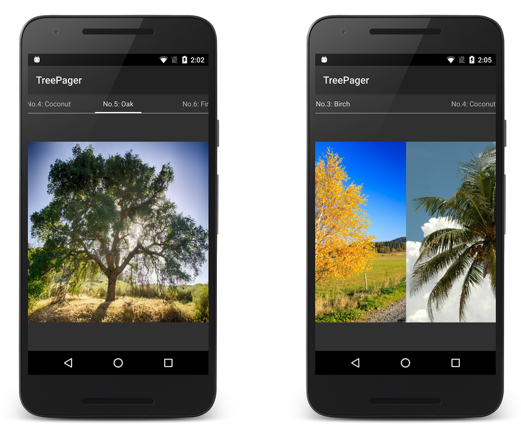
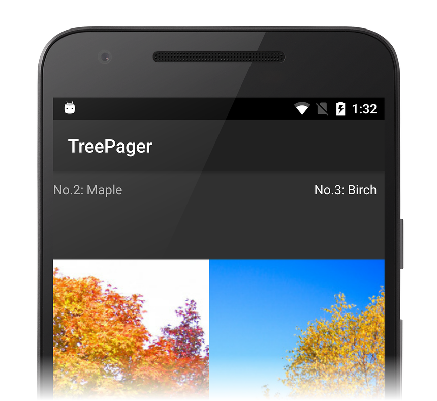
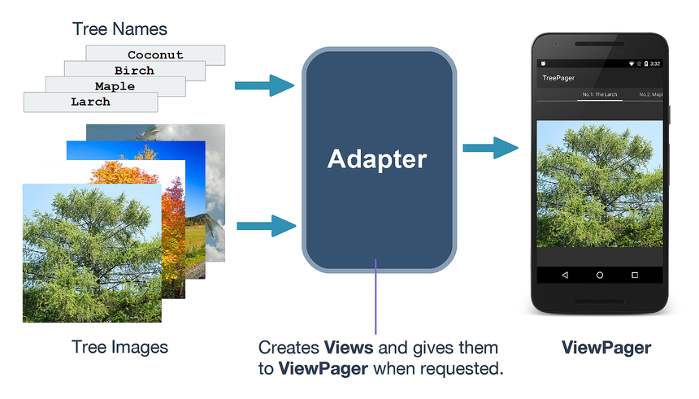
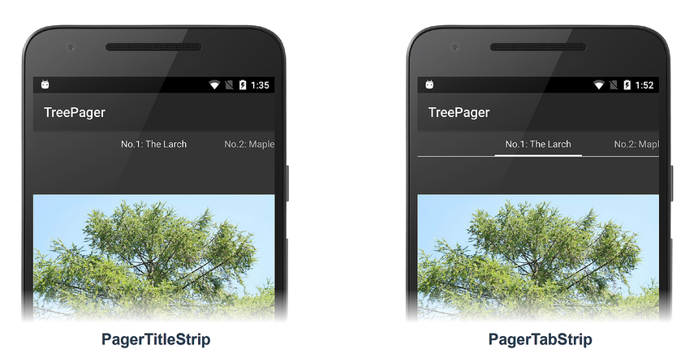

# ViewPager

_ViewPager is a layout manager that lets you implement gestural navigation. Gestural navigation allows the user to swipe left and right to step through pages of data. This guide explains how to implement gestural navigation with ViewPager, with and without Fragments. It also describes how to add page indicators using PagerTitleStrip and PagerTabStrip._

## Overview

A common scenario in app development is the need to provide users with 
gestural navigation between sibling views. In this approach, the user 
swipes left or right to access pages of content (for example, in a 
setup wizard or a slide show). You can create these swipe views 
by using the `ViewPager` widget, available in 
[Android Support Library v4](https://www.nuget.org/packages/Xamarin.Android.Support.v4/). 
The `ViewPager` is a layout widget made up of multiple child views where 
each child view constitutes a page in the layout: 

Typically, `ViewPager` is used in conjunction with 
[Fragments](~/android/platform/fragments/index.md); 
however, there are some situations where you might want to use 
`ViewPager` without the added complexity of `Fragment`s.

`ViewPager` uses an adapter pattern to provide it with the views to 
display. The adapter used here is conceptually similar to that used by 
[RecyclerView](~/android/user-interface/layouts/recycler-view/index.md) &ndash; you 
supply an implementation of `PagerAdapter` to generate the pages that 
the `ViewPager` displays to the user. The pages displayed by 
`ViewPager` can be `View`s or `Fragment`s. When `View`s are 
displayed, the adapter subclasses Android's `PagerAdapter` base 
class. If `Fragment`s are displayed, the adapter subclasses Android's 
`FragmentPagerAdapter`. The Android support library also includes 
`FragmentPagerAdapter` (a subclass of `PagerAdapter`) to help with the 
details of connecting `Fragment`s to data. 

This guide demonstrates both approaches: 

- In [Viewpager with Views](~/android/user-interface/controls/view-pager/viewpager-and-views.md), a
    [TreePager](/samples/xamarin/monodroid-samples/userinterface-treepager) app is 
    developed to demonstrate how to use `ViewPager` to display views
    of a tree catalog (an image gallery of deciduous and evergreen trees). 
    `PagerTabStrip`  and `PagerTitleStrip` are used to display titles 
    that help with page navigation.

- In [Viewpager with Fragments](~/android/user-interface/controls/view-pager/viewpager-and-fragments.md), a
    slightly more complex [FlashCardPager](/samples/xamarin/monodroid-samples/userinterface-flashcardpager) 
    app is developed to demonstrate how to use `ViewPager` 
    with `Fragment`s to build an app that presents math 
    problems as flash cards and responds to user input. 

## Requirements

To use `ViewPager` in your app project, you must install the 
[Android Support Library v4](https://www.nuget.org/packages/Xamarin.Android.Support.v4/)
package. For more information about installing NuGet packages, see
[Walkthrough: Including a NuGet in your project](/visualstudio/mac/nuget-walkthrough). 

## Architecture

Three components are used for implementing gestural navigation
with `ViewPager`:

- ViewPager
- Adapter
- Pager Indicator

Each of these components is summarized below.

### ViewPager

`ViewPager` is a layout manager that displays a collection of `View`s one 
at a time. Its job is to detect the user's swipe gesture and navigate 
to the next or previous view as appropriate. For example, the 
screenshot below demonstrates a `ViewPager` making the transition from 
one image to the next in response to a user gesture: 

### Adapter

`ViewPager` pulls its data from an *adapter*. The adapter's job is to 
create the `View`s displayed by the `ViewPager`, providing them as 
needed. The diagram below illustrates this concept &ndash; the adapter 
creates and populates `View`s and provides them to the `ViewPager`. As 
the `ViewPager` detects the user's swipe gestures, it asks the adapter 
to provide the appropriate `View` to display: 

In this particular example, each `View` is constructed from a tree 
image and a tree name before it is passed to the `ViewPager`. 

### Pager Indicator

`ViewPager` may be used to display a large data set (for example, 
an image gallery may contain hundreds of images). To help the user 
navigate large data sets, `ViewPager` is often accompanied by a *pager 
indicator* that displays a string. The string might be the image 
title, a caption, or simply the current view's position within the data 
set. 

There are two views that can produce this navigation information for 
you: `PagerTabStrip` and `PagerTitleStrip.` Each displays a string 
at the top of a `ViewPager`, and each pulls its data from the 
`ViewPager`'s adapter so that it always stays in sync with the 
currently-displayed `View`. The difference between them is that 
`PagerTabStrip` includes a visual indicator for the "current" string 
while `PagerTitleStrip` does not (as shown in these screenshots): 

This guide demonstrates how to immplement `ViewPager`, adapter, and 
indicator app components and integrate them to support gestural 
navigation. 

## Related Links

- [TreePager (sample)](/samples/xamarin/monodroid-samples/userinterface-treepager)
- [FlashCardPager (sample)](/samples/xamarin/monodroid-samples/userinterface-flashcardpager)