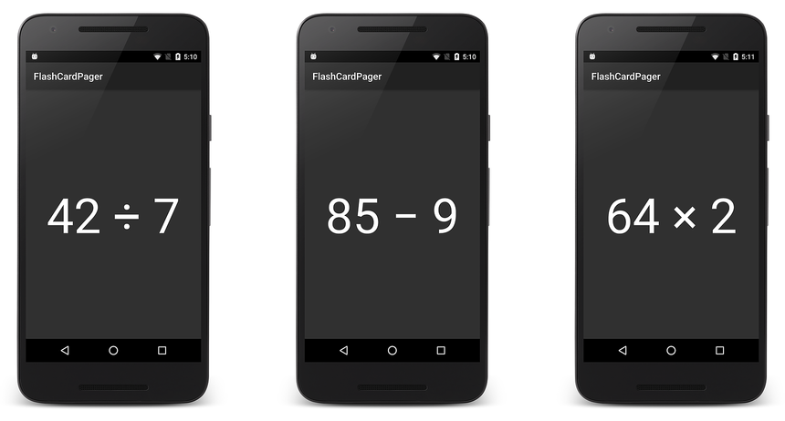
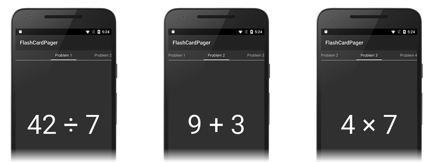
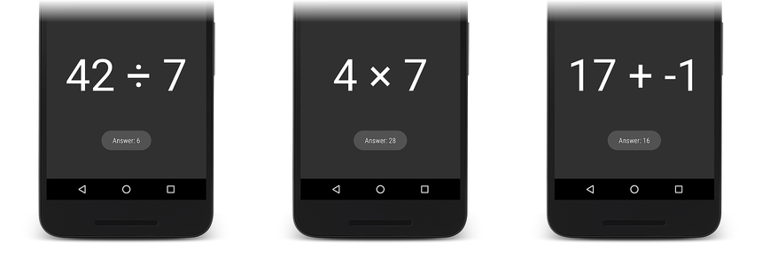

# ViewPager with Fragments

_ViewPager is a layout manager that lets you implement gestural navigation. Gestural navigation allows the user to swipe left and right to step through pages of data. This guide explains how to implement a swipeable UI with ViewPager, using Fragments as the data pages._

## Overview

`ViewPager` is often used in conjunction with fragments so that it is 
easier to manage the lifecycle of each page in the `ViewPager`. In this 
walkthrough, `ViewPager` is used to create an app called 
**FlashCardPager** that presents a series of math problems on flash 
cards. Each flash card is implemented as a fragment. The user swipes 
left and right through the flash cards and taps on a math problem to 
reveal its answer. This app creates a `Fragment` instance for each 
flash card and implements an adapter derived from 
`FragmentPagerAdapter`. In 
[Viewpager and Views](~/android/user-interface/controls/view-pager/viewpager-and-views.md), 
most of the work was done in `MainActivity` lifecycle methods. In 
**FlashCardPager**, most of the work will be done by a `Fragment` in 
one of its lifecycle methods. 

This guide does not cover the basics of fragments &ndash; if you are 
not yet familiar with fragments in Xamarin.Android, see 
[Fragments](~/android/platform/fragments/index.md) to help you 
get started with fragments. 

## Start an App Project

Create a new Android project called **FlashCardPager**. Next, launch 
the NuGet Package Manager (for more information about installing NuGet 
packages, see 
[Walkthrough: Including a NuGet in your project](/visualstudio/mac/nuget-walkthrough)). 
Find and install the **Xamarin.Android.Support.v4** package as 
explained in [Viewpager and Views](~/android/user-interface/controls/view-pager/viewpager-and-views.md). 

## Add an Example Data Source

In **FlashCardPager**, the data source is a deck of flash cards 
represented by the `FlashCardDeck` class; this data source supplies the 
`ViewPager` with item content. `FlashCardDeck` contains a ready-made 
collection of math problems and answers. The `FlashCardDeck` 
constructor requires no arguments: 

```csharp
FlashCardDeck flashCards = new FlashCardDeck();
```

The collection of flash cards in `FlashCardDeck` is organized such that 
each flash card can be accessed by an indexer. For example, the 
following line of code retrieves the fourth flash card problem in the 
deck: 

```csharp
string problem = flashCardDeck[3].Problem;
```

This line of code retrieves the corresponding answer to the previous problem:

```csharp
string answer = flashCardDeck[3].Answer;
```

Because the implementation details of `FlashCardDeck` are not relevant to
understanding `ViewPager`, the `FlashCardDeck` code is not listed here.
The source code to `FlashCardDeck` is available at
[FlashCardDeck.cs](https://github.com/xamarin/monodroid-samples/blob/master/UserInterface/FlashCardPager/FlashCardPager/FlashCardDeck.cs).
Download this source file (or copy and paste the code into a new
**FlashCardDeck.cs** file) and add it to your project.

## Create a ViewPager Layout

Open **Resources/layout/Main.axml** and replace its contents with the following XML:

```xml
<?xml version="1.0" encoding="utf-8"?>
<android.support.v4.view.ViewPager
    xmlns:android="http://schemas.android.com/apk/res/android"
    android:id="@+id/viewpager"
    android:layout_width="match_parent"
    android:layout_height="match_parent" >

    </android.support.v4.view.ViewPager>
```

This XML defines a `ViewPager` that occupies the entire screen. Note that
you must use the fully-qualified name **android.support.v4.view.ViewPager**
because `ViewPager` is packaged in a support library. `ViewPager` is
available only from the
[Android Support Library v4](https://www.nuget.org/packages/Xamarin.Android.Support.v4/);
it is not available in the Android SDK.

## Set up ViewPager

Edit **MainActivity.cs** and add the following `using` statements:

```csharp
using Android.Support.V4.View;
using Android.Support.V4.App;
```

Change the `MainActivity` class declaration so that it is derived
from `FragmentActivity`:

```csharp
public class MainActivity : FragmentActivity
```

`MainActivity` is derived from`FragmentActivity` (rather than 
`Activity`) because `FragmentActivity` knows how to manage the support 
of fragments. Replace the `OnCreate` method with the following code: 

```csharp
protected override void OnCreate(Bundle bundle)
{
    base.OnCreate(bundle);
    SetContentView(Resource.Layout.Main);
    ViewPager viewPager = FindViewById<ViewPager>(Resource.Id.viewpager);
    FlashCardDeck flashCards = new FlashCardDeck();
}
```

This code does the following:

1. Sets the view from the **Main.axml** layout resource.

2. Retrieves a reference to the `ViewPager` from the layout.

3. Instantiates a new `FlashCardDeck` as the data source.

When you build and run this code, you should see a display that 
resembles the following screenshot: 

[](viewpager-and-fragments-images/01-initial-screen.png#lightbox)

At this point, the `ViewPager` is empty because it is lacking the 
fragments that are used populate the `ViewPager`, and it is lacking an 
adapter for creating these fragments from the data in 
**FlashCardDeck**. 

In the following sections, a `FlashCardFragment` is create to implement 
the functionality of each flash card, and a `FragmentPagerAdapter` is 
created to connect the `ViewPager` to the fragments created from data 
in the `FlashCardDeck`. 

## Create the Fragment

Each flash card will be managed by a UI fragment called 
`FlashCardFragment`. `FlashCardFragment`'s view will display the 
information contained with a single flash card. Each instance of 
`FlashCardFragment` will be hosted by the `ViewPager`. 
`FlashCardFragment`'s view will consist of a `TextView` that displays 
the flash card problem text. This view will implement an event handler 
that uses a `Toast` to display the answer when the user taps the flash 
card question. 

### Create the FlashCardFragment Layout

Before `FlashCardFragment` can be implemented, its layout must be 
defined. This layout is a fragment container layout for a single 
fragment. Add a new Android layout to **Resources/layout** called 
**flashcard_layout.axml**. Open 
**Resources/layout/flashcard_layout.axml** and replace its contents 
with the following code: 

```xml
<?xml version="1.0" encoding="utf-8"?>
<RelativeLayout xmlns:android="http://schemas.android.com/apk/res/android"
    xmlns:tools="http://schemas.android.com/tools"
    android:layout_width="match_parent"
    android:layout_height="match_parent">
    <TextView
        android:id="@+id/flash_card_question"
            android:layout_width="wrap_content"
            android:layout_height="wrap_content"
            android:gravity="center"
            android:textAppearance="@android:style/TextAppearance.Large"
            android:textSize="100sp"
            android:layout_centerHorizontal="true"
            android:layout_centerVertical="true"
            android:text="Question goes here" />
    </RelativeLayout>
```

This layout defines a single flash card fragment; each fragment is 
comprised of a `TextView` that displays a math problem using a large 
(100sp) font. This text is centered vertically and horizontally on the 
flash card. 

### Create the Initial FlashCardFragment Class

Add a new file called **FlashCardFragment.cs** and replace its contents
with the following code:

```csharp
using System;
using Android.OS;
using Android.Views;
using Android.Widget;
using Android.Support.V4.App;

namespace FlashCardPager
{
    public class FlashCardFragment : Android.Support.V4.App.Fragment
    {
        public FlashCardFragment() { }

        public static FlashCardFragment newInstance(String question, String answer)
        {
            FlashCardFragment fragment = new FlashCardFragment();
            return fragment;
        }
        public override View OnCreateView (
            LayoutInflater inflater, ViewGroup container, Bundle savedInstanceState)
        {
            View view = inflater.Inflate (Resource.Layout.flashcard_layout, container, false);
            TextView questionBox = (TextView)view.FindViewById (Resource.Id.flash_card_question);
            return view;
        }
    }
}
```

This code stubs out the essential `Fragment` definition that will be 
used to display a flash card. Note that `FlashCardFragment` is derived 
from the support library version of `Fragment` defined in 
`Android.Support.V4.App.Fragment`. The constructor is empty so that the 
`newInstance` factory method is used to create a new 
`FlashCardFragment` instead of a constructor. 

The `OnCreateView` lifecycle method creates and configures the 
`TextView`. It inflates the layout for the fragment's `TextView` and 
returns the inflated `TextView` to the caller. `LayoutInflater` and 
`ViewGroup` are passed to `OnCreateView` so that it can inflate the 
layout. The `savedInstanceState` bundle contains data that 
`OnCreateView` uses to recreate the `TextView` from a saved state. 

The fragment's view is explicitly inflated by the call to 
`inflater.Inflate`. The `container` argument is the view's parent, and 
the `false` flag instructs the inflater to refrain from adding the 
inflated view to the view's parent (it will be added when `ViewPager` 
call's the adapter's `GetItem` method later in this walkthrough). 

### Add State Code to FlashCardFragment

Like an Activity, a fragment has a `Bundle` that it uses to save and 
retrieve its state. In **FlashCardPager**, this `Bundle` is used to save 
the question and answer text for the associated flash card. In 
**FlashCardFragment.cs**, add the following `Bundle` keys to the top of 
the `FlashCardFragment` class definition: 

```csharp
private static string FLASH_CARD_QUESTION = "card_question";
private static string FLASH_CARD_ANSWER = "card_answer";
```

Modify the `newInstance` factory method so that it creates a `Bundle` 
object and uses the above keys to store the passed question and answer text 
in the fragment after it is instantiated: 

```csharp
public static FlashCardFragment newInstance(String question, String answer)
{
    FlashCardFragment fragment = new FlashCardFragment();

    Bundle args = new Bundle();
    args.PutString(FLASH_CARD_QUESTION, question);
    args.PutString(FLASH_CARD_ANSWER, answer);
    fragment.Arguments = args;

    return fragment;
}
```

Modify the fragment lifecycle method `OnCreateView` to retrieve this 
information from the passed-in Bundle and load the question text into 
the `TextBox`: 

```csharp
public override View OnCreateView(LayoutInflater inflater, ViewGroup container, Bundle savedInstanceState)
{
    string question = Arguments.GetString(FLASH_CARD_QUESTION, "");
    string answer = Arguments.GetString(FLASH_CARD_ANSWER, "");

    View view = inflater.Inflate(Resource.Layout.flashcard_layout, container, false);
    TextView questionBox = (TextView)view.FindViewById(Resource.Id.flash_card_question);
    questionBox.Text = question;

    return view;
}
```

The `answer` variable is not used here, but it will be used later when 
event handler code is added to this file. 

## Create the Adapter

`ViewPager` uses an adapter controller object that sits between the 
`ViewPager` and the data source (see the illustration in the ViewPager 
[Adapter](~/android/user-interface/controls/view-pager/index.md#adapter) article). 
To access this data, `ViewPager` requires that you provide a custom 
adapter derived from `PagerAdapter`. Because this example uses 
fragments, it uses a `FragmentPagerAdapter` &ndash; 
`FragmentPagerAdapter` is derived from `PagerAdapter`. 
`FragmentPagerAdapter` represents each page as a `Fragment` that is 
persistently kept in the fragment manager for as long as the user can 
return to the page. As the user swipes through pages of the 
`ViewPager`, the `FragmentPagerAdapter` extracts information from the 
data source and uses it to create `Fragment`s for the `ViewPager` to 
display. 

When you implement a `FragmentPagerAdapter`, you must override the following:

- **Count** &ndash; Read-only property that returns the number of
    views (pages) available.

- **GetItem** &ndash; Returns the fragment to display for the
    specified page.

Add a new file called **FlashCardDeckAdapter.cs** and replace its contents
with the following code:

```csharp
using System;
using Android.Views;
using Android.Widget;
using Android.Support.V4.App;

namespace FlashCardPager
{
    class FlashCardDeckAdapter : FragmentPagerAdapter
    {
        public FlashCardDeckAdapter (Android.Support.V4.App.FragmentManager fm, FlashCardDeck flashCards)
            : base(fm)
        {
        }

        public override int Count
        {
            get { throw new NotImplementedException(); }
        }

        public override Android.Support.V4.App.Fragment GetItem(int position)
        {
            throw new NotImplementedException();
        }
    }
}
```

This code stubs out the essential `FragmentPagerAdapter` 
implementation. In the following sections, each of these methods is 
replaced with working code. The purpose of the constructor is to pass 
the fragment manager to the `FlashCardDeckAdapter`'s base class 
constructor. 

### Implement the Adapter Constructor

When the app instantiates the `FlashCardDeckAdapter`, it supplies a 
reference to the fragment manager and an instantiated `FlashCardDeck`. 
Add the following member variable to the top of the 
`FlashCardDeckAdapter` class in **FlashCardDeckAdapter.cs**: 

```csharp
public FlashCardDeck flashCardDeck;
```

Add the following line of code to the `FlashCardDeckAdapter` 
constructor: 

```csharp
this.flashCardDeck = flashCards;
```

This line of code stores the `FlashCardDeck` instance that the 
`FlashCardDeckAdapter` will use. 

### Implement Count

The `Count` implementation is relatively simple: it returns the number 
of flash cards in the flash card deck. Replace `Count` with the 
following code: 

```csharp
public override int Count
{
    get { return flashCardDeck.NumCards; }
}
```

The `NumCards` property of `FlashCardDeck` returns the number of flash 
cards (number of fragments) in the data set. 

### Implement GetItem

The `GetItem` method returns the fragment associated with the given 
position. When `GetItem` is called for a position in the flash card 
deck, it returns a `FlashCardFragment` configured to display the flash 
card problem at that position. Replace the `GetItem` method with the 
following code: 

```csharp
public override Android.Support.V4.App.Fragment GetItem(int position)
{
    return (Android.Support.V4.App.Fragment)
        FlashCardFragment.newInstance (
            flashCardDeck[position].Problem, flashCardDeck[position].Answer);
}
```

This code does the following:

1. Looks up the math problem string in the `FlashCardDeck` deck 
    for the specified position. 

2. Looks up the answer string in the `FlashCardDeck` deck for the 
    specified position. 

3. Calls the `FlashCardFragment` factory method `newInstance`, passing 
    in the flash card problem and answer strings. 

4. Creates and returns a new flash card `Fragment` that contains the 
    question and answer text for that position. 

When the `ViewPager` renders the `Fragment` at `position`, it displays 
the `TextBox` containing the math problem string residing at `position` 
in the flash card deck. 

## Add the Adapter to the ViewPager

Now that the `FlashCardDeckAdapter` is implemented, it's time to add it to the
`ViewPager`. In **MainActivity.cs**, add the following line of code to the
end of the `OnCreate` method:

```csharp
FlashCardDeckAdapter adapter =
    new FlashCardDeckAdapter(SupportFragmentManager, flashCards);
viewPager.Adapter = adapter;
```

This code instantiates the `FlashCardDeckAdapter`, passing in the 
`SupportFragmentManager` in the first argument. (The 
`SupportFragmentManager` property of FragmentActivity is used to get a 
reference to the `FragmentManager` &ndash; for more information about 
the `FragmentManager`, see 
[Managing Fragments](~/android/platform/fragments/managing-fragments.md).) 

The core implementation is now complete &ndash; build and run the app.
You should see the first image of the flash card deck appear on the screen
as shown on the left in the next screenshot. Swipe left to see more
flash cards, then swipe right to move back through the flash card deck:

[](viewpager-and-fragments-images/02-example-views.png#lightbox)

## Add a Pager Indicator

This minimal `ViewPager` implementation displays each flash card in the 
deck, but it provides no indication as to where the user is within the 
deck. The next step is to add a `PagerTabStrip`. The `PagerTabStrip` 
informs the user as to which problem number is displayed and provides 
navigation context by displaying a hint of the previous and next flash 
cards. 

Open **Resources/layout/Main.axml** and add a `PagerTabStrip` to the layout:

```xml
<?xml version="1.0" encoding="utf-8"?>
<android.support.v4.view.ViewPager xmlns:android="http://schemas.android.com/apk/res/android"
    android:id="@+id/pager"
    android:layout_width="match_parent"
    android:layout_height="match_parent" >

  <android.support.v4.view.PagerTabStrip
      android:layout_width="match_parent"
      android:layout_height="wrap_content"
      android:layout_gravity="top"
      android:paddingBottom="10dp"
      android:paddingTop="10dp"
      android:textColor="#fff" />

</android.support.v4.view.ViewPager>
```

When you build and run the app, you should see the empty 
`PagerTabStrip` displayed at the top of each flash card: 

[](viewpager-and-fragments-images/03-empty-pagetabstrip.png#lightbox)

### Display a Title

To add a title to each page tab, implement the `GetPageTitleFormatted` 
method in the adapter. `ViewPager` calls `GetPageTitleFormatted` (if 
implemented) to obtain the title string that describes the page at the 
specified position. Add the following method to the 
`FlashCardDeckAdapter` class in **FlashCardDeckAdapter.cs**: 

```csharp
public override Java.Lang.ICharSequence GetPageTitleFormatted(int position)
{
    return new Java.Lang.String("Problem " + (position + 1));
}
```

This code converts the position in the flash card deck to a problem 
number. The resulting string is converted into a Java `String` that is 
returned to the `ViewPager`. When you run the app with this new method, 
each page displays the problem number in the `PagerTabStrip`: 

[](viewpager-and-fragments-images/04-pagetabstrip.png#lightbox)

You can swipe back and forth to see the problem number in the flash card 
deck that is displayed at the top of each flash card. 

## Handle User Input

**FlashCardPager** presents a series of fragment-based flash cards in a 
`ViewPager`, but it does not yet have a way to reveal the answer for 
each problem. In this section, an event handler is added to the 
`FlashCardFragment` to display the answer when the user taps on the 
flash card problem text. 

Open **FlashCardFragment.cs** and add the following code to the end of 
the `OnCreateView` method just before the view is returned to the caller: 

```csharp
questionBox.Click += delegate
{
    Toast.MakeText(Activity.ApplicationContext,
            "Answer: " + answer, ToastLength.Short).Show();
};
```

This `Click` event handler displays the answer in a Toast that appears 
when the user taps the `TextBox`. The `answer` variable was initialized 
earlier when state information was read from the Bundle that was passed 
to `OnCreateView`. Build and run the app, then tap the problem text on 
each flash card to see the answer: 

[](viewpager-and-fragments-images/05-answer.png#lightbox)

The **FlashCardPager** presented in this walkthrough uses a 
`MainActivity` derived from `FragmentActivity`, but you can also derive 
`MainActivity` from `AppCompatActivity` (which also provides support 
for managing fragments). To view an `AppCompatActivity` example, see 
[FlashCardPager](/samples/xamarin/monodroid-samples/userinterface-flashcardpager)
in the Sample Gallery.

## Summary

This walkthrough provided a step-by-step example of how to build a basic 
`ViewPager`-based app using `Fragment`s. It presented an example data 
source containing flash card questions and answers, a `ViewPager` 
layout to display the flash cards, and a `FragmentPagerAdapter` 
subclass that connects the `ViewPager` to the data source. To help the 
user navigate through the flash cards, instructions were included that 
explain how to add a `PagerTabStrip` to display the problem number at 
the top of each page. Finally, event handling code was added to display 
the answer when the user taps on a flash card problem. 

## Related Links

- [FlashCardPager (sample)](/samples/xamarin/monodroid-samples/userinterface-flashcardpager)