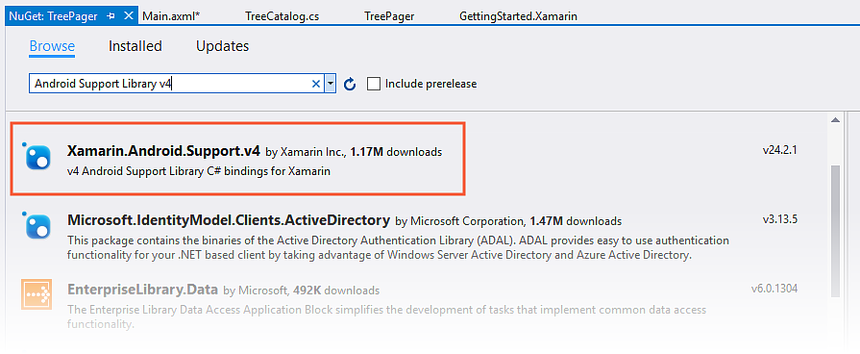
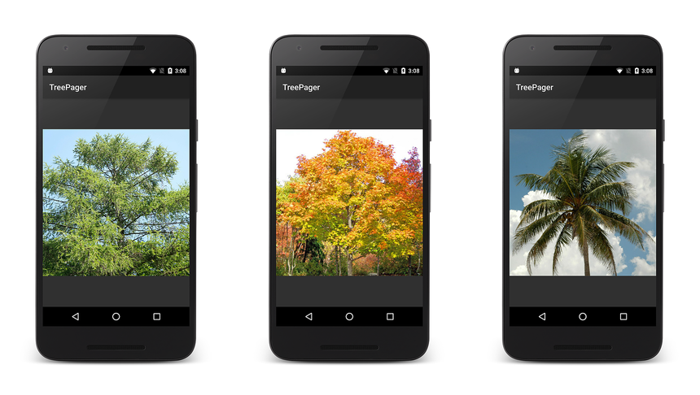
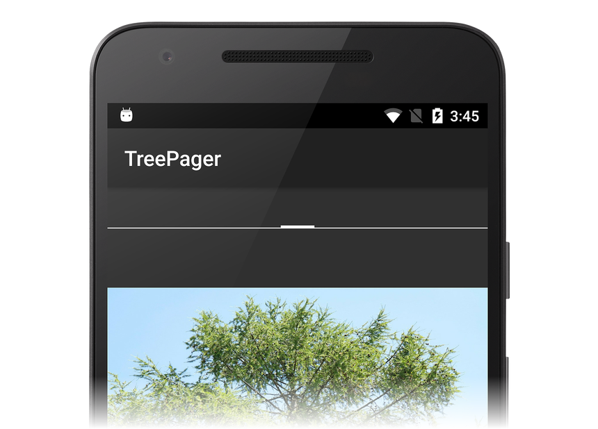

# ViewPager with Views

_ViewPager is a layout manager that lets you implement gestural navigation. Gestural navigation allows the user to swipe left and right to step through pages of data. This guide explains how to implement a swipeable UI with ViewPager and PagerTabStrip, using Views as the data pages (a subsequent guide covers how to use Fragments for the pages)._

## Overview

This guide is a walkthrough that provides a step-by-step demonstration 
how to use `ViewPager` to implement an image gallery of deciduous and 
evergreen trees. In this app, the user swipes left and right through a 
"tree catalog" to view tree images. At the top of each page of the 
catalog, the name of the tree is listed in a`PagerTabStrip`, and an 
image of the tree is displayed in an `ImageView`. An adapter is used to 
interface the `ViewPager` to the underlying data model. This app 
implements an adapter derived from `PagerAdapter`. 

Although `ViewPager`-based apps are often implemented with `Fragment`s, 
there are some relatively simple use cases where the extra complexity 
of `Fragment`s is not necessary. For example, the basic image gallery 
app illustrated in this walkthrough does not require the use of 
`Fragment`s. Because the content is static and the user only swipes 
back and forth between different images, the implementation can be kept 
simpler by using standard Android views and layouts. 

## Start an App Project

Create a new Android project called **TreePager** (see
[Hello, Android](~/android/get-started/hello-android/hello-android-quickstart.md)
for more information about creating new Android projects). 
Next, launch the NuGet Package Manager. (For more information about 
installing NuGet packages, see 
[Walkthrough: Including a NuGet in your project](/visualstudio/mac/nuget-walkthrough)). 
Find and install **Android Support Library v4**: 

[](viewpager-and-views-images/01-install-support-lib.png#lightbox)

This will also install any additional packages reaquired by **Android Support Library v4**.

## Add an Example Data Source

In this example, the tree catalog data source (represented by the 
`TreeCatalog` class) supplies the `ViewPager` with item content. 
`TreeCatalog` contains a ready-made collection of tree images and tree 
titles that the adapter will use for creating `View`s. The `TreeCatalog`
constructor requires no arguments:

```csharp
TreeCatalog treeCatalog = new TreeCatalog();
```

The collection of images in `TreeCatalog` is organized such that each 
image can be accessed by an indexer. For example, the following line of 
code retrieves the image resource ID for the third image in the 
collection: 

```csharp
int imageId = treeCatalog[2].imageId;
```

Because the implementation details of `TreeCatalog` are not relevant to 
understanding `ViewPager`, the `TreeCatalog` code is not listed here. 
The source code to `TreeCatalog` is available at 
[TreeCatalog.cs](https://github.com/xamarin/monodroid-samples/blob/master/UserInterface/TreePager/TreePager/TreeCatalog.cs). 
Download this source file (or copy and paste the code into a new 
**TreeCatalog.cs** file) and add it to your project. Also, download and 
unzip the [image files](https://github.com/xamarin/monodroid-samples/blob/master/UserInterface/TreePager/Resources/tree-images.zip?raw=true) into your 
**Resources/drawable** folder and include them in the project. 

## Create a ViewPager Layout

Open **Resources/layout/Main.axml** and replace its contents with the following XML:

```xml
<?xml version="1.0" encoding="utf-8"?>
<android.support.v4.view.ViewPager
    xmlns:android="http://schemas.android.com/apk/res/android"
    android:id="@+id/viewpager"
    android:layout_width="match_parent"
    android:layout_height="match_parent" >

</android.support.v4.view.ViewPager>
```

This XML defines a `ViewPager` that occupies the entire screen. Note that
you must use the fully-qualified name **android.support.v4.view.ViewPager**
because `ViewPager` is packaged in a support library. `ViewPager` is
available only from 
[Android Support Library v4](https://www.nuget.org/packages/Xamarin.Android.Support.v4/);
it is not available in the Android SDK. 

## Set up ViewPager

Edit **MainActivity.cs** and add the following `using` statement:

```csharp
using Android.Support.V4.View;
```

Replace the `OnCreate` method with the following code:

```csharp
protected override void OnCreate(Bundle bundle)
{
    base.OnCreate(bundle);
    SetContentView(Resource.Layout.Main);
    ViewPager viewPager = FindViewById<ViewPager>(Resource.Id.viewpager);
    TreeCatalog treeCatalog = new TreeCatalog();
}
```

This code does the following:

1. Sets the view from the **Main.axml** layout resource.

2. Retrieves a reference to the `ViewPager` from the layout.

3. Instantiates a new `TreeCatalog` as the data source.

When you build and run this code, you should see a display that 
resembles the following screenshot: 

[](viewpager-and-views-images/02-initial-screen.png#lightbox)

At this point, the `ViewPager` is empty because it is lacking an 
adapter for accessing the content in **TreeCatalog**. In the next 
section, a **PagerAdapter** is created to connect the `ViewPager` to 
the **TreeCatalog**. 

## Create the Adapter

`ViewPager` uses an adapter controller object that sits between the 
`ViewPager` and the data source (see the illustration in 
[Adapter](~/android/user-interface/controls/view-pager/index.md#adapter)). In order 
to access this data, `ViewPager` requires that you provide a custom 
adapter derived from `PagerAdapter`. This adapter populates each 
`ViewPager` page with content from the data source. Because this 
data source is app-specific, the custom adapter is the code that 
understands how to access the data. As the user swipes through pages of 
the `ViewPager`, the adapter extracts information from the data source 
and loads it into the pages for the `ViewPager` to display. 

When you implement a `PagerAdapter`, you must override the following:

- **InstantiateItem** &ndash; Creates the page (`View`) for a given 
    position and adds it to the `ViewPager`'s collection of views. 

- **DestroyItem** &ndash; Removes a page from a given position.

- **Count** &ndash; Read-only property that returns the number of 
    views (pages) available. 

- **IsViewFromObject** &ndash; Determines whether a page is
    associated with a specific key object. (This object is created
    by the `InstantiateItem` method.) In this example, the key object
    is the `TreeCatalog` data object.

Add a new file called **TreePagerAdapter.cs** and replace its contents 
with the following code: 

```csharp
using System;
using Android.App;
using Android.Runtime;
using Android.Content;
using Android.Views;
using Android.Widget;
using Android.Support.V4.View;
using Java.Lang;

namespace TreePager
{
    class TreePagerAdapter : PagerAdapter
    {
        public override int Count
        {
            get { throw new NotImplementedException(); }
        }

        public override bool IsViewFromObject(View view, Java.Lang.Object obj)
        {
            throw new NotImplementedException();
        }

        public override Java.Lang.Object InstantiateItem (View container, int position)
        {
            throw new NotImplementedException();
        }

        public override void DestroyItem(View container, int position, Java.Lang.Object view)
        {
            throw new NotImplementedException();
        }
    }
}
```

This code stubs out the essential `PagerAdapter` implementation. In the 
following sections, each of these methods is replaced with working 
code. 

### Implement the Constructor

When the app instantiates the `TreePagerAdapter`, it supplies a context 
(the `MainActivity`) and an instantiated `TreeCatalog`. Add the 
following member variables and constructor to the top of the 
`TreePagerAdapter` class in **TreePagerAdapter.cs**: 

```csharp
Context context;
TreeCatalog treeCatalog;

public TreePagerAdapter (Context context, TreeCatalog treeCatalog)
{
    this.context = context;
    this.treeCatalog = treeCatalog;
}
```

The purpose of this constructor is to store the context and 
`TreeCatalog` instance that the `TreePagerAdapter` will use. 

### Implement Count

The `Count` implementation is relatively simple: it returns the number of
trees in the tree catalog. Replace `Count` with the following code:

```csharp
public override int Count
{
    get { return treeCatalog.NumTrees; }
}
```

The `NumTrees` property of `TreeCatalog` returns the number of trees
(number of pages) in the data set.

### Implement InstantiateItem

The `InstantiateItem` method creates the page for a given position. It 
must also add the newly-created view to the `ViewPager`'s view 
collection. To make this possible, the `ViewPager` passes itself as the 
container parameter. 

Replace the `InstantiateItem` method with the following code:

```csharp
public override Java.Lang.Object InstantiateItem (View container, int position)
{
    var imageView = new ImageView (context);
    imageView.SetImageResource (treeCatalog[position].imageId);
    var viewPager = container.JavaCast<ViewPager>();
    viewPager.AddView (imageView);
    return imageView;
}
```

This code does the following:

1. Instantiates a new `ImageView` to display the tree image
    at the specified position. The app's `MainActivity` is the context 
    that will be passed to the `ImageView` constructor.

2. Sets the `ImageView` resource to the `TreeCatalog` image
    resource ID at the specified position.

3. Casts the passed container `View` to a `ViewPager` reference.
    Note that you must use `JavaCast<ViewPager>()` to properly
    perform this cast (this is needed so that Android performs
    a runtime-checked type conversion).

4. Adds the instantiated `ImageView` to the `ViewPager` and returns
    the `ImageView` to the caller.

When the `ViewPager` displays the image at `position`, it displays this 
`ImageView`. Initially, `InstantiateItem` is called twice to populate 
the first two pages with views. As the user scrolls, it is called again 
to maintain views just behind and ahead of the currently displayed item. 

### Implement DestroyItem

The `DestroyItem` method removes a page from the given position. In 
apps where the view at any given position can change, `ViewPager` must 
have some way of removing a stale view at that position before 
replacing it with a new view. In the `TreeCatalog` example, the view at 
each position does not change, so a view removed by `DestroyItem` will 
simply be re-added when `InstantiateItem` is called for that position. 
(For better efficiency, one could implement a pool to recycle `View`s 
that will be re-displayed at the same position.) 

Replace the `DestroyItem` method with the following code: 

```csharp
public override void DestroyItem(View container, int position, Java.Lang.Object view)
{
    var viewPager = container.JavaCast<ViewPager>();
    viewPager.RemoveView(view as View);
}
```

This code does the following:

1. Casts the passed container `View` into a `ViewPager` reference.

2. Casts the passed Java object (`view`) into a C# `View` (`view as View`);

3. Removes the view from the `ViewPager`. 

### Implement IsViewFromObject

As the user slides left and right through pages of content, `ViewPager` 
calls `IsViewFromObject` to verify that the child `View` at the given 
position is associated with the adapter's object for that same position 
(hence, the adapter's object is called an *object key*). For relatively 
simple apps, the association is one of identity &ndash; the adapter's 
object key at that instance is the view that was previously returned to 
the `ViewPager` via `InstantiateItem`. However for other apps, the 
object key may be some other adapter-specific class instance that is 
associated with (but not the same as) the child view that `ViewPager` 
displays at that position. Only the adapter knows whether or not the 
passed view and object key are associated. 

`IsViewFromObject` must be implemented for `PagerAdapter` to function 
properly. If `IsViewFromObject` returns `false` for a given position, 
`ViewPager` will not display the view at that position. In the 
`TreePager` app, the object key returned by `InstantiateItem` *is* the 
page `View` of a tree, so the code only has to check for identity (i.e, 
the object key and the view are one and the same). Replace 
`IsViewFromObject` with the following code: 

```csharp
public override bool IsViewFromObject(View view, Java.Lang.Object obj)
{
    return view == obj;
}
```

## Add the Adapter to the ViewPager

Now that the `TreePagerAdapter` is implemented, it's time to add it to the
`ViewPager`. In **MainActivity.cs**, add the following line of code to the
end of the `OnCreate` method:

```csharp
viewPager.Adapter = new TreePagerAdapter(this, treeCatalog);
```

This code instantiates the `TreePagerAdapter`, passing in the 
`MainActivity` as the context (`this`). The instantiated `TreeCatalog` 
is passed into the constructor's second argument. The `ViewPager`'s 
`Adapter` property is set to the instantiated `TreePagerAdapter` object; 
this plugs the `TreePagerAdapter` into the `ViewPager`. 

The core implementation is now complete &ndash; build and run the app. 
You should see the first image of the tree catalog appear on the screen 
as shown on the left in the next screenshot. Swipe left to see more 
tree views, then swipe right to move back through the tree catalog: 

[](viewpager-and-views-images/03-example-views.png#lightbox)

## Add a Pager Indicator

This minimal `ViewPager` implementation displays the images of the tree 
catalog, but it provides no indication as to where the user is within 
the catalog. The next step is to add a `PagerTabStrip`. The 
`PagerTabStrip` informs the user as to which page is displayed and 
provides navigation context by displaying a hint of the previous and 
next pages. `PagerTabStrip` is intended to be used as an indicator for 
the current page of a `ViewPager`; it scrolls and updates as the user 
swipes through each page. 

Open **Resources/layout/Main.axml** and add a `PagerTabStrip` to the layout:

```xml
<?xml version="1.0" encoding="utf-8"?>
<android.support.v4.view.ViewPager
    xmlns:android="http://schemas.android.com/apk/res/android"
    android:id="@+id/viewpager"
    android:layout_width="match_parent"
    android:layout_height="match_parent" >

    <android.support.v4.view.PagerTabStrip
          android:layout_width="match_parent"
          android:layout_height="wrap_content"
          android:layout_gravity="top"
          android:paddingBottom="10dp"
          android:paddingTop="10dp"
          android:textColor="#fff" />

</android.support.v4.view.ViewPager>
```

`ViewPager` and `PagerTabStrip` are designed to work together. When you 
declare a `PagerTabStrip` inside a `ViewPager` layout, the `ViewPager` 
will automatically find the `PagerTabStrip` and connect it to the 
adapter. When you build and run the app, you should see the empty 
`PagerTabStrip` displayed at the top of each screen: 

[](viewpager-and-views-images/04-empty-pagetabstrip-cap.png#lightbox)

### Display a Title

To add a title to each page tab, implement the `GetPageTitleFormatted` 
method in the `PagerAdapter`-derived class. `ViewPager` calls 
`GetPageTitleFormatted` (if implemented) to obtain the title string 
that describes the page at the specified position. Add the following 
method to the `TreePagerAdapter` class in **TreePagerAdapter.cs**: 

```csharp
public override Java.Lang.ICharSequence GetPageTitleFormatted(int position)
{
    return new Java.Lang.String(treeCatalog[position].caption);
}
```

This code retrieves the tree caption string from the specified page 
(position) in the tree catalog, converts it into a Java `String`, and 
returns it to the `ViewPager`. When you run the app with this new 
method, each page displays the tree caption in the `PagerTabStrip`. You 
should see the tree name at the top of the screen without an underline: 

[](viewpager-and-views-images/05-final-pagetabstrip.png#lightbox)

You can swipe back and forth to view each captioned tree image in the 
catalog. 

### PagerTitleStrip Variation

`PagerTitleStrip` is very similar to `PagerTabStrip` except that 
`PagerTabStrip` adds an underline for the currently selected tab. You 
can replace `PagerTabStrip` with `PagerTitleStrip` in the above layout 
and run the app again to see how it looks with `PagerTitleStrip`: 

[](viewpager-and-views-images/06-pagetitlestrip-example.png#lightbox)

Note that the underline is removed when you convert to 
`PagerTitleStrip`. 

## Summary

This walkthrough provided a step-by-step example of how to build a 
basic `ViewPager`-based app without using `Fragment`s. It presented an 
example data source containing images and caption strings, a 
`ViewPager` layout to display the images, and a `PagerAdapter` subclass 
that connects the `ViewPager` to the data source. To help the user 
navigate through the data set, instructions were included that explain 
how to add a `PagerTabStrip` or `PagerTitleStrip` to display the image 
caption at the top of each page. 

## Related Links

- [TreePager (sample)](/samples/xamarin/monodroid-samples/userinterface-treepager)