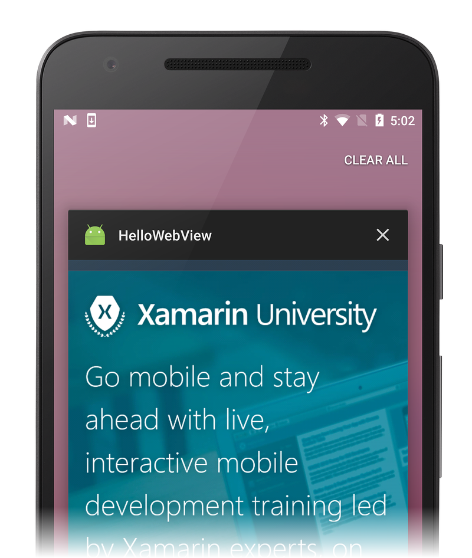
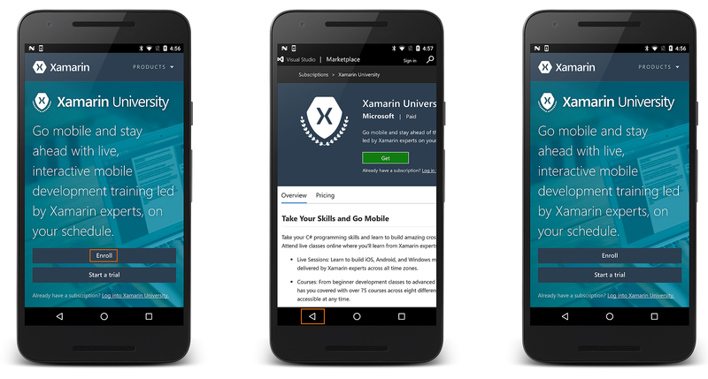

# Web View

[`WebView`](https://developer.xamarin.com/api/type/Android.Webkit.WebView/)
allows you to create your own window for viewing web pages (or even
develop a complete browser). In this tutorial, you'll create a simple
[`Activity`](https://developer.xamarin.com/api/type/Android.App.Activity/)
that can view and navigate web pages.

Create a new project named **HelloWebView**.

Open **Resources/Layout/Main.axml** and insert the following:

```xml
<?xml version="1.0" encoding="utf-8"?>
<WebView  xmlns:android="http://schemas.android.com/apk/res/android"
    android:id="@+id/webview"
    android:layout_width="fill_parent"
    android:layout_height="fill_parent" />
```

Because this application will access the Internet, you must add the
appropriate permissions to the Android manifest file. Open your
project's properties to specify which permissions your application
requires to operate. Enable the `INTERNET` permission as shown
below:


Now open **MainActivity.cs** and add a using directive for Webkit:

```csharp
using Android.Webkit;
```

At the top of the `MainActivity` class, declare a
[`WebView`](https://developer.xamarin.com/api/type/Android.Webkit.WebView/) object:

```csharp
WebView web_view;
```

When the **WebView** is asked to load a URL, it will by default
delegate the request to the default browser. To have the **WebView**
load the URL (rather than the default browser), you must subclass
`Android.Webkit.WebViewClient` and override the
`ShouldOverriderUrlLoading` method. An instance of this custom
`WebViewClient` is provided to the `WebView`. To do this, add the
following nested `HelloWebViewClient` class inside `MainActivity`:

```csharp
public class HelloWebViewClient : WebViewClient
{
    public override bool ShouldOverrideUrlLoading (WebView view, string url)
    {
        view.LoadUrl(url);
        return false;
    }
}
```

When `ShouldOverrideUrlLoading` returns `false`, it signals to Android
that the current `WebView` instance handled the request and that no
further action is necessary. 

If you are targeting API level 24 or later, use the overload of
`ShouldOverrideUrlLoading` that takes an `IWebResourceRequest` for
the second argument instead of a `string`:

```csharp
public class HelloWebViewClient : WebViewClient
{
    // For API level 24 and later
    public override bool ShouldOverrideUrlLoading (WebView view, IWebResourceRequest request)
    {
        view.LoadUrl(request.Url.ToString());
        return false;
    }
}
```

Next, use the following code for the
[`OnCreate()`](https://developer.xamarin.com/api/member/Android.App.Activity.OnCreate/(Android.OS.Bundle))
method:

```csharp
protected override void OnCreate (Bundle bundle)
{
    base.OnCreate (bundle);

    // Set our view from the "main" layout resource
    SetContentView (Resource.Layout.Main);

    web_view = FindViewById<WebView> (Resource.Id.webview);
    web_view.Settings.JavaScriptEnabled = true;
    web_view.SetWebViewClient(new HelloWebViewClient());
    web_view.LoadUrl ("https://www.xamarin.com/university");
}
```

This initializes the member
[`WebView`](https://developer.xamarin.com/api/type/Android.Webkit.WebView/) with the one from
the
[`Activity`](https://developer.xamarin.com/api/type/Android.App.Activity/) layout and enables
JavaScript for the
[`WebView`](https://developer.xamarin.com/api/type/Android.Webkit.WebView/) with
[`JavaScriptEnabled`](https://developer.xamarin.com/api/property/Android.Webkit.WebSettings.JavaScriptEnabled/)
`= true` (see the
[Call C\# from JavaScript](https://github.com/xamarin/recipes/tree/master/Recipes/android/controls/webview/call_csharp_from_javascript)
recipe for information about how to call C\# functions from
JavaScript). Finally, an initial web page is loaded with
[`LoadUrl(String)`](https://developer.xamarin.com/api/type/Android.Webkit.WebView/%2fM%2fLoadUrl).

Build and run the app. You should see a simple web page viewer app
as the one seen in the following screenshot:

[](web-view-images/02-simple-webview-app.png#lightbox)

To handle the **BACK** button key press, add the following using
statement:

```csharp
using Android.Views;
```

Next, add the following method inside the `HelloWebView` Activity:

```csharp
public override bool OnKeyDown (Android.Views.Keycode keyCode, Android.Views.KeyEvent e)
{
    if (keyCode == Keycode.Back && web_view.CanGoBack ())
    {
        web_view.GoBack ();
        return true;
    }
    return base.OnKeyDown (keyCode, e);
}
```

This
[`OnKeyDown(int, KeyEvent)`](https://developer.xamarin.com/api/member/Android.App.Activity.OnKeyDown/(Android.Views.Keycode%2cAndroid.Views.KeyEvent))
callback method will be called whenever a button is pressed while
the Activity is running. The condition inside uses the
[`KeyEvent`](https://developer.xamarin.com/api/type/Android.Views.KeyEvent/) to check whether
the key pressed is the **BACK** button and whether the
[`WebView`](https://developer.xamarin.com/api/type/Android.Webkit.WebView/) is actually capable
of navigating back (if it has a history). If both are true, then
the
[`GoBack()`](https://developer.xamarin.com/api/member/Android.Webkit.WebView.GoBack/) method is
called, which will navigate back one step in the
[`WebView`](https://developer.xamarin.com/api/type/Android.Webkit.WebView/) history. Returning
`true` indicates that the event has been handled. If this condition
is not met, then the event is sent back to the system.

Run the application again. You should now be able to follow links and
navigate back through the page history:

[](web-view-images/03-back-button.png#lightbox)


*Portions of this page are modifications based on work created and shared by the
Android Open Source Project and used according to terms described in the*
[*Creative Commons 2.5 Attribution License*](http://creativecommons.org/licenses/by/2.5/).


## Related Links

- [Call C# from JavaScript](https://github.com/xamarin/recipes/tree/master/Recipes/android/controls/webview/call_csharp_from_javascript)
- [Android.Webkit.WebView](https://developer.xamarin.com/api/type/Android.Webkit.WebView)
- [KeyEvent](https://developer.xamarin.com/api/type/Android.Webkit.WebView/Client)
