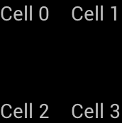
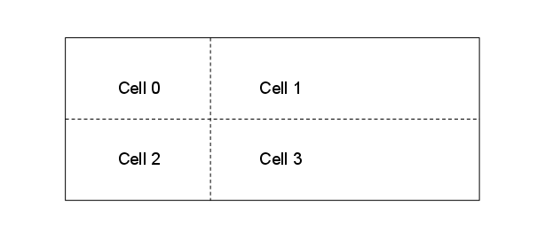
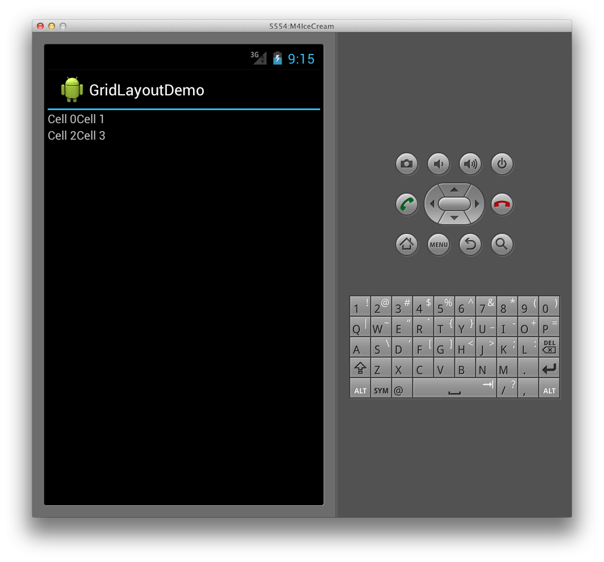
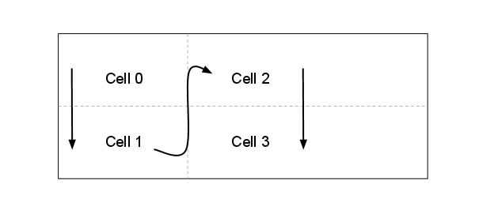
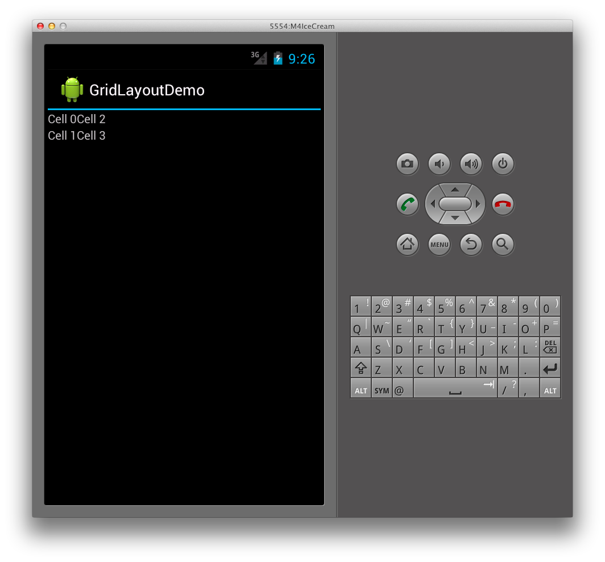
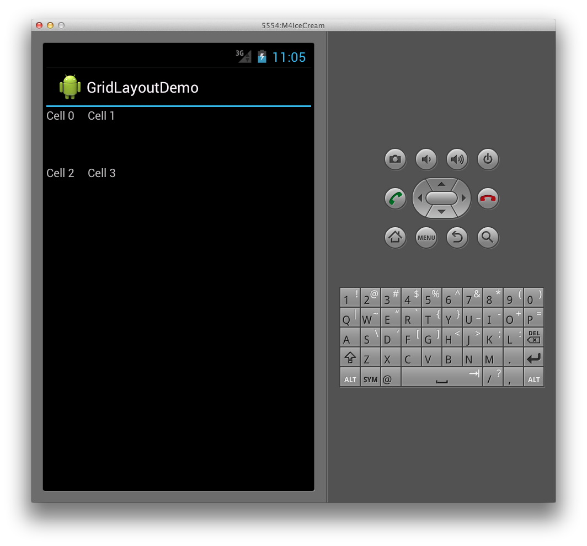
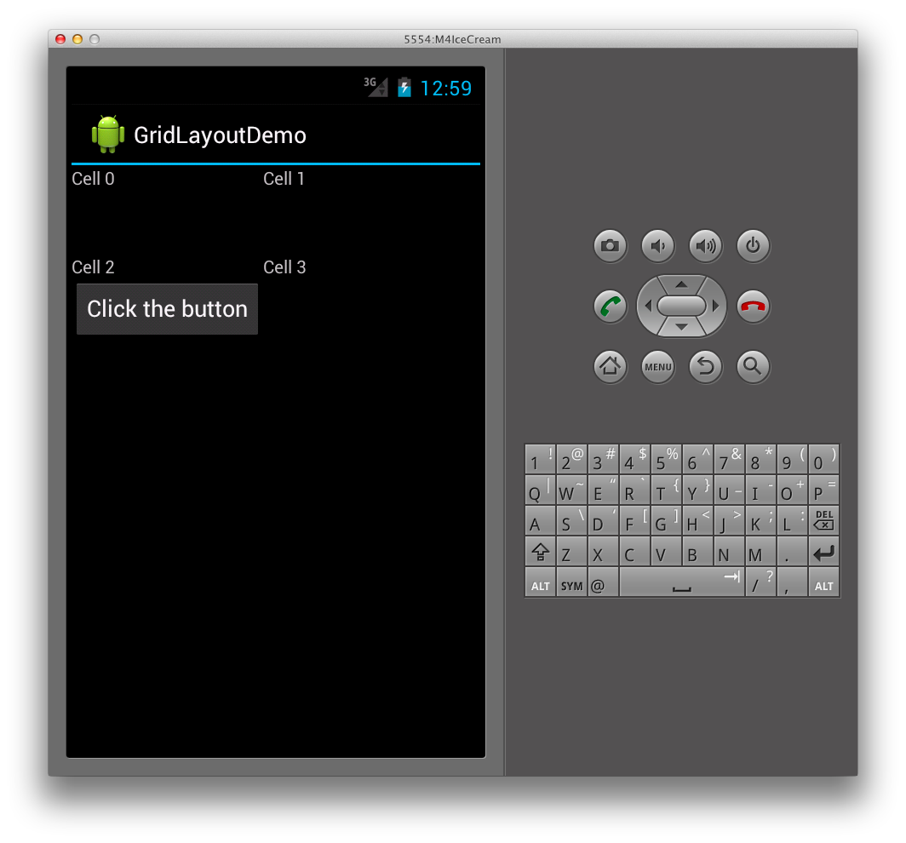
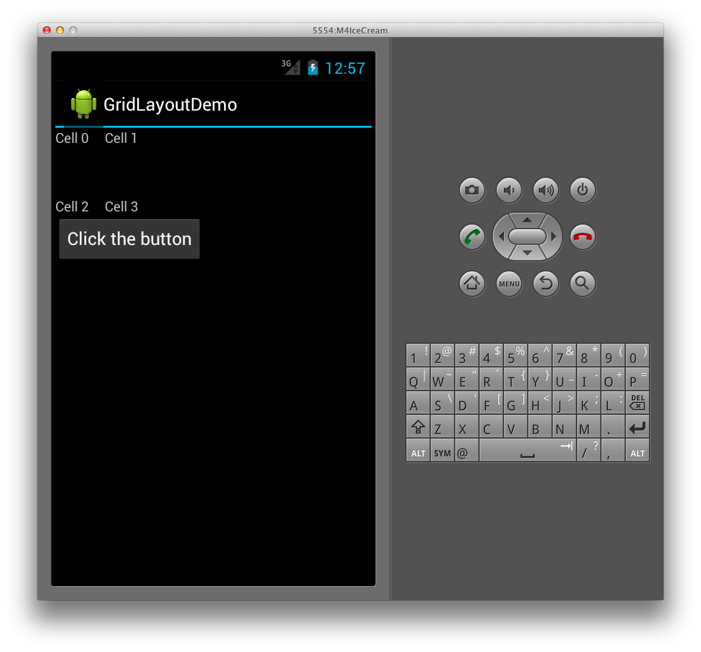

# Xamarin.Android GridLayout

The `GridLayout` is a new `ViewGroup` subclass that
supports laying out views in a 2D grid, similar to an HTML table, as shown
below:

 [](grid-layout-images/21-gridlayoutcropped.png#lightbox)

 `GridLayout` works with a flat-view hierarchy, where child views
set their locations in the grid by specifying the rows and columns they should
be in. This way, the *GridLayout* is able to position views in the grid
without requiring that any intermediate views provide a table structure, such as
seen in the table rows used in the TableLayout. By maintaining a flat hierarchy, *GridLayout* is able to more swiftly layout its child views. Let’s take
a look at an example to illustrate what this concept actually means in code.

## Creating a Grid Layout

The following XML adds several `TextView` controls to a *GridLayout*.

```xml
<?xml version="1.0" encoding="utf-8"?>
<GridLayout xmlns:android="http://schemas.android.com/apk/res/android"
        android:layout_width="match_parent"
        android:layout_height="match_parent"    
        android:rowCount="2"
        android:columnCount="2">
     <TextView
            android:text="Cell 0"
            android:textSize="14dip" />
     <TextView
            android:text="Cell 1"
            android:textSize="14dip" />
     <TextView
            android:text="Cell 2"
            android:textSize="14dip" />
     <TextView
            android:text="Cell 3"
            android:textSize="14dip" />
</GridLayout>
```

The layout will adjust the row and column sizes so that the cells can fit
their content, as illustrated by the following diagram:

 [](grid-layout-images/gridlayout-cells.png#lightbox)

This results in the following user interface when run in an application:

 [](grid-layout-images/01-gridlayout.png#lightbox)

## Specifying Orientation

Notice in the XML above, each `TextView` does not specify a row or
column. When these are not specified, the `GridLayout` assigns each
child view in order, based upon the orientation. For example, let’s change the
GridLayout’s orientation from the default, which is horizontal, to vertical
like this:

```xml
<GridLayout xmlns:android="http://schemas.android.com/apk/res/android"
        android:layout_width="match_parent"
        android:layout_height="match_parent"    
        android:rowCount="2"
        android:columnCount="2"
        android:orientation="vertical">
</GridLayout>
```

Now, the `GridLayout` will position the cells from top to bottom
in each column, instead of left to right, as shown below:

 [](grid-layout-images/gridlayoutorientation.png#lightbox)

This results in the following user interface at runtime:

 [](grid-layout-images/02-gridlayout.png#lightbox)

### Specifying Explicit Position

If we want to explicitly control the positions of the child views in the `GridLayout`, we can set their `layout_row` and `layout_column` attributes. For example, the following XML will
result in the layout shown in the first screenshot (shown above), regardless of
the orientation.

```xml
<?xml version="1.0" encoding="utf-8"?>
<GridLayout xmlns:android="http://schemas.android.com/apk/res/android"
        android:layout_width="match_parent"
        android:layout_height="match_parent"    
        android:rowCount="2"
        android:columnCount="2">
     <TextView
            android:text="Cell 0"
            android:textSize="14dip"
            android:layout_row="0"
            android:layout_column="0" />
     <TextView
            android:text="Cell 1"
            android:textSize="14dip"
            android:layout_row="0"
            android:layout_column="1" />
     <TextView
            android:text="Cell 2"
            android:textSize="14dip"
            android:layout_row="1"
            android:layout_column="0" />
     <TextView
            android:text="Cell 3"
            android:textSize="14dip"
            android:layout_row="1"
            android:layout_column="1"  />
</GridLayout>
```

### Specifying spacing

We have a couple of options that will provide spacing between the child views
of the `GridLayout`. We can use the `layout_margin`
attribute to set the margin on each child view directly, as shown below

```xml
<TextView
            android:text="Cell 0"
            android:textSize="14dip"
            android:layout_row="0"
            android:layout_column="0"
            android:layout_margin="10dp" />
```

Additionally, in Android 4, a new general-purpose spacing view called `Space` is now available. To use it, simply add it as a child view.
For example, the XML below adds an additional row to the `GridLayout`
by setting its `rowcount` to 3, and adds a `Space` view
that provides spacing between the `TextViews`.

```xml
<?xml version="1.0" encoding="utf-8"?>
<GridLayout xmlns:android="http://schemas.android.com/apk/res/android"
        android:layout_width="match_parent"
        android:layout_height="match_parent"    
        android:rowCount="3"
        android:columnCount="2"
        android:orientation="vertical">
     <TextView
            android:text="Cell 0"
            android:textSize="14dip"
            android:layout_row="0"
            android:layout_column="0" />
     <TextView
            android:text="Cell 1"
            android:textSize="14dip"
            android:layout_row="0"        
            android:layout_column="1" />
     <Space
            android:layout_row="1"
            android:layout_column="0"
            android:layout_width="50dp"         
            android:layout_height="50dp" />    
     <TextView
            android:text="Cell 2"
            android:textSize="14dip"
            android:layout_row="2"        
            android:layout_column="0" />
     <TextView
            android:text="Cell 3"
            android:textSize="14dip"
            android:layout_row="2"        
            android:layout_column="1" />
</GridLayout>
```

This XML creates spacing in the `GridLayout` as shown below:

 [](grid-layout-images/03-gridlayout.png#lightbox)

The benefit of using the new `Space` view is that it allows for
spacing and doesn’t require us to set attributes on every child view.

### Spanning Columns and Rows

The `GridLayout` also supports cells that span multiple columns
and rows. For example, say we add another row containing a button to the `GridLayout` as shown below:

```xml
<?xml version="1.0" encoding="utf-8"?>
<GridLayout xmlns:android="http://schemas.android.com/apk/res/android"
        android:layout_width="match_parent"
        android:layout_height="match_parent"    
        android:rowCount="4"
        android:columnCount="2"
        android:orientation="vertical">
     <TextView
            android:text="Cell 0"
            android:textSize="14dip"
            android:layout_row="0"
            android:layout_column="0" />
     <TextView
            android:text="Cell 1"
            android:textSize="14dip"
            android:layout_row="0"        
            android:layout_column="1" />
     <Space
            android:layout_row="1"
            android:layout_column="0"
            android:layout_width="50dp"        
            android:layout_height="50dp" />   
     <TextView
            android:text="Cell 2"
            android:textSize="14dip"
            android:layout_row="2"        
            android:layout_column="0" />
     <TextView
            android:text="Cell 3"
            android:textSize="14dip"        
            android:layout_row="2"        
            android:layout_column="1" />
     <Button
            android:id="@+id/myButton"
            android:text="@string/hello"        
            android:layout_row="3"
            android:layout_column="0" />
</GridLayout>
```

This will result in the first column of the `GridLayout` being
stretched to accommodate the size of the button, as we see here:

[](grid-layout-images/04-gridlayout.png#lightbox)

To keep the first column from stretching, we can set the button to
span two columns by setting its columnspan like this:

```xml
<Button
    android:id="@+id/myButton"
    android:text="@string/hello"       
    android:layout_row="3"
    android:layout_column="0"
    android:layout_columnSpan="2" />
```

Doing this results in a layout for the `TextViews` that is similar
to the layout we had earlier, with the button added to the bottom of the `GridLayout` as shown below:

 [](grid-layout-images/05-gridlayout.png#lightbox)

## Related Links

- [GridLayoutDemo (sample)](/samples/xamarin/monodroid-samples/gridlayoutdemo)