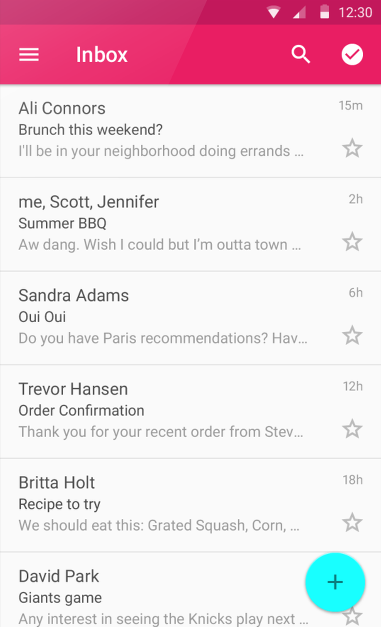
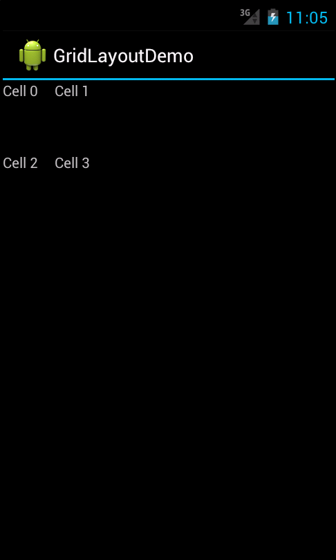

# Layouts

Layouts are used to arrange the elements that make up the UI interface
of a screen (such as an Activity). The following sections explain how
to use the most commonly-used layouts in Xamarin.Android apps.

-   [LinearLayout](~/android/user-interface/layouts/linear-layout.md)
    is a view group that displays child view elements in
    a linear direction, either vertically or horizontally.

    

-   [RelativeLayout](~/android/user-interface/layouts/relative-layout.md)
    is view group that displays child view elements in
    a relative position. The position of a view can be specified as
    relative to sibling elements.

    

-   [TableLayout](~/android/user-interface/layouts/table-layout.md)
    is a view group that displays child view elements in rows and
    columns.

    

-   [RecyclerView](~/android/user-interface/layouts/recycler-view/index.md)
    is a UI element that displays a collection of items in
    a list or a grid, enabling the user to scroll through the collection.

    

-   [ListView](~/android/user-interface/layouts/list-view/index.md)
    is a view group that creates a list of scrollable items. The
    list items are automatically inserted into the list using a list
    adapter. The `ListView` is an important UI component of Android
    applications because it is used everywhere from short lists of menu
    options to long lists of contacts or internet favorites. It provides a
    simple way to present a scrolling list of rows that can either be
    formatted with a built-in style or customized extensively. A ListView
    instance requires an Adapter to feed it with data contained in row
    views.

    

-   [GridView](~/android/user-interface/layouts/grid-view.md)
    is a UI element that displays items in a two-dimensional
    grid that can be scrolled.

    

-   [GridLayout](~/android/user-interface/layouts/grid-layout.md)
    is a view group that supports laying out views in a 2D
    grid, similar to an HTML table.

    

-   [Tabbed Layouts](~/android/user-interface/layouts/tab-layout/index.md)
    are a popular user interface pattern in mobile applications
    because of their simplicity and usability. They provide a
    consistent, easy way to navigate between various screens in an
    application.

    
 
