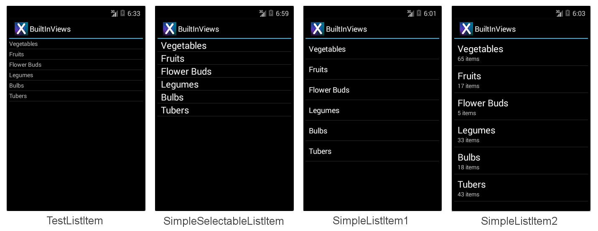
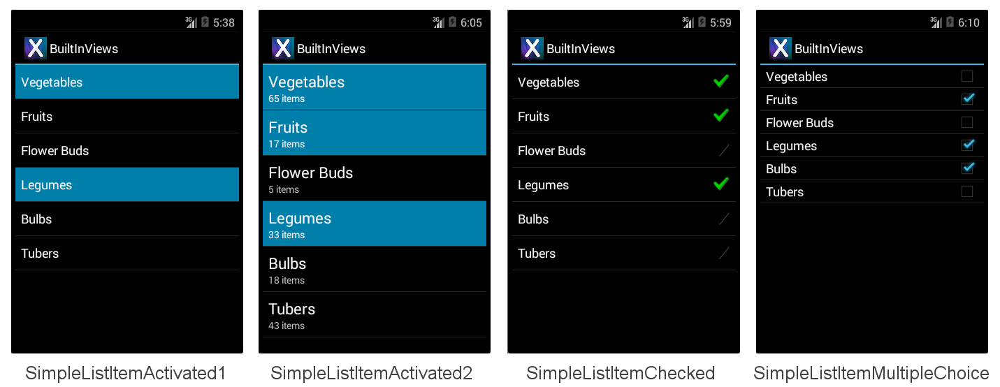
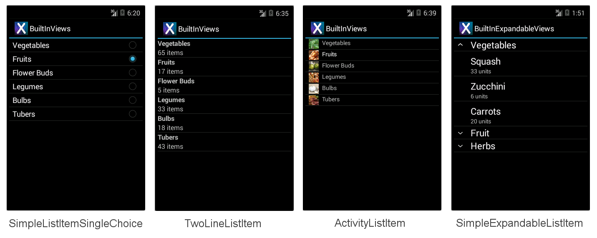
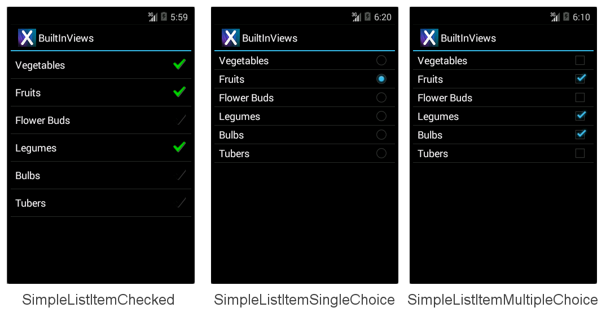
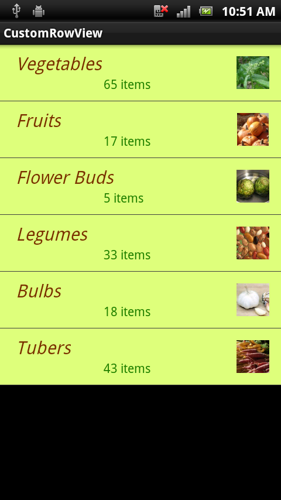
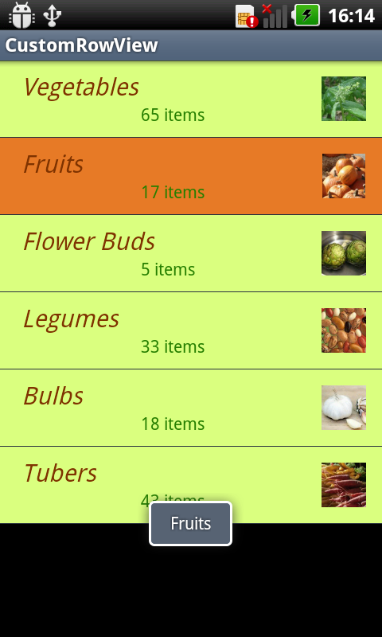

# Customizing a ListView's Appearance with Xamarin.Android

The appearance of a ListView is dictated by the layout of the rows being
displayed. To change the appearance of a `ListView`, use a
different row layout.

## Built-in Row Views

There are twelve built-in Views that can be referenced using
**Android.Resource.Layout**:

- **TestListItem** &ndash; Single line of text with minimal formatting.

- **SimpleListItem1** &ndash; Single line of text.

- **SimpleListItem2** &ndash; Two lines of text.

- **SimpleSelectableListItem** &ndash; Single line of text that
  supports single or multiple item selection (added in API level 11).

- **SimpleListItemActivated1** &ndash; Similar to SimpleListItem1, but
  the background color indicates when a row is selected (added in API
  level 11).

- **SimpleListItemActivated2** &ndash; Similar to SimpleListItem2, but
  the background color indicates when a row is selected (added in API
  level 11).

- **SimpleListItemChecked** &ndash; Displays check marks to indicate
  selection.

- **SimpleListItemMultipleChoice** &ndash; Displays check boxes to
  indicate multiple-choice selection.

- **SimpleListItemSingleChoice** &ndash; Displays radio buttons to
  indicate mutually-exclusive selection.

- **TwoLineListItem** &ndash; Two lines of text.

- **ActivityListItem** &ndash; Single line of text with an image.

- **SimpleExpandableListItem** &ndash; Groups rows by categories, and
  each group can be expanded or collapsed.

Each built-in row view has a built in style associated with it. These
screenshots show how each view appears:

[](customizing-appearance-images/builtinviews.png#lightbox)

[](customizing-appearance-images/builtinviews-2.png#lightbox)

[](customizing-appearance-images/builtinviews-3.png#lightbox)

The **BuiltInViews/HomeScreenAdapter.cs** sample file (in the
**BuiltInViews** solution) contains the code to produce the
non-expandable list item screens. The view is set in the `GetView`
method like this:

```csharp
view = context.LayoutInflater.Inflate(Android.Resource.Layout.SimpleListItem1, null);
```

The view's properties can then be set by referencing the standard
control identifiers `Text1`, `Text2` and `Icon` under
`Android.Resource.Id` (do not set properties that the view does not
contain or an exception will be thrown):

```csharp
view.FindViewById<TextView>(Android.Resource.Id.Text1).Text = item.Heading;
view.FindViewById<TextView>(Android.Resource.Id.Text2).Text = item.SubHeading;
view.FindViewById<ImageView>(Android.Resource.Id.Icon).SetImageResource(item.ImageResourceId); // only use with ActivityListItem
```

The **BuiltInExpandableViews/ExpandableScreenAdapter.cs** sample file
(in the **BuiltInViews** solution) contains the code to produce the
SimpleExpandableListItem screen. The group view is set in the
`GetGroupView` method like this:

```csharp
view = context.LayoutInflater.Inflate(Android.Resource.Layout.SimpleExpandableListItem1, null);
```

The child view is set in the `GetChildView` method like this:

```csharp
view = context.LayoutInflater.Inflate(Android.Resource.Layout.SimpleExpandableListItem2, null);
```

The properties for the group view and the child view can then be set
by referencing the standard `Text1` and `Text2`
control identifiers as shown above. The SimpleExpandableListItem
screenshot (shown above) provides an example of a one-line group
view (SimpleExpandableListItem1) and a two-line child view
(SimpleExpandableListItem2). Alternately, the group view can be
configured for two lines (SimpleExpandableListItem2) and the child view
can be configured for one line (SimpleExpandableListItem1), or both
group view and child view can have the same number of lines. 

## Accessories

Rows can have accessories added to the right of the view to
indicate selection state:

- **SimpleListItemChecked** &ndash; Creates a single-selection list with a
  check as the indicator.

- **SimpleListItemSingleChoice** &ndash; Creates radio-button-type lists
  where only one choice is possible.

- **SimpleListItemMultipleChoice** &ndash; Creates checkbox-type lists
  where multiple choices are possible.

The aforementioned accessories are illustrated in the following
screens, in their respective order:

[](customizing-appearance-images/accessories.png#lightbox)

To display one of these accessories pass the required layout resource ID to
the adapter then manually set the selection state for the required rows. This
line of code shows how to create and assign an `Adapter` using one of 
these layouts:

```csharp
ListAdapter = new ArrayAdapter<String>(this, Android.Resource.Layout.SimpleListItemChecked, items);
```

The `ListView` itself supports different selection modes, regardless of
the accessory being displayed. To avoid confusion, use `Single`
selection mode with `SingleChoice` accessories and the `Checked` or 
`Multiple` mode with the `MultipleChoice` style. The selection mode is
controlled by the `ChoiceMode` property of the `ListView`.

### Handling API Level

Earlier versions of Xamarin.Android implemented enumerations as integer
properties. The latest version has introduced proper .NET enumeration
types which makes it much easier to discover the potential options.

Depending on which API level you are targeting, `ChoiceMode` is either
an integer or an enumeration. The sample file
**AccessoryViews/HomeScreen.cs** has a block commented out if you wish
to target the Gingerbread API:

```csharp
// For targeting Gingerbread the ChoiceMode is an int, otherwise it is an
// enumeration.

lv.ChoiceMode = Android.Widget.ChoiceMode.Single; // 1
//lv.ChoiceMode = Android.Widget.ChoiceMode.Multiple; // 2
//lv.ChoiceMode = Android.Widget.ChoiceMode.None; // 0

// Use this block if targeting Gingerbread or lower
/*
lv.ChoiceMode = 1; // Single
//lv.ChoiceMode = 0; // none
//lv.ChoiceMode = 2; // Multiple
//lv.ChoiceMode = 3; // MultipleModal
*/
```

### Selecting Items Programmatically

Manually setting which items are 'selected' is done with the
`SetItemChecked` method (it can be called multiple times for multiple
selection):

```csharp
// Set the initially checked row ("Fruits")
lv.SetItemChecked(1, true);
```

The code also needs to detect single selections differently from
multiple selections. To determine which row has been selected in
`Single` mode use the `CheckedItemPosition` integer property:

```csharp
FindViewById<ListView>(Android.Resource.Id.List).CheckedItemPosition
```

To determine which rows have been selected in `Multiple` mode you need
to loop through the `CheckedItemPositions` `SparseBooleanArray`. A
sparse array is like a dictionary that only contains entries where the
value has been changed, so you must traverse the entire array looking
for `true` values to know what has been selected in the list as
illustrated in the following code snippet:

```csharp
var sparseArray = FindViewById<ListView>(Android.Resource.Id.List).CheckedItemPositions;
for (var i = 0; i < sparseArray.Size(); i++ )
{
   Console.Write(sparseArray.KeyAt(i) + "=" + sparseArray.ValueAt(i) + ",");
}
Console.WriteLine();
```

## Creating Custom Row Layouts

The four built-in row views are very simple. To display more complex
layouts (such as a list of emails, or tweets, or contact info) a custom
view is required. Custom views are generally declared as AXML files in
the **Resources/Layout** directory and then loaded using their resource
Id by a custom adapter. The view can contain any number of display
classes (such as TextViews, ImageViews and other controls) with custom
colors, fonts and layout.

This example differs from the previous examples in a number of ways:

- Inherits from `Activity` , not `ListActivity` . You can customize
   rows for any `ListView` , however other controls can also be
   included in an `Activity` layout (such as a heading, buttons or
   other user interface elements). This example adds a heading above
   the `ListView` to illustrate.

- Requires an AXML layout file for the screen; in the previous
   examples the `ListActivity` does not require a layout file. This
   AXML contains a `ListView` control declaration.

- Requires an AXML layout file to render each row. This AXML file
   contains the text and image controls with custom font and color
   settings.

- Uses an optional custom selector XML file to set the appearance of
   the row when it is selected.

- The `Adapter` implementation returns a custom layout from the
   `GetView` override.

- `ItemClick` must be declared differently (an event handler is
   attached to `ListView.ItemClick` rather than an overriding
   `OnListItemClick` in `ListActivity`).

These changes are detailed below, starting with creating the activity's
view and the custom row view and then covering the modifications to the
Adapter and Activity to render them.

### Adding a ListView to an Activity Layout

Because `HomeScreen` no longer inherits from `ListActivity` it doesn't
have a default view, so a layout AXML file must be created for the
HomeScreen's view. For this example, the view will have a heading
(using a `TextView`) and a `ListView` to display data. The layout is
defined in the **Resources/Layout/HomeScreen.axml** file which is shown
here:

```xml
<?xml version="1.0" encoding="utf-8"?>
<LinearLayout xmlns:android="http://schemas.android.com/apk/res/android"
   android:orientation="vertical"
   android:layout_width="fill_parent"
   android:layout_height="fill_parent">
    <TextView android:id="@+id/Heading"
        android:text="Vegetable Groups"
        android:layout_width="fill_parent"
        android:layout_height="wrap_content"
        android:background="#00000000"
        android:textSize="30dp"
        android:textColor="#FF267F00"
        android:textStyle="bold"
        android:padding="5dp"
    />
    <ListView android:id="@+id/List"
        android:layout_width="fill_parent"
        android:layout_height="fill_parent"
        android:cacheColorHint="#FFDAFF7F"
    />
</LinearLayout>
```

The benefit of using an `Activity` with a custom layout (instead of a
`ListActivity`) lies in being able to add additional controls to the
screen, such as the heading `TextView` in this example.

### Creating a Custom Row Layout

Another AXML layout file is required to contain the custom layout for
each row that will appear in the list view. In this example the row
will have a green background, brown text and right-aligned image. The
Android XML markup to declare this layout is described in
**Resources/Layout/CustomView.axml**:

```xml
<?xml version="1.0" encoding="utf-8"?>
<RelativeLayout  xmlns:android="http://schemas.android.com/apk/res/android"
   android:layout_width="fill_parent"
   android:layout_height="wrap_content"
   android:background="#FFDAFF7F"
   android:padding="8dp">
    <LinearLayout android:id="@+id/Text"
       android:orientation="vertical"
       android:layout_width="wrap_content"
       android:layout_height="wrap_content"
       android:paddingLeft="10dip">
        <TextView
         android:id="@+id/Text1"
         android:layout_width="wrap_content"
         android:layout_height="wrap_content"
         android:textColor="#FF7F3300"
         android:textSize="20dip"
         android:textStyle="italic"
         />
        <TextView
         android:id="@+id/Text2"
         android:layout_width="wrap_content"
         android:layout_height="wrap_content"
         android:textSize="14dip"
         android:textColor="#FF267F00"
         android:paddingLeft="100dip"
         />
    </LinearLayout>
    <ImageView
        android:id="@+id/Image"
        android:layout_width="48dp"
        android:layout_height="48dp"
        android:padding="5dp"
        android:src="@drawable/icon"
        android:layout_alignParentRight="true" />
</RelativeLayout >
```

While a custom row layout can contain many different controls,
scrolling performance can be affected by complex designs and using
images (especially if they have to be loaded over the network). See
Google's article for more information on addressing scrolling
performance issues.

### Referencing a Custom Row View

The implementation of the custom adapter example is in
`HomeScreenAdapter.cs`. The key method is `GetView` where it loads the
custom AXML using the resource ID `Resource.Layout.CustomView`, and
then sets properties on each of the controls in the view before
returning it. The complete adapter class is shown:

```csharp
public class HomeScreenAdapter : BaseAdapter<TableItem> {
   List<TableItem> items;
   Activity context;
   public HomeScreenAdapter(Activity context, List<TableItem> items)
       : base()
   {
       this.context = context;
       this.items = items;
   }
   public override long GetItemId(int position)
   {
       return position;
   }
   public override TableItem this[int position]
   {
       get { return items[position]; }
   }
   public override int Count
   {
       get { return items.Count; }
   }
   public override View GetView(int position, View convertView, ViewGroup parent)
   {
       var item = items[position];
       View view = convertView;
       if (view == null) // no view to re-use, create new
           view = context.LayoutInflater.Inflate(Resource.Layout.CustomView, null);
       view.FindViewById<TextView>(Resource.Id.Text1).Text = item.Heading;
       view.FindViewById<TextView>(Resource.Id.Text2).Text = item.SubHeading;
       view.FindViewById<ImageView>(Resource.Id.Image).SetImageResource(item.ImageResourceId);
       return view;
   }
}
```

### Referencing the Custom ListView in the Activity

Because the `HomeScreen` class now inherits from `Activity`, a
`ListView` field is declared in the class to hold a reference to the
control declared in the AXML:

```csharp
ListView listView;
```

The class must then load the Activity's custom layout AXML using the
`SetContentView` method. It can then find the `ListView` control in the
layout then creates and assigns the adapter and assigns the click
handler. The code for the OnCreate method is shown here:

```csharp
SetContentView(Resource.Layout.HomeScreen); // loads the HomeScreen.axml as this activity's view
listView = FindViewById<ListView>(Resource.Id.List); // get reference to the ListView in the layout

// populate the listview with data
listView.Adapter = new HomeScreenAdapter(this, tableItems);
listView.ItemClick += OnListItemClick;  // to be defined
```

Finally the `ItemClick` handler must be defined; in this case it just
displays a `Toast` message:

```csharp
void OnListItemClick(object sender, AdapterView.ItemClickEventArgs e)
{
   var listView = sender as ListView;
   var t = tableItems[e.Position];
   Android.Widget.Toast.MakeText(this, t.Heading, Android.Widget.ToastLength.Short).Show();
}
```

The resulting screen looks like this:

[](customizing-appearance-images/customrowview.png#lightbox)

### Customizing the Row Selector Color

When a row is touched it should be highlighted for user feedback. When
a custom view specifies as background color as **CustomView.axml** does,
it also overrides the selection highlight. This line of code in
**CustomView.axml** sets the background to light green, but it also means
there is no visual indicator when the row is touched:

```xml
android:background="#FFDAFF7F"
```

To re-enable the highlight behavior, and also to customize the color
that is used, set the background attribute to a custom selector
instead. The selector will declare both the default background color as
well as the highlight color. The file
**Resources/Drawable/CustomSelector.xml** contains the following
declaration:

```xml
<?xml version="1.0" encoding="utf-8"?>
<selector xmlns:android="http://schemas.android.com/apk/res/android">
<item android:state_pressed="false"
  android:state_selected="false"
  android:drawable="@color/cellback" />
<item android:state_pressed="true" >
  <shape>
     <gradient
      android:startColor="#E77A26"
        android:endColor="#E77A26"
        android:angle="270" />
  </shape>
</item>
<item android:state_selected="true"
  android:state_pressed="false"
  android:drawable="@color/cellback" />
</selector>
```

To reference the custom selector, change the background attribute in
**CustomView.axml** to:

```xml
android:background="@drawable/CustomSelector"
```

A selected row and the corresponding `Toast` message now looks like
this:

[](customizing-appearance-images/customselectcolor.png#lightbox)

### Preventing Flickering on Custom Layouts

Android attempts to improve the performance of `ListView` scrolling by
caching layout information. If you have long scrolling lists of data
you should also set the `android:cacheColorHint` property on the
`ListView` declaration in the Activity's AXML definition (to the same
color value as your custom row layout's background). Failure to
include this hint could result in a 'flicker' as the user scrolls
through a list with custom row background colors.

## Related Links

- [BuiltInViews (sample)](/samples/xamarin/monodroid-samples/builtinviews)
- [AccessoryViews (sample)](/samples/xamarin/monodroid-samples/accessoryviews)
- [CustomRowView (sample)](/samples/xamarin/monodroid-samples/customrowview)