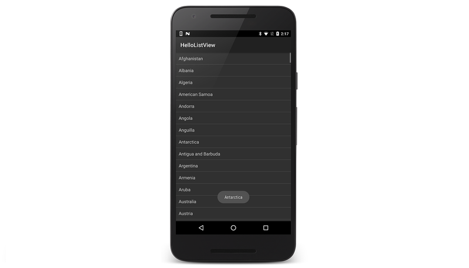
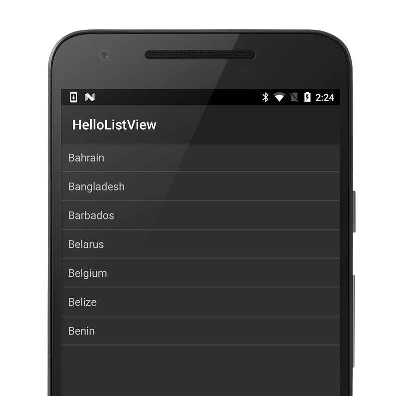

# Xamarin.Android ListView

_ListView is an important UI component of Android applications; it is used everywhere from short lists of menu options to long lists of contacts or internet favorites. It provides a simple way to present a scrolling list of rows that can either be formatted with a built-in style or customized extensively._

## Overview

List views and adapters are included in the most fundamental building
blocks of Android Applications. The `ListView` class provides a
flexible way to present data, whether it is a short menu or a long
scrolling list. It provides usability features like fast scrolling,
indexes and single or multiple selection to help you build
mobile-friendly user interfaces for your applications. A `ListView`
instance requires an *Adapter* to feed it with data contained in row
views.

This guide explains how to implement `ListView` and the various
`Adapter` classes in Xamarin.Android. It also demonstrates how to
customize the appearance of a `ListView`, and it discusses the
importance of row re-use to reduce memory consumption. There is also
some discussion of how the Activity Lifecycle affects `ListView` and
`Adapter` use. If you are working on cross-platform applications with
Xamarin.iOS, the `ListView` control is structurally similar to the iOS
`UITableView` (and the Android `Adapter` is similar to the
`UITableViewSource`).

First, a short tutorial introduces the `ListView` with a basic code
example. Next, links to more advanced topics are provided to help you
use `ListView` in real-world apps.

> [!NOTE]
> The `RecyclerView` widget is a more advanced and
flexible version of `ListView`. Because `RecyclerView` is designed to
be the successor to `ListView` (and `GridView`), we recommend that you
use `RecyclerView` rather than `ListView` for new app development. For
more information, see
[RecyclerView](~/android/user-interface/layouts/recycler-view/index.md).

## ListView Tutorial

[`ListView`](xref:Android.Widget.ListView) is a
[`ViewGroup`](xref:Android.Views.ViewGroup)
that creates a list of scrollable items. The list items are
automatically inserted to the list using a
[`IListAdapter`](xref:Android.Widget.IListAdapter).

In this tutorial, you'll create a scrollable list of country/region names that
are read from a string array. When a list item is selected, a toast
message will display the position of the item in the list.

Start a new project named **HelloListView**.

Create an XML file named **list_item.xml** and save it inside the
**Resources/Layout/** folder. Insert the following:

```xml
<?xml version="1.0" encoding="utf-8"?>
<TextView xmlns:android="http://schemas.android.com/apk/res/android"
    android:layout_width="fill_parent"
    android:layout_height="fill_parent"
    android:padding="10dp"
    android:textSize="16sp">
</TextView>
```

This file defines the layout for each item that will be placed in the
[`ListView`](xref:Android.Widget.ListView).

Open `MainActivity.cs` and modify the class to extend
[`ListActivity`](xref:Android.App.ListActivity) (instead of
[`Activity`](xref:Android.App.Activity)):

```csharp
public class MainActivity : ListActivity
{
```

Insert the following code for the
[`OnCreate()`](xref:Android.App.Activity.OnCreate*))
method:

```csharp
protected override void OnCreate (Bundle bundle)
{
    base.OnCreate (bundle);

    ListAdapter = new ArrayAdapter<string> (this, Resource.Layout.list_item, countries);

    ListView.TextFilterEnabled = true;

    ListView.ItemClick += delegate (object sender, AdapterView.ItemClickEventArgs args)
    {
        Toast.MakeText(Application, ((TextView)args.View).Text, ToastLength.Short).Show();
    };
}
```

Notice that this does not load a layout file for the Activity
(which you usually do with
[`SetContentView(int)`](xref:Android.App.Activity.SetContentView*))).
Instead, setting the
[`ListAdapter`](xref:Android.App.ListActivity.ListAdapter)
property automatically adds a
[`ListView`](xref:Android.Widget.ListView)
to fill the entire screen of the
[`ListActivity`](xref:Android.App.ListActivity).
This method takes an
[`ArrayAdapter<T>`](xref:Android.Widget.ArrayAdapter`1),
which manages the array of list items that will be placed into the
[`ListView`](xref:Android.Widget.ListView).
The
[`ArrayAdapter<T>`](xref:Android.Widget.ArrayAdapter`1)
constructor takes the application
[`Context`](xref:Android.Content.Context),
the layout description for each list item (created in the previous
step), and a `T[]` or
[`Java.Util.IList<T>`](xref:Java.Util.IList)
array of objects to insert in the
[`ListView`](xref:Android.Widget.ListView)
(defined next).

The
[`TextFilterEnabled`](xref:Android.Widget.AbsListView.TextFilterEnabled)
property turns on text filtering for the
[`ListView`](xref:Android.Widget.ListView),
so that when the user begins typing, the list will be filtered.

The
[`ItemClick`](xref:Android.Widget.AdapterView.ItemClick)
event can be used to subscribe handlers for clicks. When an item in
the
[`ListView`](xref:Android.Widget.ListView)
is clicked, the handler is called and a
[`Toast`](xref:Android.Widget.Toast)
message is displayed, using the text from the clicked item.

You can use list item designs provided by the platform instead of
defining your own layout file for the
[`ListAdapter`](xref:Android.App.ListActivity.ListAdapter).
For example, try using `Android.Resource.Layout.SimpleListItem1`
instead of `Resource.Layout.list_item`.

Add the following `using` statement:

```csharp
using System;
```

Next, add the following string array as a member of `MainActivity`:

```csharp
static readonly string[] countries = new String[] {
    "Afghanistan","Albania","Algeria","American Samoa","Andorra",
    "Angola","Anguilla","Antarctica","Antigua and Barbuda","Argentina",
    "Armenia","Aruba","Australia","Austria","Azerbaijan",
    "Bahrain","Bangladesh","Barbados","Belarus","Belgium",
    "Belize","Benin","Bermuda","Bhutan","Bolivia",
    "Bosnia and Herzegovina","Botswana","Bouvet Island","Brazil","British Indian Ocean Territory",
    "British Virgin Islands","Brunei","Bulgaria","Burkina Faso","Burundi",
    "Cote d'Ivoire","Cambodia","Cameroon","Canada","Cape Verde",
    "Cayman Islands","Central African Republic","Chad","Chile","China",
    "Christmas Island","Cocos (Keeling) Islands","Colombia","Comoros","Congo",
    "Cook Islands","Costa Rica","Croatia","Cuba","Cyprus","Czech Republic",
    "Democratic Republic of the Congo","Denmark","Djibouti","Dominica","Dominican Republic",
    "East Timor","Ecuador","Egypt","El Salvador","Equatorial Guinea","Eritrea",
    "Estonia","Ethiopia","Faeroe Islands","Falkland Islands","Fiji","Finland",
    "Former Yugoslav Republic of Macedonia","France","French Guiana","French Polynesia",
    "French Southern Territories","Gabon","Georgia","Germany","Ghana","Gibraltar",
    "Greece","Greenland","Grenada","Guadeloupe","Guam","Guatemala","Guinea","Guinea-Bissau",
    "Guyana","Haiti","Heard Island and McDonald Islands","Honduras","Hong Kong","Hungary",
    "Iceland","India","Indonesia","Iran","Iraq","Ireland","Israel","Italy","Jamaica",
    "Japan","Jordan","Kazakhstan","Kenya","Kiribati","Kuwait","Kyrgyzstan","Laos",
    "Latvia","Lebanon","Lesotho","Liberia","Libya","Liechtenstein","Lithuania","Luxembourg",
    "Macau","Madagascar","Malawi","Malaysia","Maldives","Mali","Malta","Marshall Islands",
    "Martinique","Mauritania","Mauritius","Mayotte","Mexico","Micronesia","Moldova",
    "Monaco","Mongolia","Montserrat","Morocco","Mozambique","Myanmar","Namibia",
    "Nauru","Nepal","Netherlands","Netherlands Antilles","New Caledonia","New Zealand",
    "Nicaragua","Niger","Nigeria","Niue","Norfolk Island","North Korea","Northern Marianas",
    "Norway","Oman","Pakistan","Palau","Panama","Papua New Guinea","Paraguay","Peru",
    "Philippines","Pitcairn Islands","Poland","Portugal","Puerto Rico","Qatar",
    "Reunion","Romania","Russia","Rwanda","Sqo Tome and Principe","Saint Helena",
    "Saint Kitts and Nevis","Saint Lucia","Saint Pierre and Miquelon",
    "Saint Vincent and the Grenadines","Samoa","San Marino","Saudi Arabia","Senegal",
    "Seychelles","Sierra Leone","Singapore","Slovakia","Slovenia","Solomon Islands",
    "Somalia","South Africa","South Georgia and the South Sandwich Islands","South Korea",
    "Spain","Sri Lanka","Sudan","Suriname","Svalbard and Jan Mayen","Swaziland","Sweden",
    "Switzerland","Syria","Taiwan","Tajikistan","Tanzania","Thailand","The Bahamas",
    "The Gambia","Togo","Tokelau","Tonga","Trinidad and Tobago","Tunisia","Turkey",
    "Turkmenistan","Turks and Caicos Islands","Tuvalu","Virgin Islands","Uganda",
    "Ukraine","United Arab Emirates","United Kingdom",
    "United States","United States Minor Outlying Islands","Uruguay","Uzbekistan",
    "Vanuatu","Vatican City","Venezuela","Vietnam","Wallis and Futuna","Western Sahara",
    "Yemen","Yugoslavia","Zambia","Zimbabwe"
  };
```

This is the array of strings that will be placed into the
[`ListView`](xref:Android.Widget.ListView).

Run the application. You can scroll the list, or type to filter it,
then click an item to see a message. You should see something like
this:

[](images/01-listview-example.png#lightbox)

Note that using a hard-coded string array is not the best design
practice. One is used in this tutorial for simplicity, to
demonstrate the
[`ListView`](xref:Android.Widget.ListView)
widget. The better practice is to reference a string array defined by
an external resource, such as with a `string-array` resource in your
project **Resources/Values/Strings.xml** file. For example:

```xml
<?xml version="1.0" encoding="utf-8"?>
<resources>
  <string name="app_name">HelloListView</string>
  <string-array name="countries_array">
    <item>Bahrain</item>
    <item>Bangladesh</item>
    <item>Barbados</item>
    <item>Belarus</item>
    <item>Belgium</item>
    <item>Belize</item>
    <item>Benin</item>
  </string-array>
</resources>
```

To use these resource strings for the
[`ArrayAdapter`](xref:Android.Widget.ArrayAdapter`1),
replace the original
[`ListAdapter`](xref:Android.App.ListActivity.ListAdapter)
line with the following:

```csharp
string[] countries = Resources.GetStringArray (Resource.Array.countries_array);
ListAdapter = new ArrayAdapter<string> (this, Resource.Layout.list_item, countries);
```

Run the application. You should see something like this:

[](images/02-smaller-example.png#lightbox)

## Going Further with ListView

The remaining topics (linked below) take a comprehensive look at
working with the `ListView` class and the different types of Adapter
types you can use with it. The structure is as follows:

- **Visual Appearance** &ndash; Parts of the `ListView` control and
    how they work.

- **Classes** &ndash; Overview of the classes used to display a
    `ListView`.

- **Displaying Data in a ListView** &ndash; How to display a simple
    list of data; how to implement `ListView's` usability features; how
    to use different built-in row layouts; and how Adapters save memory
    by re-using row views.

- **Custom appearance** &ndash; Changing the style of the `ListView`
    with custom layouts, fonts and colors.

- **Using SQLite** &ndash; How to display data from a SQLite database
    with a `CursorAdapter`.

- **Activity Lifecycle** &ndash; Design considerations when
    implementing `ListView` Activities, including where in the
    lifecycle you should populate your data and when to release
    resources.

The discussion (broken into six parts) begins with an
overview of the `ListView` class itself before introducing
progressively more complex examples of how to use it.

- [ListView Parts and Functionality](~/android/user-interface/layouts/list-view/parts-and-functionality.md)
- [Populating a ListView with Data](~/android/user-interface/layouts/list-view/populating.md)
- [Customizing a ListView's Appearance](~/android/user-interface/layouts/list-view/customizing-appearance.md)
- [Using CursorAdapters](~/android/user-interface/layouts/list-view/cursor-adapters.md)
- [Using a ContentProvider](~/android/user-interface/layouts/list-view/content-provider.md)
- [ListView and the Activity Lifecycle](~/android/user-interface/layouts/list-view/activity-lifecycle.md)

## Summary

This set of topics introduced `ListView` and provided some examples of
how to use the built-in features of the `ListActivity`. It discussed
custom implementations of `ListView` that allowed for colorful layouts
and using an SQLite database, and it briefly touched on the relevance
of the activity lifecycle on your `ListView` implementation.

## Related Links

- [AccessoryViews (sample)](/samples/xamarin/monodroid-samples/accessoryviews)
- [BasicTableAndroid (sample)](/samples/xamarin/monodroid-samples/basictableandroid)
- [BasicTableAdapter (sample)](/samples/xamarin/monodroid-samples/basictableadapter)
- [BuiltInViews (sample)](/samples/xamarin/monodroid-samples/builtinviews)
- [CustomRowView (sample)](/samples/xamarin/monodroid-samples/customrowview)
- [FastScroll (sample)](/samples/xamarin/monodroid-samples/fastscroll)
- [SectionIndex (sample)](/samples/xamarin/monodroid-samples/sectionindex)
- [SimpleCursorTableAdapter (sample)](/samples/xamarin/monodroid-samples/simplecursortableadapter)
- [CursorTableAdapter (sample)](/samples/xamarin/monodroid-samples/cursortableadapter)
- [Activity Lifecycle Tutorial](~/android/app-fundamentals/activity-lifecycle/index.md)
- [Working with Tables and Cells (in Xamarin.iOS)](~/ios/user-interface/controls/tables/index.md)
- [ListView Class Reference](xref:Android.Widget.ListView)
- [ListActivity Class Reference](xref:Android.App.ListActivity)
- [BaseAdapter Class Reference](xref:Android.Widget.BaseAdapter)
- [ArrayAdapter Class Reference](xref:Android.Widget.ArrayAdapter)
- [CursorAdapter Class Reference](xref:Android.Widget.CursorAdapter)