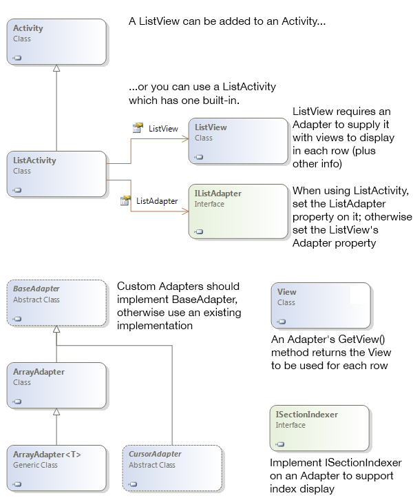

# ListView Parts and Functionality

## Overview

A `ListView` consists of the following parts:

- **Rows** &ndash; The visible representation of the data in the list.

- **Adapter** &ndash; A non-visual class that binds the data source to
  the list view.

- **Fast Scrolling** &ndash; A handle that lets the user scroll the
  length of the list.

- **Section Index** &ndash; A user interface element that floats over
  the scrolling rows to indicate where in the list the current rows are
  located.

These screenshots use a basic `ListView` control to
show how Fast Scrolling and Section Index are rendered:

The elements that make up a `ListView` are described in
more detail below:

## Rows

Each row has its own `View`. The view can be either one of the built-in
views defined in `Android.Resources`, or a custom view. Each row can
use the same view layout or they can all be different. There are
examples in this document of using built-in layouts and others
explaining how to define custom layouts.

## Adapter

The `ListView` control requires an `Adapter` to supply the formatted
`View` for each row. Android has built-in Adapters and Views that can
be used, or custom classes can be created.

## Fast Scrolling

When a `ListView` contains many rows of data fast-scrolling can be
enabled to help the user navigate to any part of the list. The
fast-scrolling 'scroll bar' can be optionally enabled (and customized
in API level 11 and higher).

## Section Index

While scrolling through long lists, the optional section index provides
the user with feedback on what part of the list they are currently
viewing. It is only appropriate on long lists, typically in conjunction
with fast scrolling.

## Classes Overview

The primary classes used to display `ListViews` are shown here:

The purpose of each class is described below:

- **ListView** &ndash; user interface element that displays a scrollable
  collection of rows. On phones it usually uses up the entire screen
  (in which case, the `ListActivity` class can be used) or it could be
  part of a larger layout on phones or tablet devices.

- **View** &ndash; a View in Android can be any user interface element, but
  in the context of a `ListView` it requires a `View` to be supplied
  for each row.

- **BaseAdapter** &ndash; Base class for Adapter implementations to bind a
  `ListView` to a data source.

- **ArrayAdapter** &ndash; Built-in Adapter class that binds an array of
  strings to a `ListView` for display. The generic `ArrayAdapter<T>`
  does the same for other types.

- **CursorAdapter** &ndash; Use `CursorAdapter` or `SimpleCursorAdapter` to
  display data based on an SQLite query.

This document contains simple examples that use an `ArrayAdapter` as
well as more complex examples that require custom implementations of
`BaseAdapter` or `CursorAdapter`.

