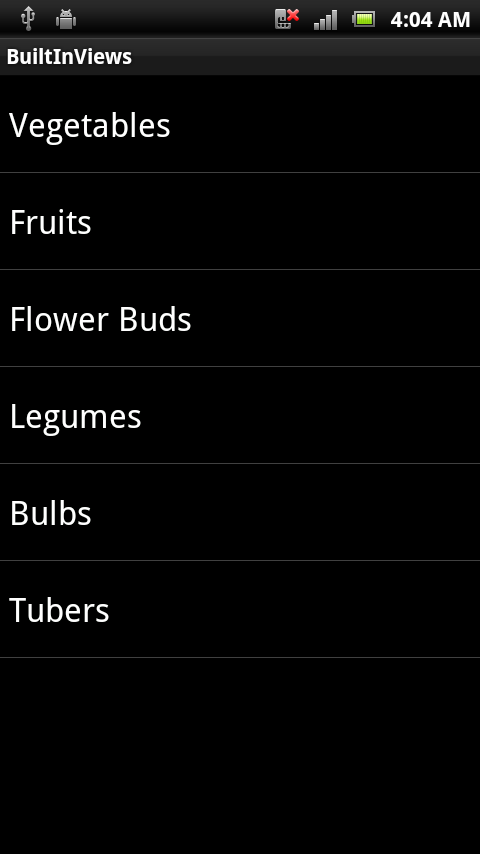
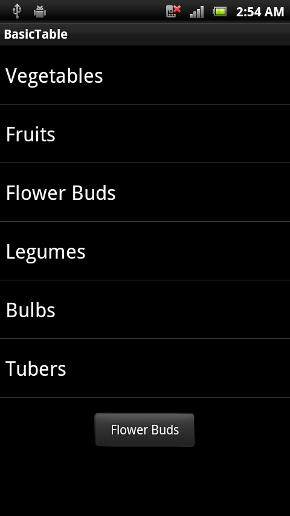
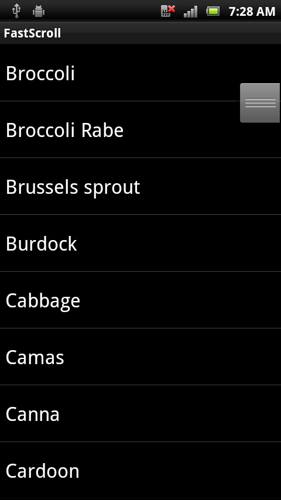
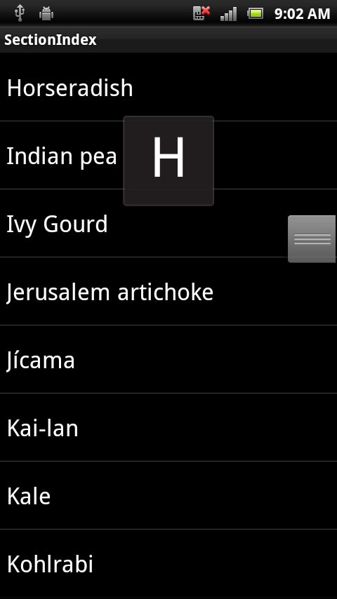

# Populating a Xamarin.Android ListView with data

To add rows to a `ListView` you need to add it to your layout and
implement an `IListAdapter` with methods that the `ListView` calls to
populate itself. Android includes built-in `ListActivity` and
`ArrayAdapter` classes that you can use without defining any custom
layout XML or code. The `ListActivity` class automatically creates a
`ListView` and exposes a `ListAdapter` property to supply the row views
to display via an adapter.

The built-in adapters take a view resource ID as a parameter that gets
used for each row. You can use built-in resources such as those in
`Android.Resource.Layout` so you don't need to write your own.

## Using ListActivity and ArrayAdapter&lt;String&gt;

The example **BasicTable/HomeScreen.cs** demonstrates how to use these
classes to display a `ListView` in only a few lines of code:

```csharp
[Activity(Label = "BasicTable", MainLauncher = true, Icon = "@drawable/icon")]
public class HomeScreen : ListActivity {
   string[] items;
   protected override void OnCreate(Bundle bundle)
   {
       base.OnCreate(bundle);
       items = new string[] { "Vegetables","Fruits","Flower Buds","Legumes","Bulbs","Tubers" };
       ListAdapter = new ArrayAdapter<String>(this, Android.Resource.Layout.SimpleListItem1, items);
   }
}
```

### Handling row clicks

Usually a `ListView` will also allow the user to touch a row to perform
some action (such as playing a song, or calling a contact, or showing
another screen). To respond to user touches there needs to be one more
method implemented in the `ListActivity` &ndash; `OnListItemClick`
&ndash; like this:

[](populating-images/simplelistitem1.png#lightbox)

```csharp
protected override void OnListItemClick(ListView l, View v, int position, long id)
{
   var t = items[position];
   Android.Widget.Toast.MakeText(this, t, Android.Widget.ToastLength.Short).Show();
}
```

Now the user can touch a row and a `Toast` alert will appear:

[](populating-images/basictable2.png#lightbox)

## Implementing a ListAdapter

`ArrayAdapter<string>` is great because of its
simplicity, but it's extremely limited. However, often times you have a
collection of business entities, rather than just strings that you want to bind.
For example, if your data consists of a collection of Employee classes, then you
might want the list to just display the names of each employee. To customize the
behavior of a `ListView` to control what data is displayed
you must implement a subclass of `BaseAdapter` overriding
the following four items:

- **Count** &ndash; To tell the control how many rows are in the data.

- **GetView** &ndash; To return a View for each row, populated with data.
    This method has a parameter for the `ListView` to pass in an
    existing, unused row for re-use.

- **GetItemId** &ndash; Return a row identifier (typically the row
    number, although it can be any long value that you like).

- **this[int]** indexer &ndash; To return the data associated with a
    particular row number.

The example code in **BasicTableAdapter/HomeScreenAdapter.cs**
demonstrates how to subclass `BaseAdapter`:

```csharp
public class HomeScreenAdapter : BaseAdapter<string> {
   string[] items;
   Activity context;
   public HomeScreenAdapter(Activity context, string[] items) : base() {
       this.context = context;
       this.items = items;
   }
   public override long GetItemId(int position)
  {
       return position;
   }
   public override string this[int position] {  
       get { return items[position]; }
   }
   public override int Count {
       get { return items.Length; }
   }
   public override View GetView(int position, View convertView, ViewGroup parent)
   {
       View view = convertView; // re-use an existing view, if one is available
      if (view == null) // otherwise create a new one
           view = context.LayoutInflater.Inflate(Android.Resource.Layout.SimpleListItem1, null);
       view.FindViewById<TextView>(Android.Resource.Id.Text1).Text = items[position];
       return view;
   }
}
```

### Using a custom adapter

Using the custom adapter is similar to the built-in `ArrayAdapter`,
passing in a `context` and the `string[]` of values to display:

```csharp
ListAdapter = new HomeScreenAdapter(this, items);
```

Because this example uses the same row layout (`SimpleListItem1`) the
resulting application will look identical to the previous example.

### Row view re-Use

In this example there are only six items. Since the screen can fit
eight, no row re-use required. When displaying hundreds or thousands of
rows, however, it would be a waste of memory to create hundreds or
thousands of `View` objects when only eight fit on the screen at a
time. To avoid this situation, when a row disappears from the screen
its view is placed in a queue for re-use. As the user scrolls, the
`ListView` calls `GetView` to request new views to display &ndash; if
available it passes an unused view in the `convertView` parameter. If
this value is null then your code should create a new view instance,
otherwise you can re-set the properties of that object and re-use it.

The `GetView` method should follow this pattern to
re-use row views:

```csharp
public override View GetView(int position, View convertView, ViewGroup parent)
{
   View view = convertView; // re-use an existing view, if one is supplied
   if (view == null) // otherwise create a new one
       view = context.LayoutInflater.Inflate(Android.Resource.Layout.SimpleListItem1, null);
   // set view properties to reflect data for the given row
   view.FindViewById<TextView>(Android.Resource.Id.Text1).Text = items[position];
   // return the view, populated with data, for display
   return view;
}
```

Custom adapter implementations should *always* re-use the `convertView`
object before creating new views to ensure they do not run out of
memory when displaying long lists.

Some adapter implementations (such as the `CursorAdapter`) don't have a
`GetView` method, rather they require two different methods `NewView`
and `BindView` which enforce row re-use by separating the
responsibilities of `GetView` into two methods. There is a
`CursorAdapter` example later in the document.

## Enabling fast scrolling

Fast Scrolling helps the user to scroll through long lists by providing
an additional 'handle' that acts as a scroll bar to directly access
a part of the list. This screenshot shows the fast scroll handle:

[](populating-images/fastscroll.png#lightbox)

Causing the fast scrolling handle to appear is as simple as setting the
`FastScrollEnabled` property to `true`:

```csharp
ListView.FastScrollEnabled = true;
```

### Adding a section index

A section index provides additional feedback for users when they are
fast-scrolling through a long list &ndash; it shows which 'section'
they have scrolled to. To cause the section index to appear the Adapter
subclass must implement the `ISectionIndexer` interface to supply the
index text depending on the rows being displayed:

[](populating-images/sectionindex.png#lightbox)

To implement `ISectionIndexer` you need to add three methods to an
adapter:

- **GetSections** &ndash; Provides the complete list of section index
    titles that could be displayed. This method requires an array of
    Java Objects so the code needs to create a `Java.Lang.Object[]`
    from a .NET collection. In our example it returns a list of the
    initial characters in the list as `Java.Lang.String` .

- **GetPositionForSection** &ndash; Returns the first row position for a
    given section index.

- **GetSectionForPosition** &ndash; Returns the section index to be
    displayed for a given row.

The example `SectionIndex/HomeScreenAdapter.cs` file implements those
methods, and some additional code in the constructor. The constructor
builds the section index by looping through every row and extracting
the first character of the title (the items must already be sorted for
this to work).

```csharp
alphaIndex = new Dictionary<string, int>();
for (int i = 0; i < items.Length; i++) { // loop through items
   var key = items[i][0].ToString();
   if (!alphaIndex.ContainsKey(key))
       alphaIndex.Add(key, i); // add each 'new' letter to the index
}
sections = new string[alphaIndex.Keys.Count];
alphaIndex.Keys.CopyTo(sections, 0); // convert letters list to string[]

// Interface requires a Java.Lang.Object[], so we create one here
sectionsObjects = new Java.Lang.Object[sections.Length];
for (int i = 0; i < sections.Length; i++) {
   sectionsObjects[i] = new Java.Lang.String(sections[i]);
}
```

With the data structures created, the `ISectionIndexer` methods are
very simple:

```csharp
public Java.Lang.Object[] GetSections()
{
   return sectionsObjects;
}
public int GetPositionForSection(int section)
{
   return alphaIndexer[sections[section]];
}
public int GetSectionForPosition(int position)
{   // this method isn't called in this example, but code is provided for completeness
    int prevSection = 0;
    for (int i = 0; i < sections.Length; i++)
    {
        if (GetPositionForSection(i) > position)
        {
            break;
        }
        prevSection = i;
    }
    return prevSection;
}
```

Your section index titles don't need to map 1:1 to your actual
sections. This is why the `GetPositionForSection` method exists.
`GetPositionForSection` gives you an opportunity to map whatever
indices are in your index list to whatever sections are in your list
view. For example, you may have a "z" in your index, but you may
not have a table section for every letter, so instead of "z"
mapping to 26, it may map to 25 or 24, or whatever section index
"z" should map to.

## Related links

- [BasicTableAndroid (sample)](/samples/xamarin/monodroid-samples/basictableandroid)
- [BasicTableAdapter (sample)](/samples/xamarin/monodroid-samples/basictableadapter)
- [FastScroll (sample)](/samples/xamarin/monodroid-samples/fastscroll)