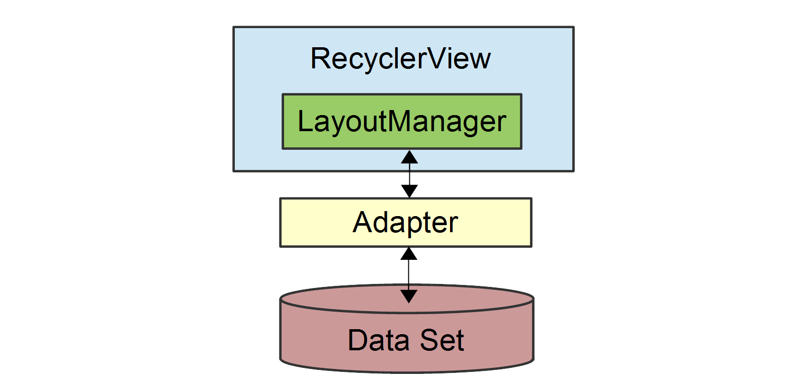
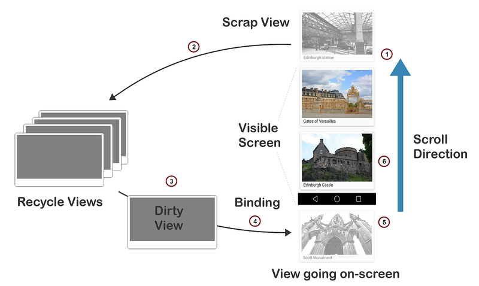
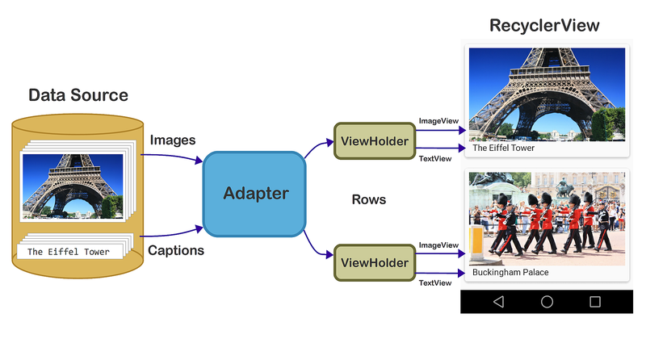

# RecyclerView Parts and Functionality

`RecyclerView` handles some tasks internally (such as the scrolling
and recycling of views), but it is essentially a manager that
coordinates helper classes to display a collection. `RecyclerView`
delegates tasks to the following helper classes:

- **`Adapter`** &ndash; Inflates item layouts (instantiates
    the contents of a layout file) and binds data to views that are
    displayed within a `RecyclerView`. The adapter also reports
    item-click events.

- **`LayoutManager`** &ndash; Measures and positions item views
    within a `RecyclerView` and manages the policy for view recycling.

- **`ViewHolder`** &ndash; Looks up and stores view
    references. The view holder also helps with detecting item-view
    clicks.

- **`ItemDecoration`** &ndash; Allows an app to add special
    drawing and layout offsets to specific views for drawing dividers
    between items, highlights, and visual grouping boundaries.

- **`ItemAnimator`** &ndash; Defines the animations that take
    place during item actions or as changes are made to the adapter.

The relationship between the `RecyclerView`, `LayoutManager`, and
`Adapter` classes is depicted in the following diagram:

As this figure illustrates, the `LayoutManager` can be thought of as
the intermediary between the `Adapter` and the `RecyclerView`. The
`LayoutManager` makes calls into `Adapter` methods on behalf of the
`RecyclerView`. For example, the `LayoutManager` calls an `Adapter`
method when it is time to create a new view for a particular item
position in the `RecyclerView`. The `Adapter` inflates the layout for
that item and creates a `ViewHolder` instance (not shown) to cache
references to the views at that position. When the `LayoutManager`
calls the `Adapter` to bind a particular item to the data set, the
`Adapter` locates the data for that item, retrieves it from the data
set, and copies it to the associated item view.

When using `RecyclerView` in your app, creating derived types of the
following classes is required:

- **`RecyclerView.Adapter`** &ndash; Provides a binding from your
    app's data set (which is specific to your app) to item views that
    are displayed within the `RecyclerView`. The adapter knows how to
    associate each item-view position in the `RecyclerView` to a
    specific location in the data source. In addition, the adapter
    handles the layout of the contents within each individual item view
    and creates the view holder for each view. The adapter also reports
    item-click events that are detected by the item view.

- **`RecyclerView.ViewHolder`** &ndash; Caches references to the
    views in your item layout file so that resource lookups are not
    repeated unnecessarily. The view holder also arranges for
    item-click events to be forwarded to the adapter when a user taps
    the view-holder's associated item view.

- **`RecyclerView.LayoutManager`** &ndash; Positions items within the
    `RecyclerView`. You can use one of several predefined layout
    managers or you can implement your own custom layout manager.
    `RecyclerView` delegates the layout policy to the layout manager,
    so you can plug in a different layout manager without having to
    make significant changes to your app.

Also, you can optionally extend the following classes to change the look
and feel of `RecyclerView` in your app:

- **`RecyclerView.ItemDecoration`**
- **`RecyclerView.ItemAnimator`**

If you do not extend `ItemDecoration` and `ItemAnimator`,
`RecyclerView` uses default implementations. This guide does not
explain how to create custom `ItemDecoration` and `ItemAnimator`
classes; for more information about these classes, see
[RecyclerView.ItemDecoration](https://developer.android.com/reference/android/support/v7/widget/RecyclerView.ItemDecoration.html)
and
[RecyclerView.ItemAnimator](https://developer.android.com/reference/android/support/v7/widget/RecyclerView.ItemAnimator.html).

## How View Recycling Works

`RecyclerView` does not allocate an item view for every item in
your data source. Instead, it allocates only the number of item views
that fit on the screen and it reuses those item layouts as the user
scrolls. When the view first scrolls out of sight, it goes through the
recycling process illustrated in the following figure:

1. When a view scrolls out of sight and is no longer displayed, it
    becomes a *scrap view*.

2. The scrap view is placed in a pool and becomes a *recycle view*.
    This pool is a cache of views that display the same type of data.

3. When a new item is to be displayed, a view is taken from the recycle
    pool for reuse. Because this view must be re-bound by the adapter
    before being displayed, it is called a *dirty view*.

4. The dirty view is recycled: the adapter locates the data
    for the next item to be displayed and copies this data to
    the views for this item. References for these views are
    retrieved from the view holder associated with the recycled view.

5. The recycled view is added to the list of items in the `RecyclerView`
    that are about to go on-screen.

6. The recycled view goes on-screen as the user scrolls the `RecyclerView`
    to the next item in the list. Meanwhile, another view scrolls out
    of sight and is recycled according to the above steps.

In addition to item-view reuse, `RecyclerView` also uses another
efficiency optimization: view holders. A *view holder* is a simple class
that caches view references. Each time the adapter inflates an
item-layout file, it also creates a corresponding view holder. The view
holder uses `FindViewById` to get references to the views inside the
inflated item-layout file. These references are used to load new data
into the views every time the layout is recycled to show new data.

## The Layout Manager

The layout manager is responsible for positioning items in the
`RecyclerView` display; it determines the presentation type (a list
or a grid), the orientation (whether items are displayed vertically or
horizontally), and which direction items should be displayed (in normal
order or in reverse order). The layout manager is also responsible for
calculating the size and position of each item in the **RecycleView**
display.

The layout manager has an additional purpose: it determines the policy
for when to recycle item views that are no longer visible to the user.
Because the layout manager is aware of which views are visible (and
which are not), it is in the best position to decide when a view can be
recycled. To recycle a view, the layout manager typically makes calls
to the adapter to replace the contents of a recycled view with
different data, as described previously in [How View Recycling Works](#recycling).

You can extend `RecyclerView.LayoutManager` to create your own layout
manager, or you can use a predefined layout manager. `RecyclerView`
provides the following predefined layout managers:

- **`LinearLayoutManager`** &ndash; Arranges items in a column that can
    be scrolled vertically, or in a row that can be scrolled horizontally.

- **`GridLayoutManager`** &ndash; Displays items in a grid.

- **`StaggeredGridLayoutManager`** &ndash; Displays items in a staggered grid,
    where some items have different heights and widths.

To specify the layout manager, instantiate your chosen layout manager
and pass it to the `SetLayoutManager` method. Note that you *must*
specify the layout manager &ndash; `RecyclerView` does not select a
predefined layout manager by default.

For more information about the layout manager, see the
[RecyclerView.LayoutManager class reference](https://developer.android.com/reference/android/support/v7/widget/RecyclerView.LayoutManager.html).

## The View Holder

The view holder is a class that you define for caching view
references. The adapter uses these view references to bind each view to
its content. Every item in the `RecyclerView` has an associated view
holder instance that caches the view references for that item. To
create a view holder, use the following steps to define a class to
hold the exact set of views per item:

1. Subclass `RecyclerView.ViewHolder`.
2. Implement a constructor that looks up and stores the view references.
3. Implement properties that the adapter can use to access these references.

A detailed example of a `ViewHolder` implementation is presented in
[A Basic RecyclerView Example](~/android/user-interface/layouts/recycler-view/recyclerview-example.md).
For more information about `RecyclerView.ViewHolder`, see the
[RecyclerView.ViewHolder class reference](https://developer.android.com/reference/android/support/v7/widget/RecyclerView.ViewHolder.html).

## The Adapter

Most of the "heavy-lifting" of the `RecyclerView` integration code
takes place in the adapter. `RecyclerView` requires that you provide
an adapter derived from `RecyclerView.Adapter` to access your data
source and populate each item with content from the data source.
Because the data source is app-specific, you must implement adapter
functionality that understands how to access your data. The adapter
extracts information from the data source and loads it into each item
in the `RecyclerView` collection.

The following drawing illustrates how the adapter maps content in a
data source through view holders to individual views within each row
item in the `RecyclerView`:

The adapter loads each `RecyclerView` row with data for a particular
row item. For row position *P*, for example, the adapter locates the
associated data at position *P* within the data source and copies this
data to the row item at position *P* in the `RecyclerView` collection.
In the above drawing, for example, the adapter uses the view holder to
lookup the references for the `ImageView` and `TextView` at that
position so it doesn't have to repeatedly call `FindViewById` for those
views as the user scrolls through the collection and reuses views.

When you implement an adapter, you must override the following
`RecyclerView.Adapter` methods:

- **`OnCreateViewHolder`** &ndash; Instantiates the item layout file and
    view holder.

- **`OnBindViewHolder`** &ndash; Loads the data at the specified position
    into the views whose references are stored in the given view holder.

- **`ItemCount`** &ndash; Returns the number of items in the data source.

The layout manager calls these methods while it is positioning items
within the `RecyclerView`.

## Notifying RecyclerView of Data Changes

`RecyclerView` does not automatically update its display when the
contents of its data source changes; the adapter must notify
`RecyclerView` when there is a change in the data set. The data set
can change in many ways; for example, the contents within an item can
change or the overall structure of the data may be altered.
`RecyclerView.Adapter` provides a number of methods that you can call
so that `RecyclerView` responds to data changes in the most efficient
manner:

- **`NotifyItemChanged`** &ndash; Signals that the item at the
    specified position has changed.

- **`NotifyItemRangeChanged`** &ndash; Signals that the items in the
    specified range of positions have changed.

- **`NotifyItemInserted`** &ndash; Signals that the item in the
    specified position has been newly inserted.

- **`NotifyItemRangeInserted`** &ndash; Signals that the items in the
    specified range of positions have been newly inserted.

- **`NotifyItemRemoved`** &ndash; Signals that the item in the
    specified position has been removed.

- **`NotifyItemRangeRemoved`** &ndash; Signals that the items in the
    specified range of positions have been removed.

- **`NotifyDataSetChanged`** &ndash; Signals that the data set has
    changed (forces a full update).

If you know exactly how your data set has changed, you can call the
appropriate methods above to refresh `RecyclerView` in the most
efficient manner. If you do not know exactly how your data set has
changed, you can call `NotifyDataSetChanged`, which is far less
efficient because `RecyclerView` must refresh all the views that are
visible to the user. For more information about these methods, see
[RecyclerView.Adapter](https://developer.android.com/reference/android/support/v7/widget/RecyclerView.Adapter.html).

In the next topic,
[A Basic RecyclerView Example](~/android/user-interface/layouts/recycler-view/recyclerview-example.md),
an example app is implemented to demonstrate real code examples of the parts and functionality
outlined above.

## Related Links

- [RecyclerView](~/android/user-interface/layouts/recycler-view/index.md)
- [A Basic RecyclerView Example](~/android/user-interface/layouts/recycler-view/recyclerview-example.md)
- [Extending the RecyclerView Example](~/android/user-interface/layouts/recycler-view/extending-the-example.md)
- [RecyclerView](https://developer.android.com/reference/android/support/v7/widget/RecyclerView.html)
