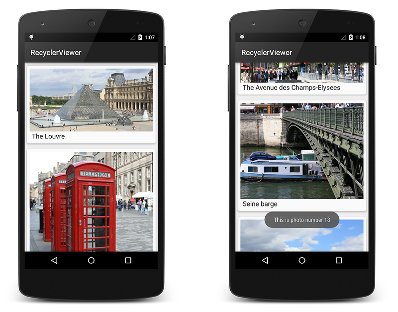
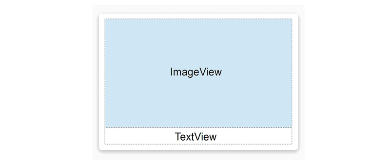
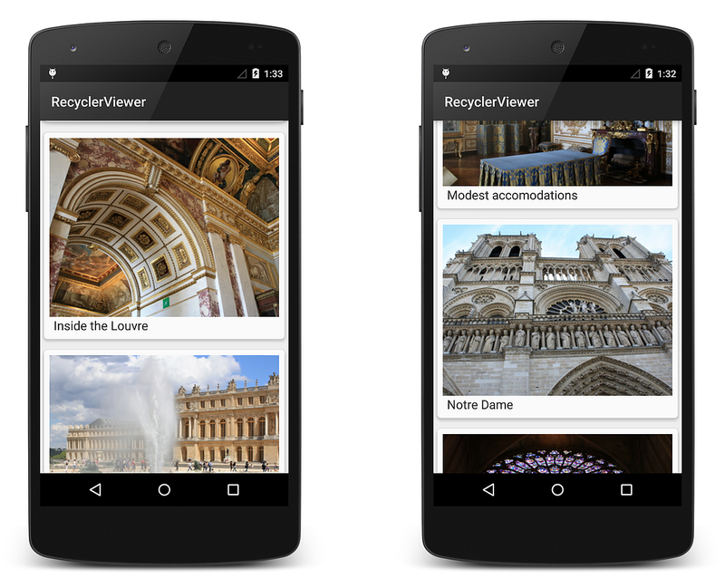
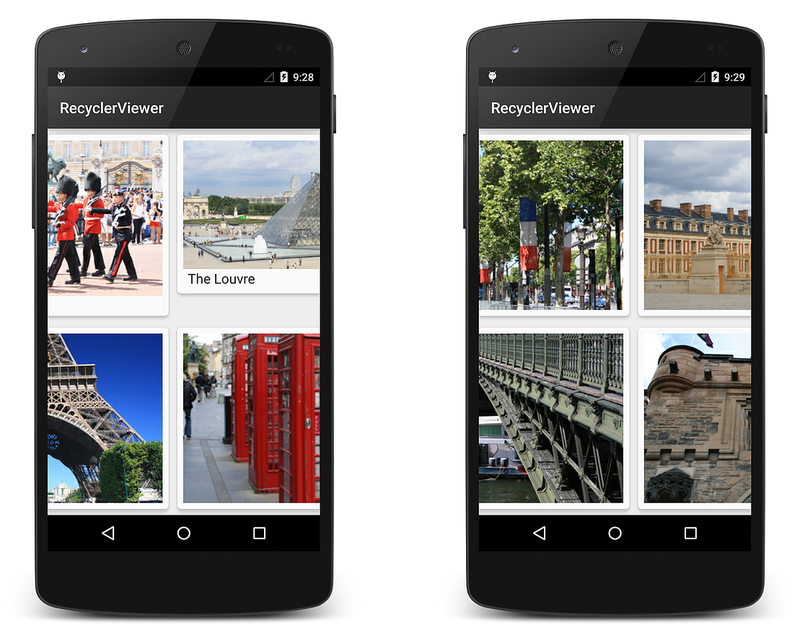

# A Basic RecyclerView Example

To understand how `RecyclerView` works in a typical application, this
topic explores the
[RecyclerViewer](/samples/xamarin/monodroid-samples/android50-recyclerviewer) sample
app, a simple code example that uses `RecyclerView` to display a large
collection of photos: 

[](recyclerview-example-images/01-recyclerviewer.png#lightbox)

**RecyclerViewer** uses
[CardView](~/android/user-interface/controls/card-view.md) to
implement each photograph item in the `RecyclerView` layout. Because
of `RecyclerView`'s performance advantages, this sample app is able
to quickly scroll through a large collection of photos smoothly and
without noticeable delays.

### An Example Data Source

In this example app, a "photo album" data source (represented by
the `PhotoAlbum` class) supplies `RecyclerView` with item content.
`PhotoAlbum` is a collection of photos with captions; when you
instantiate it, you get a ready-made collection of 32 photos:

```csharp
PhotoAlbum mPhotoAlbum = new PhotoAlbum ();
```

Each photo instance in `PhotoAlbum` exposes properties that allow you
to read its image resource ID, `PhotoID`, and its caption string,
`Caption`. The collection of photos is organized such that each photo
can be accessed by an indexer. For example, the following lines of code
access the image resource ID and caption for the tenth photo in the
collection:

```csharp
int imageId = mPhotoAlbum[9].ImageId;
string caption = mPhotoAlbum[9].Caption;
```

`PhotoAlbum` also provides a `RandomSwap` method that you can call to
swap the first photo in the collection with a randomly-chosen photo
elsewhere in the collection:

```csharp
mPhotoAlbum.RandomSwap ();
```

Because the implementation details of `PhotoAlbum` are not relevant to
understanding `RecyclerView`, the `PhotoAlbum` source code is not
presented here. The source code to `PhotoAlbum` is available at
[PhotoAlbum.cs](https://github.com/xamarin/monodroid-samples/blob/master/android5.0/RecyclerViewer/RecyclerViewer/PhotoAlbum.cs)
 in the [RecyclerViewer](/samples/xamarin/monodroid-samples/android50-recyclerviewer) sample app.

### Layout and Initialization

The layout file, **Main.axml**, consists of a single `RecyclerView` within
a `LinearLayout`:

```xml
<?xml version="1.0" encoding="utf-8"?>
<LinearLayout xmlns:android="http://schemas.android.com/apk/res/android"
    android:orientation="vertical"
    android:layout_width="fill_parent"
    android:layout_height="fill_parent">
    <android.support.v7.widget.RecyclerView
        android:id="@+id/recyclerView"
        android:scrollbars="vertical"
        android:layout_width="fill_parent"
        android:layout_height="fill_parent" />
</LinearLayout>
```

Note that you must use the fully-qualified name
**android.support.v7.widget.RecyclerView** because `RecyclerView` is
packaged in a support library. The `OnCreate` method of `MainActivity`
initializes this layout, instantiates the adapter, and prepares the
underlying data source:

```csharp
public class MainActivity : Activity
{
    RecyclerView mRecyclerView;
    RecyclerView.LayoutManager mLayoutManager;
    PhotoAlbumAdapter mAdapter;
    PhotoAlbum mPhotoAlbum;

    protected override void OnCreate (Bundle bundle)
    {
        base.OnCreate (bundle);

        // Prepare the data source:
        mPhotoAlbum = new PhotoAlbum ();

        // Instantiate the adapter and pass in its data source:
        mAdapter = new PhotoAlbumAdapter (mPhotoAlbum);

        // Set our view from the "main" layout resource:
        SetContentView (Resource.Layout.Main);

        // Get our RecyclerView layout:
        mRecyclerView = FindViewById<RecyclerView> (Resource.Id.recyclerView);

        // Plug the adapter into the RecyclerView:
        mRecyclerView.SetAdapter (mAdapter);
```

This code does the following:

1. Instantiates the `PhotoAlbum` data source.

2. Passes the photo album data source to the constructor of the adapter, 
   `PhotoAlbumAdapter` (which is defined later in this guide). 
   Note that it is considered a best practice to pass the data
   source as a parameter to the constructor of the adapter. 

3. Gets the `RecyclerView` from the layout.

4. Plugs the adapter into the `RecyclerView` instance by calling 
   the `RecyclerView` `SetAdapter` method as shown above.

### Layout Manager

Each item in the `RecyclerView` is made up of a `CardView` that
contains a photo image and photo caption (details are covered in the
[View Holder](#view-holder) section below). The predefined
`LinearLayoutManager` is used to lay out each `CardView` in a vertical
scrolling arrangement:

```csharp
mLayoutManager = new LinearLayoutManager (this);
mRecyclerView.SetLayoutManager (mLayoutManager);
```

This code resides in the main activity's `OnCreate` method. The
constructor to the layout manager requires a *context*, so the
`MainActivity` is passed using `this` as seen above.

Instead of using the predefined `LinearLayoutManager`, you can
plug in a custom layout manager that displays two `CardView` items
side-by-side, implementing a page-turning animation effect to traverse
through the collection of photos. Later in this guide, you will see an
example of how to modify the layout by swapping in a different layout
manager.

<a name="view-holder"></a>

### View Holder

The view holder class is called `PhotoViewHolder`. Each
`PhotoViewHolder` instance holds references to the `ImageView` and
`TextView` of an associated row item, which is laid out in a `CardView`
as diagrammed here:

[](recyclerview-example-images/02-cardview-layout.png#lightbox)

`PhotoViewHolder` derives from `RecyclerView.ViewHolder` and contains properties
to store references to the `ImageView` and `TextView` shown in the above layout.
`PhotoViewHolder` consists of two properties and one constructor:

```csharp
public class PhotoViewHolder : RecyclerView.ViewHolder
{
    public ImageView Image { get; private set; }
    public TextView Caption { get; private set; }

    public PhotoViewHolder (View itemView) : base (itemView)
    {
        // Locate and cache view references:
        Image = itemView.FindViewById<ImageView> (Resource.Id.imageView);
        Caption = itemView.FindViewById<TextView> (Resource.Id.textView);
    }
}
```

In this code example, the `PhotoViewHolder` constructor is passed a
reference to the parent item view (the `CardView`) that
`PhotoViewHolder` wraps. Note that you always forward the parent item
view to the base constructor. The `PhotoViewHolder` constructor calls
`FindViewById` on the parent item view to locate each of its child view
references, `ImageView` and `TextView`, storing the results in the
`Image` and `Caption` properties, respectively. The adapter later
retrieves view references from these properties when it updates this
`CardView`'s child views with new data.

For more information about `RecyclerView.ViewHolder`, see the
[RecyclerView.ViewHolder class reference](https://developer.android.com/reference/android/support/v7/widget/RecyclerView.ViewHolder.html).

### Adapter

The adapter loads each `RecyclerView` row with data for a particular
photograph. For a given photograph at row position *P*, for example,
the adapter locates the associated data at position *P* within the data
source and copies this data to the row item at position *P* in the
`RecyclerView` collection. The adapter uses the view holder to lookup
the references for the `ImageView` and `TextView` at that position so
it doesn't have to repeatedly call `FindViewById` for those views as
the user scrolls through the photograph collection and reuses views.

In **RecyclerViewer**, an adapter class is derived from
`RecyclerView.Adapter` to create `PhotoAlbumAdapter`:

```csharp
public class PhotoAlbumAdapter : RecyclerView.Adapter
{
    public PhotoAlbum mPhotoAlbum;

    public PhotoAlbumAdapter (PhotoAlbum photoAlbum)
    {
        mPhotoAlbum = photoAlbum;
    }
    ...
}
```

The `mPhotoAlbum` member contains the data source (the photo album)
that is passed into the constructor; the constructor copies the photo
album into this member variable. The following required
`RecyclerView.Adapter` methods are implemented:

- **`OnCreateViewHolder`** &ndash; Instantiates the item layout file and
    view holder.

- **`OnBindViewHolder`** &ndash; Loads the data at the specified position
    into the views whose references are stored in the given view holder.

- **`ItemCount`** &ndash; Returns the number of items in the data source.

The layout manager calls these methods while it is positioning items
within the `RecyclerView`. The implementation of these methods is
examined in the following sections.

#### OnCreateViewHolder

The layout manager calls `OnCreateViewHolder` when the `RecyclerView`
needs a new view holder to represent an item. `OnCreateViewHolder`
inflates the item view from the view's layout file and wraps the view
in a new `PhotoViewHolder` instance. The `PhotoViewHolder` constructor
locates and stores references to child views in the layout as described
previously in [View Holder](#view-holder).

Each row item is represented by a `CardView` that contains an
`ImageView` (for the photo) and a `TextView` (for the caption). This
layout resides in the file **PhotoCardView.axml**:

```xml
<?xml version="1.0" encoding="utf-8"?>
<FrameLayout xmlns:card_view="http://schemas.android.com/apk/res-auto"
    xmlns:android="http://schemas.android.com/apk/res/android"
    android:layout_width="fill_parent"
    android:layout_height="wrap_content">
    <android.support.v7.widget.CardView
        android:layout_width="match_parent"
        android:layout_height="wrap_content"
        card_view:cardElevation="4dp"
        card_view:cardUseCompatPadding="true"
        card_view:cardCornerRadius="5dp">
        <LinearLayout
            android:layout_width="match_parent"
            android:layout_height="wrap_content"
            android:orientation="vertical"
            android:padding="8dp">
            <ImageView
                android:layout_width="match_parent"
                android:layout_height="wrap_content"
                android:id="@+id/imageView"
                android:scaleType="centerCrop" />
            <TextView
                android:layout_width="match_parent"
                android:layout_height="wrap_content"
                android:textAppearance="?android:attr/textAppearanceMedium"
                android:textColor="#333333"
                android:text="Caption"
                android:id="@+id/textView"
                android:layout_gravity="center_horizontal"
                android:layout_marginLeft="4dp" />
        </LinearLayout>
    </android.support.v7.widget.CardView>
</FrameLayout>
```

This layout represents a single row item in the `RecyclerView`. The
`OnBindViewHolder` method (described below) copies data from the data
source into the `ImageView` and `TextView` of this layout.
`OnCreateViewHolder` inflates this layout for a given photo location in
the `RecyclerView` and instantiates a new `PhotoViewHolder` instance
(which locates and caches references to the `ImageView` and `TextView`
child views in the associated `CardView` layout):

```csharp
public override RecyclerView.ViewHolder
    OnCreateViewHolder (ViewGroup parent, int viewType)
{
    // Inflate the CardView for the photo:
    View itemView = LayoutInflater.From (parent.Context).
                Inflate (Resource.Layout.PhotoCardView, parent, false);

    // Create a ViewHolder to hold view references inside the CardView:
    PhotoViewHolder vh = new PhotoViewHolder (itemView);
    return vh;
}

```

The resulting view holder instance, `vh`, is returned back to the
caller (the layout manager).

#### OnBindViewHolder

When the layout manager is ready to display a particular view in the
`RecyclerView`'s visible screen area, it calls the adapter's
`OnBindViewHolder` method to fill the item at the specified row
position with content from the data source. `OnBindViewHolder` gets the
photo information for the specified row position (the photo's image
resource and the string for the photo's caption) and copies this data
to the associated views. Views are located via references stored in the
view holder object (which is passed in through the `holder` parameter):

```csharp
public override void
    OnBindViewHolder (RecyclerView.ViewHolder holder, int position)
{
    PhotoViewHolder vh = holder as PhotoViewHolder;

    // Load the photo image resource from the photo album:
    vh.Image.SetImageResource (mPhotoAlbum[position].PhotoID);

    // Load the photo caption from the photo album:
    vh.Caption.Text = mPhotoAlbum[position].Caption;
}
```

The passed-in view holder object must first be cast into the derived
view holder type (in this case, `PhotoViewHolder`) before it is used.
The adapter loads the image resource into the view referenced by the
view holder's `Image` property, and it copies the caption text into the
view referenced by the view holder's `Caption` property. This *binds*
the associated view with its data.

Notice that `OnBindViewHolder` is the code that deals directly with the
structure of the data. In this case, `OnBindViewHolder` understands how
to map the `RecyclerView` item position to its associated data item in
the data source. The mapping is straightforward in this case because
the position can be used as an array index into the photo album;
however, more complex data sources may require extra code to establish
such a mapping.

#### ItemCount

The `ItemCount` method returns the number of items in the data
collection. In the example photo viewer app, the item count is the
number of photos in the photo album:

```csharp
public override int ItemCount
{
    get { return mPhotoAlbum.NumPhotos; }
}
```

For more information about `RecyclerView.Adapter`, see the
[RecyclerView.Adapter class reference](https://developer.android.com/reference/android/support/v7/widget/RecyclerView.Adapter.html).

### Putting it All Together

The resulting `RecyclerView` implementation for the example photo app
consists of `MainActivity` code that creates the data source, layout
manager and the adapter. `MainActivity` creates the `mRecyclerView`
instance, instantiates the data source and the adapter, and plugs in
the layout manager and adapter:

```csharp
public class MainActivity : Activity
{
    RecyclerView mRecyclerView;
    RecyclerView.LayoutManager mLayoutManager;
    PhotoAlbumAdapter mAdapter;
    PhotoAlbum mPhotoAlbum;

    protected override void OnCreate (Bundle bundle)
    {
        base.OnCreate (bundle);
        mPhotoAlbum = new PhotoAlbum();
        SetContentView (Resource.Layout.Main);
        mRecyclerView = FindViewById<RecyclerView> (Resource.Id.recyclerView);

        // Plug in the linear layout manager:
        mLayoutManager = new LinearLayoutManager (this);
        mRecyclerView.SetLayoutManager (mLayoutManager);

        // Plug in my adapter:
        mAdapter = new PhotoAlbumAdapter (mPhotoAlbum);
        mRecyclerView.SetAdapter (mAdapter);
    }
}

```

`PhotoViewHolder` locates and caches the view references:

```csharp
public class PhotoViewHolder : RecyclerView.ViewHolder
{
    public ImageView Image { get; private set; }
    public TextView Caption { get; private set; }

    public PhotoViewHolder (View itemView) : base (itemView)
    {
        // Locate and cache view references:
        Image = itemView.FindViewById<ImageView> (Resource.Id.imageView);
        Caption = itemView.FindViewById<TextView> (Resource.Id.textView);
    }
}
```

`PhotoAlbumAdapter` implements the three required method overrides:

```csharp
public class PhotoAlbumAdapter : RecyclerView.Adapter
{
    public PhotoAlbum mPhotoAlbum;
    public PhotoAlbumAdapter (PhotoAlbum photoAlbum)
    {
        mPhotoAlbum = photoAlbum;
    }

    public override RecyclerView.ViewHolder
        OnCreateViewHolder (ViewGroup parent, int viewType)
    {
        View itemView = LayoutInflater.From (parent.Context).
                    Inflate (Resource.Layout.PhotoCardView, parent, false);
        PhotoViewHolder vh = new PhotoViewHolder (itemView);
        return vh;
    }

    public override void
        OnBindViewHolder (RecyclerView.ViewHolder holder, int position)
    {
        PhotoViewHolder vh = holder as PhotoViewHolder;
        vh.Image.SetImageResource (mPhotoAlbum[position].PhotoID);
        vh.Caption.Text = mPhotoAlbum[position].Caption;
    }

    public override int ItemCount
    {
        get { return mPhotoAlbum.NumPhotos; }
    }
}
```

When this code is compiled and run, it creates the basic photo viewing
app as shown in the following screenshots:

[](recyclerview-example-images/03-recyclerviewer-basic.png#lightbox)

If shadows are not being drawn (as seen in the above screenshot), edit
**Properties/AndroidManifest.xml** and add the following attribute
setting to the `<application>` element:

```xml
android:hardwareAccelerated="true"
```

This basic app only supports browsing of the photo album. It does not
respond to item-touch events, nor does it handle changes in the
underlying data. This functionality is added in
[Extending the RecyclerView Example](~/android/user-interface/layouts/recycler-view/extending-the-example.md).

### Changing the LayoutManager

Because of `RecyclerView`'s flexibility, it's easy to modify the app to
use a different layout manager. In the following example, it is
modified to display the photo album with a grid layout that scrolls
horizontally rather than with a vertical linear layout. To do this, the
layout manager instantiation is modified to use the `GridLayoutManager`
as follows:

```csharp
mLayoutManager = new GridLayoutManager(this, 2, GridLayoutManager.Horizontal, false);
```

This code change replaces the vertical `LinearLayoutManager` with a
`GridLayoutManager` that presents a grid made up of two rows that
scroll in the horizontal direction. When you compile and run the app
again, you'll see that the photographs are displayed in a grid and that
scrolling is horizontal rather than vertical:

[](recyclerview-example-images/04-gridlayoutmanager.png#lightbox)

By changing only one line of code, it is possible to modify the
photo-viewing app to use a different layout with different behavior.
Notice that neither the adapter code nor the layout XML had to be
modified to change the layout style. 

In the next topic,
[Extending the RecyclerView Example](~/android/user-interface/layouts/recycler-view/extending-the-example.md),
this basic sample app is extended to handle item-click events and
update `RecyclerView` when the underlying data source changes.

## Related Links

- [RecyclerViewer (sample)](/samples/xamarin/monodroid-samples/android50-recyclerviewer)
- [RecyclerView](~/android/user-interface/layouts/recycler-view/index.md)
- [RecyclerView Parts and Functionality](~/android/user-interface/layouts/recycler-view/parts-and-functionality.md)
- [Extending the RecyclerView Example](~/android/user-interface/layouts/recycler-view/extending-the-example.md)
- [RecyclerView](https://developer.android.com/reference/android/support/v7/widget/RecyclerView.html)