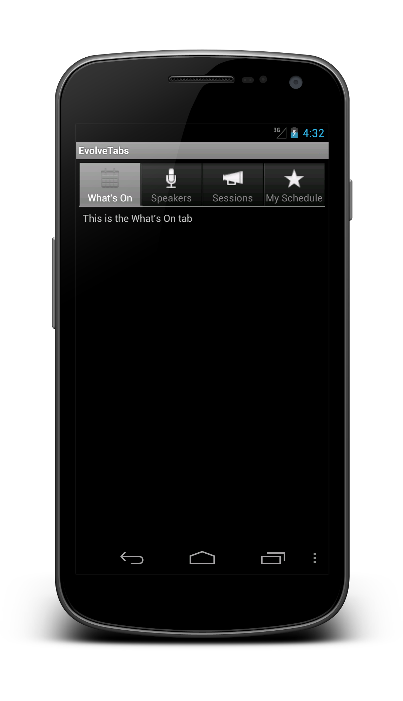
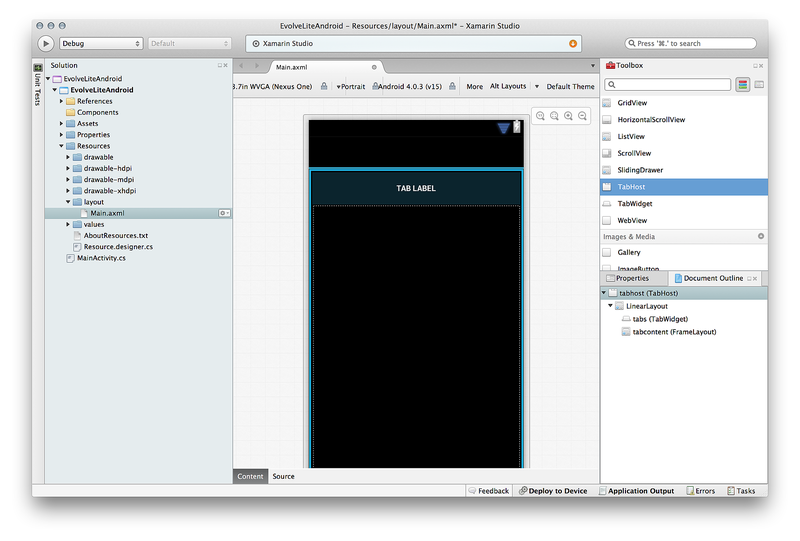
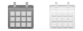

# Walkthrough - Creating a tabbed UI with TabHost

_This article will walk through creating a tabbed UI in Xamarin.Android using the TabHost API._

> [!NOTE]
> **Note:** `TabHost` is an old API that has been deprecated by Google. Developers are encouraged to 
> build tabbed applications using the [ActionBar](~/android/user-interface/controls/action-bar.md). The
> `ActionBar` is available in all version of Android. It was first introduced in Android 3.0 (API level 11) 
> and was back ported to Android 2.2 (API level 8) and Android 2.3 (API level 10) in 
> the [V7 AppCompat Library](http://developer.android.com/tools/support-library/features.html#v7-appcompat), which
> is available to Xamarin.Android via the 
> [Xamarin Android Support Library - V7](https://www.nuget.org/packages/Xamarin.Android.Support.v7.AppCompat/)
> package.

This article will walk through creating a tabbed UI in Xamarin.Android
by using the `TabHost` API. This is an older API that is available in all
versions of Android. This example will create an application with three
tabs, with the logic for each tab being encapsulated in an Activity.
The following screenshot is an example of the application that we will
create:



<a name="Creating_the_Application" />

## Creating the Application

Download and unzip
[TabHostWalkthrough](https://developer.xamarin.com/samples/monodroid/UserInterface/TabHostWalkthrough/).
This project serves as the starting point for our application and
contains some images. If you examine this project, you will see that
we've already created the drawable resources for the tab icons.

First let's update the layout file **Resources/Layout/Main.axml** that
will host the tabs. Edit **Resources/Layout/Main.axml** and insert the
following XML:

```xml
<?xml version="1.0" encoding="utf-8"?>
<TabHost xmlns:android="http://schemas.android.com/apk/res/android"
         android:id="@android:id/tabhost"
         android:layout_width="fill_parent"
         android:layout_height="fill_parent">
    <LinearLayout
            android:orientation="vertical"
            android:layout_width="fill_parent"
            android:layout_height="fill_parent"
            android:padding="5dp">
        <TabWidget
                android:id="@android:id/tabs"
                android:layout_width="fill_parent"
                android:layout_height="wrap_content" />
        <FrameLayout
                android:id="@android:id/tabcontent"
                android:layout_width="fill_parent"
                android:layout_height="fill_parent"
                android:padding="5dp" />
    </LinearLayout>
</TabHost>
```

The following screenshot shows the layout in the Xamarin Designer:

[](creating-a-tabbed-ui-images/image04.png)

The TabHost must have two child views inside it: a `TabWidget` and a
`FrameLayout`. To position the `TabWidget` and `FrameLayout` vertically
inside the `TabHost`, a `LinearLayout` is used. The FrameLayout is
where the content for each tab goes, which is empty because the
`TabHost` will automatically embed each Activity at runtime. There are
several rules that must be observed when it comes to creating the
layout for tabbed user interfaces:

-   The `TabHost` must have the id `@android:id/tabhost`.

-   The `TabWidget` must have the id `@android:id/tabs`.

-   The `FrameLayout` must have the id `@android:id/tabcontent`.

-   `TabHost` requires any activity that it manages to inherit from
   `TabActivity`. Therefore, it is important to subclass
   `TabActivity` here &ndash; a regular Activity will not work.

Edit the file **MainActivity.cs** so that the class `MainActivity`
subclasses `TabActivity` as shown in the following code snippet:

```csharp
[Activity (Label = "@string/app_name", MainLauncher = true, Icon="@drawable/ic_launcher")]
public class MainActivity : TabActivity
{
    protected override void OnCreate(Bundle bundle)
    {
        base.OnCreate(bundle);
        SetContentView(Resource.Layout.Main);
    }
}
```

Create four separate Activity classes in your project:
`MyScheduleActivity`, `SessionsActivity`, `SpeakersActivity`, and
`WhatsOnActivity`. Each activity will make up the UI of a tab. For now
these Activities will be a stub that displays a `TextView` with a
simple message. Edit the code in each activity to contain the following
`OnCreate` implementation:

```csharp
[Activity]
public class MyScheduleActivity : Activity
{
    protected override void OnCreate (Bundle savedInstanceState)
    {
        base.OnCreate (savedInstanceState);
        TextView textview = new TextView (this);
        textview.Text = "This is the My Schedule tab";
        SetContentView (textview);
    }
}
```

Notice that the above code doesn't use a layout file. It just creates a
`TextView` with some text, and sets that `TextView` as the content
view. Duplicate this for each of the remaining three activities.

Next we will assign the icons to each tab. Each tab requires two icons
&ndash; one for the selected state and one for the unselected state. An
example of these two different icons can be seen in the following two
images (the necessary icons for this application have already been
added to the sample project):




We will assign the drawable resources to the icon tabs by defining a
*State-List Drawable*. State-list drawables are a special drawable
resources that are defined in XML and allow you to specify different
images that are specific to that item's state. In this example there is
one image that is used when a tab is selected, and another that is used
when the tab is not selected. To save you time, the necessary
state-list drawables have been added to the project. The following list
shows the files and the XML each contains:

-   `ic_tab_my_schedule.xml`

    ```xml
    <?xml version="1.0" encoding="utf-8"?>
    <selector xmlns:android="http://schemas.android.com/apk/res/android">
        <item android:drawable="@drawable/ic_tab_whats_on_selected"
              android:state_selected="true"/>
        <item android:drawable="@drawable/ic_tab_whats_on_unselected"/>
    </selector>
    ```

-   `ic_tab_sessions.xml`

    ```xml
    <?xml version="1.0" encoding="utf-8"?>
    <selector xmlns:android="http://schemas.android.com/apk/res/android">
        <item android:drawable="@drawable/ic_tab_sessions_selected"
              android:state_selected="true"/>
        <item android:drawable="@drawable/ic_tab_sessions_unselected"/>
    </selector>
    ```

-   `ic_tab_speakers.xml`

    ```xml
    <?xml version="1.0" encoding="utf-8"?>
    <selector xmlns:android="http://schemas.android.com/apk/res/android">
        <item android:drawable="@drawable/ic_tab_speakers_selected"
              android:state_selected="true"/>
        <item android:drawable="@drawable/ic_tab_speakers_unselected"/>
    </selector>
    ```

-   `ic_tab_whats_on.xml`

    ```xml
    <?xml version="1.0" encoding="utf-8"?>
    <selector xmlns:android="http://schemas.android.com/apk/res/android">
        <item android:drawable="@drawable/ic_tab_whats_on_selected"
              android:state_selected="true"/>
        <item android:drawable="@drawable/ic_tab_whats_on_unselected"/>
    </selector>
    ```

Tabs are added to the `TabHost` programmatically, which is a very
repetitive task. To help with this, add the following method to the
class `MainActivity`:

```csharp
private void CreateTab(Type activityType, string tag, string label, int drawableId )
{
    var intent = new Intent(this, activityType);
    intent.AddFlags(ActivityFlags.NewTask);

    var spec = TabHost.NewTabSpec(tag);
    var drawableIcon = Resources.GetDrawable(drawableId);
    spec.SetIndicator(label, drawableIcon);
    spec.SetContent(intent);

    TabHost.AddTab(spec);
}
```

Each tab in the `TabHost` is represented by an instance of the of the
`TabHost.TabSpec` class. This instance contains the meta-data necessary
to render the tab, specifically:

-   **Text and Icon** &ndash; To be displayed in the `TabWidget`.

-   **Tab Content** &ndash; This may be either an `Activity` or a `View` and is displayed when the tab is selected.

-   **Unique Tag** &ndash; Each tab must have a unique tag assigned to it.

We must add a `TabHost.TabSpec` instance for each tab in our application. Lets do that in the next step.

Update the method `OnCreate` in `MainActivity` so that it resembles the
following code:

```csharp
protected override void OnCreate(Bundle bundle)
{
    base.OnCreate(bundle);
    SetContentView(Resource.Layout.Main);

    CreateTab(typeof(WhatsOnActivity), "whats_on", "What's On", Resource.Drawable.ic_tab_whats_on);
    CreateTab(typeof(SpeakersActivity), "speakers", "Speakers", Resource.Drawable.ic_tab_speakers);
    CreateTab(typeof(SessionsActivity), "sessions", "Sessions", Resource.Drawable.ic_tab_sessions);
    CreateTab(typeof(MyScheduleActivity), "my_schedule", "My Schedule", Resource.Drawable.ic_tab_my_schedule);
}
```

Run the application. Your application should look something like the
screenshot shown at the beginning of this walkthrough.

That's it! We have created a tabbed application which gives the user an
easy way navigate to different parts of an application.


<a name="Summary" />

## Summary

This chapter discussed tabbed layouts and guided you through process of
creating a tabbed application. The walkthrough demonstrated how to use
a `TabActivity` to inflate a layout file that hosting a `TabHost` and a
`TabWidget`. The `TabHost` was then populated with a collection of
`TabHost.TabSpec` objects which would be used by the `TabHost` at
runtime to instantiate the activities that would be used in each tab.


## Related Links

- [TabHostWalkthrough (sample)](https://developer.xamarin.com/samples/monodroid/UserInterface/TabHostWalkthrough/)
- [TabHost](https://developer.xamarin.com/api/type/Android.Widget.TabHost/)
- [TabWidget](https://developer.xamarin.com/api/type/Android.Widget.TabWidget/)
- [TabActivity](https://developer.xamarin.com/api/type/Android.App.TabActivity/)
- [ActionBar](http://developer.android.com/guide/topics/ui/actionbar.html)
- [Android Support Library v7 AppCompat NuGet Package](https://www.nuget.org/packages/Xamarin.Android.Support.v7.AppCompat/)
- [v7 appcompat library](http://developer.android.com/tools/support-library/features.html#v7-appcompat)
