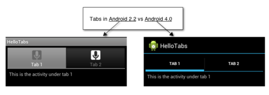

# Tabbed Layouts

## Overview

Tabs are a popular user interface pattern in mobile applications 
because of their simplicity and usability. They provide a consistent, 
easy way to navigate between various screens in an application. Android 
has several API's for tabbed interfaces: 

-   **TabHost** &ndash; This is the original API for creating tabbed user 
    interfaces. A `TabHost` widget is added to a layout and acts as a 
    container for tabbed views. This API has since been deprecated and 
    it's use is discouraged. 

-   **ActionBar** &ndash; This is part of a new set of API's that was 
    introduced in Android 3.0 (API level 11) with goal of providing a 
    consistent navigation and view-switching interface. It has been 
    back ported to Android 2.2 (API level 8) with the 
    [Android Support Library v7](https://www.nuget.org/packages/Xamarin.Android.Support.v7.AppCompat/). 

-   **PagerTabStrip** &ndash; Indicates the current, next, and previous pages 
    of a `ViewPager`. `ViewPager` is available only via 
    [Android Support Library v4](https://www.nuget.org/packages/Xamarin.Android.Support.v4/).
     For more information about `PagerTabStrip`, see 
    [ViewPager](~/android/user-interface/controls/view-pager/index.md).

-   **Toolbar** &ndash; `Toolbar` is a newer and more flexible action 
    bar component that replaces `ActionBar`. `Toolbar` is available in
    Android 5.0 Lollipop or later, and it is also available for older versions of Android via the 
    [Android Support Library v7](https://www.nuget.org/packages/Xamarin.Android.Support.v7.AppCompat/) NuGet package. 
    `Toolbar` is currently the recommended action bar component to use in Android apps.
    For more information, see [Toolbar](~/android/user-interface/controls/tool-bar/index.md). 

These API's are visually very different, and are not compatible with 
each other. The following screen image shows `TabHost` and `ActionBar` 
side-by-side: 

These incompatible API's exist because of significant UI changes 
since Android 3.0 (API level 11). One of these UI changes was the 
[action bar design pattern](http://www.androidpatterns.com/uap_pattern/action-bar), 
a pattern intended to provide easy access to navigation and key 
functionality in an application. The `ActionBar` API was introduced to 
support this pattern. 

The `ActionBar` API is simpler and arguably provides a better user 
experience. It has been back ported to Android 2.2 and is the preferred 
choice for Xamarin.Android applications. 

The `TabHost` API is compatible across all versions of Android but 
requires more effort to use and is not consistent with the current 
[Android UI Guidelines](http://developer.android.com/design/index.html). 
Developers are discouraged from using this API and should favour the newer 
ActionBar for their Xamarin.Android applications. 

## ActionBarSherlock

Before the ActionBar API's were backported to Android 2.2, developers 
who wanted the newer look and feel of the ActionBar API but could use a 
third-party library, 
[ActionBarSherlock](http://actionbarsherlock.com). ActionBarSherlock is 
an extension of the Android Support Library designed to backport the 
action bar design pattern to Android 2.x. When running on Android 3.0 
or higher, ActionBarSherlock will automatically use the native 
`ActionBar` API provided by Android. Older versions of Android will use 
a custom implemention that will mimic the look and feel of the newer 
`ActionBar` API. The 
[ActionBarSherlock component](https://www.nuget.org/packages/xamstore-XamarinActionBarSherlock/) 
makes it easy to add ActionBarSherlock to a Xamarin.Android 
application. 

## Related Links

- [TabHost Overview](tab-host.md)
- [TabHost Walkthrough](~/android/user-interface/layouts/tab-layout/creating-a-tabbed-ui.md)
- [ActionBar](http://developer.android.com/guide/topics/ui/actionbar.html)
- [Android Support Library v7 AppCompat NuGet Package](https://www.nuget.org/packages/Xamarin.Android.Support.v7.AppCompat/)
- [v7 appcompat library](http://developer.android.com/tools/support-library/features.html#v7-appcompat)
