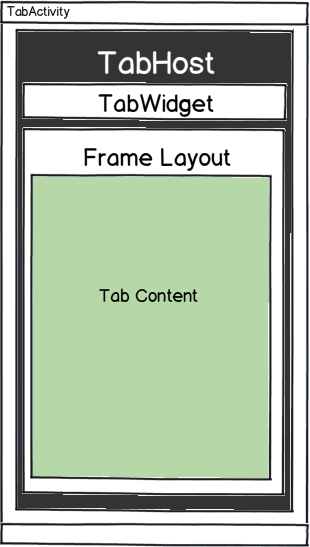

# Tab Layout with TabHost

_This article will provide a high level overview of the the TabHost, an older API used to create tabbed layouts in a Xamarin.Android application._

## Overview

> [!NOTE]
> `TabHost` is an old API that has been deprecated by Google. Developers are encouraged to
> build tabbed applications using the [ActionBar](~/android/user-interface/controls/action-bar.md). The
> `ActionBar` is available in all version of Android. It was first introduced in Android 3.0 (API level 11)
> and was back ported to Android 2.2 (API level 8) and Android 2.3 (API level 10) in
> the [V7 AppCompat Library](http://developer.android.com/tools/support-library/features.html#v7-appcompat), which
> is available to Xamarin.Android via the
> [Xamarin Android Support Library - V7](https://www.nuget.org/packages/Xamarin.Android.Support.v7.AppCompat/)
> package.

The `TabHost` is the older, original API for creating tabbed user
interfacesIt is best suited for Xamarin.Android Applications that must
support Android 2.2 and Android 2.3 and cannot use **ActionBarSherlock**.
The following five components are all involved with the `TabHost` API:

-  **TabActivity** &ndash; This is a specialized view that acts as a
   container for a `TabHost` (described below).

-  **TabHost** &ndash; This is a container for the tabbed UI. It hosts two
   children: a list of tab labels and a `FrameLayout` that displays the
   tab content.

-  **TabWidget** &ndash; This control displays a list of tab labels, one for
   each tab in the `TabHost` . Each tab in a `TabHost` are represented
   by a `TabHost.TabSpec` object. This object contains the meta-data
   for each tab. When the user selects a tab, the `TabHost` responds to
   the selection by displaying the appropriate tab.

-  **FrameLayout** &ndash; A tabbed UI must have a `FrameLayout` contained
   inside of a `TabHost`. It is used to display the contents for the
   tab.

-  **Activities or Views** &ndash; When a tab is selected, it displays either
   an Activity or a View in the `FrameLayout`.

The following diagram shows how all of these components relate
together:

The tab content may be either Activities or Views. Views are relatively
lightweight and simple, but may result in a lot of unrelated code
co-habitating in the Activity. This will result in a poor separation of
concerns and a bloated class that is hard to maintain. In contrast,
Activities require system resources but allow for a more modular
approach with the logic for each tab encapsulated in it's own distinct
class.

## Summary

This article explained the high level components of the older `TabHost`
API for Android and how they all relate together.

## Related Links

- [ActionBar](http://developer.android.com/guide/topics/ui/actionbar.html)
- [TabHost](https://developer.xamarin.com/api/type/Android.Widget.TabHost/)
- [TabHost.TabSpec](https://developer.xamarin.com/api/type/Android.Widget.TabHost+TabSpec/)
- [TabWidget](https://developer.xamarin.com/api/type/Android.Widget.TabWidget/)
- [TabActivity](https://developer.xamarin.com/api/type/Android.App.TabActivity/)
- [ActionBar](http://developer.android.com/guide/topics/ui/actionbar.html)
- [Android Support Library v7 AppCompat NuGet Package](https://www.nuget.org/packages/Xamarin.Android.Support.v7.AppCompat/)
- [v7 appcompat library](http://developer.android.com/tools/support-library/features.html#v7-appcompat)
