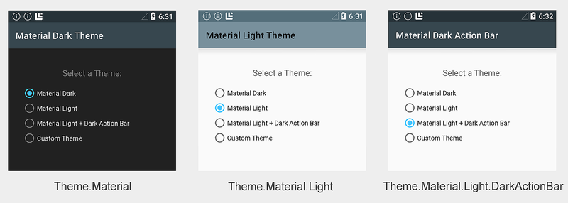
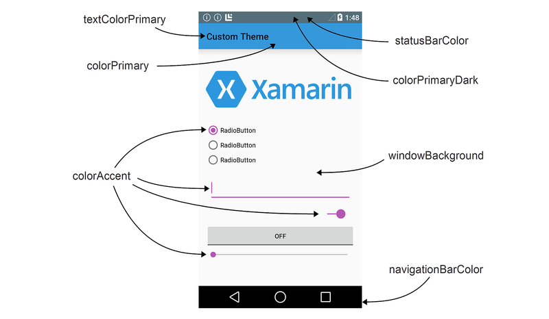
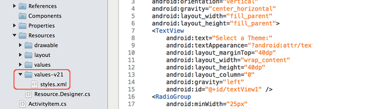
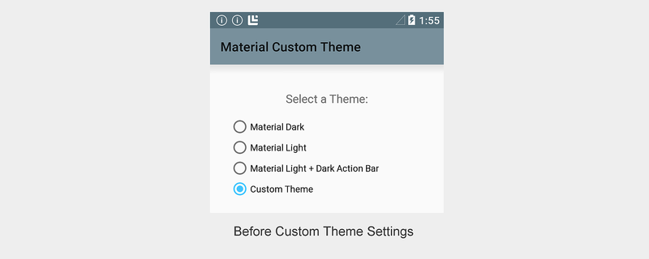
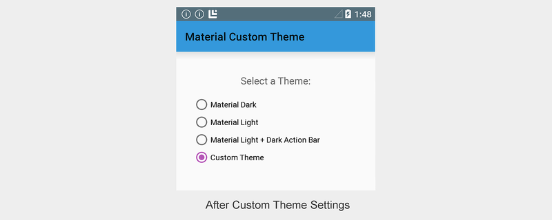
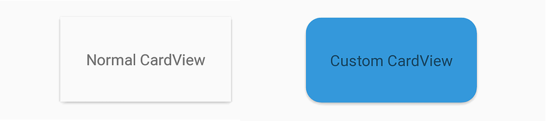

# Material Theme

*Material Theme* is a user interface style that determines the look and
feel of views and activities starting with Android 5.0 (Lollipop). Material Theme
is built into Android 5.0, so it is used by the system UI as well as by
applications. Material Theme is not a "theme" in the sense
of a system-wide appearance option that a user can dynamically choose
from a settings menu. Rather, Material Theme can be thought of as a set
of related built-in base styles that you can use to customize the look
and feel of your app.

Android provides three Material Theme flavors:

- `Theme.Material` &ndash; Dark version of Material Theme; this is the default flavor in Android 5.0.

- `Theme.Material.Light` &ndash; Light version of Material Theme.

- `Theme.Material.Light.DarkActionBar` &ndash; Light version of Material Theme, but with a dark action bar.

Examples of these Material Theme flavors are displayed here:

[](material-theme-images/three-flavors.png#lightbox)

You can derive from Material Theme to create your own theme, overriding
some or all color attributes. For example, you can create a theme that
derives from `Theme.Material.Light`, but overrides the app bar color to
match the color of your brand. You can also style individual views; for
example, you can create a style for 
[CardView](~/android/user-interface/controls/card-view.md) 
that has more rounded corners and uses a darker background color.

You can use a single theme for an entire app, or you can use different
themes for different screens (activities) in an app. In the above
screenshots, for example, a single app uses a different theme for each
activity to demonstrate the built-in color schemes. Radio
buttons switch the app to different activities, and, as a result,
display different themes.

Because Material Theme is supported only on Android 5.0 and later, you
cannot use it (or a custom theme derived from Material Theme) to theme
your app for running on earlier versions of Android. However, you can
configure your app to use Material Theme on Android 5.0 devices and
gracefully fall back to an earlier theme when it runs on older versions
of Android (see the
[Compatibility](#compatibility) section of this article for details).

## Requirements

The following is required to use the new Android 5.0 Material Theme
features in Xamarin-based apps:

- **Xamarin.Android** &ndash; Xamarin.Android 4.20 or later must be 
   installed and configured with either Visual Studio or Visual Studio for Mac. 

- **Android SDK** &ndash; Android 5.0 (API 21) or later must be 
   installed via the Android SDK Manager.

- **Java JDK 1.8** &ndash; JDK 1.7 can be used if you are specifically 
    targeting API level 23 and earlier. JDK 1.8 is available from 
   [Oracle](https://www.oracle.com/technetwork/java/javase/downloads/jdk8-downloads-2133151.html).

To learn how to configure an Android 5.0 app project, 
see [Setting Up an Android 5.0 Project](~/android/platform/lollipop.md).

## Using the Built-in Themes

The easiest way to use Material Theme is to configure your app to use
a built-in theme without customization. If you don't want to
explicitly configure a theme, your app will default to `Theme.Material`
(the dark theme). If your app has only one activity, you can configure
a theme at the activity level. If your app has multiple activities,
you can configure a theme at the application level so that it uses the
same theme across all activities, or you can assign different themes to
different activities. The following sections explain how to configure
themes at the app level and at the activity level.

### Theming an Application

To configure an entire application to use a Material Theme flavor,
set the `android:theme` attribute of the application node in
**AndroidManifest.xml** to one of the following:

- `@android:style/Theme.Material` &ndash; Dark theme.

- `@android:style/Theme.Material.Light` &ndash; Light theme.

- `@android:style/Theme.Material.Light.DarkActionBar` &ndash; Light 
   theme with dark action bar.

The following example configures the application *MyApp* to use the light theme:

```xml
<application android:label="MyApp" 
             android:theme="@android:style/Theme.Material.Light">
</application>
```

Alternately, you can set the application `Theme` attribute in **AssemblyInfo.cs** 
(or **Properties.cs**). For example:

```C#
[assembly: Application(Theme="@android:style/Theme.Material.Light")]
```

When the application theme is set to
`@android:style/Theme.Material.Light`, every activity in *MyApp* will be
displayed using `Theme.Material.Light`.

### Theming an Activity

To theme an activity, you add a `Theme` setting to the `[Activity]`
attribute above your activity declaration and assign `Theme` to the
Material Theme flavor that you want to use. The following example themes
an activity with `Theme.Material.Light`:

```C#
[Activity(Theme = "@android:style/Theme.Material.Light",
          Label = "MyApp", MainLauncher = true, Icon = "@drawable/icon")]  
```

Other activities in this app will use the default `Theme.Material` dark
color scheme (or, if configured, the application theme setting).

<a name="customtheme"></a>

## Using Custom Themes

You can enhance your brand by creating a custom theme that styles
your app with your brand&rsquo;s colors. To create a custom
theme, you define a new style that derives from a built-in Material
Theme flavor, overriding the color attributes that you want to
change. For example, you can define a custom theme that derives from
`Theme.Material.Light.DarkActionBar` and changes the screen background
color to beige instead of white.

Material Theme exposes the following layout attributes for customization:

- `colorPrimary` &ndash; The color of the app bar.

- `colorPrimaryDark` &ndash; The color of the status bar and contextual 
    app bars; this is normally a dark version of `colorPrimary`.

- `colorAccent` &ndash; The color of UI controls such as check boxes, 
    radio buttons, and edit text boxes.

- `windowBackground` &ndash; The color of the screen background.

- `textColorPrimary` &ndash; The color of UI text in the app bar.

- `statusBarColor` &ndash; The color of the status bar.

- `navigationBarColor` &ndash; The color of the navigation bar.

These screen areas are labeled in the following diagram:

[](material-theme-images/screen-attributes.png#lightbox)

By default, `statusBarColor` is set to the value of
`colorPrimaryDark`. You can set `statusBarColor` to a solid color, or
you can set it to `@android:color/transparent` to make the status bar
transparent. The navigation bar can also be made transparent by setting
`navigationBarColor` to `@android:color/transparent`.

### Creating a Custom App Theme

You can create a custom app theme by creating and modifying files in
the **Resources** folder of your app project. To style your app with a
custom theme, use the following steps:

- Create a **colors.xml** file in **Resources/values** &mdash; you use this 
    file to define your custom theme colors. For example, you can paste the 
    following code into **colors.xml** to help you get started:

```xml
<?xml version="1.0" encoding="UTF-8" ?>
<resources>
    <color name="my_blue">#3498DB</color>
    <color name="my_green">#77D065</color>
    <color name="my_purple">#B455B6</color>
    <color name="my_gray">#738182</color>
</resources>
```

- Modify this example file to define the names and color codes for 
    color resources that you will use in your custom theme.

- Create a **Resources/values-v21** folder. In this folder, create 
    a **styles.xml** file:

    [](material-theme-images/values-v21.png#lightbox)

    Note that **Resources/values-v21** is specific to Android 5.0 &ndash; older 
    versions of Android will not read files in this folder.

- Add a `resources` node to **styles.xml** and define a `style` node with the 
    name of your custom theme. For example, here is a **styles.xml** file 
    that defines *MyCustomTheme* (derived from the built-in 
    `Theme.Material.Light` theme style):

```xml
<?xml version="1.0" encoding="UTF-8" ?>
<resources>
    <!-- Inherit from the light Material Theme -->
    <style name="MyCustomTheme" parent="android:Theme.Material.Light">
        <!-- Customizations go here -->
    </style>
</resources>
```

- At this point, an app that uses *MyCustomTheme* will display the 
    stock `Theme.Material.Light` theme without customizations:

    [](material-theme-images/custom-theme-before.png#lightbox)

- Add color customizations to **styles.xml** by defining the colors of layout 
    attributes that you want to change. For example, to change the app bar color 
    to `my_blue` and change the color of UI controls to `my_purple`, add color 
    overrides to **styles.xml** that refer to color resources configured 
    in **colors.xml**:

```xml
<?xml version="1.0" encoding="UTF-8" ?>
<resources>
    <!-- Inherit from the light Material Theme -->
    <style name="MyCustomTheme" parent="android:Theme.Material.Light">
        <!-- Override the app bar color -->
        <item name="android:colorPrimary">@color/my_blue</item>
        <!-- Override the color of UI controls -->
        <item name="android:colorAccent">@color/my_purple</item>
    </style>
</resources>
```

With these changes in place, an app that uses *MyCustomTheme* will display 
an app bar color in `my_blue` and UI controls in `my_purple`, but use the 
`Theme.Material.Light` color scheme everywhere else:

[](material-theme-images/custom-theme-after.png#lightbox)

In this example, *MyCustomTheme* borrows colors from `Theme.Material.Light` 
for the background color, status bar, and text colors, but it changes the 
color of the app bar to `my_blue` and sets the color of the radio button 
to `my_purple`.

<a name="customview"></a>

### Creating a Custom View Style

Android 5.0 also makes it possible for you to style an individual
view. After you create **colors.xml** and **styles.xml** (as described
in the previous section), you can add a view style to **styles.xml**.
To style an individual view, use the following steps:

- Edit **Resources/values-v21/styles.xml** and add a `style` node with 
    the name of your custom view style. Set the custom color attributes for 
    your view within this `style` node. For example, to create a custom 
    [CardView](~/android/user-interface/controls/card-view.md) 
    style that has more rounded corners and uses `my_blue` as 
    the card background color, add a `style` node to **styles.xml** (inside 
    the `resources` node) and configure the background color and corner radius:

```xml
<!-- Theme an individual view: -->
<style name="CardView.MyBlue">

    <!-- Change the background color to Xamarin blue: -->
    <item name="cardBackgroundColor">@color/my_blue</item>

    <!-- Make the corners very round: -->
    <item name="cardCornerRadius">18dp</item>
</style>
```

- In your layout, set the `style` attribute for that view to match the custom 
    style name that you chose in the previous step. For example:

```xml
<android.support.v7.widget.CardView
    style="@style/CardView.MyBlue"
    android:layout_width="200dp"
    android:layout_height="100dp"
    android:layout_gravity="center_horizontal">
```

The following screenshot provides an example of the default 
`CardView` (shown on the left) as compared to a `CardView` that 
has been styled with the custom `CardView.MyBlue` theme (shown 
on the right):

[](material-theme-images/custom-cardview.png#lightbox)

In this example, the custom `CardView` is displayed with the 
background color `my_blue` and an 18dp corner radius.

## Compatibility

To style your app so that it uses Material Theme on Android 5.0 but
automatically reverts to a downward-compatible style on older Android
versions, use the following steps:

- Define a custom theme in **Resources/values-v21/styles.xml** that derives 
    from a Material Theme style. For example:

```xml
<resources>
    <style name="MyCustomTheme" parent="android:Theme.Material.Light">
        <!-- Your customizations go here -->
    </style>
</resources>
```

- Define a custom theme in **Resources/values/styles.xml** that derives 
    from an older theme, but uses the same theme name as above. For example:

```xml
<resources>
    <style name="MyCustomTheme" parent="android:Theme.Holo.Light">
        <!-- Your customizations go here -->
    </style>
</resources>
```

- In **AndroidManifest.xml**, configure your app with the custom theme name. 
    For example:

```xml
<application android:label="MyApp" 
             android:theme="@style/MyCustomTheme">
</application>
```

- Alternately, you can style a specific activity using your custom theme:

```C#
[Activity(Label = "MyActivity", Theme = "@style/MyCustomTheme")]
```

If your theme uses colors defined in a **colors.xml** file,
be sure to place this file in **Resources/values** (rather than
**Resources/values-v21**) so that both versions of your custom theme can
access your color definitions.

When your app runs on an Android 5.0 device, it will use the theme
definition specified in **Resources/values-v21/styles.xml**. When this
app runs on older Android devices, it will automatically fall back to
the theme definition specified in **Resources/values/styles.xml**.

For more information about theme compatibility with older Android versions, 
see [Alternate Resources](~/android/app-fundamentals/resources-in-android/alternate-resources.md).

## Summary

This article introduced the new Material Theme user interface style
included in Android 5.0 (Lollipop). It described the three built-in
Material Theme flavors that you can use to style your app, it explained
how to create a custom theme for branding your app, and it provided
an example of how to theme an individual view. Finally, this article
explained how to use Material Theme in your app while maintaining
downward compatibility with older versions of Android.

## Related Links

- [ThemeSwitcher (sample)](/samples/xamarin/monodroid-samples/android50-themeswitcher)
- [Introduction to Lollipop](../platform/lollipop.md)
- [CardView](controls/card-view.md)
- [Alternate Resources](../app-fundamentals/resources-in-android/alternate-resources.md)
- [Android Lollipop](https://developer.android.com/about/versions/lollipop)
- [Android Pie Developer](https://developer.android.com/about/versions/pie/)
- [Material Design](https://developer.android.com/guide/topics/ui/look-and-feel/)
- [Material Design Principles](https://material.io/design/)
- [Maintaining Compatibility](https://developer.android.com/training/backward-compatible-ui/)