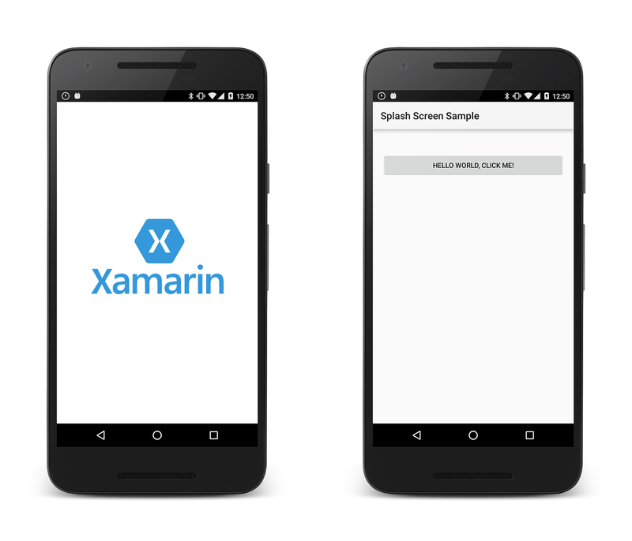
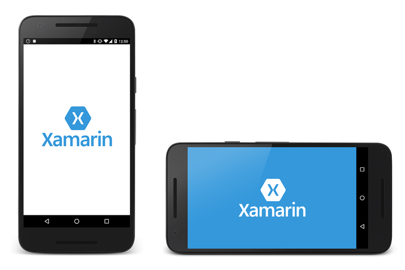

# Splash Screen

[ Download the sample](/samples/xamarin/monodroid-samples/splashscreen)

_An Android app takes some time to start up, especially when the app is first launched on a device. A splash screen may display start up progress to the user or to indicate branding._

## Overview

An Android app takes some time to start up, especially during the
first time the app is run on a device (sometimes this is referred to as
a _cold start_). The splash screen may display start up progress to the
user, or it may display branding information to identify and promote
the application.

This guide discusses one technique to implement a splash screen in
an Android application. It covers the following steps:

1. Creating a drawable resource for the splash screen.

2. Defining a new theme that will display the drawable resource.

3. Adding a new Activity to the application that will be used as the
    splash screen defined by the theme created in the previous step.

[](splash-screen-images/splashscreen-01.png#lightbox)

## Requirements

This guide assumes that the application targets Android API level
21 or higher. The application must also have the
**Xamarin.Android.Support.v4** and
**Xamarin.Android.Support.v7.AppCompat** NuGet packages added to the
project.

All of the code and XML in this guide may be found in the
[SplashScreen](/samples/xamarin/monodroid-samples/splashscreen) sample project for this
guide.

## Implementing A Splash Screen

The quickest way to render and display the splash screen is to create a
custom theme and apply it to an Activity that exhibits the splash
screen. When the Activity is rendered, it loads the theme and applies
the drawable resource (referenced by the theme) to the background of
the activity. This approach avoids the need for creating a layout file.

The splash screen is implemented as an Activity that displays the
branded drawable, performs any initializations, and starts up any
tasks. Once the app has bootstrapped, the splash screen Activity starts
the main Activity and removes itself from the application back stack.

### Creating a Drawable for the Splash Screen

The splash screen will display an XML drawable in the background of the
splash screen Activity. It is necessary to use a bitmapped image (such
as a PNG or JPG) for the image to display.

The sample application defines a drawable called **splash_screen.xml**. This drawable uses a
[Layer List](https://developer.android.com/guide/topics/resources/drawable-resource.html#LayerList)
to center the splash screen image in the application as shown in the following xml:

```xml
<?xml version="1.0" encoding="utf-8"?>
<layer-list xmlns:android="http://schemas.android.com/apk/res/android">
  <item>
    <color android:color="@color/splash_background"/>
  </item>
  <item>
    <bitmap
        android:src="@drawable/splash_logo"
        android:tileMode="disabled"
        android:gravity="center"/>
  </item>
</layer-list>
```

This `layer-list` centers the splash image on a background color specified by the `@color/splash_background` resource. The sample application defines this color in the **Resources/values/colors.xml** file:

```xml
<?xml version="1.0" encoding="utf-8"?>
<resources>
  ...
  <color name="splash_background">#FFFFFF</color>
</resources>
```

For more information about `Drawable` objects see the [Google documentation on Android Drawable](https://developer.android.com/reference/android/graphics/drawable/Drawable).

### Implementing a Theme

To create a custom theme for the splash screen Activity, edit (or add)
the file **values/styles.xml** and create a new `style` element for
the splash screen. A sample **values/style.xml** file is shown below
with a `style` named **MyTheme.Splash**:

```xml
<resources>
  <style name="MyTheme.Base" parent="Theme.AppCompat.Light">
  </style>

  <style name="MyTheme" parent="MyTheme.Base">
  </style>

  <style name="MyTheme.Splash" parent ="Theme.AppCompat.Light.NoActionBar">
    <item name="android:windowBackground">@drawable/splash_screen</item>
    <item name="android:windowNoTitle">true</item>  
    <item name="android:windowFullscreen">true</item>  
    <item name="android:windowContentOverlay">@null</item>  
    <item name="android:windowActionBar">true</item>  
  </style>
</resources>
```

**MyTheme.Splash** is very spartan &ndash; it declares the window
background, explicitly removes the title bar from the window, and
declares that it is full-screen. If you want to create a splash screen
that emulates the UI of your app before the activity inflates the first
layout, you can use `windowContentOverlay` rather than
`windowBackground` in your style definition. In this case, you must
also modify the **splash_screen.xml** drawable so that it displays an
emulation of your UI.

### Create a Splash Activity

Now we need a new Activity for Android to launch that has our splash
image and performs any startup tasks. The following code is an example
of a complete splash screen implementation:

```csharp
[Activity(Theme = "@style/MyTheme.Splash", MainLauncher = true, NoHistory = true)]
public class SplashActivity : AppCompatActivity
{
    static readonly string TAG = "X:" + typeof(SplashActivity).Name;

    public override void OnCreate(Bundle savedInstanceState, PersistableBundle persistentState)
    {
        base.OnCreate(savedInstanceState, persistentState);
        Log.Debug(TAG, "SplashActivity.OnCreate");
    }

    // Launches the startup task
    protected override void OnResume()
    {
        base.OnResume();
        Task startupWork = new Task(() => { SimulateStartup(); });
        startupWork.Start();
    }

    // Simulates background work that happens behind the splash screen
    async void SimulateStartup ()
    {
        Log.Debug(TAG, "Performing some startup work that takes a bit of time.");
        await Task.Delay (8000); // Simulate a bit of startup work.
        Log.Debug(TAG, "Startup work is finished - starting MainActivity.");
        StartActivity(new Intent(Application.Context, typeof (MainActivity)));
    }
}
```

`SplashActivity` explicitly uses the theme that was created in the
previous section, overriding the default theme of the application.
There is no need to load a layout in `OnCreate` as the theme declares a
drawable as the background.

It is important to set the `NoHistory=true` attribute so that the
Activity is removed from the back stack. To prevent the back button
from canceling the startup process, you can also override
`OnBackPressed` and have it do nothing:

```csharp
public override void OnBackPressed() { }
```

The startup work is performed asynchronously in `OnResume`. This is
necessary so that the startup work does not slow down or delay the
appearance of the launch screen. When the work has completed,
`SplashActivity` will launch `MainActivity` and the user may begin
interacting with the app.

This new `SplashActivity` is set as the launcher activity for the
application by setting the `MainLauncher` attribute to `true`. Because
`SplashActivity` is now the launcher activity, you must edit
`MainActivity.cs`, and remove the `MainLauncher` attribute from
`MainActivity`:

```csharp
[Activity(Label = "@string/ApplicationName")]
public class MainActivity : AppCompatActivity
{
    // Code omitted for brevity
}
```

## Landscape Mode

The splash screen implemented in the previous steps will display
correctly in both portrait and landscape mode. However, in some cases
it is necessary to have separate splash screens for portrait and
landscape modes (for example, if the splash image is full-screen).

To add a splash screen for landscape mode, use the following steps:

1. In the **Resources/drawable** folder, add the landscape version of
   the splash screen image you want to use. In this example,
   **splash_logo_land.png** is the landscape version of the logo that
   was used in the above examples (it uses white lettering instead of
   blue).

2. In the **Resources/drawable** folder, create a landscape version of
   the `layer-list` drawable that was defined earlier (for example,
   **splash_screen_land.xml**). In this file, set the bitmap path to
   the landscape version of the splash screen image. In the following
   example, **splash_screen_land.xml** uses **splash_logo_land.png**:

    ```xml
    <?xml version="1.0" encoding="utf-8"?>
    <layer-list xmlns:android="http://schemas.android.com/apk/res/android">
      <item>
        <color android:color="@color/splash_background"/>
      </item>
      <item>
        <bitmap
            android:src="@drawable/splash_logo_land"
            android:tileMode="disabled"
            android:gravity="center"/>
      </item>
    </layer-list>
    ```

3. Create the **Resources/values-land** folder if it doesn't already
    exist.

4. Add the files **colors.xml** and **style.xml** to **values-land**
    (these can be copied and modified from the existing
    **values/colors.xml** and **values/style.xml** files).

5. Modify **values-land/style.xml** so that it uses the landscape
    version of the drawable for `windowBackground`. In this example,
    **splash_screen_land.xml** is used:

    ```xml
    <resources>
      <style name="MyTheme.Base" parent="Theme.AppCompat.Light">
      </style>
        <style name="MyTheme" parent="MyTheme.Base">
      </style>
      <style name="MyTheme.Splash" parent ="Theme.AppCompat.Light.NoActionBar">
        <item name="android:windowBackground">@drawable/splash_screen_land</item>
        <item name="android:windowNoTitle">true</item>  
        <item name="android:windowFullscreen">true</item>  
        <item name="android:windowContentOverlay">@null</item>  
        <item name="android:windowActionBar">true</item>  
      </style>
    </resources>
    ```

6. Modify **values-land/colors.xml** to configure the colors you want
    to use for the landscape version of the splash screen. In this
    example, the splash background color is changed to blue for
    landscape mode:

    ```xml
    <?xml version="1.0" encoding="utf-8"?>
    <resources>
      <color name="primary">#2196F3</color>
      <color name="primaryDark">#1976D2</color>
      <color name="accent">#FFC107</color>
      <color name="window_background">#F5F5F5</color>
      <color name="splash_background">#3498DB</color>
    </resources>
    ```

7. Build and run the app again. Rotate the device to landscape mode while
    the splash screen is still displayed. The splash screen changes to the
    landscape version:

    [](splash-screen-images/landscape-splash.png#lightbox)

Note that the use of a landscape-mode splash screen does not always
provide a seamless experience. By default, Android launches the app in
portrait mode and transitions it to landscape mode even if the device
is already in landscape mode. As a result, if the app is launched while
the device is in landscape mode, the device briefly presents the
portrait splash screen and then animates rotation from the portrait to
the landscape splash screen. Unfortunately, this initial
portrait-to-landscape transition takes place even when
`ScreenOrientation = Android.Content.PM.ScreenOrientation.Landscape` is
specified in the splash Activity's flags. The best way to work around
this limitation is to create a single splash screen image that renders
correctly in both portrait and landscape modes.

## Summary

This guide discussed one way to implement a splash screen in a
Xamarin.Android application; namely, applying a custom theme to the
launch activity.

## Related Links

- [SplashScreen (sample)](/samples/xamarin/monodroid-samples/splashscreen)
- [layer-list Drawable](https://developer.android.com/guide/topics/resources/drawable-resource.html#LayerList)
- [Material Design Patterns - Launch Screens](https://material.io/design/communication/launch-screen.html#usage)