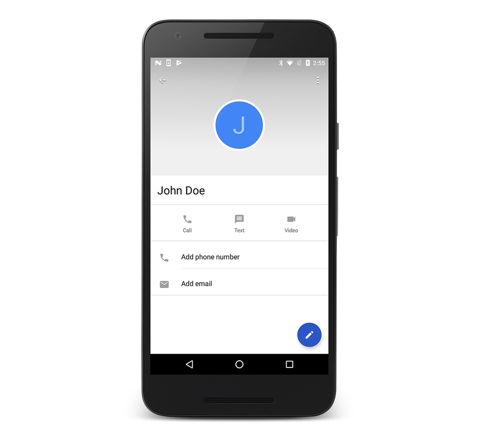

# User Profile

Android has supported enumerating contacts with the
[ContactsContract](xref:Android.Provider.ContactsContract)
provider since API Level 5. For example, listing contacts is as simple
as using the
[ContactContracts.Contacts](xref:Android.Provider.ContactsContract.Contacts)
class as shown in the following code example:

```csharp
// Get the URI for the user's contacts:
var uri = ContactsContract.Contacts.ContentUri;

// Setup the "projection" (columns we want) for only the ID and display name:
string[] projection = {
    ContactsContract.Contacts.InterfaceConsts.Id,
    ContactsContract.Contacts.InterfaceConsts.DisplayName };

// Use a CursorLoader to retrieve the user's contacts data:
CursorLoader loader = new CursorLoader(this, uri, projection, null, null, null);
ICursor cursor = (ICursor)loader.LoadInBackground();

// Print the contact data to the console if reading back succeeds:
if (cursor != null)
{
    if (cursor.MoveToFirst())
    {
        do
        {
            Console.WriteLine("Contact ID: {0}, Contact Name: {1}",
                               cursor.GetString(cursor.GetColumnIndex(projection[0])),
                               cursor.GetString(cursor.GetColumnIndex(projection[1])));
        } while (cursor.MoveToNext());
    }
}
```

Beginning with Android 4 (API Level 14), the
[ContactsContact.Profile](xref:Android.Provider.ContactsContract.Profile)
class is available through the `ContactsContract` provider. The
`ContactsContact.Profile` provides access to the personal profile for
the owner of a device, which includes contact data such as the device
owner's name and phone number.

## Required Permissions

To read and write contact data, applications must request the
`READ_CONTACTS` and `WRITE_CONTACTS` permissions, respectively.
Additionally, to read and edit the user profile, applications must
request the `READ_PROFILE` and `WRITE_PROFILE` permissions.

## Updating Profile Data

Once these permissions have been set, an application can use normal
Android techniques to interact with the user profile's data. For
example, to update the profile's display name, call
[ContentResolver.Update](xref:Android.Content.ContentResolver.Update*)
with a `Uri` retrieved through the
[ContactsContract.Profile.ContentRawContactsUri](xref:Android.Provider.ContactsContract.Profile.ContentRawContactsUri)
property, as shown below:

```csharp
var values = new ContentValues ();
values.Put (ContactsContract.Contacts.InterfaceConsts.DisplayName, "John Doe");

// Update the user profile with the name "John Doe":
ContentResolver.Update (ContactsContract.Profile.ContentRawContactsUri, values, null, null);
```

## Reading Profile Data

Issuing a query to the
[ContactsContact.Profile.ContentUri](xref:Android.Provider.ContactsContract.Profile.ContentUri)
reads back the profile data. For example, the following code will read
the user profile's display name:

```csharp
// Read the profile
var uri = ContactsContract.Profile.ContentUri;

// Setup the "projection" (column we want) for only the display name:
string[] projection = {
    ContactsContract.Contacts.InterfaceConsts.DisplayName };

// Use a CursorLoader to retrieve the data:
CursorLoader loader = new CursorLoader(this, uri, projection, null, null, null);
ICursor cursor = (ICursor)loader.LoadInBackground();
if (cursor != null)
{
    if (cursor.MoveToFirst ())
    {
        Console.WriteLine(cursor.GetString (cursor.GetColumnIndex (projection [0])));
    }
}
```

## Navigating to the User Profile

Finally, to navigate to the user profile, create an Intent with an
`ActionView` action and a `ContactsContract.Profile.ContentUri` then
pass it to the `StartActivity` method like this:

```csharp
var intent = new Intent (Intent.ActionView,
    ContactsContract.Profile.ContentUri);
StartActivity (intent);
```

When running the above code, the user profile is displayed as
illustrated in the following screenshot:

[](user-profile-images/01-profile-screen.png#lightbox)

Working with the user profile is similar to interacting with other data
in Android, and it offers an additional level of device personalization.

## Related Links

- [ContactsProviderDemo (sample)](/samples/xamarin/monodroid-samples/contactsproviderdemo)