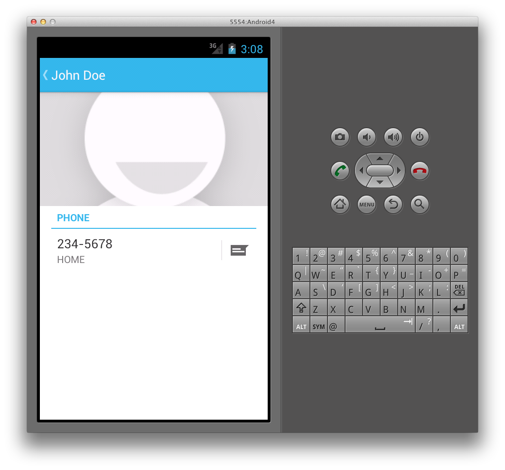

# User Profile

Android has supported enumerating contacts with the `ContactsContract` provider since API Level 5. For example, to list
contacts is as simple as using the `ContactContracts.Contacts` class,
as shown in the following code:

```csharp
var uri = ContactsContract.Contacts.ContentUri;
           
string[] projection = {
    ContactsContract.Contacts.InterfaceConsts.Id,
    ContactsContract.Contacts.InterfaceConsts.DisplayName };
           
var cursor = ManagedQuery (uri, projection, null, null, null);
           
if (cursor.MoveToFirst ()) {
    do {
        Console.WriteLine ("Contact ID: {0}, Contact Name: {1}",
            cursor.GetString (cursor.GetColumnIndex (projection [0])),
            cursor.GetString (cursor.GetColumnIndex (projection [1])));
                   
    } while (cursor.MoveToNext());
}
```

With Android 4 (API Level 14), a new `ContactsContact.Profile`
class is available through the ContactsContract provider. The `ContactsContact.Profile` provides access to a personal profile for
the owner of a device, which includes contact data such as the device owner’s
name and phone number.


## Required Permissions

To read and write contact data, applications must request the `Read_Contacts` and `Write_Contacts` permissions,
respectively. Additionally, to read and edit the user profile, applications must
request the `Read_Profile` and `Write_Profile`
permissions.


## Updating Profile Data

Once these permissions have been set, an application can use normal Android
techniques to interact with the user profile’s data. For example, to update
the profile’s display name we would call `ContentResolver.Update`
with a `Uri` retrieved through the `ContactsContract.Profile.ContentRawContactsUri` property, as shown
below:

```csharp
var values = new ContentValues ();
          
values.Put (ContactsContract.Contacts.InterfaceConsts.DisplayName,
    "John Doe");
           
ContentResolver.Update (ContactsContract.Profile.ContentRawContactsUri,
    values, null, null);
```


## Reading Profile Data

Issuing a query to the `ContactsContact.Profile.ContentUri` reads
back the profile data. For example, the following code will read the user
profile’s display name:

```csharp
string[] projection = {
    ContactsContract.Contacts.InterfaceConsts.DisplayName };
           
var cursor = ManagedQuery (uri, projection, null, null, null);

if (cursor.MoveToFirst ()) {
    Console.WriteLine(
        cursor.GetString (cursor.GetColumnIndex (projection [0])));
}
```


## Navigating to the People App

Finally, to navigate to the user profile in the new People app that comes
with Android 4, simply create an Intent with an `ActionView` action
and a `ContactsContract.Profile.ContentUri`, and pass it to the `StartActivity` method like this:

```csharp
var intent = new Intent (Intent.ActionView,
    ContactsContract.Profile.ContentUri);           
StartActivity (intent);
```

When running the above code, the People app will load to the user profile, as
shown in the following screenshot:

[](user-profile-images/15-people-app.png#lightbox)

Working with the user profile is now similar to interacting with other data
in Android, and offers an additional level of device personalization.


## Related Links

- [ContactsProviderDemo (sample)](https://developer.xamarin.com/samples/monodroid/ContactsProviderDemo/)
- [Introducing Ice Cream Sandwich](http://www.android.com/about/ice-cream-sandwich/)
- [Android 4.0 Platform](http://developer.android.com/sdk/android-4.0.html)
