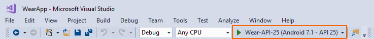
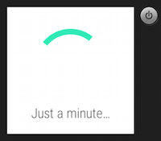

# Debug Android Wear on an Emulator

_These articles explain how to debug a Xamarin.Android Wear application on an emulator._

## Debug Wear on Emulator Overview

Developing Android Wear applications requires running the application,
either on physical hardware or using an emulator or simulator. Using
hardware is the best approach, but not always the most practical. In
many cases, it can be simpler and more cost effective to
simulate/emulate Android Wear hardware using an emulator as described
below. If you are not yet familiar with the process of deploying and
running Android Wear apps, see
[Hello, Wear](~/android/wear/get-started/hello-wear.md).

## Configure the Android Emulator

To run your Wear app on an emulator, you must install the Android SDK
Android Emulator and configure it for Android Wear. For overall Android
SDK Emulator installation and configuration information, see 
[Android Emulator Setup](~/android/get-started/installation/android-emulator/index.md).

When you create a Wear virtual device, select an Android Wear device
profile (such as **Android Wear Square**). For improved performance,
use the Wear **x86** CPU/ABI as seen in this example:

## Launch The Wear Virtual Device 

After you have created an Android Wear virtual device, you can choose
it from the device pull-down menu in the IDE before you start
debugging. If your virtual device is not available in the device
pull-down, verify that your project is an Android *Wear* app project
(not an Android app project) and that its target API level is set to
the same API level as the virtual device. For example:

After the Android emulator starts, Xamarin.Android will deploy the Wear
app to the emulator. The emulator runs the app with the configured
virtual device image.

Don't be surprised if you see this (or another interstitial screen) at 
first. The watch emulator can take a while to start up: 

The emulator may be left running; it is not necessary to shut it down
and restart it each time the app is run.

 
## Summary
 
This guide explained how to configure the Android Emulator for Wear
development and launch a Wear virtual device for debugging.
