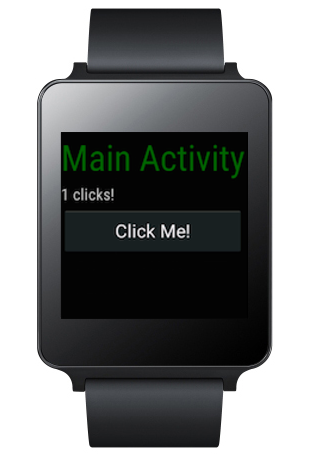
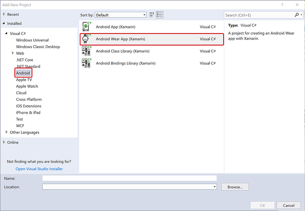
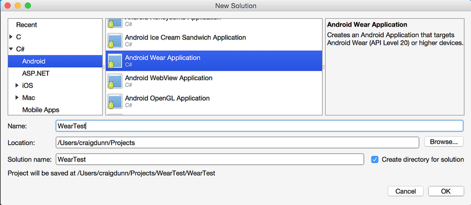
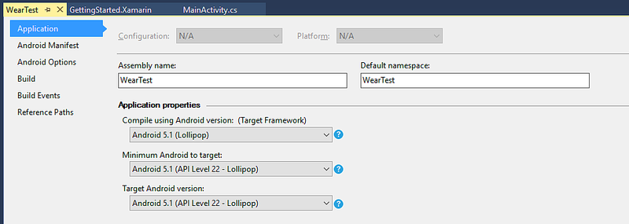
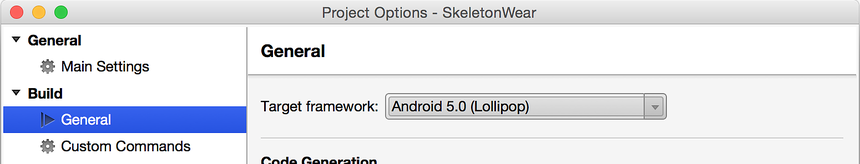
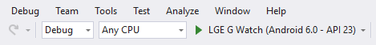
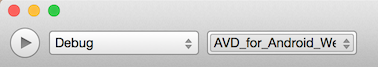
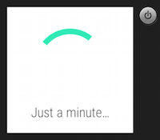
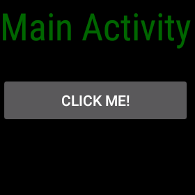
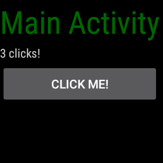

# Hello, Wear

_Create your first Android Wear app and run it on a Wear emulator or device. This walkthrough provides step-by-step instructions for creating a small Android Wear project that handles button clicks and displays a click counter on the Wear device. It explains how to debug the app using a Wear emulator or a Wear device that is connected via Bluetooth to an Android phone. It also provides a set of debugging tips for Android Wear._



## Your first Wear app

Follow these steps to create your first Xamarin.Android Wear app:

### 1. Create a new Android project

Create a new **Android Wear Application**:

<!-- markdownlint-disable MD001 -->

# [Visual Studio](#tab/windows)

[](hello-wear-images/vs/new-solution.w157.png#lightbox)

# [Visual Studio for Mac](#tab/macos)

[](hello-wear-images/xs/new-solution.png#lightbox)

-----

This template automatically includes the **Xamarin Android Wearable 
Library** NuGet (and dependencies) so you'll have access to 
Wear-specific widgets. If you don't see the Wear template, review the 
[Installation and Setup](~/android/wear/get-started/installation.md) guide to 
double-check that you have installed a supported Android SDK. 

### 2. Choose the correct **Target Framework**

# [Visual Studio](#tab/windows)

Ensure that **Minimum Android to target** is set to **Android 5.0 
(Lollipop)** or later: 

[](hello-wear-images/vs/target-framework.png#lightbox)

# [Visual Studio for Mac](#tab/macos)

Ensure the target framework is set to **Android 5.0 (Lollipop)** or later:

[](hello-wear-images/xs/target-framework.png#lightbox)

-----

For more information on setting the target framework, see
[Understanding Android API Levels](~/android/app-fundamentals/android-api-levels.md).

### 3. Edit the **Main.axml** layout

Configure the layout to contain a `TextView` and a `Button` for the 
sample: 

```xml
<?xml version="1.0" encoding="utf-8"?>
<FrameLayout xmlns:android="http://schemas.android.com/apk/res/android"
android:layout_width="match_parent"
android:layout_height="match_parent">
  <ScrollView
    android:id="@+id/scroll"
    android:layout_width="wrap_content"
    android:layout_height="wrap_content"
    android:background="#000000"
    android:fillViewport="true">
    <LinearLayout
      android:layout_width="match_parent"
      android:layout_height="wrap_content"
      android:orientation="vertical">
      <TextView
        android:layout_width="wrap_content"
        android:layout_height="wrap_content"
        android:layout_marginBottom="2dp"
        android:text="Main Activity"
        android:textSize="36sp"
        android:textColor="#006600" />
      <TextView
        android:layout_width="wrap_content"
        android:layout_height="wrap_content"
        android:layout_marginBottom="2dp"
        android:textColor="#cccccc"
        android:id="@+id/result" />
      <Button
        android:layout_width="match_parent"
        android:layout_height="wrap_content"
        android:onClick="showNotification"
        android:text="Click Me!"
        android:id="@+id/click_button" />
    </LinearLayout>
  </ScrollView>
</FrameLayout>
```

### 4. Edit the **MainActivity.cs** source

Add the code to increment a counter and display it whenever the button 
is clicked: 

```csharp
[Activity (Label = "WearTest", MainLauncher = true, Icon = "@drawable/icon")]
public class MainActivity : Activity
{
  int count = 1;

  protected override void OnCreate (Bundle bundle)
  {
    base.OnCreate (bundle);

    SetContentView (Resource.Layout.Main);

    Button button = FindViewById<Button> (Resource.Id.click_button);
    TextView text = FindViewById<TextView> (Resource.Id.result);

    button.Click += delegate {
      text.Text = string.Format ("{0} clicks!", count++);
    };
  }
}
```

### 5. Setup an Emulator or Device

The next step is set up an emulator or device to deploy and run the
app. If you are not yet familiar with the process of deploying and
running Xamarin.Android apps in general, see the
[Hello, Android Quickstart](~/android/get-started/hello-android/hello-android-quickstart.md).

If you do not have an Android Wear device such as an Android Wear
Smartwatch, You can run the app on an emulator. For information about
debugging Wear apps on an emulator, see
[Debug Android Wear on an Emulator](~/android/wear/deploy-test/debug-on-emulator.md).

If you have an Android Wear device such as an Android Wear Smartwatch, 
You can run the app on the device instead of using an emulator. For
more information about debugging on a Wear device,
see [Debug on a Wear Device](~/android/wear/deploy-test/debug-on-device.md).

### 6. Run the Android Wear app

The Android Wear device should appear in the device pulldown menu. Be
sure to choose the correct Android Wear device or AVD before you start
debugging. After selecting the device, click the Play button to
deploy the app to the emulator or device.

# [Visual Studio](#tab/windows)

[](hello-wear-images/vs/choose-wear-sim.png#lightbox)

# [Visual Studio for Mac](#tab/macos)

[](hello-wear-images/xs/choose-wear-sim.png#lightbox)

-----

You may see a **Just a minute...** message (or some other interstitial
screen) at first: 



If you are using a watch emulator, it can take a while to start up the
app. When you are using Bluetooth, it takes more time to deploy the app
than it would over USB. (For example, it takes about 5 minutes to
deploy this app to an LG G Watch that is Bluetooth-connected to a Nexus
5 phone.)

After the app successfully deploys, the screen of the Wear device
should display a screen like the following:

[](hello-wear-images/mainactivity-screen.png#lightbox)

Tap the **CLICK ME!** button on the face of the Wear device and
see the count increment with each tap:

[](hello-wear-images/mainactivity-counts.png#lightbox)

## Next Steps

Check out the [Wear samples](/samples/browse/?products=xamarin&term=Xamarin.Android%2bwear) including
Android Wear apps with companion Phone apps.

When you are ready to distribute your app, see
[Working with Packaging](~/android/wear/deploy-test/packaging.md).

## Related Links

- [Click Me App (sample)](/samples/xamarin/monodroid-samples/wear-weartest)