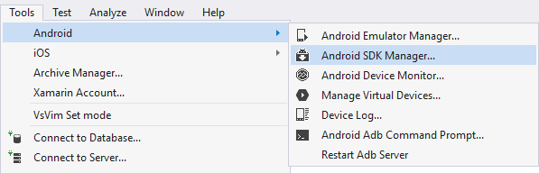
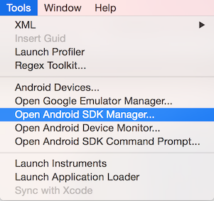
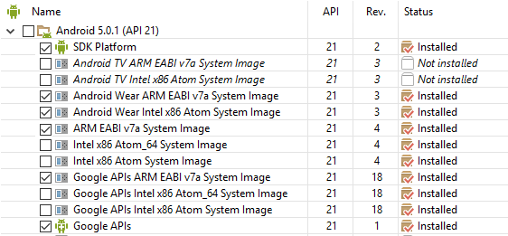
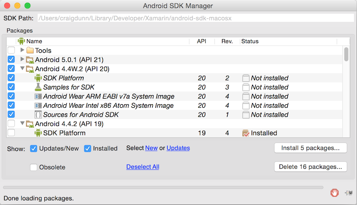
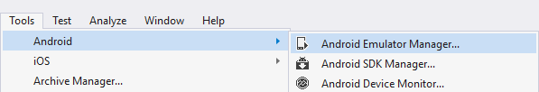
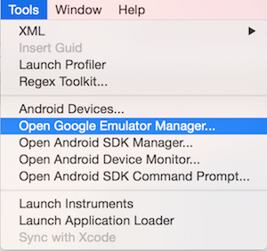

# Install and setup Wear OS on Xamarin.Android

_This article walks through the installation steps and configuration details required to prepare your computer and devices for Android Wear development. By the end of this article, you'll have a working Xamarin.Android Wear installation integrated into Visual Studio for Mac and/or Microsoft Visual Studio, and you'll be ready to start building your first Xamarin.Android Wear application._

## Requirements

The following is required to create Xamarin-based Android Wear apps:

- **Visual Studio or Visual Studio for Mac** &ndash; Visual Studio 2017 Community or later is
    required.

- **Xamarin.Android** &ndash; Xamarin.Android 4.17 or later must
    be installed and configured with either Visual Studio or Visual Studio for Mac.

- **Android SDK** - Android SDK 5.0.1 (API 21) or later must be installed
    via the Android SDK Manager.

- **Java Developer Kit** &ndash; Xamarin Android development requires
    [JDK 1.8](https://www.oracle.com/technetwork/java/javase/downloads/jdk8-downloads-2133151.html)
    if you are developing for API level 24 or greater (JDK 1.8
    also supports API levels earlier than 24).

You can continue to use
[JDK 1.7](https://www.oracle.com/technetwork/java/javase/downloads/jdk7-downloads-1880260.html)
if you are developing specifically for API level 23 or earlier.

> [!IMPORTANT]
> Xamarin.Android does not support JDK 9.

## Installation

After you have installed Xamarin.Android, perform the following steps
so that you're ready to build and test Android Wear apps:

1. Install the required Android SDK and tools.
2. Configure a test device.
3. Create your first Android Wear app.

These steps are described in the following sections.

### Install Android SDK and tools

Launch the **Android SDK Manager**:

# [Visual Studio](#tab/windows)

# [Visual Studio for Mac](#tab/macos)

-----

Ensure that you have the following Android SDK and tools installed:

- Android SDK Tools v 24.0.0 or higher, and
- Android 4.4W (API20), or
- Android 5.0.1 (API21) or higher.

If you do not have the latest SDK and tools installed, download the
required SDK tools *and* the API bits (you may need to scroll a bit to
find them &ndash; the API selection is shown below):

# [Visual Studio](#tab/windows)

# [Visual Studio for Mac](#tab/macos)

-----

## Configuration

Before you can use test your app, you must configure an Android Wear
emulator or an actual Android Wear device.

### Android Wear Emulator

Before you can use an Android Wear emulator, you must configure an Android
Wear Android Virtual Device (AVD) using the **Google Emulator Manager**:

# [Visual Studio](#tab/windows)

# [Visual Studio for Mac](#tab/macos)

-----

For more information about setting up an Android Wear emulator, see
[Debug Android Wear on an Emulator](~/android/wear/deploy-test/debug-on-emulator.md).

### Android Wear Device

If you have an Android Wear device such as an Android Wear Smartwatch,
You can debug the app on this device instead of using an emulator. For
information about developing with a Wear device, see
[Debug on a Wear Device](~/android/wear/deploy-test/debug-on-device.md).

## Create Your First Android Wear App

Follow the [Hello, Wear](~/android/wear/get-started/hello-wear.md)
instructions to build your first watch app.

## Packaging Your App

Android wear applications are always distributed with a companion
Android phone app.

When you add your Android Wear application as a reference to your main
Android application it is automatically assumed to be an Android Wear
project and will generate all necessary XML and metadata for you. In
addition, it will verify that package and version numbers match so you
can easily ship your apps to Google Play.

To learn more about packaging Wear apps, see
[Working with Packaging](~/android/wear/deploy-test/packaging.md).

## Related Links

- [SkeletonWear (sample)](/samples/xamarin/monodroid-samples/wear-skeletonwear)