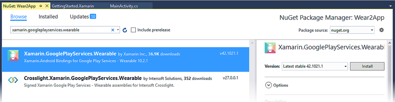
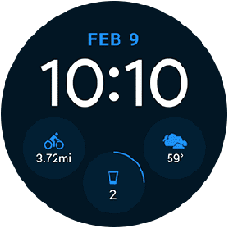
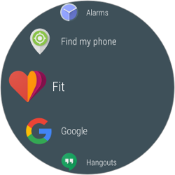

# Introduction to Android Wear

_With the introduction of Google's Android Wear, you are no longer restricted to just phones and tablets when it comes to developing great Android apps. Xamarin.Android's support for Android Wear makes it possible for you to run C# code on your wrist! This introduction provides a basic overview of Android Wear, describes its key features, and offers an overview of the features available in Android Wear 2.0. It lists some of the more popular Android Wear devices, and it provides links to essential Google Android Wear documentation for further reading._

## Overview

Android Wear runs on a variety of devices, including the 
first-generation Motorola 360, LG's G watch, and the Samsung Gear Live. 
A second generation, including Sony's SmartWatch 3, has also been 
released with additional capabilities including built-in GPS and 
offline music playback. For Android Wear 2.0, Google has teamed
up with LG for two new watches: the LG Watch Sport and the LG
Watch Style.

Xamarin.Android 5.0 and later supports Android Wear through our Android
4.4W (API 20) support and a NuGet package that adds additional
Wear-specific UI controls. Xamarin.Android 5.0 and later also includes
functionality for packaging your Wear apps. NuGet packages are also
available for Android Wear 2.0 as described later in this guide.

## Android Wear Basics

Android Wear has a user interface paradigm that differs from that of 
Android handheld apps. The first wave of Wear apps were designed to 
extend a companion handheld app in some way, but beginning with Android 
Wear 2.0, Wear apps can be used standalone. When you deploy a Wear app, 
it is packaged with a companion handheld app. Because most Wear apps 
depend upon a handheld companion app, they need some way to communicate 
with handheld apps. The following sections describe these usage 
scenarios and outline the essential Android Wear features. 

### Usage Scenarios

The first version of Android Wear was focused primarily on extending 
current handheld applications with enhanced notifications and syncing 
data between the handheld app and the wearable app. Therefore,
these scenarios are relatively straightforward to implement.

#### Wearable Notifications

The simplest way to support Android Wear is to take advantage of the 
shared nature of notifications between the handheld and the wearable 
device. By using the support v4 notification API and the 
`WearableExtender` class (available in the 
[Xamarin Android Support Library](https://www.nuget.org/packages/Xamarin.Android.Support.v4/)), 
you can tap into the native features of the platform, like inbox 
style cards or voice input. The 
[RecipeAssistant](/samples/xamarin/monodroid-samples/wear-recipeassistant) 
sample provides example code that demonstrates how to send a list 
of notifications to an Android Wear device. 

#### Companion Applications

Another strategy is to create a complete application that runs natively 
on the wearable device and pairs with a companion handheld app. A good 
example of this approach is the 
[Quiz](/samples/xamarin/monodroid-samples/wear-quiz) sample app, which demonstrates 
how to create a quiz that runs on a handheld device and asks quiz
questions on the wearable device. 

### User Interface

The primary navigation pattern for Wear is a series of cards arranged 
vertically. Each of these cards can have associated actions that are 
layered out on the same row. The `GridViewPager` class provides this 
functionality; it adheres to the same adapter concept as `ListView`. 
You typically associate the `GridViewPager` with a 
`FragmentGridPagerAdaptor` (or `GridPagerAdaptor`) that lets you 
represent each row and column cells as a `Fragment`: 

Wear also makes use of action buttons that consist of a big colored circle
with small description text underneath it (as illustrated above).  The
[GridViewPager](/samples/xamarin/monodroid-samples/wear-gridviewpager) sample demonstrates
how to use `GridViewPager` and `GridPagerAdapter` in a Wear app.

Android Wear 2.0 adds a navigation drawer, an action drawer, and inline 
action buttons to the Wear user interface. For more about Android Wear 
2.0 user interface elements, see the [Android 
Anatomy](https://developer.android.com/training/wearables/user-interfaces) 
topic. 

### Communications

Android Wear provides two different communication APIs to facilitate 
communications between wearable apps and companion handheld apps: 

**Data API** &ndash; This API is similar to a synchronized data store 
between the wearable device and the handheld device. Android takes care 
of propagating changes between wearable and handheld when it is optimal 
to do so. When the wearable is out of range, it queues synchronization 
for a later time. The main entry point for this API is 
`WearableClass.DataApi`. For more information about this API, see the 
Android 
[Syncing Data Items](https://developer.android.com/training/wearables/data-layer/data-items.html) 
topic. 

**Message API** &ndash; This API makes it possible for you to use
a lower level communications path: a small payload is sent one-way
without synchronization between the handheld and wearable apps.
The main entry point for this API is `WearableClass.MessageApi`.
For more information about this API, see the Android
[Sending and Receiving Messages](https://developer.android.com/training/wearables/data-layer/messages.html)
topic.

You can choose to register callbacks for receiving those messages
via each of the API listener interfaces or, alternatively,
implement a service in your app that derives from `WearableListenerService`.
This service will be automatically instantiated by Android Wear.
The [FindMyPhone](/samples/xamarin/monodroid-samples/wear-findmyphonesample) sample
illustrates how to implement a `WearableListenerService`.

### Deployment

Each wearable app is deployed with its own APK file embedded inside the 
main application APK. This packaging is handled automatically in 
Xamarin.Android 5.0 and later, but must be performed manually for 
versions of Xamarin.Android earlier than version 5.0. 
[Working with Packaging](~/android/wear/deploy-test/packaging.md) 
explains deployment in more detail. 

## Going Further 

The best way to become familiar with Android Wear is to build and test
your first app. The following list provides a recommended reading
order to help you get up to speed quickly:

1. [Setup & Installation](~/android/wear/get-started/installation.md) provides 
    detailed instructions for installing and configuring your development 
    environment for building Xamarin.Android Wear apps. 

2. After you have installed the required packages and configured an 
    emulator or device, see 
    [Hello, Wear](~/android/wear/get-started/hello-wear.md) for 
    step-by-step instructions that explain how to create a small 
    Android Wear project that handles button clicks and displays a 
    click counter on the Wear device. 

3. [Deployment & Testing](~/android/wear/deploy-test/index.md) provides
    more detailed information about configuring and deploying to emulators
    and devices, including instructions on how to deploy your app to a
    Wear device via Bluetooth.

4. [Working with Screen Sizes](~/android/wear/screen-sizes.md) 
    explains how to preview and optimize your user interface for the various 
    available screen sizes on Wear devices. 

5. [Working with Packaging](~/android/wear/deploy-test/packaging.md) 
    describes the steps for manually packaging Wear apps for distribution 
    on Google Play.

After you have created your first Wear app, you may want to try 
building a custom watch face for Android Wear. 
[Creating a Watch Face](~/android/wear/platform/creating-a-watchface.md) 
provides step-by-step instructions and example code for developing a 
stripped down digital watch face service, followed by more code that 
enhances it to an analog-style watch face with extra features. 

## Android Wear 2.0

Android Wear 2.0 introduces a variety of new features and capabilities,
such as *complications*, curved layouts, navigation and action drawers,
and expanded notifications. Also, Wear 2.0 makes it possible for you to
build standalone apps that work independently of handheld apps. The new
*wrist gestures* capability enables one-handed interactions with your
app. The following sections highlight these features and provide links
to help you get started with using them in your app.

### Install Wear 2.0 Packages

To build a Wear 2.0 app with Xamarin.Android, you must add the 
**Xamarin.Android.Wear v2.0** package to your project (click the
**Browse tab**):

This NuGet package contains bindings for both the Android Support
Wearable and Wear Compat libraries.

In addition to **Xamarin.Android.Wear**, we recommend that you install 
the **Xamarin.GooglePlayServices.Wearable** NuGet: 

### Key Features of Wear 2.0

Android Wear 2.0 is the biggest update to Android Wear since its 
initial launch in 2014. The following sections highlight the key 
features of Android Wear 2.0, and links are provided to help you get 
started using these new features in your app. 

#### Complications

*Complications* are small watch face widgets that you can see at a 
glance without having to swipe the watch face. Complications are 
similar to desktop-style dashboard widgets; they display information 
such as the weather, battery life, calendar events, and fitness app 
statistics: 

For more about complications, see the Android 
[Watch Face Complications](https://developer.android.com/wear/preview/features/complications.html) 
topic. 

#### Curved Layouts 

Wear 2.0 introduces new features for displaying curved layouts on round 
Wear devices. Specifically, the new `WearableRecyclerView` class is 
optimized for displaying a list of vertical items on round displays: 

`WearableRecyclerView` extends the `RecyclerView` class to support 
curved layouts and circular scrolling gestures. For more information, 
see the Android 
[WearableRecyclerView](https://developer.android.com/reference/android/support/wearable/view/WearableRecyclerView.html) 
API documentation. 

#### Standalone Apps 

Android Wear 2.0 apps can work independently of handheld apps. This means
that, for example, a smart watch can continue to offer full functionality
even if the companion handheld device is turned off or far away from
the wearable device. For more information about this feature,
see the Android [Standalone Apps](https://developer.android.com/wear/preview/features/standalone-apps.html)
topic.

#### Features

There are numerous features such as inline actions, smart 
reply, remote input, expanded notifications, and a new bridging mode 
for notifications. For more information about the new Wear 2.0 features, 
see the Android 
[API Overview](https://developer.android.com/wear/preview/api-overview.html). 

## Devices

Here are some examples of the devices that can run Android Wear:

- [Motorola 360](https://www.motorola.com)
- [LG G Watch R](https://www.lg.com/us/smartwatch/g-watch-r)
- [Samsung Gear Live](https://www.samsung.com/global/microsite/gear/gearlive_design.html)
- [Sony SmartWatch 3](https://www.sonymobile.com/global-en/products/smartwear/smartwatch-3-swr50/)
- [ASUS ZenWatch](https://www.asus.com)

## Further Reading

Check out Google's Android Wear documentation:

- [About Android Wear](https://www.android.com/wear/)
- [Android Wear App Design Principles](https://developer.android.com/training/wearables/principles)
- [android.support.wearable library](https://developer.android.com/reference/android/support/wearable/view/package-summary.html)
- [Android Wear 2.0](https://developer.android.com/wear/preview/index.html)

## Summary

This introduction provided an overview of Android Wear. It outlined the
basic features of Android Wear and included a overview of the features
introduced in Android Wear 2.0. It provided links to essential reading
to help developers get started with Xamarin.Android Wear development,
and it listed examples of some of the Android Wear devices currently on
the market.

## Related Links

- [Installation and Setup](~/android/wear/get-started/installation.md)
- [Getting Started](~/android/wear/get-started/index.md)
