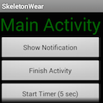
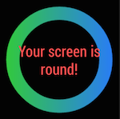
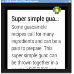
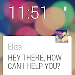
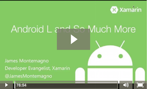
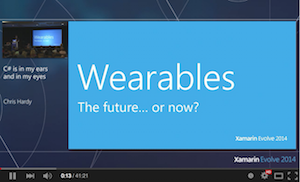

# Android Wear

Android Wear is a version of Android that is designed for wearable
devices such as smart watches. This section includes instructions on
how to install and configure tools required for Wear development, a
step-by-step walkthrough for creating your first Wear device, and a
list of samples that you can refer to for creating your own Wear apps.

## [Getting Started](~/android/wear/get-started/index.md)

Introduces Android Wear, describes how to install and configure your
computer for Wear development, and provides steps to help you create
and run your first Android Wear app on an emulator or Wear device.

## [User Interface](~/android/wear/user-interface/index.md)

Explains Android Wear-specific controls and provides links to
samples that demonstrate how to use these controls.

## [Platform Features](~/android/wear/platform/index.md)

Documents in this section cover features specific to Android Wear. Here
you'll find a topic that describes how to create a WatchFace.

## [Screen Sizes](~/android/wear/screen-sizes.md)

Preview and optimize your user interface for the available screen sizes.

## [Deployment & Testing](~/android/wear/deploy-test/index.md)

Explains how to deploy your Android Wear app to an Android
Wear device or to Android emulator configured for Wear. It also
includes debugging tips and information for how to set up a Bluetooth
connection between your development computer and an Android device.

## [Wear APIs](https://developer.android.com/reference/android/support/wearable)

The Android Developer site provides detailed information about key Wear APIs
such as [Wearable Activity](https://developer.android.com/reference/android/support/wearable/activity/package-summary.html),
[Intents](https://developer.android.com/reference/com/google/android/wearable/intent/package-summary.html),
[Authentication](https://developer.android.com/reference/android/support/wearable/authentication/package-summary.html),
[Complications](https://developer.android.com/reference/android/support/wearable/complications/package-summary.html),
[Complications Rendering](https://developer.android.com/reference/android/support/wearable/complications/rendering/package-summary.html),
[Notifications](https://developer.android.com/reference/android/support/wearable/notifications/package-summary.html),
[Views](https://developer.android.com/reference/android/support/wearable/view/package-summary.html), and
[WatchFace](https://developer.android.com/reference/android/support/wearable/watchface/package-summary.html).

## Samples

You can find a number of
[samples](/samples/browse/?products=xamarin&term=Xamarin.Android%2bwear) using Android Wear (or go
directly to
[github](https://github.com/xamarin/monodroid-samples/tree/master/wear)).

|Sample|Description|Screenshot|
|--- |--- |--- |
|[SkeletonWear](/samples/xamarin/monodroid-samples/wear-skeletonwear)|A simple example of the basics of wearable projects, including GridViewPager and interactive notifications.||
|[WatchViewStub](/samples/xamarin/monodroid-samples/wear-watchviewstub)|A simple demo of the WatchViewStub control that detects screen shape and automatically loads the correct layout. See how WatchViewStub works in the **Resources/layout/main_activity.xml** layout.||
|[RecipeAssistant](/samples/xamarin/monodroid-samples/wear-recipeassistant)|Demonstration of Wear notification pages, in the form of recipe steps. Notifications are created in RecipeService.cs.||
|[ElizaChat](/samples/xamarin/monodroid-samples/wear-elizachat)|Fun sample of interacting with a "personal assistant" called Eliza, using Wear interactive notifications to create a conversation using canned responses.||
|[GridViewPager](/samples/xamarin/monodroid-samples/wear-gridviewpager)|GridViewPager implements the 2D navigation pattern, where the user swipes vertically and then horizontally to navigate through options and content.||
|[WatchFace](/samples/xamarin/monodroid-samples/wear-watchface)|WatchFace is a custom watch face with analog-style hour, minute, and second hands. This sample demonstrates how to create a watch face service that draws the current time and handles ambient mode and visibility change events. It includes a broadcast receiver that listens for time zone changes and automatically updates the time accordingly.||

## Videos

Check out these video links that discuss Xamarin.Android with Wear support:

|Description|Screenshot|
|--- |--- |
|[Android L and So Much More](https://blog.xamarin.com/webinar-recording-android-l-and-so-much-more/) &ndash; The Android L Developer Preview introduced a plethora of new APIs for developers to take advantage of, including Material Design, notifications, and new animations, to name a few.||
|[C# is in my Ears and in my Eyes: Google Glass and Android Wear](https://www.youtube.com/watch?v=80H8tXByZQc) &ndash; Wearable computing might seem like something from the future (or an Inspector Gadget episode), but many people are already embracing the future today! C# developers know this and already have the tools and skills to harness the power of wearable devices (from Evolve 2014).||
|[What's new in Xamarin.Android](https://www.youtube.com/watch?v=Gpqc2XZIQfU) &ndash; Android L, Android Wear, Android TV, Android Auto, Material Design, and ART; what does this mean to you as a Xamarin developer? from Evolve 2014.||

<!--

March 18
https://blog.xamarin.com/android-wear/

August 14
https://blog.xamarin.com/android-l-developer-preview-android-wear-support/

August 27
https://blog.xamarin.com/tips-for-your-first-android-wear-app/

Watch Face
https://github.com/Redth/Xamarin.Wear.WatchFace
-->