# Creating a Watch Face

_This guide explains how to implement a custom watch face service for Android Wear 1.0. Step-by-step instructions are provided for building a stripped down digital watch face service, followed by more code to create an analog-style watch face._

## Overview

In this walkthrough, a basic watch face service is created to
illustrate the essentials of creating a custom Android Wear 1.0  watch face.
The initial watch face service displays a simple digital watch that
displays the current time in hours and minutes:

[](creating-a-watchface-images/01-initial-face.png#lightbox)

After this digital watch face is developed and tested, more code is
added to upgrade it to a more sophisticated analog watch face with
three hands:

[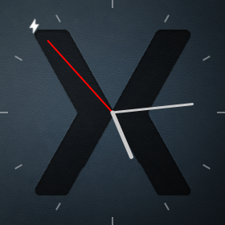](creating-a-watchface-images/02-example-watchface.png#lightbox)

Watch face services are bundled and installed as part of a Wear 1.0 app. In
the following examples, `MainActivity` contains nothing more than the
code from the Wear 1.0 app template so that the watch face service can be
packaged and deployed to the smart watch as part of the app. In effect,
this app will serve purely as a vehicle for getting the watch face
service loaded into the Wear 1.0 device (or emulator) for debugging and
testing.

## Requirements

To implement a watch face service, the following is required:

- Android 5.0 (API level 21) or higher on the Wear device or emulator.

- The [Xamarin Android Wear Support Libraries](https://www.nuget.org/packages/Xamarin.Android.Wear)
    must be added to the Xamarin.Android project.

Although Android 5.0 is the minimum API level for implementing a watch
face service, Android 5.1 or later is recommended. Android Wear devices
running Android 5.1 (API 22) or higher allow Wear apps to control
what's displayed on the screen while the device is in low-power
*ambient* mode. When the device leaves low-power *ambient* mode, it is
in *interactive* mode. For more about these modes, see
[Keeping Your App Visible](https://developer.android.com/training/wearables/apps/always-on.html).

## Start an App Project

Create a new Android Wear 1.0 project called **WatchFace**
(for more information about creating new Xamarin.Android projects,
see [Hello, Android](~/android/get-started/hello-android/hello-android-quickstart.md)):

# [Visual Studio](#tab/windows)

[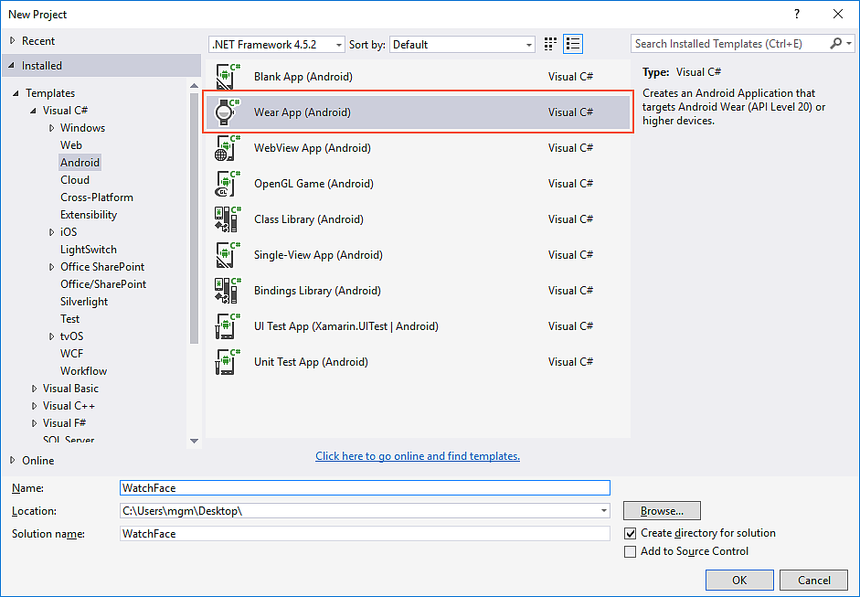](creating-a-watchface-images/03-wear-project-vs.png#lightbox)

# [Visual Studio for Mac](#tab/macos)

[](creating-a-watchface-images/03-wear-project-xs.png#lightbox)

-----

Set the package name to `com.xamarin.watchface`:

# [Visual Studio](#tab/windows)

[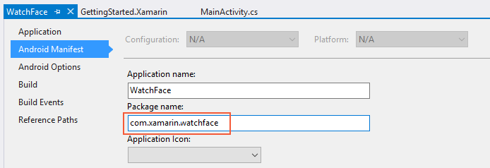](creating-a-watchface-images/04-package-name-vs.png#lightbox)

# [Visual Studio for Mac](#tab/macos)

[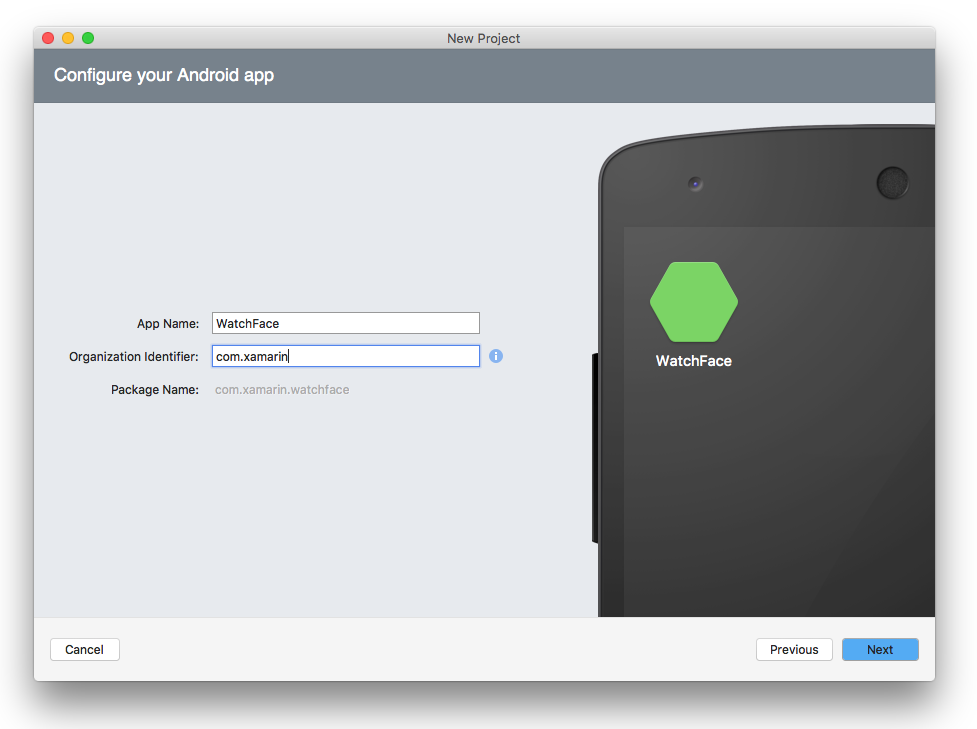](creating-a-watchface-images/04-package-name-xs.png#lightbox)

-----

# [Visual Studio](#tab/windows)

In addition, scroll down and enable the **INTERNET** and **WAKE_LOCK**
permissions:

[](creating-a-watchface-images/05-required-permissions-vs.png#lightbox)

# [Visual Studio for Mac](#tab/macos)

Set the Minimum Android version to **Android 5.1 (API level 22)**.
Also, enable the **Internet** and **WakeLock** permissions:

[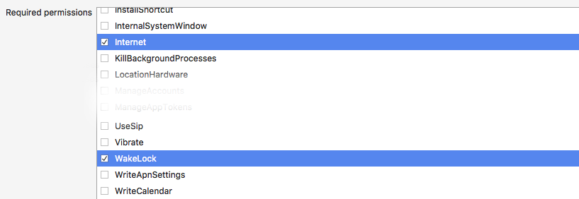](creating-a-watchface-images/05-required-permissions-xs.png#lightbox)

-----

Next, download [preview.png](creating-a-watchface-images/preview.png) &ndash; this will
be added to the **drawables** folder later in this walkthrough.

## Add the Xamarin.Android Wear Package

# [Visual Studio](#tab/windows)

Start the NuGet Package Manager (in Visual Studio, right-click
**References** in the **Solution Explorer** and select **Manage NuGet
Packages ...**). Update the project to the latest stable version of
**Xamarin.Android.Wear**:

[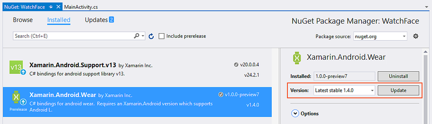](creating-a-watchface-images/06-add-wear-pkg-vs.png#lightbox)

Next, if **Xamarin.Android.Support.v13** is installed, uninstall it:

[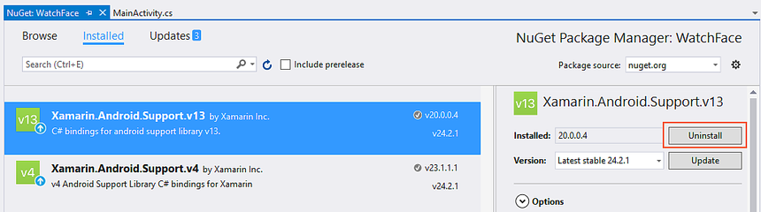](creating-a-watchface-images/07-uninstall-v13.png#lightbox)

# [Visual Studio for Mac](#tab/macos)

Start the NuGet Package Manager (in Visual Studio for Mac, right-click
**Packages** in the **Solution Pane** and select **Add Packages ...**).
Update the project to the latest stable version of
**Xamarin.Android.Wear**:

[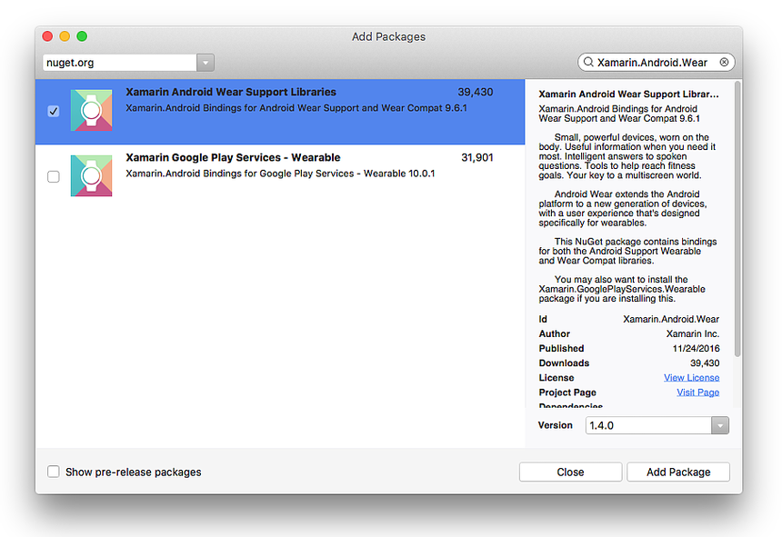](creating-a-watchface-images/06-add-wear-pkg-xs.png#lightbox)

-----

Build and run the app on a Wear device or emulator (for more
information about how to do this, see the
[Getting Started](~/android/wear/get-started/index.md) guide). You
should see the following app screen on the Wear device:

[](creating-a-watchface-images/08-app-screen.png#lightbox)

At this point, the basic Wear app does not have watch face
functionality because it does not yet provide a watch face service
implementation. This service will be added next.

## CanvasWatchFaceService

Android Wear implements watch faces via the `CanvasWatchFaceService`
class. `CanvasWatchFaceService` is derived from `WatchFaceService`,
which itself is derived from `WallpaperService` as shown in
the following diagram:

[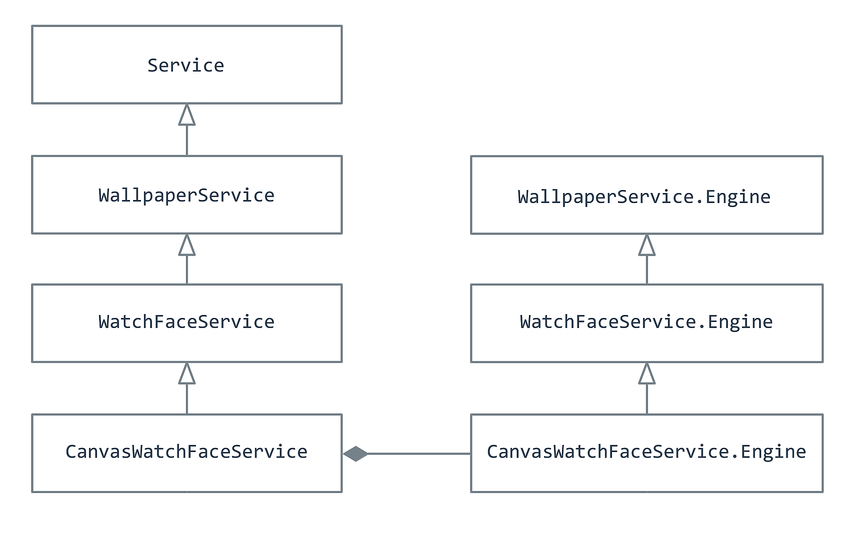](creating-a-watchface-images/09-inheritance-diagram.png#lightbox)

`CanvasWatchFaceService` includes a nested
`CanvasWatchFaceService.Engine`; it instantiates a
`CanvasWatchFaceService.Engine` object that does the actual work of
drawing the watch face. `CanvasWatchFaceService.Engine` is derived from
`WallpaperService.Engine` as shown in the above diagram.

Not shown in this diagram is a `Canvas` that `CanvasWatchFaceService`
uses for drawing the watch face &ndash; this `Canvas` is passed in via
the `OnDraw` method as described below.

In the following sections, a custom watch face service will be created
by following these steps:

1. Define a class called `MyWatchFaceService` that is derived from
    `CanvasWatchFaceService`.

2. Within `MyWatchFaceService`, create a nested class called
    `MyWatchFaceEngine` that is derived from
    `CanvasWatchFaceService.Engine`.

3. In `MyWatchFaceService`, implement a `CreateEngine`
    method that instantiates `MyWatchFaceEngine` and returns it.

4. In `MyWatchFaceEngine`, implement the `OnCreate` method to create
    the watch face style and perform any other initialization tasks.

5. Implement the `OnDraw` method of `MyWatchFaceEngine`. This method
    is called whenever the watch face needs to be redrawn (i.e.
    *invalidated*). `OnDraw` is the method that draws (and redraws) watch
    face elements such as hour, minute, and second hands.

6. Implement the `OnTimeTick` method of `MyWatchFaceEngine`.
    `OnTimeTick` is called at least once per minute (in both ambient
    and interactive modes) or when the date/time has
    changed.

For more information about `CanvasWatchFaceService`, see
the Android
[CanvasWatchFaceService](https://developer.android.com/reference/android/support/wearable/watchface/CanvasWatchFaceService.html) API documentation.
Similarly,
[CanvasWatchFaceService.Engine](https://developer.android.com/reference/android/support/wearable/watchface/CanvasWatchFaceService.Engine.html) explains
the actual implementation of the watch face.

### Add the CanvasWatchFaceService

# [Visual Studio](#tab/windows)

Add a new file called **MyWatchFaceService.cs** (in Visual Studio,
right-click **WatchFace** in the **Solution Explorer**, click **Add >
New Item...**, and select **Class**).

# [Visual Studio for Mac](#tab/macos)

Add a new file called **MyWatchFaceService.cs** (in Visual Studio for Mac,
right-click the **WatchFace** project, click **Add >
New File...**, and select **Empty Class**).

-----

Replace the contents of this file with the following code:

```csharp
using System;
using Android.Views;
using Android.Support.Wearable.Watchface;
using Android.Service.Wallpaper;
using Android.Graphics;

namespace WatchFace
{
    class MyWatchFaceService : CanvasWatchFaceService
    {
        public override WallpaperService.Engine OnCreateEngine()
        {
            return new MyWatchFaceEngine(this);
        }

        public class MyWatchFaceEngine : CanvasWatchFaceService.Engine
        {
            CanvasWatchFaceService owner;
            public MyWatchFaceEngine (CanvasWatchFaceService owner) : base(owner)
            {
                this.owner = owner;
            }
        }
    }
}
```

`MyWatchFaceService` (derived from `CanvasWatchFaceService`) is the
"main program" of the watch face. `MyWatchFaceService` implements only
one method, `OnCreateEngine`, which instantiates and returns a
`MyWatchFaceEngine` object (`MyWatchFaceEngine` is derived from
`CanvasWatchFaceService.Engine`). The instantiated `MyWatchFaceEngine`
object must be returned as a `WallpaperService.Engine`. The
encapsulating `MyWatchFaceService` object is passed into the
constructor.

`MyWatchFaceEngine` is the actual watch face implementation &ndash; it
contains the code that draws the watch face. It also handles system
events such as screen changes (ambient/interactive modes, screen
turning off, etc.).

### Implement the Engine OnCreate method

The `OnCreate` method initializes the watch face. Add the following
field to `MyWatchFaceEngine`:

```csharp
Paint hoursPaint;
```

This `Paint` object will be used to draw the current time on the watch
face. Next, add the following method to `MyWatchFaceEngine`:

```csharp
public override void OnCreate(ISurfaceHolder holder)
{
    base.OnCreate (holder);

    SetWatchFaceStyle (new WatchFaceStyle.Builder(owner)
        .SetCardPeekMode (WatchFaceStyle.PeekModeShort)
        .SetBackgroundVisibility (WatchFaceStyle.BackgroundVisibilityInterruptive)
        .SetShowSystemUiTime (false)
        .Build ());

    hoursPaint = new Paint();
    hoursPaint.Color = Color.White;
    hoursPaint.TextSize = 48f;
}
```

`OnCreate` is called shortly after `MyWatchFaceEngine` is started. It
sets up the `WatchFaceStyle` (which controls how the Wear device
interacts with the user) and instantiates the `Paint` object that will be
used to display the time.

The call to `SetWatchFaceStyle` does the following:

1. Sets *peek mode* to `PeekModeShort`, which causes notifications to
    appear as small "peek" cards on the display.

2. Sets the background visibility to `Interruptive`, which causes
    the background of a peek card to be shown only briefly if it
    represents an interruptive notification.

3. Disables the default system UI time from being drawn on the
    watch face so that the custom watch face can display the
    time instead.

For more information about these and other watch face style options, see
the Android [WatchFaceStyle.Builder](https://developer.android.com/reference/android/support/wearable/watchface/WatchFaceStyle.Builder.html)
API documentation.

After `SetWatchFaceStyle` completes, `OnCreate` instantiates the
`Paint` object (`hoursPaint`) and sets its color to white and its
text size to 48 pixels
([TextSize](https://developer.android.com/reference/android/graphics/Paint.html#setTextSize%28float%29) must be specified in pixels).

### Implement the Engine OnDraw method

The `OnDraw` method is perhaps the most important
`CanvasWatchFaceService.Engine` method &ndash; it is the method that
actually draws watch face elements such as digits and clock face hands.
In the following example, it draws a time string on the watch face.
Add the following method to `MyWatchFaceEngine`:

```csharp
public override void OnDraw (Canvas canvas, Rect frame)
{
    var str = DateTime.Now.ToString ("h:mm tt");
    canvas.DrawText (str,
        (float)(frame.Left + 70),
        (float)(frame.Top  + 80), hoursPaint);
}
```

When Android calls `OnDraw`, it passes in a `Canvas` instance and the
bounds in which the face can be drawn. In the above code example,
`DateTime` is used to calculate the current time in hours and minutes
(in 12-hour format). The resulting time string is drawn on the canvas
by using the `Canvas.DrawText` method. The string will appear 70 pixels
over from the left edge and 80 pixels down from the top edge.

For more information about the `OnDraw` method, see the Android
[onDraw](https://developer.android.com/reference/android/support/wearable/watchface/CanvasWatchFaceService.Engine#ondraw) API documentation.

### Implement the Engine OnTimeTick method

Android periodically calls the `OnTimeTick` method to update the time
shown by the watch face. It is called at least once per minute (in both
ambient and interactive modes), or when the date/time or timezone have
changed. Add the following method to `MyWatchFaceEngine`:

```csharp
public override void OnTimeTick()
{
    Invalidate();
}
```

This implementation of `OnTimeTick` simply calls `Invalidate`. The
`Invalidate` method schedules `OnDraw` to redraw the watch face.

For more information about the `OnTimeTick` method, see the Android
[onTimeTick](https://developer.android.com/reference/android/support/wearable/watchface/WatchFaceService.Engine.html#onTimeTick())
API documentation.

## Register the CanvasWatchFaceService

`MyWatchFaceService` must be registered in the **AndroidManifest.xml** of
the associated Wear app. To do this, add the following XML to the
`<application>` section:

```xml
<service
    android:name="watchface.MyWatchFaceService"
    android:label="Xamarin Sample"
    android:allowEmbedded="true"
    android:taskAffinity=""
    android:permission="android.permission.BIND_WALLPAPER">
    <meta-data
        android:name="android.service.wallpaper"
        android:resource="@xml/watch_face" />
    <meta-data
        android:name="com.google.android.wearable.watchface.preview"
        android:resource="@drawable/preview" />
    <intent-filter>
        <action android:name="android.service.wallpaper.WallpaperService" />
        <category android:name="com.google.android.wearable.watchface.category.WATCH_FACE" />
    </intent-filter>
</service>
```

This XML does the following:

1. Sets the `android.permission.BIND_WALLPAPER` permission. This
    permission gives the watch face service permission to change the
    system wallpaper on the device. Note that this permission must be
    set in the `<service>` section rather than in the outer
    `<application>` section.

2. Defines a `watch_face` resource. This resource is a short XML file
    that declares a `wallpaper` resource (this file will be created in
    the next section).

3. Declares a drawable image called `preview` that will be displayed
    by the watch picker selection screen.

4. Includes an `intent-filter` to let Android know that
    `MyWatchFaceService` will be displaying a watch face.

That completes the code for the basic `WatchFace` example. The next
step is to add the necessary resources.

## Add resource files

Before you can run the watch service, you must add the **watch_face**
resource and the preview image. First, create a new XML file at
**Resources/xml/watch_face.xml** and replace its contents with the
following XML:

```xml
<?xml version="1.0" encoding="UTF-8"?>
<wallpaper xmlns:android="http://schemas.android.com/apk/res/android" />
```

Set this file's build action to **AndroidResource**:

# [Visual Studio](#tab/windows)

[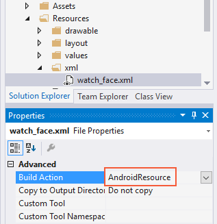](creating-a-watchface-images/10-android-resource-vs.png#lightbox)

# [Visual Studio for Mac](#tab/macos)

[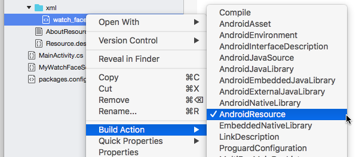](creating-a-watchface-images/10-android-resource-xs.png#lightbox)

-----

This resource file defines a simple `wallpaper` element that will be
used for the watch face.

If you have not yet done so, download [preview.png](creating-a-watchface-images/preview.png).
Install it at **Resources/drawable/preview.png**. Be sure to add this file
to the `WatchFace` project. This preview image is displayed to the user
in the watch face picker on the Wear device. To create a preview image for
your own watch face, you can take a screenshot of the watch face while
it is running. (For more about getting screenshots from
Wear devices, see [Taking screenshots](~/android/wear/deploy-test/debug-on-device.md#screenshots)).

## Try it!

Build and deploy the app to the Wear device. You should see the Wear
app screen appear as before. Do the following to enable the new watch
face:

1. Swipe to the right until you see the background of the
    watch screen.

2. Touch and hold anywhere on the background of the screen
    for two seconds.

3. Swipe from left to right to browse through the various watch faces.

4. Select the **Xamarin Sample** watch face (shown on the right):

    [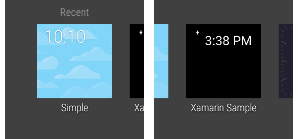](creating-a-watchface-images/11-watchface-picker.png#lightbox)

5. Tap the **Xamarin Sample** watch face to select it.

This changes the watch face of the Wear device to use the custom
watch face service implemented so far:

[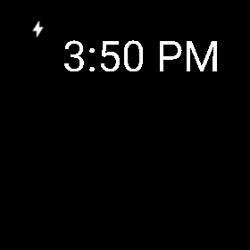](creating-a-watchface-images/12-digital-watchface.png#lightbox)

This is a relatively crude watch face because the app implementation is
so minimal (for example, it doesn't include a watch face background and
it doesn't call `Paint` anti-alias methods to improve the appearance).
However, it does implement the bare-bones functionality that is
required to create a custom watch face.

In the next section, this watch face will be upgraded to a more
sophisticated implementation.

## Upgrading the watch face

In the remainder of this walkthrough, `MyWatchFaceService` is upgraded
to display an analog-style watch face and it is extended to support
more features. The following capabilities will be added to create the
upgraded watch face:

1. Indicates the time with analog hour, minute, and second hands.

2. Reacts to changes in visibility.

3. Responds to changes between ambient mode and interactive mode.

4. Reads the properties of the underlying Wear device.

5. Automatically updates the time when a time zone change takes place.

Before implementing the code changes below, download
[drawable.zip](https://github.com/xamarin/monodroid-samples/blob/master/wear/WatchFace/Resources/drawable.zip?raw=true), unzip it, and move the unzipped
.png files to **Resources/drawable** (overwrite the previous
**preview.png**). Add the new .png files to the `WatchFace` project.

### Update Engine features

The next step is upgrade **MyWatchFaceService.cs** to an implementation
that draws an analog watch face and supports new features. Replace the
contents of **MyWatchFaceService.cs** with the analog version of the
watch face code in
[MyWatchFaceService.cs](https://github.com/xamarin/monodroid-samples/blob/master/wear/WatchFace/WatchFace/MyWatchFaceService.cs)
(you can cut and paste this source into the existing **MyWatchFaceService.cs**).

This version of **MyWatchFaceService.cs** adds more code to the
existing methods and includes additional overridden methods to add more
functionality. The following sections provide a guided tour of the
source code.

#### OnCreate

The updated **OnCreate** method configures the watch face style as
before, but it includes some additional steps:

1. Sets the background image to the **xamarin_background** resource
    that resides in **Resources/drawable-hdpi/xamarin_background.png**.

2. Initializes `Paint` objects for drawing the hour hand, minute hand,
    and second hand.

3. Initializes a `Paint` object for drawing the hour ticks
    around the edge of the watch face.

4. Creates a timer that calls the `Invalidate` (redraw) method
    so that the second hand will be redrawn every second. Note
    that this timer is necessary because `OnTimeTick` calls
    `Invalidate` only once every minute.

This example includes only one **xamarin_background.png** image;
however, you may want to create a different background image for each
screen density that your custom watch face will support.

#### OnDraw

The updated **OnDraw** method draws an analog-style watch face using the
following steps:

1. Gets the current time, which is now maintained in a `time` object.

2. Determines the bounds of the drawing surface and its center.

3. Draws the background, scaled to fit the device when the background
    is drawn.

4. Draws twelve *ticks* around the face of the clock
    (corresponding to the hours on the clock face).

5. Calculates the angle, rotation, and length for each
    watch hand.

6. Draws each hand on the watch surface. Note that the second hand is
    not drawn if the watch is in ambient mode.

#### OnPropertiesChanged

This method is called to inform `MyWatchFaceEngine` about the
properties of the Wear device (such as low-bit ambient mode and burn-in
protection). In `MyWatchFaceEngine`, this method only checks for
low bit ambient mode (in low bit ambient mode, the screen supports
fewer bits for each color).

For more information about this method, see the Android
[onPropertiesChanged](https://developer.android.com/reference/android/support/wearable/watchface/WatchFaceService.Engine.html#onPropertiesChanged%28android.os.Bundle%29) API documentation.

#### OnAmbientModeChanged

This method is called when the Wear device enters or exits ambient
mode. In the `MyWatchFaceEngine` implementation, the watch face
disables anti-aliasing when it is in ambient mode.

For more information about this method, see the Android
[onAmbientModeChanged](https://developer.android.com/reference/android/support/wearable/watchface/WatchFaceService.Engine.html#onAmbientModeChanged%28boolean%29) API documentation.

#### OnVisibilityChanged

This method is called whenever the watch becomes visible or hidden. In
`MyWatchFaceEngine`, this method registers/unregisters the time zone
receiver (described below) according to the visibility state.

For more information about this method, see the Android
[onVisibilityChanged](https://developer.android.com/reference/android/support/wearable/watchface/WatchFaceService.Engine.html#onVisibilityChanged%28boolean%29) API documentation.

### Time zone feature

The new **MyWatchFaceService.cs** also includes functionality to update
the current time whenever the time zone changes (such as while
traveling across time zones). Near the end of **MyWatchFaceService.cs**,
a time zone change `BroadcastReceiver` is defined that handles
timezone-changed Intent objects:

```csharp
public class TimeZoneReceiver: BroadcastReceiver
{
    public Action<Intent> Receive { get; set; }
    public override void OnReceive (Context context, Intent intent)
    {
        if (Receive != null)
            Receive (intent);
    }
}
```

The `RegisterTimezoneReceiver` and `UnregisterTimezoneReceiver` methods
are called by the `OnVisibilityChanged` method.
`UnregisterTimezoneReceiver` is called when the visibility state of the
watch face is changed to hidden. When the watch face is visible again,
`RegisterTimezoneReceiver` is called (see the `OnVisibilityChanged`
method).

The engine `RegisterTimezoneReceiver` method declares a handler for
this time zone receiver's `Receive` event; this handler updates the
`time` object with the new time whenever a time zone is crossed:

```csharp
timeZoneReceiver = new TimeZoneReceiver ();
timeZoneReceiver.Receive = (intent) => {
    time.Clear (intent.GetStringExtra ("time-zone"));
    time.SetToNow ();
};
```

An intent filter is created and registered for the time zone receiver:

```csharp
IntentFilter filter = new IntentFilter(Intent.ActionTimezoneChanged);
Application.Context.RegisterReceiver (timeZoneReceiver, filter);
```

The `UnregisterTimezoneReceiver` method unregisters the time zone
receiver:

```csharp
Application.Context.UnregisterReceiver (timeZoneReceiver);
```

### Run the improved watch face

Build and deploy the app to the Wear device again. Select the watch
face from the watch face picker as before. The preview in the
watch picker is shown on the left, and the new watch face
is shown on the right:

[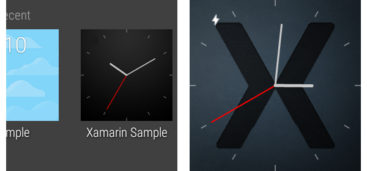](creating-a-watchface-images/13-analog-watchface.png#lightbox)

In this screenshot, the second hand is moving once per second. When you
run this code on a Wear device, the second hand disappears when the
watch enters ambient mode.

## Summary

In this walkthrough, a custom Android Wear 1.0 watchface was implemented
and tested. The `CanvasWatchFaceService` and
`CanvasWatchFaceService.Engine` classes were introduced, and the
essential methods of the engine class were implemented to create a
simple digital watch face. This implementation was updated with more
functionality to create an analog watch face, and additional methods
were implemented to handle changes in visibility, ambient mode, and
differences in device properties. Finally, a time zone broadcast
receiver was implemented so that the watch automatically updates the
time when a time zone is crossed.

## Related Links

- [Creating Watch Faces](https://developer.android.com/training/wearables/watch-faces/index.html)
- [WatchFace sample](/samples/xamarin/monodroid-samples/wear-watchface)
- [WatchFaceService.Engine](https://developer.android.com/reference/android/support/wearable/watchface/WatchFaceService.Engine.html)