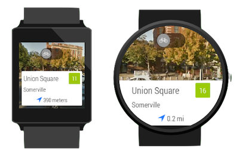
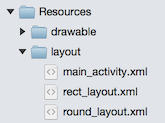
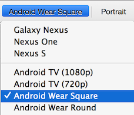
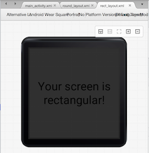
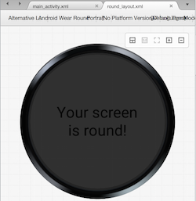
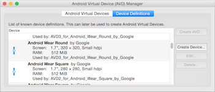
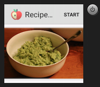
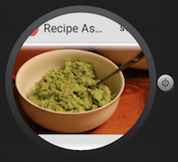

# Working with Screen Sizes

Android Wear devices can have either a rectangular or a round display,
which can also be different sizes.



## Identifying Screen Type

The Wear support library provides some controls that help you detect
and adapt to different screen shapes, such as `WatchViewStub` and
`BoxInsetLayout`.

Be aware that some of the other support library controls (such as
`GridViewPager`) *automatically* detect screen shape themselves and
shouldn't be added as children of the controls described below.

### WatchViewStub

See the
[WatchViewStub](/samples/xamarin/monodroid-samples/wear-watchviewstub) sample to see how to detect
screen type and display a different layout for each type.

The main layout file contains a
`android.support.wearable.view.WatchViewStub` which references
different layouts for rectangular and round screens using the
`app:rectLayout` and `app:roundLayout` attributes:

```xml
<android.support.wearable.view.WatchViewStub
    xmlns:app="http://schemas.android.com/apk/res-auto"
  android:layout_width="match_parent"
  android:layout_height="match_parent"
  android:id="@+id/stub"
  app:rectLayout="@layout/rect_layout"
  app:roundLayout="@layout/round_layout" />
```

The solution contains different layouts for each style which will be
selected at run-time:



### BoxInsetLayout

Rather than build different layouts for each screen type, you can also
create a single view that adapts to rectangular or round screens.

This
[Google example](https://developer.android.com/training/wearables/ui/layouts.html#same-layout)
shows how to use the `BoxInsetLayout` to use the same layout on both
rectangular and round screens.

## Wear UI Designer

The Xamarin Android Designer supports both rectangular and round
screens:



The design surface in rectangular style is shown here:

 

The design surface in round style is shown here:



## Wear Simulator

The **Google Emulator Manager** contains device definitions for both
screen types. You can create rectangular and round emulators to test
your app.



The emulator will render like this for a rectangular screen:

 

It will render like this for a round screen:



## Video

[Fullscreen apps for Android Wear](https://www.youtube.com/watch?v=naf_WbtFAlY) from
[developers.google.com](https://www.youtube.com/channel/UC_x5XG1OV2P6uZZ5FSM9Ttw).