# Cross-Platform App Case Study: Tasky

*Tasky* *Portable* is a simple to-do list application. This document
discusses how it was designed and built, following the guidance of the [Building Cross-Platform Applications](~/cross-platform/app-fundamentals/building-cross-platform-applications/index.md)
document. The discussion covers the following
areas:

<a name="Design_Process"></a>

## Design Process

It is advisable to create
a of road-map for what you want to achieve before you start coding. This is especially true for cross-platform development, where you are
building functionality that will be exposed in multiple ways. Starting with a clear idea of what
you're building saves time and effort later in the development
cycle.

 <a name="Requirements"></a>

### Requirements

The first step in designing an application is to identify desired features. These can be high-level goals or detailed use cases. Tasky has straightforward functional requirements:

- View a list of tasks
- Add, edit and delete tasks
- Set a task’s status to ‘done’

You should consider your use of platform-specific features.  Can Tasky take advantage of iOS geofencing or Windows
Phone Live Tiles? Even if you don't use platform-specific features in the first version, you should plan ahead to make sure your business & data layers can accommodate them.

 <a name="User_Interface_Design"></a>

### User Interface Design

Start with a high-level design that can be implemented across the target
platforms. Take care to note platform-specfic UI constraints. For example, a `TabBarController` in iOS can display more than five buttons, whereas the Windows Phone equivalent can display up to four.
Draw the screen-flow using the tool of your choice (paper works).

 [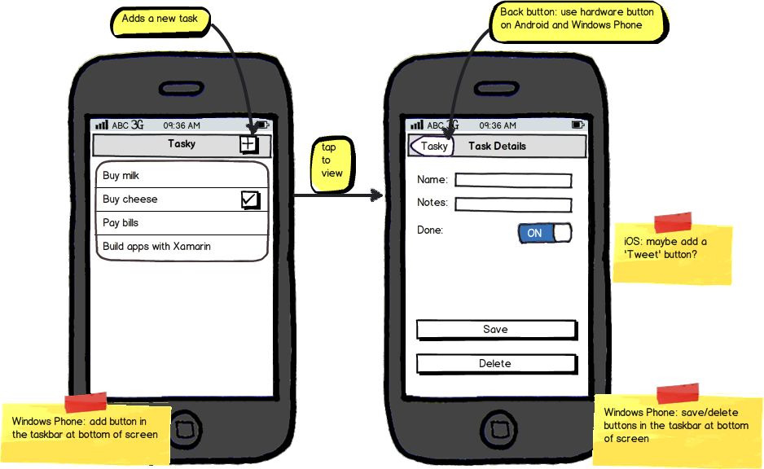](case-study-tasky-images/taskydesign.png#lightbox)

 <a name="Data_Model"></a>

### Data Model

Knowing what data needs to be stored will help determine which persistence
mechanism to use. See [Cross-Platform Data Access](~/cross-platform/app-fundamentals/index.md) for information about the available storage mechanisms and help deciding between them. For this project, we'll be using SQLite.NET.

Tasky needs to store three properties for
each 'TaskItem':

- **Name** – String
- **Notes** – String
- **Done** – Boolean

 <a name="Core_Functionality"></a>

### Core Functionality

Consider the API that the user interface will need to consume to
meet the requirements. A to-do list requires the following functions:

- **List all tasks** – to display the main screen list of all available tasks
- **Get one task** – when a task row is touched
- **Save one task** – when a task is edited
- **Delete one task** – when a task is deleted
- **Create empty task** – when a new task is created

To achieve code reuse, this API should be implemented once in the *Portable Class Library*.

 <a name="Implementation"></a>

### Implementation

Once the application design has been agreed upon, consider how it might be
implemented as a cross-platform application. This will become the
application’s architecture. Following the guidance in the [Building Cross-Platform Applications](~/cross-platform/app-fundamentals/building-cross-platform-applications/index.md) document, the
application code should be broken down into the following parts:

- **Common Code** – a common project that contains re-useable code to store the task data; expose a Model class and an API to manage the saving and loading of data.
- **Platform-specific Code** – platform-specific projects that implement a native UI for each operating system, utilizing the common code as the ‘back end’.

[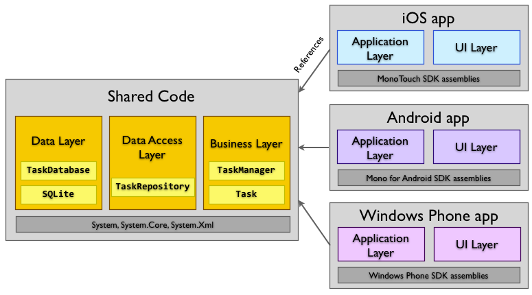](case-study-tasky-images/taskypro-architecture.png#lightbox)

These two parts are described in the following sections.

 <a name="Common_(PCL)_Code"></a>

## Common (PCL) Code

Tasky Portable uses the Portable Class Library strategy for sharing common
code. See the [Sharing Code Options](~/cross-platform/app-fundamentals/code-sharing.md) document for a description of code-sharing options.

All common code, including the data access layer, database code and contracts, is placed in the library project.

The complete PCL project is illustrated below. All of the code in the portable library is compatible with each targeted platform. When deployed, each native app will reference that library.

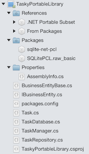

The class diagram below shows the classes grouped by layer. The `SQLiteConnection` class is boilerplate code from the Sqlite-NET package. The rest of the classes are custom code for Tasky. The `TaskItemManager` and `TaskItem` classes represent the API that is
exposed to the platform-specific applications.

 [](case-study-tasky-images/classdiagram-core.png#lightbox)

Using namespaces to separate the layers helps to manage references between
each layer. The platform-specific projects should only need to include a `using` statement for the Business Layer. The Data Access Layer and
Data Layer should be encapsulated by the API that is exposed by `TaskItemManager` in the Business Layer.

 <a name="References"></a>

### References

Portable class libraries need to be usable across multiple platforms, each with varying levels of support for platform and framework features. Because of that, there are limitations on which packages and framework libraries can be used. For example, Xamarin.iOS does not support the c# `dynamic` keyword, so a portable class library can't use any package that depends on dynamic code, even though such code would work on Android. Visual Studio for Mac will prevent you from adding incompatible packages and references, but you'll want to keep limitations in mind to avoid surprises later on.

Note: You'll see that your projects reference framework libraries that you haven't used. These references are included as part of the Xamarin project templates. When apps are compiled, the linking process will remove unreferenced code, so
even though `System.Xml` has been referenced, it will not be included
in the final application because we are not using any Xml functions.

 <a name="Data_Layer_(DL)"></a>

### Data Layer (DL)

The Data Layer contains the code that does the physical storage of data –
whether to a database, flat files or other mechanism. The Tasky data layer
consists of two parts: the SQLite-NET library and the custom code added to wire
it up.

Tasky relies on the Sqlite-net NuGet package (published by Frank Krueger) to embed SQLite-NET code that provides an Object-Relational Mapping
(ORM) database interface. The `TaskItemDatabase` class inherits from `SQLiteConnection` and
adds the required Create, Read, Update, Delete (CRUD) methods to read and write
data to SQLite. It is a simple boilerplate implementation of generic CRUD
methods that could be re-used in other projects.

The `TaskItemDatabase` is a singleton, ensuring that all access occurs
against the same instance. A lock is used to prevent concurrent access from
multiple threads.

 <a name="SQLite_on_WIndows_Phone"></a>

#### SQLite on Windows Phone

While iOS and Android both ship with SQLite as part of the operating system,
Windows Phone does not include a compatible database engine. To share
code across all three platforms a Windows phone-native version of SQLite is
required. See [Working with a Local Database](~/xamarin-forms/data-cloud/data/databases.md) for more information about setting up your Windows Phone project for Sqlite.

 <a name="Using_an_Interface_to_Generalize_Data_Access"></a>

#### Using an Interface to Generalize Data Access

The Data Layer takes a dependency on `BL.Contracts.IBusinessIdentity` so that it can implement abstract
data access methods that require a primary key. Any Business Layer class that
implements the interface can then be persisted in the Data Layer.

The interface just specifies an integer property to act as the primary
key:

```csharp
public interface IBusinessEntity {
    int ID { get; set; }
}
```

The base class implements the interface and adds the SQLite-NET attributes to
mark it as an auto-incrementing primary key. Any class in the Business Layer
that implements this base class can then be persisted in the Data Layer:

```csharp
public abstract class BusinessEntityBase : IBusinessEntity {
    public BusinessEntityBase () {}
    [PrimaryKey, AutoIncrement]
    public int ID { get; set; }
}
```

An example of the generic methods in the Data Layer that use the interface is
this `GetItem<T>` method:

```csharp
public T GetItem<T> (int id) where T : BL.Contracts.IBusinessEntity, new ()
{
    lock (locker) {
        return Table<T>().FirstOrDefault(x => x.ID == id);
    }
}
```

 <a name="Locking_to_prevent_Concurrent_Access"></a>

#### Locking to prevent Concurrent Access

A [lock](/previous-versions/visualstudio/visual-studio-2010/c5kehkcz(v=vs.100)) is implemented within the `TaskItemDatabase`
class to prevent concurrent access to the database. This is to ensure concurrent
access from different threads is serialized (otherwise a UI component might
attempt to read the database at the same time a background thread is updating
it). An example of how the lock is implemented is shown here:

```csharp
static object locker = new object ();
public IEnumerable<T> GetItems<T> () where T : BL.Contracts.IBusinessEntity, new ()
{
    lock (locker) {
        return (from i in Table<T> () select i).ToList ();
    }
}
public T GetItem<T> (int id) where T : BL.Contracts.IBusinessEntity, new ()
{
    lock (locker) {
        return Table<T>().FirstOrDefault(x => x.ID == id);
    }
}
```

Most of the Data Layer code could be re-used in other projects. The only
application-specific code in the layer is the `CreateTable<TaskItem>` call in the `TaskItemDatabase`
constructor.

 <a name="Data_Access_Layer_(DAL)"></a>

### Data Access Layer (DAL)

The `TaskItemRepository` class encapsulates the data storage mechanism
with a strongly-typed API that allows `TaskItem` objects to be created,
deleted, retrieved and updated.

 <a name="Using_Conditional_Compilation"></a>

#### Using Conditional Compilation

The class uses conditional compilation to set the file location - this is an
example of implementing Platform Divergence. The property that returns the path compiles to
different code on each platform. The code and platform-specific compiler
directives are shown here:

```csharp
public static string DatabaseFilePath {
    get {
        var sqliteFilename = "TaskDB.db3";
#if SILVERLIGHT
        // Windows Phone expects a local path, not absolute
        var path = sqliteFilename;
#else
#if __ANDROID__
        // Just use whatever directory SpecialFolder.Personal returns
        string libraryPath = Environment.GetFolderPath(Environment.SpecialFolder.Personal); ;
#else
        // we need to put in /Library/ on iOS5.1+ to meet Apple's iCloud terms
        // (they don't want non-user-generated data in Documents)
        string documentsPath = Environment.GetFolderPath (Environment.SpecialFolder.Personal); // Documents folder
        string libraryPath = Path.Combine (documentsPath, "..", "Library"); // Library folder
#endif
        var path = Path.Combine (libraryPath, sqliteFilename);
                #endif
                return path;
    }
}
```

Depending on the platform, the output will be “<app
path>/Library/TaskDB.db3” for iOS, “<app
path>/Documents/TaskDB.db3” for Android or just “TaskDB.db3” for
Windows Phone.

### Business Layer (BL)

The Business Layer implements the Model classes and a Façade to manage them.
In Tasky the Model is the `TaskItem` class and `TaskItemManager` implements the Façade pattern to provide an API for
managing `TaskItems`.

 <a name="Façade"></a>

#### Façade

 `TaskItemManager` wraps the `DAL.TaskItemRepository` to provide the Get, Save
and Delete methods that will be referenced by the Application and UI Layers.

Business rules and logic would be placed here if required – for example any
validation rules that must be satisfied before an object is saved.

 <a name="API_for_Platform-Specific_Code"></a>

### API for Platform-Specific Code

Once the common code has been written, the user interface must be built to
collect and display the data exposed by it. The `TaskItemManager` class
implements the Façade pattern to provide a simple API for the application code
to access.

The code written in each platform-specific project will generally be
tightly coupled to the native SDK of that device, and only access the common
code using the API defined by the `TaskItemManager`. This includes the
methods and business classes it exposes, such as `TaskItem`.

Images are not shared across platforms but added independently to each
project. This is important because each platform handles images differently, using different file names, directories and resolutions.

The remaining sections discuss the platform-specific implementation details
of the Tasky UI.

 <a name="iOS_App"></a>

## iOS App

There are only a handful of classes required to implement the iOS Tasky
application using the common PCL project to store and retrieve data. The
complete iOS Xamarin.iOS project is shown below:

 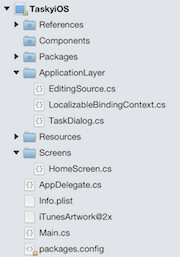

The classes are shown in this diagram, grouped into layers.

 [](case-study-tasky-images/classdiagram-android.png#lightbox)

 <a name="References"></a>

### References

The iOS app references the platform-specific SDK libraries – eg. Xamarin.iOS
and MonoTouch.Dialog-1.

It must also reference the `TaskyPortableLibrary` PCL project.
The references list is shown here:

 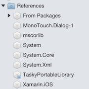

The Application Layer and User Interface Layer are implemented in this
project using these references.

 <a name="Application_Layer_(AL)"></a>

### Application Layer (AL)

The Application Layer contains platform-specific classes required to
‘bind’ the objects exposed by the PCL to the UI. The iOS-specific
application has two classes to help display tasks:

- **EditingSource** – This class is used to bind lists of tasks to the user interface. Because `MonoTouch.Dialog` was used for the Task list, we need to implement this helper to enable swipe-to-delete functionality in the  `UITableView` . Swipe-to-delete is common on iOS, but not Android or Windows Phone, so the iOS specific project is the only one that implements it.
- **TaskDialog** – This class is used to bind a single task to the UI. It uses the `MonoTouch.Dialog` Reflection API to ‘wrap’ the `TaskItem` object with a class that contains the correct attributes to allow the input screen to be correctly formatted.

The `TaskDialog` class uses `MonoTouch.Dialog` attributes to create a screen based on a class’s properties. The class looks like this:

```csharp
public class TaskDialog {
    public TaskDialog (TaskItem task)
    {
        Name = task.Name;
        Notes = task.Notes;
        Done = task.Done;
    }
    [Entry("task name")]
    public string Name { get; set; }
    [Entry("other task info")]
    public string Notes { get; set; }
    [Entry("Done")]
    public bool Done { get; set; }
    [Section ("")]
    [OnTap ("SaveTask")]    // method in HomeScreen
    [Alignment (UITextAlignment.Center)]
    public string Save;
    [Section ("")]
    [OnTap ("DeleteTask")]  // method in HomeScreen
    [Alignment (UITextAlignment.Center)]
    public string Delete;
}
```

Notice the `OnTap` attributes require a method name – these
methods must exist in the class where the `MonoTouch.Dialog.BindingContext` is created (in this case, the `HomeScreen` class discussed in the next section).

 <a name="User_Interface_Layer_(UI)"></a>

### User Interface Layer (UI)

The User Interface Layer consists of the following classes:

1. **AppDelegate** – Contains calls to the Appearance API to style the fonts and colors used in the application. Tasky is a simple application so there are no other initialization tasks running in  `FinishedLaunching` .
2. **Screens** –  subclasses of `UIViewController` that define each screen and its behavior. Screens tie together the UI with Application Layer classes and the common API ( `TaskItemManager` ). In this example the screens are created in code, but they could have been designed using Xcode’s Interface Builder or the storyboard designer.
3. **Images** – Visual elements are an important part of every application. Tasky has splash screen and icon images, which for iOS must be supplied in regular and Retina resolution.

 <a name="Home_Screen"></a>

#### Home Screen

The Home Screen is a `MonoTouch.Dialog`
screen that displays a list of tasks from the SQLite database. It inherits from `DialogViewController` and implements code to set the `Root` to contain
a collection of `TaskItem` objects for display.

 [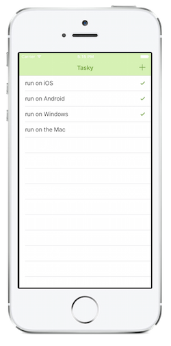](case-study-tasky-images/ios-taskylist.png#lightbox)

The two main methods related to displaying and interacting with the task list
are:

1. **PopulateTable** – Uses the Business Layer’s  `TaskManager.GetTasks` method to retrieve a collection of  `TaskItem` objects to display.
2. **Selected** – When a row is touched, displays the task in a new screen.

 <a name="Task_Details_Screen"></a>

#### Task Details Screen

Task Details is an input screen that allows tasks to be edited or
deleted.

Tasky uses `MonoTouch.Dialog`’s Reflection API to display the screen, so there is no `UIViewController` implementation. Instead, the `HomeScreen` class instantiates and displays a `DialogViewController` using the `TaskDialog` class from
the Application Layer.

This screenshot shows an empty screen that demonstrates the `Entry` attribute setting the watermark text in the **Name** and **Notes** fields:

 [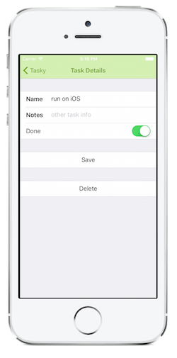](case-study-tasky-images/ios-taskydetail.png#lightbox)

The functionality of the **Task Details** screen (such as
saving or deleting a task) must be implemented in the `HomeScreen`
class, because this is where the `MonoTouch.Dialog.BindingContext` is
created. The following `HomeScreen` methods support the Task Details
screen:

1. **ShowTaskDetails** – Creates a  `MonoTouch.Dialog.BindingContext` to render a screen. It creates the input screen using reflection to retrieve property names and types from the  `TaskDialog` class. Additional information, such as the watermark text for the input boxes, is implemented with attributes on the properties.
2. **SaveTask** – This method is referenced in the  `TaskDialog` class via an  `OnTap` attribute. It is called when  **Save** is pressed, and uses a  `MonoTouch.Dialog.BindingContext` to retrieve the user-entered data before saving the changes using  `TaskItemManager` .
3. **DeleteTask** – This method is referenced in the  `TaskDialog` class via an  `OnTap` attribute. It uses  `TaskItemManager` to delete the data using the primary key (ID property).

 <a name="Android_App"></a>

## Android App

The complete Xamarin.Android project is pictured below:

 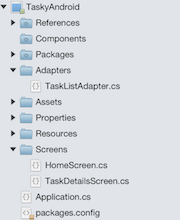

The class diagram, with classes grouped by layer:

 [](case-study-tasky-images/classdiagram-android.png#lightbox)

 <a name="References"></a>

### References

The Android app project must reference the platform-specific Xamarin.Android
assembly to access classes from the Android SDK.

It must also reference the PCL project (eg. TaskyPortableLibrary) to
access the common data and business layer code.

 

 <a name="Application_Layer_(AL)"></a>

### Application Layer (AL)

Similar to the iOS version we looked at earlier, the Application Layer in the
Android version contains platform-specific classes required to ‘bind’ the
objects exposed by the Core to the UI.

 **TaskListAdapter** – to display a List\<T> of objects
we need to implement an adapter to display custom
objects in a `ListView`. The adapter controls which layout is used for each item
in the list – in this case the code uses an Android built-in layout `SimpleListItemChecked`.

 <a name="User_Interface_(UI)"></a>

### User Interface (UI)

The Android app’s User Interface Layer is a combination of code and XML
markup.

- **Resources/Layout** – screen layouts and the row cell design implemented as AXML files. The AXML can be written by hand, or laid-out visually using the Xamarin UI Designer for Android.
- **Resources/Drawable** – images (icons) and custom button.
- **Screens** – Activity subclasses that define each screen and its behavior. Ties together the UI with Application Layer classes and the common API (`TaskItemManager`).

 <a name="Home_Screen"></a>

#### Home Screen

The Home Screen consists of an Activity subclass `HomeScreen` and
the `HomeScreen.axml` file which defines the layout (position of the
button and task list). The screen looks like this:

 [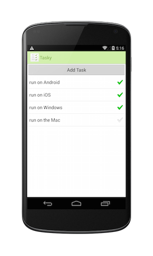](case-study-tasky-images/android-taskylist.png#lightbox)

The Home Screen code defines the handlers for clicking the button and
clicking items in the list, as well as populating the list in the `OnResume` method (so that it reflects changes made in the Task
Details Screen). Data is loaded using the Business Layer’s `TaskItemManager` and the `TaskListAdapter` from the
Application Layer.

 <a name="Task_Details_Screen"></a>

#### Task Details Screen

The Task Details Screen also consists of an `Activity` subclass and an AXML
layout file. The layout determines the location of the input controls and the C#
class defines the behavior to load and save `TaskItem` objects.

 [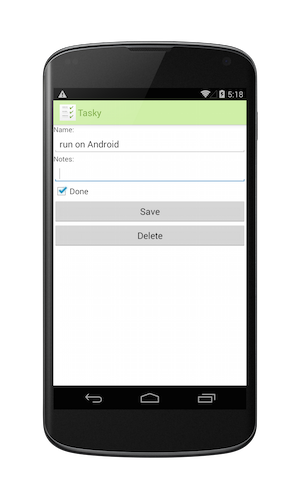](case-study-tasky-images/android-taskydetail.png#lightbox)

All references to the PCL library are through the `TaskItemManager` class.

 <a name="Windows_Phone_App"></a>

## Windows Phone App
The complete Windows Phone project:

 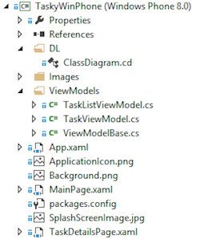

The diagram below presents the classes grouped into layers:

 [](case-study-tasky-images/classdiagram-wp7.png#lightbox)

 <a name="References"></a>

### References

The platform-specific project must reference the required platform-specific
libraries (such as `Microsoft.Phone` and `System.Windows`)
to create a valid Windows Phone application.

It must also reference the PCL project (eg. `TaskyPortableLibrary`) to
utilize the `TaskItem` class and database.

 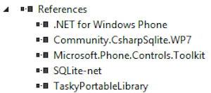

 <a name="Application_Layer_(AL)"></a>

### Application Layer (AL)

Again, as with the iOS and Android versions, the application layer consists
of the non-visual elements that help to bind data to the user interface.

 <a name="ViewModels"></a>

#### ViewModels

ViewModels wrap data from the PCL ( `TaskItemManager`) and presents it
in way that can be consumed by Silverlight/XAML data binding. This is an example
of platform-specific behavior (as discussed in the Cross-Platform Applications
document).

 <a name="User_Interface_(UI)"></a>

### User Interface (UI)

XAML has a unique data-binding capability that can be declared in markup and
reduce the amount of code required to display objects:

1. **Pages** – XAML files and their codebehind define the user interface and reference the ViewModels and the PCL project to display and collect data.
2. **Images** – Splash screen, background and icon images are a key part of the user interface.

 <a name="MainPage"></a>

#### MainPage

The MainPage class uses the `TaskListViewModel` to display data
using XAML’s data-binding features. The page’s `DataContext` is
set to the view model, which is populated asynchronously. The `{Binding}` syntax in the XAML determines how the data is
displayed.

 <a name="TaskDetailsPage"></a>

#### TaskDetailsPage

Each task is displayed by binding the `TaskViewModel` to the XAML
defined in the TaskDetailsPage.xaml. The task data is retrieved via the `TaskItemManager` in the Business Layer.

 <a name="Results"></a>

## Results

The resulting applications look like this on each platform:

 <a name="iOS"></a>

### iOS

The application uses iOS-standard user interface design, such as the
‘add’ button being positioned in the navigation bar and using the built-in **plus (+)** icon. It also uses the default
`UINavigationController` ‘back’ button behavior and supports
‘swipe-to-delete’ in the table.

 [](case-study-tasky-images/ios-taskylist.png#lightbox) [](case-study-tasky-images/ios-taskylist.png#lightbox)

 <a name="Android"></a>

### Android

The Android app uses built-in controls including the built-in layout for rows
that require a ‘tick’ displayed. The hardware/system back behavior is
supported in addition to an on-screen back button.

 [](case-study-tasky-images/android-taskylist.png#lightbox)[](case-study-tasky-images/android-taskylist.png#lightbox)

 <a name="Windows_Phone"></a>

### Windows Phone

The Windows Phone app uses the standard layout, populating the app bar at the bottom
of the screen instead of a nav bar at the top.

 [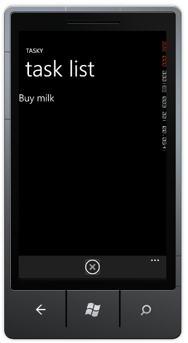](case-study-tasky-images/wp-taskylist.png#lightbox) [](case-study-tasky-images/wp-taskylist.png#lightbox)

 <a name="Summary"></a>

## Summary

This document has provided a detailed explanation of how the principles of
layered application design have been applied to a simple application to
facilitate code re-use across three mobile platforms: iOS, Android and Windows
Phone.

It has described the process used to design the application layers and discussed what
code &amp; functionality has been implemented in each layer.

The code can be downloaded from [github](https://github.com/xamarin/mobile-samples/tree/master/TaskyPortable).

## Related Links

- [Building Cross-Platform Applications (main document)](~/cross-platform/app-fundamentals/building-cross-platform-applications/index.md)
- [Tasky Portable Sample App (github)](https://github.com/xamarin/mobile-samples/tree/master/TaskyPortable)