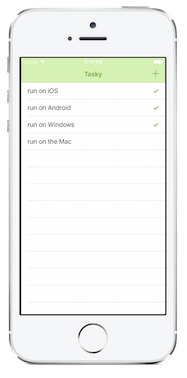

# Building Cross-Platform Applications

There are two options for sharing code between cross-platform mobile applications: Shared Asset Projects and Portable Class Libraries. These options are [discussed here](~/cross-platform/app-fundamentals/code-sharing.md); more information on [Portable Class Libraries](~/cross-platform/app-fundamentals/pcl.md) and [Shared Projects](~/cross-platform/app-fundamentals/shared-projects.md) is also available.

 [Overview](~/cross-platform/app-fundamentals/building-cross-platform-applications/overview.md)

 [Part 1 – Understanding the Xamarin Mobile Platform](~/cross-platform/app-fundamentals/building-cross-platform-applications/understanding-the-xamarin-mobile-platform.md)

 [Part 2 – Architecture](~/cross-platform/app-fundamentals/building-cross-platform-applications/architecture.md)

 [Part 3 – Setting Up a Xamarin Cross Platform Solution](~/cross-platform/app-fundamentals/building-cross-platform-applications/setting-up-a-xamarin-cross-platform-solution.md)

 [Part 4 – Dealing with Multiple Platforms](~/cross-platform/app-fundamentals/building-cross-platform-applications/platform-divergence-abstraction-divergent-implementation.md)

 [Part 5 – Practical Code Sharing Strategies](~/cross-platform/app-fundamentals/building-cross-platform-applications/practical-code-sharing-strategies.md)

 [Part 6 - Testing and App Store Approvals](~/cross-platform/app-fundamentals/building-cross-platform-applications/testing-and-app-store-approvals.md)

 

## Case Studies

The principles outlined in this document are put into practice in the sample
application *Tasky*, as well as [pre-built applications](https://xamarin.com/prebuilt)
like [Xamarin CRM](https://xamarin.com/prebuilt/#xamarincrm).

 

### Tasky

Tasky is a simple to-do list application for iOS, Android and Windows Phone.
It demonstrates the basics of creating a cross-platform application with Xamarin
and uses a local SQLite database.

  

Read the [Tasky Case Study](~/cross-platform/app-fundamentals/building-cross-platform-applications/case-study-tasky.md).

## Summary

This section introduces Xamarin’s application development tools and
discusses how to build applications that target multiple mobile platforms.

It covers a layered architecture that structures code for re-use across
multiple platforms, and describes different software patterns that can be used
within that architecture.

Examples are given of common application functions (like file and network operations)
and how they can be built in a cross-platform way.

Finally, it briefly discusses testing, and provides references to
a case study that puts these principles into action.

## Related Links

- [Sharing Code Options](~/cross-platform/app-fundamentals/code-sharing.md)
- [Case Study: Tasky](~/cross-platform/app-fundamentals/building-cross-platform-applications/case-study-tasky.md)
- [Tasky Sample App (github)](/samples/xamarin/mobile-samples/taskyportable/)
- [Xamarin Mobile Application Development: Cross-Platform C# and Xamarin.Forms Fundamentals (Amazon)](https://www.amazon.com/Xamarin-Mobile-Application-Development-Cross-Platform/dp/1484202155/)
- [Mobile Development with C# by Greg Shackles (O’Reilly)](https://shop.oreilly.com/product/0636920024002.do)