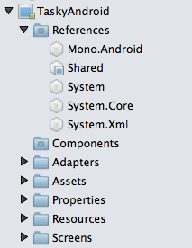

# Part 3 - Setting Up A Xamarin Cross-Platform Solution

Regardless of what platforms are being used, Xamarin projects all use the
same solution file format (the Visual Studio **.sln** file format). Solutions
can be shared across development environments, even when individual projects
cannot be loaded (such as a Windows project in Visual Studio for Mac).

When creating a new cross-platform application, the first step is to create a
blank solution. This section explains what happens next: setting up the projects for
building cross-platform mobile apps.

 <a name="Sharing_Code" />

## Sharing Code

Refer to the [Code Sharing Options](~/cross-platform/app-fundamentals/code-sharing.md) document for a detailed description of how to implement
code-sharing across platforms.

 <a name="Shared_Asset_Projects" />

### Shared Projects

The simplest approach to sharing code files is using a [Shared Project](~/cross-platform/app-fundamentals/shared-projects.md).

This method allows you to share the same code across different platform projects,
and use compiler directives to include different, platform-specific code
paths.

 <a name="Portable_Class_Libraries" />

### Portable Class Libraries (PCL)

Historically a .NET project file (and the resulting assembly) has been
targeted to a specific framework version. This prevents the project or the
assembly being shared by different frameworks.

A Portable Class Library (PCL) is a special type of project that can be used
across disparate CLI platforms such as Xamarin.iOS and Xamarin.Android, as well
as WPF, Universal Windows Platform, and Xbox. The library can only utilize a
subset of the complete .NET framework, limited by the platforms being
targeted.

You can read more about Xamarin's [support for Portable Class Libraries](~/cross-platform/app-fundamentals/pcl.md) and follow the instructions there to see how the [TaskyPortable sample](https://github.com/xamarin/mobile-samples/tree/master/TaskyPortable) works.

### .NET Standard

Introduced in 2016, [.NET Standard](~/cross-platform/app-fundamentals/net-standard.md)
projects provide an easy way to share code across platforms, producing assemblies
that can be used across Windows, Xamarin platforms (iOS, Android, Mac), and Linux.

.NET Standard libraries can be created and used like PCLs, except that the APIs
available in each version (from 1.0 to 1.6) are more easily discovered
and each version is backwards-compatible with lower version numbers.

 <a name="Populating_the_Solution" />

## Populating the Solution

Regardless of which method is used to share code, the overall solution
structure should implement a layered architecture that encourages code sharing.
The Xamarin approach is to group code into two project types:

-   **Core project** – Write re-usable code in one place, to be shared across different platforms. Use the principles of encapsulation to hide implementation details wherever possible.
-   **Platform-specific application projects** – Consume the re-usable code with as little coupling as possible. Platform-specific features are added at this level, built on components exposed in the Core project.

 <a name="Core_Project" />

### Core Project

Shared code projects should only reference assemblies that are available
across all platforms – ie. the common framework namespaces like `System`, `System.Core` and `System.Xml`.

Shared projects should implement as much non-UI functionality as is possible,
which could include the following layers:

-   **Data Layer** – Code that takes care of physical data storage eg.  [SQLite-NET](https://github.com/praeclarum/sqlite-net), an alternative database like  [Realm.io](https://realm.io/products/realm-mobile-database/) or even XML files. The data layer classes are normally only used by the data access layer.
-   **Data Access Layer** – Defines an API that supports the required data operations for the application’s functionality, such as methods to access lists of data, individual data items and also create, edit, and delete them.
-   **Service Access Layer** – An optional layer to provide cloud services to the application. Contains code that accesses remote network resources (web services, image downloads, etc) and possibly caching of the results.
-   **Business Layer** – Definition of the Model classes and the Façade or Manager classes that expose functionality to the platform-specific applications.

 <a name="Platform-Specific_Application_Projects" />

### Platform-Specific Application Projects

Platform-specific projects must reference the assemblies required to bind to
each platform’s SDK (Xamarin.iOS, Xamarin.Android, Xamarin.Mac, or Windows) as well as
the Core shared code project.

The platform-specific projects should implement:

-   **Application Layer** – Platform specific functionality and binding/conversion between the Business Layer objects and the user interface.
-   **User Interface Layer** – Screens, custom user-interface controls, presentation of validation logic.

<a name="Example" />

### Example

The application architecture is illustrated in this diagram:

 

This screenshot shows a solution setup with the shared Core project, iOS, and
Android application projects. The Shared Project contains code relating to each of the architectural layers (Business, Service, Data and Data Access code):

 ")

 <a name="Project_References" />

## Project References

Project references reflect the dependencies for a project. Core projects
limit their references to common assemblies so that the code is easy to share.
Platform-specific application projects reference the Shared code, plus any other
platform-specific assemblies they need to take advantage of the target
platform.

The application projects each reference Shared project, and contain the
user-interface code required to present functionality to the user, as shown in these screenshots:

 

Specific examples of how projects should be structured are given in the case
studies.

 <a name="Adding_Files" />

## Adding Files

 <a name="Build_Action" />

### Build Action

It is important to set the correct build-action for certain file types. This
list shows the build action for some common file types:

-  **All C# files** – Build Action: Compile
-   **Images in Xamarin.iOS & Windows** – Build Action: Content
-   **XIB and Storyboard files in Xamarin.iOS** – Build Action: InterfaceDefinition
-   **Images and AXML layouts in Android** – Build Action: AndroidResource
-  **XAML files in Windows projects** – Build Action: Page
-  **Xamarin.Forms XAML files** – Build Action: EmbeddedResource

Generally the IDE will detect the file type and suggest the correct build
action.

 <a name="Case_Sensitivity" />

### Case Sensitivity

Finally, remember that some platforms have case-sensitive file systems (eg.
iOS and Android) so be sure to use a consistent file naming standard and make
sure that the file names you use in code match the filesystem exactly. This is
especially important for images and other resources that you reference in code.
